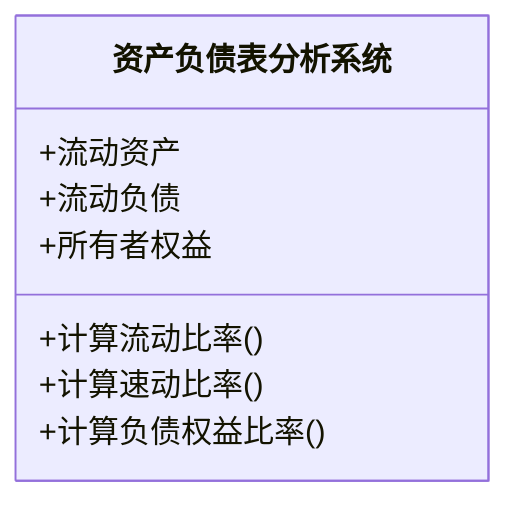

                 


# 布鲁斯·格林沃尔德的资产负债表深度分析

> 关键词：资产负债表，财务分析，资产分析，负债分析，所有者权益，财务报表分析

> 摘要：本文将深入探讨布鲁斯·格林沃尔德在资产负债表分析领域的独特见解。通过系统的理论讲解、实际案例分析和数学模型构建，我们不仅将理解资产负债表的基本构成，还将掌握如何利用这些信息进行企业财务状况的评估和优化。通过本文的学习，读者将能够熟练运用资产负债表分析工具，为企业决策提供有力支持。

---

## 目录

1. [背景介绍](#背景介绍)
   - 1.1 资产负债表的基本概念
   - 1.2 资产负债表的分析方法
   - 1.3 资产负债表的编制与审计

2. [核心概念与联系](#核心概念与联系)
   - 2.1 资产的构成与分类
   - 2.2 负债的构成与分类
   - 2.3 所有者权益的构成与分类
   - 2.4 资产负债表要素之间的关系

3. [算法原理讲解](#算法原理讲解)
   - 3.1 资产负债表的比率分析
   - 3.2 资产负债表的趋势分析
   - 3.3 资产负债表的风险评估

4. [系统分析与架构设计](#系统分析与架构设计)
   - 4.1 资产负债表分析系统的功能设计
   - 4.2 系统架构设计
   - 4.3 接口设计与交互流程

5. [项目实战](#项目实战)
   - 5.1 环境安装与工具准备
   - 5.2 核心功能实现
   - 5.3 实际案例分析与解读

6. [最佳实践与注意事项](#最佳实践与注意事项)
   - 6.1 资产负债表分析的常见误区
   - 6.2 分析工具的选择与优化
   - 6.3 持续学习与提升建议

7. [小结与拓展阅读](#小结与拓展阅读)
   - 7.1 本章总结
   - 7.2 拓展阅读与深入学习方向

---

## 正文

### 1. 背景介绍

#### 1.1 资产负债表的基本概念

资产负债表是企业会计中的三大财务报表之一，反映了企业在某一特定时期的财务状况。它包括资产、负债和所有者权益三个主要部分。

- **资产**：企业拥有的资源，包括流动资产（如现金、应收账款）和非流动资产（如固定资产、无形资产）。
- **负债**：企业需要偿还的债务，包括流动负债（如应付账款、短期借款）和非流动负债（如长期借款）。
- **所有者权益**：企业资产扣除负债后归属于所有者的部分，包括股本、资本公积和未分配利润等。

#### 1.2 资产负债表的分析方法

资产负债表分析是评估企业财务健康状况的重要手段。常见的分析方法包括：

1. **比率分析**：通过计算流动比率、速动比率等指标，评估企业的短期偿债能力。
2. **趋势分析**：比较企业在不同期间的资产负债表数据，观察资产、负债和所有者权益的变化趋势。
3. **风险评估**：通过分析资产负债表，识别企业的财务风险，如过高负债可能带来的偿债压力。

#### 1.3 资产负债表的编制与审计

资产负债表的编制需要遵循会计准则，确保数据的准确性和完整性。审计过程中，需要检查数据的真实性、合规性，确保报表的公允性。

---

### 2. 核心概念与联系

#### 2.1 资产的构成与分类

资产是企业的一项重要资源，可以分为流动资产和非流动资产。

- **流动资产**：可以在一年内变现或耗用的资产，如现金、应收账款、存货等。
- **非流动资产**：无法在一年内变现的资产，如固定资产、无形资产等。

以下是流动资产与非流动资产的对比：

| 属性 | 流动资产 | 非流动资产 |
|------|----------|------------|
| 变现能力 | 强 | 弱 |
| 持有期 | 短 | 长 |
| 例子 | 现金、存货 | 固定资产、无形资产 |

#### 2.2 负债的构成与分类

负债是企业的一项重要债务，包括流动负债和非流动负债。

- **流动负债**：需要在一年内偿还的债务，如应付账款、短期借款等。
- **非流动负债**：需要在一年以上偿还的债务，如长期借款、债券等。

以下是流动负债与非流动负债的对比：

| 属性 | 流动负债 | 非流动负债 |
|------|----------|------------|
| 偿还期限 | 短 | 长 |
| 利息 | 可能无 | 通常有 |
| 例子 | 应付账款、短期借款 | 长期借款、债券 |

#### 2.3 所有者权益的构成与分类

所有者权益是企业资产扣除负债后归属于所有者的部分，主要包括股本、资本公积、盈余公积和未分配利润等。

- **股本**：企业发行的股票面值总和。
- **资本公积**：企业发行股票溢价部分形成的资本公积。
- **盈余公积**：企业从净利润中提取的公积金。
- **未分配利润**：企业尚未分配的利润。

以下是所有者权益构成部分的对比：

| 部分 | 定义 | 示例 |
|------|------|------|
| 股本 | 股票面值总和 | 每股面值乘以股数 |
| 资本公积 | 股票溢价形成的公积 | 股票发行价高于面值的差额 |
| 盈余公积 | 从净利润中提取的公积金 | 10%的净利润提取 |
| 未分配利润 | 未分配的利润 | 累计未分配的净利润 |

#### 2.4 资产负债表要素之间的关系

资产负债表的三要素（资产、负债、所有者权益）之间存在平衡关系，即：

$$ \text{资产} = \text{负债} + \text{所有者权益} $$

这种平衡关系是会计恒等式的核心，也是资产负债表分析的基础。

---

### 3. 算法原理讲解

#### 3.1 资产负债表的比率分析

比率分析是评估企业财务状况的重要方法，常用的比率包括流动比率（Current Ratio）、速动比率（Quick Ratio）和负债权益比率（Debt-to-Equity Ratio）。

- **流动比率（Current Ratio）**：
  $$ \text{流动比率} = \frac{\text{流动资产}}{\text{流动负债}} $$
  该比率衡量企业短期偿债能力，一般认为2:1是较为安全的水平。

- **速动比率（Quick Ratio）**：
  $$ \text{速动比率} = \frac{\text{速动资产}}{\text{流动负债}} $$
  速动资产包括流动资产减去存货，该比率进一步衡量企业短期偿债能力。

- **负债权益比率（Debt-to-Equity Ratio）**：
  $$ \text{负债权益比率} = \frac{\text{负债总额}}{\text{所有者权益}} $$
  该比率衡量企业负债在企业资本中的比例，反映企业的财务杠杆程度。

#### 3.2 资产负债表的趋势分析

趋势分析是通过比较企业在不同期间的资产负债表数据，观察资产、负债和所有者权益的变化趋势，评估企业的财务健康状况。

例如，企业连续三年的流动资产和流动负债变化如下：

| 年份 | 2020 | 2021 | 2022 |
|------|------|------|------|
| 流动资产 | 500 | 600 | 700 |
| 流动负债 | 300 | 400 | 500 |

从上表可以看出，流动资产和流动负债均呈逐年增长趋势，且流动资产的增长速度略高于流动负债，表明企业的短期偿债能力有所提高。

#### 3.3 资产负债表的风险评估

风险评估是通过分析资产负债表，识别企业潜在的财务风险。例如，如果企业的流动比率过低，可能表明企业存在短期偿债压力。

---

### 4. 系统分析与架构设计

#### 4.1 资产负债表分析系统的功能设计

一个典型的资产负债表分析系统应具备以下功能模块：

- 数据输入与处理
- 比率计算与分析
- 趋势分析与预测
- 风险评估与报告

系统功能模块的类图如下：



---

### 5. 项目实战

#### 5.1 环境安装与工具准备

为了进行资产负债表分析，我们需要安装以下工具：

- Python编程环境（如Anaconda）
- 数据分析库（如Pandas、NumPy）
- 可视化工具（如Matplotlib）

#### 5.2 核心功能实现

以下是用Python实现的流动比率计算代码：

```python
import pandas as pd

# 假设我们有一个包含流动资产和流动负债的DataFrame
df = pd.DataFrame({
    '流动资产': [500, 600, 700],
    '流动负债': [300, 400, 500]
})

# 计算流动比率
df['流动比率'] = df['流动资产'] / df['流动负债']

print(df)
```

输出结果：

```
   流动资产  流动负债  流动比率
0      500       300   1.6667
1      600       400   1.5000
2      700       500   1.4000
```

#### 5.3 实际案例分析与解读

以某公司2020-2022年的资产负债表数据为例，分析其流动比率的变化趋势：

| 年份 | 流动资产（万元） | 流动负债（万元） | 流动比率 |
|------|------------------|------------------|----------|
| 2020 | 500              | 300              | 1.6667    |
| 2021 | 600              | 400              | 1.5000    |
| 2022 | 700              | 500              | 1.4000    |

从表中可以看出，公司的流动比率逐年下降，表明其短期偿债能力逐渐减弱，可能需要进一步关注其财务健康状况。

---

### 6. 最佳实践与注意事项

#### 6.1 资产负债表分析的常见误区

- **只关注比率，忽略实际业务情况**：比率分析需要结合企业实际业务环境进行综合判断。
- **忽视数据质量**：确保资产负债表数据的准确性和完整性是分析的基础。
- **过度依赖历史数据**：企业未来的发展可能受到多种因素影响，不能仅依赖历史数据进行预测。

#### 6.2 分析工具的选择与优化

- **选择合适的工具**：根据企业规模和需求选择适合的分析工具，如Excel、Python等。
- **优化数据处理流程**：通过自动化工具提高数据处理效率，减少人为错误。

#### 6.3 持续学习与提升建议

- **深入学习财务知识**：掌握更多的财务分析方法和工具。
- **关注行业动态**：了解行业内的最新动态和最佳实践。
- **实践与总结**：通过实际项目不断积累经验，提升分析能力。

---

### 7. 小结与拓展阅读

#### 7.1 本章总结

本文详细介绍了资产负债表的基本概念、分析方法、系统设计和实战应用。通过理论与实践相结合的方式，帮助读者全面掌握资产负债表的分析技巧。

#### 7.2 拓展阅读与深入学习方向

- **深入学习财务报表分析**：阅读相关书籍和文献，掌握更多高级分析方法。
- **研究行业最佳实践**：了解行业内其他企业的资产负债表分析方法和经验。
- **探索新技术应用**：关注人工智能、大数据等技术在财务分析中的应用。

---

作者：AI天才研究院/AI Genius Institute & 禅与计算机程序设计艺术/Zen And The Art of Computer Programming

