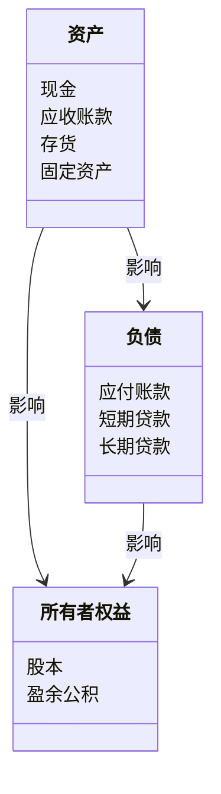

                 


# 布鲁斯·格林沃尔德的隐蔽价值：发掘资产负债表中的秘密

## 关键词：资产负债表，企业价值，隐蔽价值，财务报表分析，格林沃尔德

## 摘要：本文深入探讨了如何通过分析资产负债表来发现企业的隐蔽价值。基于布鲁斯·格林沃尔德的理论，结合实际案例和系统架构，详细介绍了资产负债表的核心要素、企业价值评估方法以及如何利用这些信息优化企业价值。

---

# 第1章: 隐蔽价值与资产负债表概述

## 1.1 隐蔽价值的概念与重要性

### 1.1.1 隐蔽价值的定义
**隐蔽价值**是指企业在资产负债表中未明确列出，但实际存在的价值。这些价值可能隐藏在资产、负债或所有者权益中，未被传统财务报表完全反映。

### 1.1.2 隐蔽价值在企业中的作用
企业通过识别和评估隐蔽价值，可以更全面地了解其真实价值，优化资源配置，提升竞争力。

### 1.1.3 资产负债表的核心地位
资产负债表是企业财务健康状况的晴雨表，是分析企业价值的重要工具。

## 1.2 资产负债表的基本结构

### 1.2.1 资产、负债与所有者权益的定义
- **资产**：企业拥有的资源，预期能带来经济利益。
- **负债**：企业未来需要偿还的债务。
- **所有者权益**：企业资产减去负债后归所有者的部分。

### 1.2.2 资产负债表的平衡关系
$$ 资产 = 负债 + 所有者权益 $$

### 1.2.3 资产负债表的编制与审计
资产负债表需按会计准则编制，并经过审计以确保准确性。

## 1.3 布鲁斯·格林沃尔德的理论基础

### 1.3.1 企业价值评估的核心理念
企业价值 = 净资产价值 + 隐蔽价值

### 1.3.2 资产负债表分析的框架
- 资产分析
- 负债分析
- 所有者权益分析

### 1.3.3 隐蔽价值发现的方法论
通过深入分析资产负债表，识别未记录的资产、负债和权益。

## 1.4 本章小结
本章介绍了隐蔽价值的定义、重要性以及资产负债表的基本结构，为后续分析奠定了基础。

---

# 第2章: 资产负债表的核心要素分析

## 2.1 资产分析

### 2.1.1 流动资产与非流动资产的分类
- **流动资产**：易于变现的资产，如现金、应收账款。
- **非流动资产**：长期资产，如固定资产、无形资产。

### 2.1.2 隐性资产的识别与评估
识别未记录的资产，如品牌价值、客户关系。

### 2.1.3 资产质量与价值的关联
高质量资产通常带来更高的企业价值。

## 2.2 负债分析

### 2.2.1 流动负债与非流动负债的区分
- **流动负债**：短期债务，如应付账款、短期贷款。
- **非流动负债**：长期债务，如长期贷款。

### 2.2.2 隐性负债的识别与风险评估
识别未记录的负债，评估其对企业的潜在影响。

### 2.2.3 负债对企业价值的影响
高负债可能增加财务风险，影响企业价值。

## 2.3 所有者权益分析

### 2.3.1 所有者权益的构成
包括股本、资本公积、盈余公积等。

### 2.3.2 隐性权益的识别与评估
识别未记录的权益，如期权、认股权证。

### 2.3.3 所有者权益与企业价值的关系
所有者权益是企业价值的重要组成部分。

## 2.4 资产负债表的整体分析

### 2.4.1 资产负债表的平衡性分析
确保 $$ 资产 = 负债 + 所有者权益 $$

### 2.4.2 资产负债表的结构优化
通过调整资产和负债结构，提升企业价值。

### 2.4.3 资产负债表的动态变化
分析资产负债表的变化趋势，预测企业未来价值。

## 2.5 本章小结
本章详细分析了资产负债表的核心要素，为后续的企业价值评估奠定了基础。

---

# 第3章: 企业价值评估的理论与方法

## 3.1 企业价值评估的基本原理

### 3.1.1 企业价值的定义与构成
企业价值 = 净资产价值 + 隐蔽价值

### 3.1.2 企业价值的驱动因素
包括资产、负债、盈利能力、成长潜力等。

## 3.2 现金流折现模型（DCF模型）

### 3.2.1 现金流折现模型的原理
$$ 企业价值 = \sum_{t=1}^{n} \frac{CF_t}{(1+r)^t} + \frac{TV}{(1+r)^n} $$

其中：
- \( CF_t \)：第t年的自由现金流
- \( r \)：折现率
- \( TV \)：终值

### 3.2.2 应用DCF模型进行企业价值评估的步骤
1. 预测未来现金流
2. 确定折现率
3. 计算现值
4. 加终值
5. 计算企业价值

## 3.3 资产负债表分析在企业价值评估中的应用

### 3.3.1 利用资产负债表识别隐性资产和负债
通过分析资产负债表，识别未记录的资产和负债，调整企业价值评估结果。

### 3.3.2 结合财务比率分析企业价值
使用ROE、ROA等比率评估企业盈利能力，进而影响企业价值。

## 3.4 本章小结
本章介绍了企业价值评估的基本原理和方法，强调了资产负债表分析在识别隐性价值中的重要性。

---

# 第4章: 资产负债表分析的系统架构

## 4.1 问题场景介绍
企业需要通过资产负债表分析识别隐性价值，优化资源配置。

## 4.2 系统功能设计

### 4.2.1 领域模型设计


### 4.2.2 系统架构设计


### 4.2.3 系统接口设计
- 输入：资产负债表数据
- 输出：隐性价值评估报告

### 4.2.4 系统交互设计
```mermaid
sequenceDiagram
    起始 -> 用户: 输入资产负债表数据
    用户 -> 系统: 分析隐性价值
    系统 -> 用户: 输出评估报告
    结束
```

## 4.3 本章小结
本章通过系统架构设计，展示了如何利用资产负债表分析识别隐性价值。

---

# 第5章: 项目实战

## 5.1 环境安装
- 安装Python和相关库（pandas, numpy）

## 5.2 系统核心实现源代码

```python
import pandas as pd

def calculate隐性价值():
    # 输入资产负债表数据
    df = pd.read_csv('balance_sheet.csv')
    # 计算隐性价值
    隐性价值 = df['资产'].sum() - (df['负债'].sum() + df['所有者权益'].sum())
    return 隐性价值

# 调用函数
print(calculate隐性价值())
```

## 5.3 代码应用解读与分析
- 读取资产负债表数据
- 计算隐性价值
- 输出结果

## 5.4 实际案例分析
以具体企业为例，分析其资产负债表，识别隐性价值。

## 5.5 项目小结
本章通过实战项目，展示了如何利用Python代码分析资产负债表，识别隐性价值。

---

# 第6章: 最佳实践与注意事项

## 6.1 注意事项
- 确保数据准确性
- 考虑行业差异
- 定期更新分析

## 6.2 小结
通过系统分析和项目实战，读者可以掌握如何利用资产负债表分析识别隐性价值。

## 6.3 拓展阅读
推荐相关书籍和论文，进一步深入学习。

---

作者：AI天才研究院/AI Genius Institute & 禅与计算机程序设计艺术 /Zen And The Art of Computer Programming

