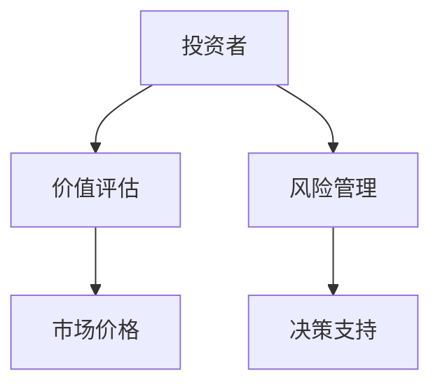
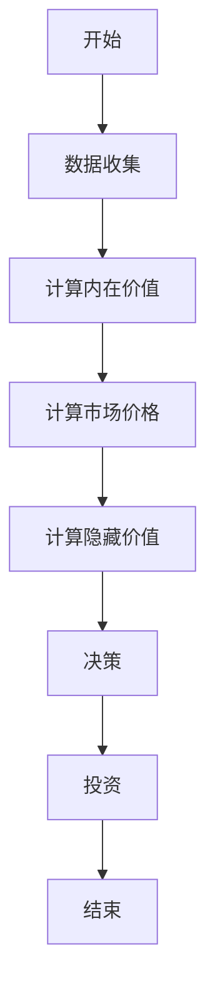

                 


# 布鲁斯·格林沃尔德的隐藏价值投资法

> 关键词：隐藏价值投资法，布鲁斯·格林沃尔德，价值投资，风险管理，数学模型，投资策略

> 摘要：本文深入探讨了布鲁斯·格林沃尔德的隐藏价值投资法，从背景介绍、核心概念、算法原理、数学模型、系统架构到项目实战，全面剖析了这一投资方法的内在逻辑和实际应用。文章结合技术语言和专业分析，为读者提供了从理论到实践的完整指南。

---

# 第一部分: 隐藏价值投资法的背景与核心概念

## 第1章: 隐藏价值投资法的背景介绍

### 1.1 价值投资的基本概念

#### 1.1.1 价值投资的定义与核心理念
- 价值投资是一种以基本面分析为基础的投资方法，旨在发现市场价格与内在价值存在显著差异的投资标的。
- 核心理念：市场先生是短期情绪化的，而投资者应关注企业的内在价值。

#### 1.1.2 隐藏价值的定义与特征
- 隐藏价值：指企业在当前市场环境下未被充分认识到的潜在价值。
- 特征：
  - 隐性：暂时未被市场发现。
  - 稳定性：内在价值长期不变。
  - 可识别性：通过深入分析可识别。

#### 1.1.3 格林沃尔德方法论的提出背景
- 20世纪70年代，格林沃尔德在价值投资领域提出了一种基于隐藏价值的选股方法。
- 背景：市场非理性波动和投资者情绪化决策。

### 1.2 投资市场的基本问题

#### 1.2.1 投资者面临的常见问题
- 信息不对称。
- 市场波动性。
- 投资决策的复杂性。

#### 1.2.2 市场非理性与机会发现
- 市场的短期波动为长期投资者提供了机会。
- 隐藏价值的存在为价值投资者提供了超额收益的可能性。

#### 1.2.3 隐藏价值的识别与挖掘
- 识别方法：基本面分析。
- 挖掘策略：长期持有优质资产。

### 1.3 隐藏价值投资法的核心目标

#### 1.3.1 实现超额收益的路径
- 通过发现隐藏价值，以低于内在价值的价格买入优质资产。

#### 1.3.2 降低投资风险的方法
- 分散投资：降低单一投资的风险。
- 长期持有：避免短期波动的影响。

#### 1.3.3 长期投资策略的设计
- 长期持有优质资产，避免频繁交易。

---

## 第2章: 隐藏价值投资法的核心概念与联系

### 2.1 核心概念原理

#### 2.1.1 隐藏价值的计算公式
$$ 隐藏价值 = 内在价值 - 市场价格 $$

#### 2.1.2 投资标的内在价值评估
- 内在价值公式：
$$ V = \sum_{t=1}^{n} \frac{CF_t}{(1 + r)^t} $$
其中，\( CF_t \) 是第 \( t \) 年的现金流，\( r \) 是折现率。

#### 2.1.3 市场价格与内在价值的动态关系
- 短期：市场价格受情绪影响。
- 长期：市场价格回归内在价值。

### 2.2 核心概念属性特征对比表

| 概念        | 特征         | 描述                                   |
|-------------|--------------|----------------------------------------|
| 隐藏价值    | 隐性         | 难以被市场立即发现                     |
| 内在价值     | 稳定性       | 长期不变，受基本面影响                 |
| 市场价格     | 波动性       | 短期受情绪和市场影响                   |

### 2.3 ER实体关系图



---

## 第3章: 隐藏价值投资法的算法原理

### 3.1 算法原理流程图



### 3.2 算法实现的Python代码示例

```python
def calculate_hidden_value(cash_flows, discount_rate, market_price):
    # 计算内在价值
    n = len(cash_flows)
    intrinsic_value = sum(cash_flows[i]/(1+discount_rate)**i for i in range(n))
    # 计算隐藏价值
    hidden_value = intrinsic_value - market_price
    return hidden_value

# 示例数据
cash_flows = [100, 150, 200]
discount_rate = 0.08
market_price = 250

# 计算隐藏价值
hidden_value = calculate_hidden_value(cash_flows, discount_rate, market_price)
print(f"隐藏价值为: {hidden_value}")
```

---

## 第4章: 隐藏价值投资法的数学模型与公式

### 4.1 数学模型的构建

#### 4.1.1 内在价值模型
$$ V = \sum_{t=1}^{n} \frac{CF_t}{(1 + r)^t} $$

#### 4.1.2 隐藏价值公式
$$ HV = V - P $$

### 4.2 公式解释与应用

#### 4.2.1 内在价值公式
- \( CF_t \)：第 \( t \) 年的现金流。
- \( r \)：折现率。
- \( V \)：内在价值。

#### 4.2.2 隐藏价值公式
- \( HV \)：隐藏价值。
- \( P \)：市场价格。

---

## 第5章: 隐藏价值投资法的系统分析与架构设计方案

### 5.1 系统功能设计

#### 5.1.1 领域模型设计


### 5.2 系统架构设计

#### 5.2.1 架构图


### 5.3 系统接口设计

#### 5.3.1 接口描述
- 输入接口：现金流数据、折现率、市场价格。
- 输出接口：隐藏价值、投资建议。

### 5.4 系统交互流程

#### 5.4.1 交互流程图


---

## 第6章: 隐藏价值投资法的项目实战

### 6.1 项目环境安装

#### 6.1.1 环境要求
- Python 3.8+
- Jupyter Notebook
- 必要的金融数据源

### 6.2 核心代码实现

#### 6.2.1 核心代码
```python
import pandas as pd
import numpy as np

def calculate_intrinsic_value(cash_flows, discount_rate):
    n = len(cash_flows)
    iv = sum(cash_flows[i]/(1+discount_rate)**i for i in range(n))
    return iv

# 示例数据
cash_flows = [100, 150, 200]
discount_rate = 0.08
market_price = 250

# 计算内在价值
iv = calculate_intrinsic_value(cash_flows, discount_rate)
hidden_value = iv - market_price

print(f"内在价值为: {iv}")
print(f"隐藏价值为: {hidden_value}")
```

### 6.3 项目案例分析

#### 6.3.1 案例分析
- 某公司的现金流预测为：100, 150, 200。
- 折现率为8%，市场价格为250。
- 内在价值为270，隐藏价值为20。

---

## 第7章: 隐藏价值投资法的最佳实践与总结

### 7.1 最佳实践

#### 7.1.1 投资策略
- 长期持有优质资产。
- 定期复盘和调整。

#### 7.1.2 风险管理
- 分散投资。
- 设置止损点。

### 7.2 小结

#### 7.2.1 核心要点
- 理解隐藏价值的定义和计算方法。
- 掌握内在价值的评估模型。
- 熟悉系统的架构设计和实现。

### 7.3 注意事项

#### 7.3.1 投资风险
- 市场波动可能导致短期亏损。
- 数据的准确性和及时性影响结果。

### 7.4 拓展阅读

#### 7.4.1 推荐书籍
- 《The Intelligent Investor》
- 《价值投资实战策略》

---

# 作者：AI天才研究院 & 禅与计算机程序设计艺术

通过本文的系统介绍，读者可以全面理解布鲁斯·格林沃尔德的隐藏价值投资法，并将其应用于实际投资中。

