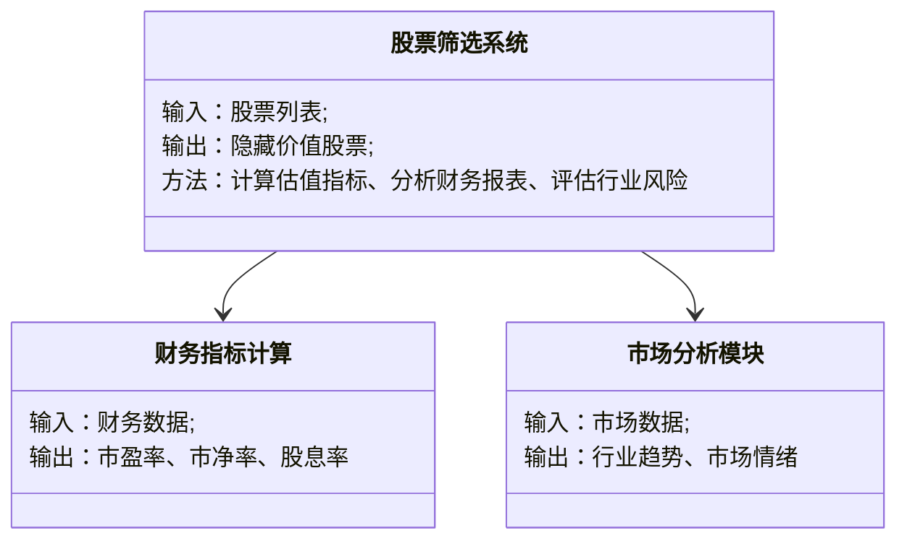
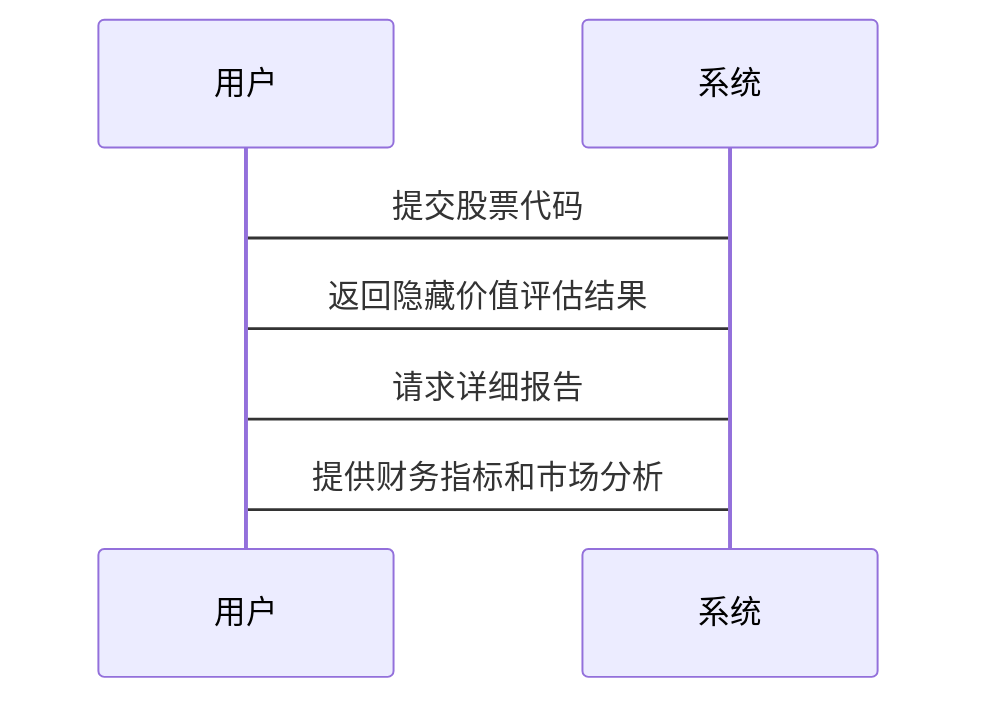

                 


# 布鲁斯·格林沃尔德的隐藏价值投资策略

> **关键词**：隐藏价值投资、股票分析、财务指标、投资策略、风险管理、价值发现  
> **摘要**：本文深入探讨了布鲁斯·格林沃尔德提出的隐藏价值投资策略，分析其核心概念、实施方法及数学模型，并结合实际案例进行详细解读，最后总结其在现代投资中的应用价值。

---

## 第一部分: 隐藏价值投资策略基础概述

### 第1章: 隐藏价值投资的定义与背景

#### 1.1 投资的基本概念
##### 1.1.1 投资的定义与分类
投资是指将资金投入特定资产以期获得收益的行为。股票投资作为最常见的形式之一，其本质是购买企业部分股权，分享企业成长的收益。根据投资期限和策略，股票投资可分为短线交易、波段操作和长期持有。

##### 1.1.2 股票投资的基本原理
股票投资的收益主要来源于资本增值和股息收益。资本增值是指股价上涨带来的收益，而股息收益则是企业分配的利润。投资者需要综合考虑企业的盈利能力、行业地位、财务状况等因素，选择具有长期增长潜力的股票。

##### 1.1.3 隐藏价值投资的核心概念
隐藏价值投资是一种专注于寻找市场低估的股票的投资策略。其核心在于发现那些市场价格低于其内在价值的企业，这些企业通常具有较高的安全边际，能够在市场波动中提供稳定的回报。

#### 1.2 隐藏价值投资的背景与现状
##### 1.2.1 隐藏价值投资的起源与发展
隐藏价值投资理念最早可追溯至本杰明·格雷厄姆的价值投资理论，强调以低于内在价值的价格买入优质股票。布鲁斯·格林沃尔德在此基础上，结合现代金融理论和市场实践，进一步完善了隐藏价值投资的策略框架。

##### 1.2.2 当前市场环境下的隐藏价值投资
随着市场信息的透明化和机构投资者的增多，隐藏价值投资的难度增加。但通过深入分析企业的基本面，仍能找到被市场忽视的优质标的。

##### 1.2.3 隐藏价值投资与其他投资策略的对比
与成长型投资相比，隐藏价值投资更注重安全性和稳定性；与趋势投资相比，其更关注企业的内在价值而非市场趋势。

---

### 第2章: 隐藏价值投资的核心要素

#### 2.1 隐藏价值的定义与特征
##### 2.1.1 隐藏价值的定义
隐藏价值是指股票的内在价值与其市场价格之间的差额。当市场价格低于内在价值时，该股票即具有隐藏价值。

##### 2.1.2 隐藏价值的核心特征
- **低估值**：市盈率、市净率等指标低于行业平均水平。
- **高分红**：企业愿意将利润以股息形式返还给股东。
- **强劲基本面**：公司财务状况健康，盈利稳定且具有增长潜力。

##### 2.1.3 隐藏价值与市场估值的关系
市场估值受到投资者情绪和市场波动的影响，而内在价值则取决于企业的实际经营状况。隐藏价值策略的目标是找到市场价格与内在价值存在显著差异的股票。

#### 2.2 隐藏价值投资的关键指标
##### 2.2.1 市盈率（P/E）的计算与应用
市盈率=股票价格/每股净利润。市盈率过低通常意味着股价被低估。

##### 2.2.2 市净率（P/B）的计算与应用
市净率=股票价格/每股净资产。市净率过低可能表明资产被低估。

##### 2.2.3 股息率与股息支付率的分析
股息率=股息/股票价格，股息支付率=股息/净利润。高股息率和合理的股息支付率通常表明企业具有较强的盈利能力和分红意愿。

#### 2.3 隐藏价值投资的适用场景
##### 2.3.1 经济周期对隐藏价值投资的影响
在经济衰退期，许多优质企业因市场恐慌而被低估，为隐藏价值投资提供了机会。

##### 2.3.2 市场波动对隐藏价值投资的影响
市场波动加剧时，短期价格波动可能掩盖企业的长期价值，为投资者创造了低位买入的机会。

##### 2.3.3 行业分析与隐藏价值投资的关系
不同行业具有不同的估值标准，投资者需要结合行业特点分析企业的隐藏价值。

---

## 第二部分: 隐藏价值投资策略的分析与实施

### 第3章: 隐藏价值的识别方法

#### 3.1 财务指标分析
##### 3.1.1 资产负债表分析
- 重点关注企业的资产质量、负债结构和所有者权益。
- 低负债率和高净资产收益率（ROE）是隐藏价值的标志。

##### 3.1.2 利润表分析
- 重点关注企业的收入、成本和利润情况。
- 净利润持续增长且毛利率稳定的公司更具投资价值。

##### 3.1.3 现金流量表分析
- 重点关注企业的现金流状况。
- 自由现金流充裕且投资活动现金流为正的企业具有较强的发展潜力。

#### 3.2 市场分析方法
##### 3.2.1 行业分析与竞争分析
- 行业集中度高且竞争格局稳定的行业更容易出现隐藏价值股票。
- 具备竞争优势（如成本优势、技术壁垒）的企业更值得投资。

##### 3.2.2 市场趋势分析
- 经济周期分析：衰退期和复苏期更容易发现隐藏价值股票。
- 行业周期分析：行业处于低谷期时，企业估值可能被低估。

##### 3.2.3 估值模型的应用
- 使用市盈率、市净率、股息率等指标进行横向和纵向比较，判断股票是否被低估。

#### 3.3 隐藏价值股票的筛选标准
##### 3.3.1 低估值股票的筛选标准
- 市盈率低于行业平均水平。
- 市净率低于行业平均水平。
- 市销率（P/S）低于行业平均水平。

##### 3.3.2 高质量公司的识别标准
- 盈利能力强且稳定。
- 财务状况健康，现金流充裕。
- 公司治理良好，管理层稳定。

##### 3.3.3 市场情绪与投资者心理分析
- 市场恐慌时，投资者往往抛售优质股票，导致股价被低估。
- 市场乐观时，投资者可能忽视企业的实际价值。

### 第4章: 隐藏价值投资策略的实施

#### 4.1 投资组合的构建
##### 4.1.1 投资组合的构成要素
- 结合成长性和稳定性，选择不同行业的股票。
- 保持适度分散，避免过度集中。

##### 4.1.2 股票权重的分配策略
- 根据股票的隐藏价值潜力和风险水平确定权重。
- 优先选择那些估值低、基本面好且具有竞争优势的股票。

##### 4.1.3 投资组合的风险管理
- 设置止损点，控制单只股票的亏损比例。
- 定期审视组合，及时调整持仓。

#### 4.2 风险管理与策略调整
##### 4.2.1 风险评估与控制方法
- 通过技术分析监控股价波动。
- 定期评估企业的财务状况和行业环境。

##### 4.2.2 策略调整的时机与方式
- 当市场环境发生变化时，及时调整投资策略。
- 根据企业基本面的变化，逐步调整个股仓位。

##### 4.2.3 仓位管理与止损策略
- 采用分批建仓和逐步加仓的方式，降低一次性投资的风险。
- 设置止损点，当股价跌破关键支撑位时果断卖出。

#### 4.3 隐藏价值投资的长期策略
##### 4.3.1 长期投资与复利效应
- 长期持有优质股票，享受企业成长的复利效应。
- 定期定额投资，分散风险，降低择时难度。

##### 4.3.2 定期投资与价值发现
- 坚持定期定额的投资方式，避免情绪化决策。
- 通过持续的市场调研和分析，发现新的隐藏价值股票。

##### 4.3.3 股东价值的长期增长
- 选择那些能够持续创造股东价值的企业。
- 关注企业的ROE和分红情况，确保投资收益稳定增长。

---

## 第三部分: 隐藏价值投资的系统分析与架构

### 第5章: 隐藏价值投资的系统分析

#### 5.1 系统功能设计（领域模型）


#### 5.2 系统架构设计


#### 5.3 系统接口设计
- 输入接口：股票代码、财务数据、市场数据
- 输出接口：隐藏价值股票列表、投资建议、风险提示

#### 5.4 系统交互设计


---

## 第四部分: 隐藏价值投资的项目实战

### 第6章: 项目实战分析

#### 6.1 环境安装
- 需要安装的工具：Python、Pandas、Matplotlib、Scrapy
- 数据来源：Yahoo Finance、Alpha Vantage

#### 6.2 核心实现代码
```python
import pandas as pd
import numpy as np

# 示例代码：计算隐藏价值股票
def calculate_hidden_value(stock_data, industry_avg):
    stock_data['隐藏价值'] = stock_data['内在价值'] - stock_data['市场价格']
    return stock_data[stock_data['市场价格'] < industry_avg]

# 应用示例
stock_data = pd.read_csv('stocks.csv')
industry_avg = stock_data['市场价格'].mean()
result = calculate_hidden_value(stock_data, industry_avg)
print(result)
```

#### 6.3 代码解读与分析
- 代码功能：计算每只股票的隐藏价值，并筛选出市场价格低于行业平均水平的股票。
- 数据来源：假设`stocks.csv`包含各股票的基本信息和财务数据。

#### 6.4 案例分析
假设某行业平均市盈率为15，某股票的市盈率为12且内在价值为20元，则该股票具有隐藏价值。

#### 6.5 项目小结
通过代码实现隐藏价值股票的筛选，投资者可以快速找到具有投资潜力的标的，但需要注意数据的准确性和模型的适用性。

---

## 第五部分: 最佳实践与总结

### 第7章: 最佳实践与注意事项

#### 7.1 最佳实践
- 定期复盘投资组合，及时调整持仓。
- 结合技术分析和基本面分析，提高决策的准确性。
- 保持学习，更新投资理念和方法。

#### 7.2 小结
隐藏价值投资是一种有效的长期投资策略，通过寻找市场价格低于内在价值的股票，投资者可以在市场波动中获得稳定的收益。

#### 7.3 注意事项
- 避免过度依赖单一指标，应综合考虑多个因素。
- 定期评估模型的有效性，及时优化筛选标准。
- 注意市场环境的变化，灵活调整投资策略。

#### 7.4 拓展阅读
推荐阅读布鲁斯·格林沃尔德的著作，深入了解隐藏价值投资的具体方法和实践案例。

---

## 作者信息

作者：AI天才研究院/AI Genius Institute & 禅与计算机程序设计艺术/Zen And The Art of Computer Programming

---

本文通过系统分析和实际案例，详细阐述了布鲁斯·格林沃尔德的隐藏价值投资策略，帮助投资者在复杂的市场环境中找到优质标的，实现稳健的投资回报。

