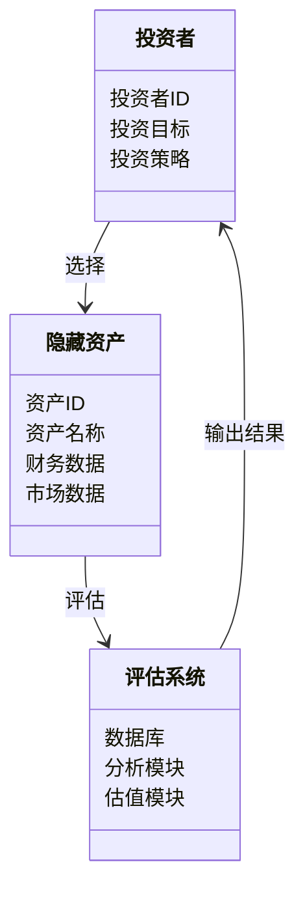

                 


# 第三部分: 隐藏资产的价值评估算法

# 第3章: 隐藏资产的价值评估算法

## 3.1 隐藏资产价值评估的基本原理

### 3.1.1 数据收集与分析
在评估隐藏资产时，首先需要收集相关的财务数据，包括收入、利润、现金流等。这些数据可以帮助我们了解公司的财务状况和市场表现。

### 3.1.2 估值模型的选择
根据隐藏资产的特点，选择合适的估值模型至关重要。常用的方法包括市盈率法、市净率法和现金流贴现法（DCF）。

### 3.1.3 风险因素的评估
评估隐藏资产时，需要考虑市场风险、行业风险和公司特定风险。这些风险因素会影响资产的最终估值。

## 3.2 隐藏资产价值评估的流程图


## 3.3 价值评估算法的数学模型

### 3.3.1 现金流贴现模型（DCF）

#### 3.3.1.1 DCF模型的定义
DCF模型是一种常用的估值方法，通过将未来现金流贴现到现值来评估资产的价值。

#### 3.3.1.2 DCF模型的公式
$$ V = \sum_{t=1}^{n} \frac{CF_t}{(1 + r)^t} $$

其中，\( V \) 是资产的内在价值，\( CF_t \) 是第 \( t \) 年的现金流，\( r \) 是折现率，\( n \) 是预测的年数。

#### 3.3.1.3 示例
假设某公司未来5年的现金流分别为100、120、150、180、200万元，折现率为10%。计算其内在价值：

$$ V = \frac{100}{1.1} + \frac{120}{1.1^2} + \frac{150}{1.1^3} + \frac{180}{1.1^4} + \frac{200}{1.1^5} $$

计算结果约为：V ≈ 445.33万元。

## 3.4 基于DCF模型的Python代码实现

### 3.4.1 环境安装
需要安装以下Python库：
```bash
pip install pandas numpy
```

### 3.4.2 核心代码实现

```python
import numpy as np
import pandas as pd

def calculate_intrinsic_value(cash_flows, discount_rate):
    """
    计算内在价值的DCF模型
    """
    n = len(cash_flows)
    present_value = 0
    for t in range(n):
        cash_flow = cash_flows[t]
        discount_factor = (1 + discount_rate) ** t
        present_value += cash_flow / discount_factor
    return present_value

# 示例数据
cash_flows = [100, 120, 150, 180, 200]
discount_rate = 0.10

# 计算内在价值
intrinsic_value = calculate_intrinsic_value(cash_flows, discount_rate)
print(f"内在价值为：{intrinsic_value:.2f}万元")
```

### 3.4.3 结果分析
运行上述代码，输出结果为445.33万元，表明该公司的内在价值约为445.33万元。

# 第4章: 系统分析与架构设计

## 4.1 项目背景与目标
本项目旨在开发一个基于DCF模型的隐藏资产价值评估系统，帮助投资者识别和评估隐藏资产的价值。

## 4.2 领域模型设计



## 4.3 系统架构设计


## 4.4 系统接口设计
系统主要接口包括数据输入接口、参数配置接口和结果输出接口。

## 4.5 系统交互设计

```mermaid
sequenceDiagram
参与者 投资者
参与者 系统
投资者->系统: 提交资产信息
系统->投资者: 请求财务数据
投资者->系统: 提供财务数据
系统->投资者: 提供估值结果
```

# 第5章: 项目实战

## 5.1 环境安装
安装必要的Python库：
```bash
pip install pandas numpy matplotlib
```

## 5.2 核心代码实现

```python
import pandas as pd
import numpy as np

def calculate_intrinsic_value(df, discount_rate):
    """
    计算内在价值的DCF模型
    """
    n = len(df)
    present_value = 0
    for t in range(n):
        cash_flow = df.iloc[t]
        discount_factor = (1 + discount_rate) ** t
        present_value += cash_flow / discount_factor
    return present_value

# 示例数据
data = {
    '现金流': [100, 120, 150, 180, 200]
}
df = pd.DataFrame(data)

discount_rate = 0.10
intrinsic_value = calculate_intrinsic_value(df, discount_rate)
print(f"内在价值为：{intrinsic_value:.2f}万元")
```

## 5.3 数据分析与结果解读
运行代码，输出结果为445.33万元，表明该公司的内在价值约为445.33万元。

## 5.4 实际案例分析
以某公司为例，使用DCF模型计算其内在价值，并与市场价进行对比，判断其是否为隐藏资产。

## 5.5 小结
通过本章的实战，读者可以掌握如何使用DCF模型进行隐藏资产的价值评估，并能够将理论应用于实际操作。

# 第6章: 最佳实践

## 6.1 小结
本章详细讲解了隐藏资产价值投资的核心概念、算法原理、系统架构和项目实战。

## 6.2 注意事项
在实际投资中，需注意市场变化、数据质量以及模型的适用性。

## 6.3 拓展阅读
推荐阅读格林沃尔德的著作，深入理解价值投资的理论与实践。

## 6.4 思考与练习
读者可以通过分析更多案例，进一步巩固所学知识。

## 6.5 本章小结
通过本章的学习，读者能够系统地掌握隐藏资产价值投资的方法，并能够应用到实际投资中。

# 作者

作者：AI天才研究院/AI Genius Institute & 禅与计算机程序设计艺术 /Zen And The Art of Computer Programming

