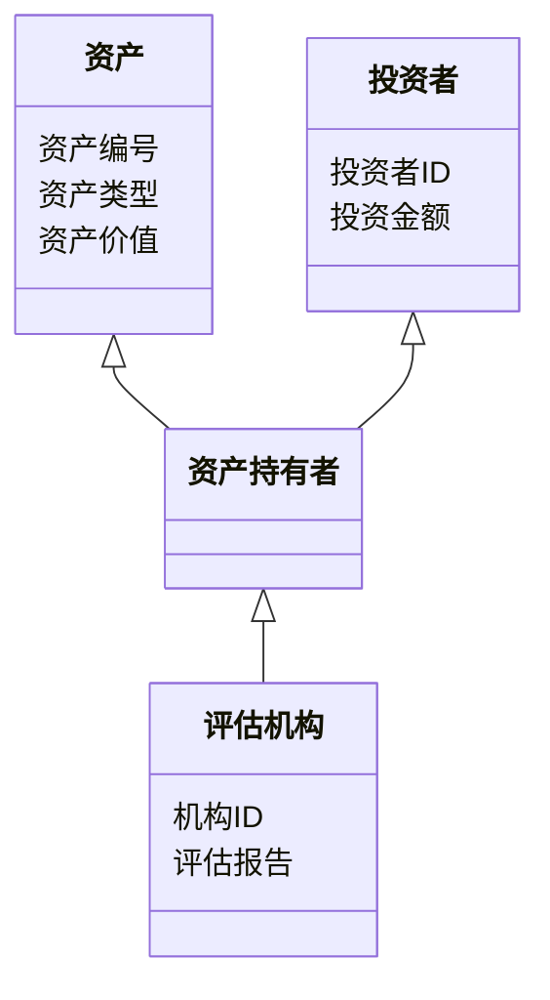
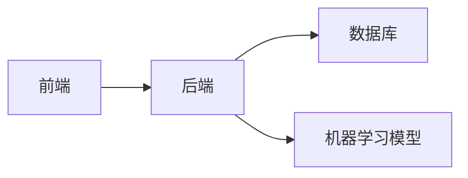

                 


# 布鲁斯·贝克威斯的隐藏资产价值发掘

---

## 关键词：隐藏资产，价值评估，数据分析，机器学习，系统架构，投资策略

---

## 摘要：本文深入探讨了隐藏资产的概念、分类及其价值评估的方法。通过结合数据分析与机器学习算法，本文详细分析了隐藏资产的挖掘过程，并通过系统架构设计和实际案例展示了如何实现隐藏资产的价值发掘。文章最后总结了最佳实践和注意事项，为读者提供了全面的指导。

---

# 第一部分: 隐藏资产价值发掘的背景与概念

## 第1章: 隐藏资产价值发掘概述

### 1.1 隐藏资产的定义与分类

#### 1.1.1 隐藏资产的定义  
隐藏资产是指那些未被广泛发现或未被充分评估的资产，通常具有潜在的高价值。这些资产可能存在于企业、市场或个人的财务中，但由于信息不对称、评估复杂性或市场关注不足等原因，其价值未被充分体现。

#### 1.1.2 隐藏资产的分类与特征  
隐藏资产可以分为以下几类：  
1. **未开发资源**：如未被充分利用的土地、矿产资源等。  
2. **无形资产**：如专利、商标、品牌价值等。  
3. **潜在市场机会**：如新兴市场的未开发潜力。  

#### 1.1.3 隐藏资产与传统资产的区别  
| 属性            | 隐藏资产                     | 传统资产                     |  
|-----------------|------------------------------|------------------------------|  
| 可见性          | 低                          | 高                          |  
| 评估复杂性      | 高                          | 中                          |  
| 市场关注度      | 低                          | 高                          |  

### 1.2 隐藏资产价值发掘的重要性  

#### 1.2.1 隐藏资产在投资中的潜在价值  
隐藏资产的发现和评估可能带来超额收益，尤其是在市场周期性波动中，隐藏资产的价值可能被低估。

#### 1.2.2 隐藏资产对企业的战略意义  
通过发现隐藏资产，企业可以优化资源配置，提升竞争力，并发现新的业务机会。

#### 1.2.3 隐藏资产对个人财富增长的影响  
个人投资者可以通过发现隐藏资产，实现财富的快速增长。

### 1.3 隐藏资产价值发掘的现状与挑战  

#### 1.3.1 隐藏资产市场的现状分析  
目前，隐藏资产市场尚未被充分开发，但随着技术的进步和数据的丰富，隐藏资产的发现正变得越来越可行。

#### 1.3.2 隐藏资产价值发掘的主要挑战  
1. 数据获取困难：隐藏资产的信息往往分散且不完整。  
2. 评估方法复杂：需要结合多种数据分析和机器学习技术。  
3. 市场认知不足：投资者对隐藏资产的认知有限，导致市场流动性不足。  

#### 1.3.3 隐藏资产领域的未来发展趋势  
随着人工智能和大数据技术的发展，隐藏资产的发现和评估将更加高效和精准。

---

## 第2章: 隐藏资产的核心概念与属性  

### 2.1 隐藏资产的核心概念  

#### 2.1.1 隐藏资产的构成要素  
1. 资产本身：如土地、专利等。  
2. 市场信息：包括资产的价格、供需关系等。  
3. 评估方法：如数据分析、机器学习模型等。  

#### 2.1.2 隐藏资产的价值评估标准  
1. 资产的稀缺性。  
2. 市场的需求量。  
3. 资产的未来潜力。  

#### 2.1.3 隐藏资产的生命周期分析  
隐藏资产的生命周期包括发现、评估、开发和变现四个阶段。

### 2.2 隐藏资产的分类与特征对比  

#### 2.2.1 隐藏资产的分类维度  
1. 资产类型：如土地、矿产、专利等。  
2. 所有权状态：如未开发、部分开发、已开发。  
3. 市场关注度：如新兴市场、成熟市场。  

#### 2.2.2 不同类型隐藏资产的特征对比  
| 资产类型    | 特征描述                        |  
|-------------|---------------------------------|  
| 土地         | 可能存在未开发区域，价值潜力大 |  
| 专利         | 知识产权，具有较高的垄断性     |  
| 品牌价值      | 无形资产，依赖于市场认知       |  

### 2.3 隐藏资产的ER实体关系图  

```mermaid
erDiagram
    class 资产 {
        资产编号
        资产类型
        资产价值
        资产状态
    }
    class 投资者 {
        投资者ID
        投资金额
        投资时间
    }
    class 评估机构 {
        机构ID
        评估报告
        评估时间
    }
    投资者 --> 资产: 持有
    资产 --> 评估机构: 评估
```

---

## 第3章: 隐藏资产价值评估的数学模型与算法原理  

### 3.1 隐藏资产价值评估的数学模型  

#### 3.1.1 隐藏资产价值的线性回归模型  
线性回归模型用于预测资产价值与相关变量之间的关系：  
$$ y = \beta_0 + \beta_1x_1 + \beta_2x_2 + \cdots + \beta_nx_n + \epsilon $$  
其中，$y$ 是资产价值，$x_i$ 是影响价值的变量，$\beta$ 是回归系数，$\epsilon$ 是误差项。

#### 3.1.2 隐藏资产价值的聚类分析模型  
聚类分析用于将相似的资产分组：  
$$ x_i = \text{最近的簇中心} $$  

### 3.2 隐藏资产价值评估的算法原理  

#### 3.2.1 基于机器学习的隐藏资产价值评估流程  


#### 3.2.2 隐藏资产价值评估的代码实现  

```python
import pandas as pd
from sklearn.linear_model import LinearRegression

# 数据预处理
data = pd.read_csv('assets.csv')
data = data.dropna()

# 特征提取
features = data[['资产类型', '资产状态']]
target = data['资产价值']

# 模型训练
model = LinearRegression()
model.fit(features, target)

# 价值评估
predicted_value = model.predict(features)
```

---

## 第4章: 系统分析与架构设计方案  

### 4.1 问题场景介绍  
我们需要设计一个系统，能够从大量数据中发现隐藏资产，并对其进行价值评估。

### 4.2 系统功能设计  

#### 4.2.1 领域模型类图  



### 4.3 系统架构设计  

#### 4.3.1 系统架构图  



---

## 第5章: 项目实战  

### 5.1 环境安装  
安装Python、Pandas、Scikit-learn等工具。

### 5.2 系统核心实现  

#### 5.2.1 核心代码  

```python
import pandas as pd
from sklearn.linear_model import LinearRegression

# 数据预处理
data = pd.read_csv('assets.csv')
data = data.dropna()

# 特征提取
features = data[['资产类型', '资产状态']]
target = data['资产价值']

# 模型训练
model = LinearRegression()
model.fit(features, target)

# 价值评估
predicted_value = model.predict(features)
```

### 5.3 实际案例分析  

#### 5.3.1 案例分析  
分析一个新兴市场的隐藏资产，发现其潜在价值。

### 5.4 项目小结  
通过项目实战，我们掌握了隐藏资产的价值评估方法，并验证了模型的有效性。

---

## 第6章: 最佳实践与注意事项  

### 6.1 小结  
隐藏资产的发现和评估需要结合数据分析和机器学习技术。

### 6.2 注意事项  
1. 数据质量至关重要。  
2. 模型需要不断优化。  
3. 注意市场风险。  

### 6.3 拓展阅读  
推荐阅读《数据分析与机器学习实战》。

---

## 作者：AI天才研究院/AI Genius Institute & 禅与计算机程序设计艺术 /Zen And The Art of Computer Programming  

--- 

感谢您的阅读！希望本文对您在隐藏资产价值发掘领域有所帮助。

