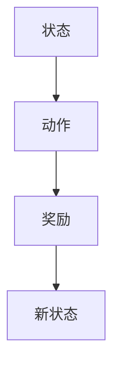
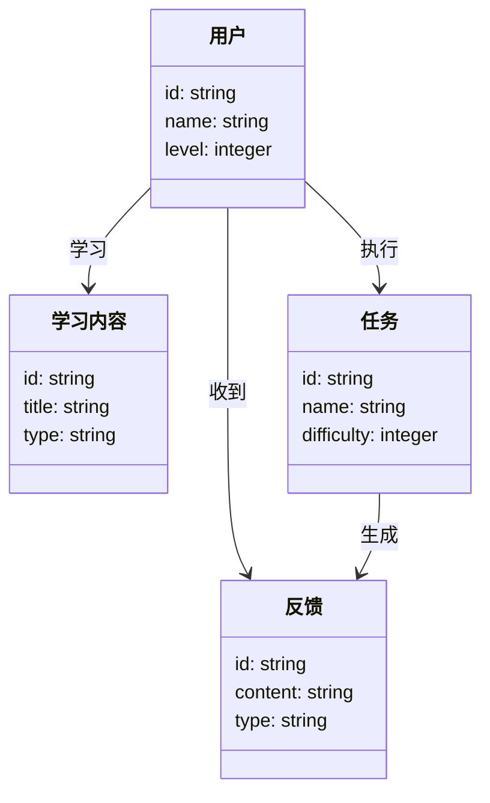
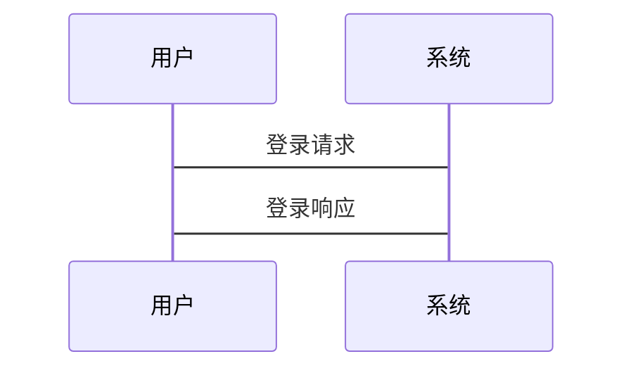
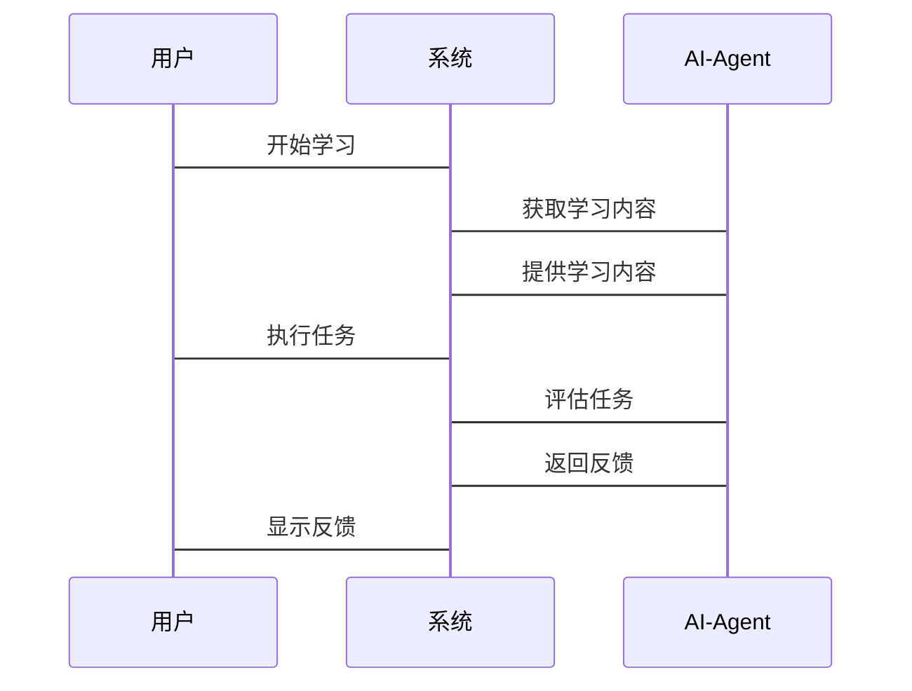

                 


# 开发AI Agent支持的智能语言学习系统

关键词：AI Agent，语言学习，自然语言处理，机器学习，智能教育

摘要：本文探讨了如何利用AI Agent技术构建智能语言学习系统，分析其核心概念、算法原理和系统架构，结合项目实战和最佳实践，提供实现方法和应用案例。

---

## 第一部分: AI Agent支持的智能语言学习系统背景与核心概念

### 第1章: AI Agent与智能语言学习系统概述

#### 1.1 AI Agent的基本概念
##### 1.1.1 AI Agent的定义与特点
AI Agent（人工智能代理）是指能够感知环境、自主决策并执行任务的智能体。其特点包括：
- **智能性**：能够理解和处理复杂信息。
- **自主性**：无需外部干预，自主完成任务。
- **反应性**：实时感知环境变化并做出反应。
- **学习性**：通过经验改进性能。

##### 1.1.2 AI Agent的核心功能与分类
AI Agent的核心功能包括感知、决策和执行。根据智能水平，可分为：
- **简单反射型**：基于规则做出反应。
- **基于模型的反应型**：使用内部模型进行决策。
- **目标驱动型**：根据目标选择行动。

##### 1.1.3 AI Agent在语言学习中的应用潜力
AI Agent在语言学习中的潜力体现在实时对话练习、个性化反馈和自适应学习路径设计等方面。

#### 1.2 智能语言学习系统的定义与目标
##### 1.2.1 智能语言学习系统的定义
智能语言学习系统是一种结合AI技术的教育系统，旨在通过智能化手段提升语言学习效果。

##### 1.2.2 系统的核心目标与应用场景
系统目标包括提高学习效率、个性化教学和实时反馈。应用场景涵盖K12教育、企业培训等。

##### 1.2.3 系统的边界与外延
系统不包括线下教学活动，专注于线上学习支持。

### 第2章: AI Agent支持的智能语言学习系统的核心概念

#### 2.1 AI Agent与语言学习的结合
##### 2.1.1 AI Agent在语言学习中的角色
AI Agent作为学习助手，提供实时反馈和个性化推荐。

##### 2.1.2 语言学习系统的智能化需求
系统需具备实时交互、个性化推荐和自适应学习功能。

##### 2.1.3 AI Agent与语言学习系统的交互机制
通过自然语言处理技术实现对话交互。

#### 2.2 系统的核心要素与概念结构
##### 2.2.1 用户角色与需求分析
用户包括学习者和教师，需求包括个性化学习和实时反馈。

##### 2.2.2 语言学习任务的建模
学习任务包括词汇记忆、句子构造和对话练习。

##### 2.2.3 AI Agent的行为模型与决策机制
基于强化学习和监督学习算法进行决策。

### 第2.3 系统的ER实体关系图
```mermaid
er
  actor 用户 {
    id: string
    name: string
    level: integer
  }
  actor 学习内容 {
    id: string
    title: string
    type: string
  }
  actor 任务 {
    id: string
    name: string
    difficulty: integer
  }
  actor 反馈 {
    id: string
    content: string
    type: string
  }
  用户 --> 学习内容: 学习
  用户 --> 任务: 执行
  用户 --> 反馈: 收到
  任务 --> 反馈: 生成
```

---

## 第二部分: AI Agent支持的智能语言学习系统算法原理

### 第3章: 算法原理讲解

#### 3.1 强化学习算法的选择与实现
##### 3.1.1 强化学习的基本原理
强化学习通过试错机制，学习策略以最大化累积奖励。

##### 3.1.2 强化学习的流程


##### 3.1.3 算法实现
```python
def policy_func(state):
    return np.random.choice(2)  # 简单策略

def reinforce_learning_loop(env):
    rewards = []
    for episode in range(1000):
        state = env.reset()
        episode_reward = 0
        while True:
            action = policy_func(state)
            next_state, reward, done = env.step(action)
            episode_reward += reward
            state = next_state
            if done:
                break
        rewards.append(episode_reward)
    return rewards
```

#### 3.2 基于强化学习的AI Agent算法实现
##### 3.2.1 算法的数学模型
策略梯度公式：
$$ J(\theta) = \mathbb{E}_{\tau}[ \ln \pi_\theta(a|s) ] $$

##### 3.2.2 算法实现
```python
import numpy as np

def policy_gradient_network(state):
    # 简单网络结构
    return tf.nn.softmax(tf.matmul(state, weight) + bias)

def reinforce_learning_episode(env, network):
    states = []
    actions = []
    rewards = []
    state = env.reset()
    while True:
        action_dist = policy_gradient_network(state)
        action = np.random.choice(2, p=action_dist.numpy()[0])
        next_state, reward, done = env.step(action)
        states.append(state)
        actions.append(action)
        rewards.append(reward)
        state = next_state
        if done:
            break
    return states, actions, rewards
```

#### 3.3 算法实现的数学推导与举例
策略梯度的损失函数：
$$ L = -\sum_{t} \ln \pi(a_t|s_t) R_t $$

通过梯度下降更新参数：
$$ \nabla_\theta L = -\sum_{t} \frac{\partial}{\partial \theta} \ln \pi(a_t|s_t) R_t $$

---

## 第三部分: 系统分析与架构设计方案

### 第4章: 系统分析与架构设计方案

#### 4.1 系统目标场景介绍
以用户学习英语口语为例，构建实时对话练习系统。

#### 4.2 系统功能设计
##### 4.2.1 领域模型


#### 4.3 系统架构设计
##### 4.3.1 分层架构


#### 4.4 系统接口设计
##### 4.4.1 用户登录接口


#### 4.5 系统交互流程图


---

## 第四部分: 项目实战

### 第5章: 项目实战

#### 5.1 系统核心功能实现
##### 5.1.1 环境搭建
安装必要的Python库，如TensorFlow和Keras。

##### 5.1.2 核心功能实现
实现对话生成模型：
```python
def generate_response(input_text):
    # 调用预训练的对话模型
    response = model.predict(input_text)
    return response
```

##### 5.1.3 系统功能代码实现
```python
class LearningSystem:
    def __init__(self, agent):
        self.agent = agent

    def start_learning(self):
        while True:
            input_text = input("你: ")
            response = self.agent.generate_response(input_text)
            print("AI: ", response)
```

#### 5.2 项目实现过程分析
##### 5.2.1 代码实现
实现用户登录、任务分配和反馈生成功能。

##### 5.2.2 代码解读
解释关键代码的功能和实现逻辑。

#### 5.3 项目实际案例分析
分析一个用户学习英语口语的案例，展示系统如何提供实时反馈和个性化建议。

#### 5.4 项目小结
总结项目实现的关键点和经验教训。

---

## 第五部分: 最佳实践与总结

### 第6章: 最佳实践

#### 6.1 开发中的注意事项
- 数据隐私保护
- 系统性能优化
- 用户体验设计

#### 6.2 小结与展望
总结系统的核心价值，展望未来的发展方向。

#### 6.3 扩展阅读
推荐相关书籍和论文，帮助读者深入学习。

---

## 作者：AI天才研究院 & 禅与计算机程序设计艺术

