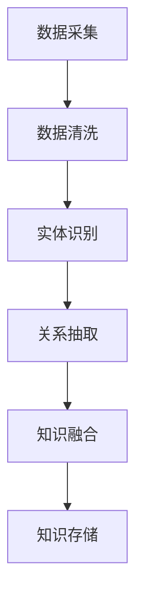
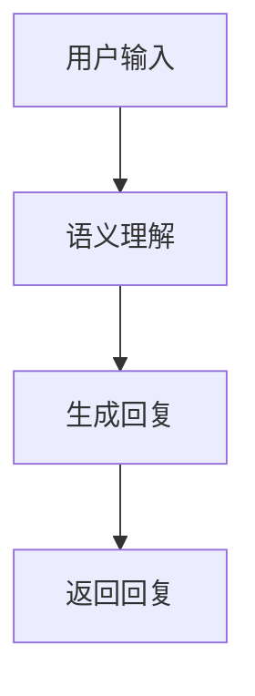
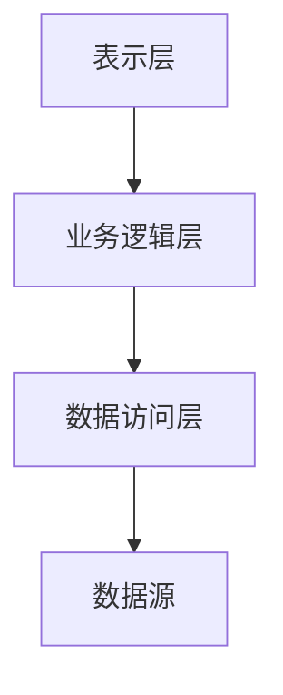
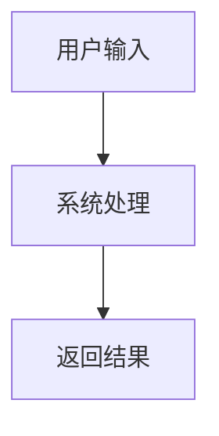

                 


# 开发AI Agent的个性化学习助手系统

> 关键词：AI Agent, 个性化学习, 自然语言处理, 机器学习, 知识图谱, 系统架构

> 摘要：本文详细介绍了开发AI Agent个性化学习助手系统的各个方面，从核心概念到算法原理，再到系统架构和项目实战。通过理论与实践相结合，帮助读者理解并掌握如何设计和实现一个高效的个性化学习助手系统。

---

# 第1章: AI Agent与个性化学习助手系统概述

## 1.1 AI Agent的基本概念

### 1.1.1 AI Agent的定义

AI Agent（智能代理）是指能够感知环境、自主决策并执行任务的智能实体。它可以是一个软件程序，也可以是物理设备，通过传感器和执行器与环境交互。

**AI Agent的核心特征：**

- **自主性**：能够自主决策，无需外部干预。
- **反应性**：能够实时感知环境并做出反应。
- **目标导向**：有明确的目标，驱动行为。
- **学习能力**：能够通过经验改进性能。

### 1.1.2 个性化学习助手系统的定义

个性化学习助手系统是一种基于AI技术的教育工具，能够根据学习者的需求、兴趣和能力提供定制化的学习建议、资源推荐和实时反馈。

---

## 1.2 个性化学习助手系统的背景与意义

### 1.2.1 当前教育领域的技术需求

现代教育领域对个性化学习的需求日益增加，传统的“一刀切”教学方式已无法满足学生的多样化需求。AI技术的引入为解决这一问题提供了新的可能性。

### 1.2.2 AI技术在教育中的应用现状

目前，AI技术在教育领域的应用主要集中在以下几个方面：

- **智能推荐**：基于学习者的数据推荐个性化学习资源。
- **自然语言处理**：用于智能对话和学习内容生成。
- **学习分析**：通过数据分析优化学习过程。

### 1.2.3 个性化学习助手系统的应用前景

个性化学习助手系统具有广阔的应用前景，特别是在K-12教育、高等教育和职业培训领域。通过AI Agent技术，学习助手能够帮助学生更高效地学习，教师也能更好地管理教学过程。

---

## 1.3 本章小结

本章介绍了AI Agent的基本概念和个性化学习助手系统的定义，分析了当前教育领域的技术需求和AI技术在教育中的应用现状，最后展望了个性化学习助手系统的应用前景。

---

# 第2章: AI Agent的核心概念与技术背景

## 2.1 AI Agent的核心概念

### 2.1.1 知识表示与推理

知识表示是AI Agent实现智能决策的基础。常用的表示方法包括：

- **符号表示法**：使用符号和规则表示知识。
- **语义网络**：通过节点和边表示概念及其关系。
- **知识图谱**：结构化的知识表示，广泛应用于AI系统中。

**推理**是基于知识表示进行逻辑推导的过程，常用的推理方法包括：

- **逻辑推理**：基于逻辑规则进行推导。
- **概率推理**：基于概率模型进行推导。

### 2.1.2 自然语言处理技术

自然语言处理（NLP）是AI Agent实现人机交互的关键技术。主要任务包括：

- **分词与词性标注**：将文本分割成词语，并标注词性。
- **语义理解**：理解文本的语义含义。
- **对话系统**：实现与用户的自然对话。

### 2.1.3 机器学习与深度学习

机器学习和深度学习是AI Agent实现个性化学习的基础技术。常用的算法包括：

- **监督学习**：基于标记数据进行学习。
- **无监督学习**：基于未标记数据进行学习。
- **深度学习**：基于神经网络进行特征提取和模式识别。

---

## 2.2 个性化学习的理论基础

### 2.2.1 学习者特征分析

学习者特征分析是个性化学习的基础，主要包括：

- **学习风格**：不同学习者适合不同的学习方式。
- **知识水平**：学习者当前的知识储备。
- **学习动机**：学习者的内在驱动力。

### 2.2.2 学习目标与路径规划

基于学习者特征分析，系统可以为每个学习者制定个性化的目标和学习路径。

### 2.2.3 学习效果评估

通过实时监测和评估学习者的学习行为和结果，系统可以不断优化学习策略。

---

## 2.3 AI Agent在个性化学习中的作用

### 2.3.1 动态适应学习者需求

AI Agent能够实时感知学习者的需求变化，并动态调整学习计划。

### 2.3.2 提供个性化学习资源

基于学习者特征，系统可以推荐适合的学习资源和学习路径。

### 2.3.3 监测与反馈学习过程

通过实时监测学习者的学习行为，系统可以提供即时反馈，帮助学习者改进学习策略。

---

## 2.4 本章小结

本章介绍了AI Agent的核心概念，包括知识表示与推理、自然语言处理技术和机器学习与深度学习。分析了个性化学习的理论基础，并探讨了AI Agent在个性化学习中的作用。

---

# 第3章: AI Agent的算法原理与实现

## 3.1 知识表示与推理算法

### 3.1.1 知识图谱构建

知识图谱是一种结构化的知识表示方法，通过实体和关系构建知识网络。以下是知识图谱构建的流程：

1. **数据采集**：从多种数据源（如网页、数据库）采集数据。
2. **数据清洗**：去除噪声数据，确保数据质量。
3. **实体识别**：识别数据中的实体。
4. **关系抽取**：提取实体之间的关系。
5. **知识融合**：将不同数据源的知识进行整合。
6. **知识存储**：将知识存储到数据库中。

**知识图谱构建流程图：**



---

### 3.1.2 逻辑推理算法

逻辑推理是基于知识图谱进行推理的过程，常用的推理算法包括：

- **前向推理**：从已知事实出发，推导新的事实。
- **反向推理**：从目标出发，寻找支持目标的事实。

**逻辑推理示例：**

假设知识图谱中有以下事实：
- A是B的父亲。
- B是C的父亲。
则可以推导出A是C的祖父。

---

## 3.2 自然语言处理技术

### 3.2.1 分词与词性标注

分词是将文本分割成词语的过程，词性标注是对每个词语赋予词性标签。

**分词与词性标注示例：**

输入文本：人工智能是一种新兴的技术。

分词结果：["人工智能", "是", "一种", "新兴", "的技术", "."]

词性标注：
- 人工智能：名词
- 是：动词
- 一种：数量词
- 新兴：形容词
- 的：助词
- 技术：名词

---

### 3.2.2 语义理解与生成

语义理解是通过分析文本的语义含义，生成符合上下文的回复。

**示例：**

输入文本：你今天过得怎么样？

语义理解：询问对方今天的情况。

生成回复：今天过得很好，谢谢。

---

### 3.2.3 对话系统实现

对话系统实现基于自然语言处理技术，通过理解用户输入生成回复。

**对话系统流程图：**



---

## 3.3 机器学习与深度学习算法

### 3.3.1 监督学习与特征提取

监督学习是一种基于标记数据的机器学习方法，常用于分类和回归任务。

**线性回归公式：**

$$ y = \theta_0 + \theta_1 x $$

---

### 3.3.2 无监督学习与聚类分析

无监督学习是一种基于未标记数据的机器学习方法，常用于聚类和降维任务。

**k-means聚类算法：**

1. 初始化k个质心。
2. 计算每个数据点到质心的距离，将数据点分配到最近的质心所在簇。
3. 重新计算质心。
4. 重复步骤2和3，直到质心不再变化。

---

## 3.4 本章小结

本章详细介绍了AI Agent的算法原理与实现，包括知识表示与推理、自然语言处理技术和机器学习与深度学习算法。

---

# 第4章: 系统架构与功能设计

## 4.1 系统功能模块划分

个性化学习助手系统的主要功能模块包括：

1. **用户信息采集模块**：采集学习者的基本信息、学习目标和学习风格。
2. **学习需求分析模块**：基于用户信息分析学习者的需求。
3. **个性化推荐模块**：根据需求分析结果推荐学习资源和学习路径。

---

## 4.2 系统架构设计

### 4.2.1 分层架构设计

个性化学习助手系统的架构设计通常采用分层架构，包括：

1. **表示层**：用户界面。
2. **业务逻辑层**：实现系统的核心功能。
3. **数据访问层**：与数据源交互。

**系统架构图：**



---

## 4.3 系统接口与交互流程

### 4.3.1 用户界面设计

用户界面设计应简洁直观，便于学习者使用。

### 4.3.2 API接口设计

API接口是系统与其他系统交互的重要途径。

### 4.3.3 交互流程图



---

## 4.4 本章小结

本章详细介绍了个性化学习助手系统的架构设计与功能模块划分，包括分层架构设计和系统接口与交互流程。

---

# 第5章: 项目实战与实现

## 5.1 环境搭建与工具安装

开发个性化学习助手系统需要以下工具：

- **Python**：编程语言。
- **TensorFlow**：机器学习框架。
- **Flask**：Web框架。
- **NLTK**：自然语言处理库。

---

## 5.2 系统核心实现

### 5.2.1 用户信息采集模块

**代码示例：**

```python
import pandas as pd

def collect_user_info():
    user_info = {}
    user_info['name'] = input("请输入您的姓名：")
    user_info['age'] = int(input("请输入您的年龄："))
    user_info['learning_style'] = input("请输入您的学习风格：")
    return user_info

user_info = collect_user_info()
print(user_info)
```

---

### 5.2.2 学习需求分析模块

**代码示例：**

```python
import numpy as np

def analyze_learning_demand(user_info):
    demand = {}
    demand['primary_skills'] = np.random.choice(['编程', '数学', '英语'], 2)
    demand['learning_plan'] = '每天学习2小时'
    return demand

demand = analyze_learning_demand(user_info)
print(demand)
```

---

### 5.2.3 个性化推荐模块

**代码示例：**

```python
from flask import Flask

app = Flask(__name__)

@app.route('/')
def recommend_resources():
    return "个性化学习资源推荐：编程书籍、数学练习题、英语听力材料"

if __name__ == '__main__':
    app.run()
```

---

## 5.3 本章小结

本章通过项目实战的方式，详细介绍了个性化学习助手系统的实现过程，包括环境搭建、核心模块实现和系统部署。

---

# 第6章: 最佳实践与注意事项

## 6.1 最佳实践

### 6.1.1 数据隐私保护

在个性化学习系统中，用户数据的隐私保护至关重要。

### 6.1.2 系统可扩展性设计

系统设计时应考虑未来的扩展性需求。

### 6.1.3 人机交互优化

优化人机交互界面和流程，提升用户体验。

---

## 6.2 小结

个性化学习助手系统的开发需要综合运用AI技术、系统设计和项目管理的知识，通过不断优化和迭代，才能实现最佳效果。

---

## 6.3 注意事项

- **数据质量**：确保数据的准确性和完整性。
- **系统性能**：优化系统性能，提升响应速度。
- **用户体验**：注重用户体验，提供友好的交互界面。

---

## 6.4 拓展阅读

推荐阅读以下书籍和文章：

- 《机器学习实战》
- 《深度学习入门：基于Python》
- 《自然语言处理入门》

---

# 作者信息

作者：AI天才研究院/AI Genius Institute & 禅与计算机程序设计艺术 /Zen And The Art of Computer Programming

---

感谢您的阅读，希望本文对您开发AI Agent的个性化学习助手系统有所帮助！

