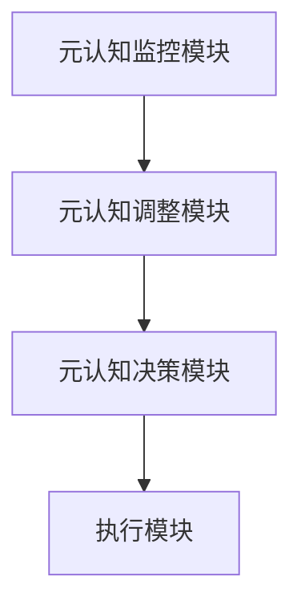

                 


# 开发AI Agent的元认知能力：自我监控和调整

## 关键词：AI Agent，元认知能力，自我监控，自适应机制，强化学习，元认知环路

## 摘要：  
本文详细探讨了AI Agent的元认知能力，特别是自我监控和调整的能力。文章从元认知能力的定义、AI Agent的基本概念入手，深入分析了元认知能力的核心概念、算法原理、系统架构设计以及实际项目中的应用。通过结合强化学习和自适应算法，文章展示了如何实现具备元认知能力的AI Agent，并通过实际案例和代码示例，帮助读者理解元认知能力在AI Agent中的具体应用和优化策略。

---

# 第1章 元认知能力与AI Agent概述

## 1.1 元认知能力的定义与特点  
### 1.1.1 元认知能力的定义  
元认知能力是指个体对自身认知过程的认知和调控能力，包括对认知过程的监控、评估和调整。在AI Agent中，元认知能力表现为对自身行为的监控、对环境的理解以及对决策过程的调整能力。

### 1.1.2 元认知能力的核心特点  
- **自省性**：能够意识到自身的认知状态和行为结果。  
- **灵活性**：能够根据环境变化调整自身的认知策略。  
- **目标导向性**：元认知能力以实现特定目标为导向，动态优化认知过程。  

### 1.1.3 元认知能力与AI Agent的结合  
AI Agent通过元认知能力可以实现自主决策和自适应行为，能够更好地应对复杂和动态变化的环境。

---

## 1.2 AI Agent的基本概念  
### 1.2.1 AI Agent的定义  
AI Agent是一种智能实体，能够感知环境、自主决策并执行任务，具备问题解决、学习和自适应能力。  

### 1.2.2 AI Agent的核心功能  
- **感知环境**：通过传感器或数据输入感知外部环境。  
- **决策与推理**：基于感知信息进行推理和决策。  
- **执行动作**：根据决策结果执行具体动作。  
- **学习与适应**：通过经验或反馈优化自身行为。  

### 1.2.3 AI Agent的分类与应用场景  
AI Agent可以分为简单反射型、基于模型的反应型、目标驱动型和实用驱动型等。应用场景包括自动驾驶、智能助手、机器人控制等。

---

## 1.3 元认知能力在AI Agent中的作用  
### 1.3.1 元认知能力对AI Agent自主性的影响  
元认知能力使得AI Agent能够自主监控自身行为，发现错误并及时调整，从而提高自主性。  

### 1.3.2 元认知能力对AI Agent适应性的作用  
元认知能力使AI Agent能够根据环境变化动态调整认知策略，增强适应性。  

### 1.3.3 元认知能力对AI Agent决策优化的意义  
通过元认知能力，AI Agent能够评估决策过程的合理性，优化决策结果，提升整体性能。

---

## 1.4 本章小结  
本章从元认知能力的定义和特点入手，介绍了AI Agent的基本概念和分类，重点阐述了元认知能力在AI Agent中的作用，为后续内容奠定了基础。

---

# 第2章 元认知能力的核心概念与原理  

## 2.1 元认知环路模型  
### 2.1.1 元认知环路的定义  
元认知环路模型描述了元认知能力在AI Agent中的运行机制，包括监控、评估和调整三个阶段。  

### 2.1.2 元认知环路的组成部分  
- **监控阶段**：感知和识别当前认知状态。  
- **评估阶段**：对认知过程和结果进行评估。  
- **调整阶段**：根据评估结果调整认知策略。  

### 2.1.3 元认知环路的运行机制  
元认知环路通过实时监控和动态调整，确保AI Agent的认知过程高效且符合目标要求。

---

## 2.2 元认知监控与调整机制  
### 2.2.1 元认知监控的定义与作用  
元认知监控是对AI Agent自身行为的实时观察和记录，帮助识别潜在问题。  

### 2.2.2 元认知调整的策略与方法  
- **基于反馈的调整**：根据外部反馈优化认知策略。  
- **基于规则的调整**：根据预定义规则动态调整行为。  
- **基于学习的调整**：通过机器学习模型优化调整策略。  

### 2.2.3 监控与调整的动态平衡  
AI Agent需要在监控和调整之间找到动态平衡，避免过度监控导致性能下降。

---

## 2.3 元认知能力的评估指标  
### 2.3.1 元认知能力的评估维度  
- **准确性**：认知过程的正确性。  
- **效率性**：认知过程的执行速度。  
- **适应性**：应对环境变化的能力。  

### 2.3.2 元认知能力的量化方法  
通过量化指标（如准确率、响应时间）评估元认知能力的表现。  

### 2.3.3 元认知能力的评估工具  
使用日志分析、性能测试等工具对元认知能力进行评估。

---

## 2.4 本章小结  
本章详细阐述了元认知环路模型和监控调整机制，并提出了元认知能力的评估方法，为后续的算法设计提供了理论基础。

---

# 第3章 元认知能力的算法原理  

## 3.1 基于强化学习的元认知监控  
### 3.1.1 强化学习的基本原理  
强化学习通过奖励机制优化决策过程，适用于动态环境中的策略优化。  

### 3.1.2 元认知监控的强化学习模型  
$$ R(s, a) = \text{奖励函数} $$  
其中，$s$表示状态，$a$表示动作，$R$表示奖励。  

### 3.1.3 案例分析：元认知监控在棋类游戏中的应用  
通过强化学习模型，AI Agent能够实时监控棋局变化，优化决策策略。  

### 3.1.4 代码实现：强化学习框架下的元认知监控  
```python
def reinforce_learning(state, action):
    # 计算奖励
    reward = get_reward(state, action)
    # 更新策略
    update_policy(reward)
```

---

## 3.2 元认知调整的自适应算法  
### 3.2.1 自适应算法的基本概念  
自适应算法能够根据环境变化动态调整参数和策略。  

### 3.2.2 基于反馈的自适应调整策略  
$$ f(s, r) = \text{反馈函数} $$  
其中，$s$表示状态，$r$表示反馈。  

### 3.2.3 案例分析：自适应算法在自然语言处理中的应用  
通过自适应算法，AI Agent能够根据上下文调整语言生成策略。  

### 3.2.4 代码实现：自适应算法框架下的元认知调整  
```python
def adaptive_adjustment(input, feedback):
    # 根据反馈调整参数
    new_params = adjust_parameters(input, feedback)
    # 更新模型
    update_model(new_params)
```

---

## 3.3 元认知能力的数学模型  
### 3.3.1 元认知能力的数学表达式  
$$ C(s, a) = \text{认知函数} $$  
其中，$s$表示状态，$a$表示动作，$C$表示认知函数。  

### 3.3.2 元认知监控的数学模型  
$$ M(s, a) = \text{监控函数} $$  
其中，$M$表示监控函数，用于评估当前认知过程。  

### 3.3.3 元认知调整的数学公式  
$$ A(s, r) = \text{调整函数} $$  
其中，$A$表示调整函数，$r$表示反馈。  

---

## 3.4 本章小结  
本章从算法角度详细探讨了元认知能力的实现方法，重点介绍了基于强化学习和自适应算法的元认知监控与调整策略。

---

# 第4章 元认知能力的系统架构与设计  

## 4.1 元认知能力的系统组成  
### 4.1.1 元认知监控模块  
负责实时监控AI Agent的行为和环境状态。  

### 4.1.2 元认知调整模块  
根据监控结果动态调整认知策略。  

### 4.1.3 元认知决策模块  
综合监控和调整结果，做出最优决策。  

---

## 4.2 元认知能力的系统架构图  


---

## 4.3 元认知能力的接口设计  
### 4.3.1 元认知监控接口  
定义接口用于获取当前状态和行为信息。  

### 4.3.2 元认知调整接口  
定义接口用于接收反馈并调整认知策略。  

---

## 4.4 本章小结  
本章从系统架构的角度分析了元认知能力的实现，重点介绍了系统的组成模块和接口设计，为实际应用提供了参考。

---

# 第5章 元认知能力的项目实战  

## 5.1 项目背景与目标  
通过开发一个具备元认知能力的AI Agent，验证元认知监控和调整算法的有效性。

---

## 5.2 项目环境与工具安装  
- **Python 3.8+**  
- **TensorFlow 2.0+**  
- **OpenAI API**  

---

## 5.3 项目核心实现  
### 5.3.1 元认知监控模块实现  
```python
def monitor_behavior(state):
    # 返回监控结果
    return monitor_result
```

### 5.3.2 元认知调整模块实现  
```python
def adjust_strategy(feedback):
    # 根据反馈调整策略
    return new_strategy
```

---

## 5.4 项目案例分析  
### 5.4.1 案例描述  
开发一个智能聊天机器人，具备元认知能力，能够根据对话反馈动态调整回答策略。  

### 5.4.2 实际案例分析  
通过用户反馈优化聊天机器人的回答策略，提升用户体验。  

---

## 5.5 项目小结  
本章通过实际案例展示了元认知能力在AI Agent中的应用，验证了算法的有效性。

---

# 第6章 元认知能力的优化与展望  

## 6.1 最佳实践 tips  
- 定期优化元认知监控和调整算法，提升性能。  
- 结合具体应用场景，选择合适的元认知能力实现方法。  

---

## 6.2 小结  
本文详细探讨了AI Agent的元认知能力，从理论到实践，全面分析了其开发和应用。

---

## 6.3 注意事项  
- 元认知能力的实现需要结合具体场景，避免过于通用化。  
- 定期监控和调整元认知能力，确保其有效性。  

---

## 6.4 拓展阅读  
- 强化学习与自适应算法的相关研究。  
- 元认知能力在人机交互中的应用。  

---

# 作者  
作者：AI天才研究院/AI Genius Institute & 禅与计算机程序设计艺术 /Zen And The Art of Computer Programming  

---

通过以上目录和内容设计，文章系统地探讨了AI Agent的元认知能力，从理论到实践，为读者提供了全面的知识和实用的指导。

