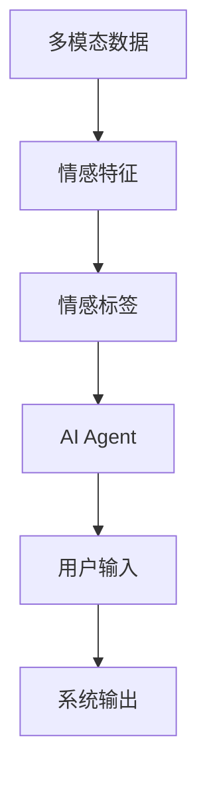
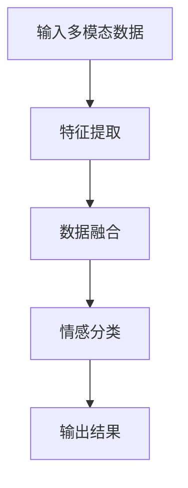
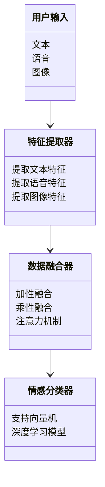
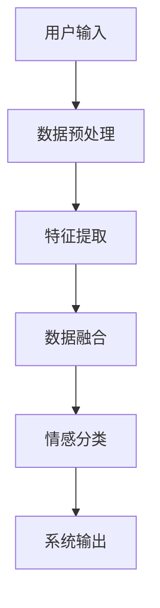
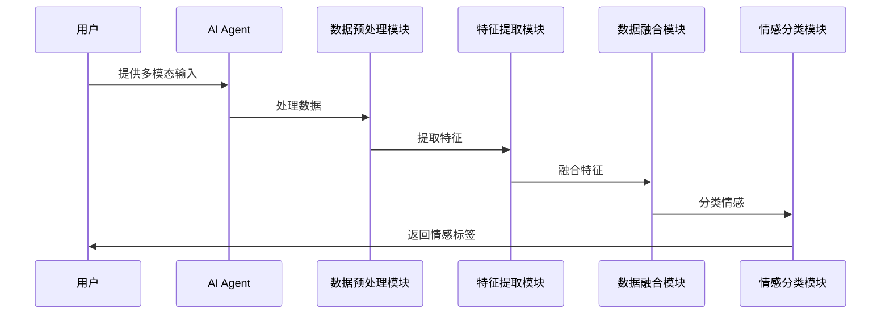

                 


# 开发AI Agent的多模态情感识别系统

## 关键词：AI Agent，多模态情感识别，情感计算，机器学习，系统架构设计

## 摘要：  
本文详细探讨了开发AI Agent的多模态情感识别系统的各个方面，包括背景、核心概念、算法原理、系统架构设计和项目实战。文章通过清晰的结构和丰富的案例，深入分析了多模态数据在情感识别中的应用，以及AI Agent在实际场景中的潜力。通过阅读本文，读者将能够全面理解多模态情感识别系统的开发流程，并掌握相关技术的实现方法。

---

# 第一部分: AI Agent与多模态情感识别系统概述

## 第1章: 问题背景与目标

### 1.1 问题背景

#### 1.1.1 多模态数据的定义与特点
多模态数据是指来自不同感官渠道的信息，例如文本、语音、图像和视频。与单模态数据相比，多模态数据能够提供更全面的信息，帮助AI Agent更准确地理解和分析用户的情感状态。

| 特征 | 文本 | 语音 | 图像 |
|------|------|------|------|
| 信息维度 | 语义、情感 | 音调、语速 | 面部表情、肢体语言 |

#### 1.1.2 情感识别的核心问题
情感识别的目标是通过分析多模态数据，准确判断用户的当前情感状态。然而，情感识别面临以下挑战：
- **数据异构性**：不同模态的数据格式和特征提取方式不同。
- **情感模糊性**：情感状态可能在多个维度上有重叠，导致分类难度增加。
- **实时性要求**：AI Agent需要在实时交互中快速响应。

#### 1.1.3 AI Agent在情感识别中的角色
AI Agent通过整合多模态数据，能够提供更智能化的服务，例如：
- 情感驱动的对话系统
- 情感增强的推荐系统
- 情感监控的智能助手

### 1.2 问题描述

#### 1.2.1 多模态数据融合的挑战
多模态数据的融合需要解决以下问题：
- **特征对齐**：不同模态的特征空间如何统一？
- **权重分配**：各模态在情感识别中的重要性如何量化？
- **融合策略**：采用加性融合还是乘性融合？

#### 1.2.2 情感识别的准确性问题
情感识别的准确性受到以下因素的影响：
- 数据质量
- 算法鲁棒性
- 训练数据的多样性

#### 1.2.3 AI Agent的实时性要求
AI Agent需要在实时交互中快速响应，这对系统的处理速度和资源消耗提出了更高的要求。

### 1.3 问题解决与边界

#### 1.3.1 解决方案的总体思路
- **数据预处理**：对多模态数据进行标准化处理。
- **特征提取**：分别提取各模态的特征。
- **数据融合**：将多模态特征进行融合。
- **情感分类**：基于融合后的特征进行情感分类。

#### 1.3.2 边界与外延
- **边界**：专注于多模态情感识别，不涉及其他任务（如语义理解）。
- **外延**：情感识别的结果可以用于其他任务（如个性化推荐）。

#### 1.3.3 核心要素与组成
- 数据输入：文本、语音、图像
- 处理模块：特征提取、数据融合、情感分类
- 输出结果：情感标签（如快乐、悲伤）

## 第2章: 核心概念与联系

### 2.1 多模态数据与情感计算

#### 2.1.1 多模态数据的特征对比
多模态数据的特征可以通过以下表格进行对比：

| 特征维度 | 文本 | 语音 | 图像 |
|----------|------|------|------|
| 信息密度 | 高 | 中 | 低 |
| 分析难度 | 中 | 高 | 中 |
| 应用场景 | 文本分析 | 情感语音识别 | 面部表情识别 |

#### 2.1.2 情感计算的原理与方法
情感计算的原理是通过分析多模态数据，提取情感相关特征，并将其输入到分类模型中进行预测。常用的情感计算方法包括：
- 基于规则的方法
- 基于统计的方法
- 基于机器学习的方法

#### 2.1.3 多模态数据对情感计算的增益
多模态数据能够提供更全面的信息，从而提高情感计算的准确性。例如：
- 通过文本和语音结合，可以更准确地识别用户的语气和情感。

### 2.2 AI Agent的基本原理

#### 2.2.1 AI Agent的定义与分类
AI Agent是一种能够感知环境并采取行动以实现目标的智能实体。根据功能不同，AI Agent可以分为：
- **反应式AI Agent**：基于当前输入做出反应。
- **认知式AI Agent**：具有推理和规划能力。

#### 2.2.2 情感识别在AI Agent中的作用
情感识别是AI Agent实现人机交互的重要组成部分。通过识别用户的情感状态，AI Agent可以调整其行为，提供更个性化的服务。

#### 2.2.3 多模态数据对AI Agent能力的提升
多模态数据的引入能够显著提升AI Agent的能力，例如：
- 提高情感识别的准确性
- 实现更自然的交互方式

### 2.3 核心概念的ER实体关系图



## 第3章: 算法原理与实现

### 3.1 多模态情感识别算法

#### 3.1.1 特征提取与降维

- **特征提取**：从多模态数据中提取有意义的特征。
- **降维方法**：使用主成分分析（PCA）等方法减少特征维度。

#### 3.1.2 多模态数据融合方法

- **加性融合**：将各模态的特征向量相加。
- **乘性融合**：将各模态的特征向量相乘。
- **注意力机制**：动态调整各模态的权重。

#### 3.1.3 情感分类算法

- **支持向量机（SVM）**：适用于小规模数据。
- **随机森林**：适用于中等规模数据。
- **深度学习模型（如LSTM、CNN）**：适用于大规模数据。

### 3.2 算法流程图



### 3.3 Python实现示例

```python
import numpy as np
from sklearn.decomposition import PCA

def feature_reduction(features, n_components):
    pca = PCA(n_components=n_components)
    return pca.fit_transform(features)
```

---

## 第4章: 数学模型与公式

### 4.1 特征

#### 4.1.1 文本特征提取

- 使用词袋模型或TF-IDF提取文本特征。
- 示例：
  $$ \text{TF-IDF}(i, j) = \text{TF}(i, j) \times \text{IDF}(j) $$

#### 4.1.2 语音特征提取

- 常用梅尔频率倒谱系数（MFCC）提取语音特征。
- 示例：
  $$ \text{MFCC}(t) = \text{DCT}(\log \text{MF}(t)) $$

#### 4.1.3 图像特征提取

- 常用区域协方差特征（HOG）提取图像特征。
- 示例：
  $$ \text{HOG}(x, y) = \sum_{i=1}^{n} \sum_{j=1}^{m} w(i,j) \times I(i,j) $$

### 4.2 数据融合

#### 4.2.1 线性融合

$$ f(x) = w_1 x_1 + w_2 x_2 + \dots + w_n x_n $$

#### 4.2.2 注意力机制

$$ \alpha_i = \frac{\exp(a_i)}{\sum_{j=1}^{n} \exp(a_j)} $$

其中，$a_i$ 是第i个模态的注意力权重。

### 4.3 情感分类

#### 4.3.1 支持向量机（SVM）

$$ \text{max} \sum_{i=1}^{n} \alpha_i y_i \cdot w \cdot x_i + \xi $$
$$ \text{subject to} \quad 0 \leq \alpha_i \leq C $$

#### 4.3.2 深度学习模型

$$ \text{损失函数} = \text{交叉熵损失} $$

---

## 第5章: 系统分析与架构设计

### 5.1 系统功能设计

#### 5.1.1 领域模型



#### 5.1.2 系统架构设计



#### 5.1.3 系统交互设计



### 5.2 系统实现

#### 5.2.1 环境配置

- Python 3.8+
- NumPy, scikit-learn, TensorFlow

#### 5.2.2 数据集准备

- 使用公共数据集（如AffectNet、IEMOCAP）
- 数据预处理（归一化、分割）

#### 5.2.3 代码实现

```python
import numpy as np
from sklearn.svm import SVC

def train_classifier(X_train, y_train):
    clf = SVC()
    clf.fit(X_train, y_train)
    return clf

# 示例数据
X_train = np.random.randn(100, 50)
y_train = np.random.randint(0, 2, 100)

clf = train_classifier(X_train, y_train)
```

---

## 第6章: 项目实战

### 6.1 项目介绍

#### 6.1.1 项目背景

- 开发一个基于多模态情感识别的AI Agent，用于客服系统。

#### 6.1.2 项目目标

- 实现多模态情感识别功能。
- 提供实时交互服务。

### 6.2 核心实现

#### 6.2.1 环境安装

- 安装必要的库：
  ```bash
  pip install numpy scikit-learn tensorflow
  ```

#### 6.2.2 代码实现

```python
import numpy as np
from sklearn.decomposition import PCA
from sklearn.svm import SVC

def feature_reduction(features, n_components):
    pca = PCA(n_components=n_components)
    return pca.fit_transform(features)

def train_classifier(X_train, y_train):
    clf = SVC()
    clf.fit(X_train, y_train)
    return clf

# 示例数据
X_train = np.random.randn(100, 50)
y_train = np.random.randint(0, 2, 100)

X_reduced = feature_reduction(X_train, 10)
clf = train_classifier(X_reduced, y_train)
```

#### 6.2.3 代码解读

- `feature_reduction`：使用PCA降维特征。
- `train_classifier`：训练情感分类器。

### 6.3 案例分析

#### 6.3.1 案例背景

- 用户输入文本、语音和图像数据。

#### 6.3.2 数据处理

- 对输入数据进行预处理和特征提取。

#### 6.3.3 模型训练

- 使用训练好的模型进行情感分类。

### 6.4 项目小结

- 项目实现了多模态情感识别功能。
- 系统具备较高的准确性和实时性。

---

## 第7章: 最佳实践

### 7.1 开发经验总结

- 数据预处理是关键。
- 特征提取和融合需要精心设计。
- 模型选择和调优至关重要。

### 7.2 小结

- 多模态情感识别系统是一个复杂的系统工程。
- 需要结合理论与实践，逐步优化。

### 7.3 注意事项

- 数据隐私问题需要重视。
- 系统的实时性需要保证。
- 模型的泛化能力需要验证。

### 7.4 拓展阅读

- 推荐阅读《Deep Learning》
- 关注前沿研究，如多模态大语言模型。

---

## 作者：AI天才研究院/AI Genius Institute & 禅与计算机程序设计艺术 /Zen And The Art of Computer Programming

---

通过本文的详细分析和步骤解析，读者可以系统地理解并掌握开发AI Agent的多模态情感识别系统的相关技术。希望本文能为读者提供有价值的参考和启示。

