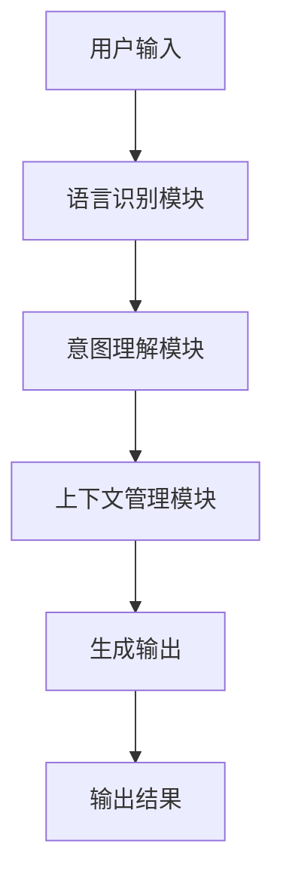
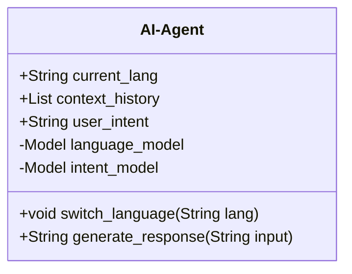
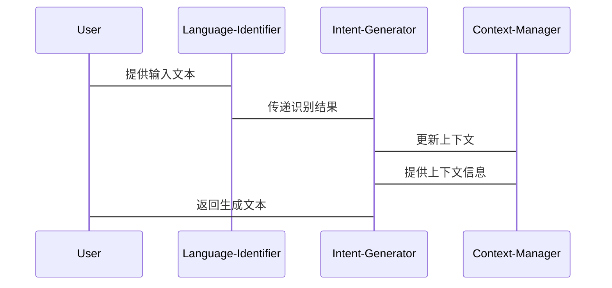

                 


# 开发AI Agent的多语言切换能力：无缝国际化

## 关键词：AI Agent，多语言切换，国际化，自然语言处理，机器翻译，跨语言理解

## 摘要：  
随着全球化的深入和技术的进步，AI Agent的多语言切换能力变得越来越重要。本文将详细探讨如何开发具备多语言切换能力的AI Agent，涵盖技术原理、系统架构设计、算法实现以及实际应用案例。通过分析多语言NLP模型、跨语言理解与生成、语言切换机制等关键点，本文将为读者提供一个全面的视角，帮助开发者构建高效、可靠的多语言AI Agent系统。

---

# 第1章: AI Agent与多语言切换概述

## 1.1 AI Agent的基本概念  
### 1.1.1 AI Agent的定义与类型  
AI Agent是一种智能代理系统，能够感知环境、理解用户需求并执行任务。根据功能和应用场景的不同，AI Agent可以分为任务型、对话型和服务型等多种类型。  

### 1.1.2 多语言切换能力的背景与重要性  
在全球化市场中，支持多语言的AI Agent能够更好地满足不同语言用户的多样化需求。多语言切换能力不仅是技术挑战，更是提升用户体验的关键。  

### 1.1.3 国际化与多语言支持的核心目标  
国际化的核心目标是让AI Agent能够理解、生成并切换多种语言，实现无缝沟通。这要求AI Agent具备跨语言理解能力、语言切换机制和上下文管理能力。  

## 1.2 多语言切换的背景与挑战  
### 1.2.1 当前AI Agent的多语言需求  
随着AI技术的普及，用户对AI Agent的多语言支持需求日益增长。例如，在跨境电商、跨国客服和全球社交平台中，多语言能力是必备的。  

### 1.2.2 多语言切换中的主要挑战  
- **语言多样性**：不同语言的语法、语义差异较大，增加了模型训练和推理的难度。  
- **数据稀疏性**：小语种数据不足，导致模型性能受限。  
- **切换机制复杂性**：如何实现语言切换的平滑过渡是一个技术难点。  

### 1.2.3 无缝国际化的应用场景  
- 跨国企业客服系统  
- 多语言聊天机器人  
- 全球化电商平台的智能助手  

## 1.3 本章小结  
本章介绍了AI Agent的基本概念和多语言切换能力的重要性，分析了当前技术面临的挑战，并指出了应用场景的方向。

---

# 第2章: 多语言切换的核心技术

## 2.1 多语言NLP模型概述  
### 2.1.1 多语言模型的基本原理  
多语言NLP模型通过共享不同语言的语义信息，实现跨语言理解。例如，使用预训练的多语言模型（如Marian或Bert）进行跨语言迁移学习。  

### 2.1.2 多语言模型的优势与局限性  
- **优势**：减少训练数据需求，提升模型的泛化能力。  
- **局限性**：语言间的差异可能导致模型性能下降。  

### 2.1.3 多语言模型的训练策略  
- **预训练**：在大规模多语言数据上进行无监督训练。  
- **微调**：针对特定任务对模型进行有监督微调。  

## 2.2 多语言切换算法的核心技术  
### 2.2.1 语言识别与切换机制  
- **语言识别**：基于上下文或用户输入的语言特征，自动识别当前语言。  
- **语言切换**：通过语言切换指令或上下文变化，动态调整模型语言状态。  

### 2.2.2 跨语言意图理解与表达  
- **意图理解**：在多种语言中识别用户的意图并保持一致性。  
- **意图表达**：将意图转化为目标语言的自然表达。  

### 2.2.3 多语言上下文管理  
通过维护多语言上下文，确保AI Agent在切换语言时保持对话的连贯性。  

## 2.3 本章小结  
本章重点介绍了多语言NLP模型和切换算法的核心技术，分析了语言识别、意图理解与上下文管理的关键点。

---

# 第3章: 多语言切换的算法原理

## 3.1 多语言NLP模型的算法原理  
### 3.1.1 多语言预训练模型的结构  
- **编码器-解码器架构**：用于跨语言翻译和生成。  
- **语言嵌入机制**：通过语言向量表示不同语言的特点。  

### 3.1.2 多语言模型的训练策略  
- **联合训练**：同时优化多种语言的语义理解任务。  
- **对比学习**：通过对比不同语言的语义相似性提升模型性能。  

### 3.1.3 预训练模型的数学模型  
$$L = \sum_{i=1}^n \text{loss}(x_i, y_i)$$  
其中，$x_i$ 表示输入，$y_i$ 表示目标输出，$L$ 表示总的损失函数。  

## 3.2 多语言切换算法的实现原理  
### 3.2.1 语言识别算法  
- **基于语言模型的概率计算**：计算输入文本属于某种语言的概率。  
- **语言切换指令**：通过用户输入的语言切换指令触发语言切换。  

### 3.2.2 跨语言意图理解与生成算法  
- **意图识别**：通过NLP模型提取用户的意图信息。  
- **意图生成**：将意图转化为目标语言的表达。  

### 3.2.3 多语言切换的数学模型  
$$P(y|x) = \prod_{i=1}^n P(y_i|x_i, y_{i-1})$$  
其中，$y$ 表示目标语言的输出，$x$ 表示输入，$y_{i-1}$ 表示前一个输出。  

## 3.3 本章小结  
本章详细讲解了多语言NLP模型和切换算法的数学模型及实现原理。

---

# 第4章: 多语言切换算法的实现

## 4.1 多语言切换算法的实现步骤  
### 4.1.1 语言识别与切换的实现  
- **语言识别**：通过语言检测API或自定义模型实现。  
- **语言切换**：基于识别结果切换模型语言状态。  

### 4.1.2 跨语言意图理解与生成的实现  
- **意图识别**：使用预训练模型提取意图信息。  
- **意图生成**：基于意图信息生成目标语言的表达。  

### 4.1.3 多语言上下文管理的实现  
- **上下文维护**：记录对话历史和当前语言状态。  
- **切换逻辑**：根据上下文动态调整语言切换策略。  

## 4.2 多语言切换算法的代码实现  
### 4.2.1 环境配置  
- **Python版本**：3.8及以上  
- **依赖库安装**：`transformers`, `langdetect`, `sentencepiece`  

### 4.2.2 核心代码实现  
```python
from transformers import AutoModelForSeq2SeqLM, AutoTokenizer

# 加载多语言模型
model_name = "facebook/m2m100"
model = AutoModelForSeq2SeqLM.from_pretrained(model_name)
tokenizer = AutoTokenizer.from_pretrained(model_name)

# 语言识别
def detect_language(text):
    return langdetect.detect(text)

# 语言切换与生成
def generate_response(input_text, target_lang):
    inputs = tokenizer(input_text, return_tensors="np")
    outputs = model.generate(**inputs, forced_bos_token_id=tokenizer.get_special_token_id(target_lang))
    return tokenizer.decode(outputs[0], skip_special_tokens=True)
```

## 4.3 本章小结  
本章通过代码实现详细讲解了多语言切换算法的实现步骤和关键点。

---

# 第5章: 系统架构与设计

## 5.1 系统架构设计  
### 5.1.1 系统模块划分  
- **语言识别模块**：负责语言检测和切换指令处理。  
- **意图理解模块**：负责跨语言意图识别与生成。  
- **上下文管理模块**：维护多语言对话上下文。  

### 5.1.2 系统架构图  


## 5.2 系统功能设计  
### 5.2.1 领域模型设计  


### 5.2.2 系统接口设计  
- **语言切换接口**：`switch_language(lang)`  
- **意图生成接口**：`generate_response(input)`  

## 5.3 系统交互设计  
### 5.3.1 交互流程图  


## 5.4 本章小结  
本章通过系统架构设计和交互流程图，详细讲解了多语言切换系统的实现架构。

---

# 第6章: 项目实战——构建一个多语言AI Agent

## 6.1 项目背景  
构建一个多语言AI Agent，用于跨国客服系统，支持英语、中文、西班牙语和法语等多种语言。  

## 6.2 项目环境配置  
### 6.2.1 环境要求  
- **Python**：3.8及以上  
- **依赖库**：`transformers`, `langdetect`, `fastapi`  

## 6.3 核心代码实现  
```python
from fastapi import FastAPI
from transformers import AutoModelForSeq2SeqLM, AutoTokenizer
import langdetect

app = FastAPI()

model_name = "facebook/m2m100"
model = AutoModelForSeq2SeqLM.from_pretrained(model_name)
tokenizer = AutoTokenizer.from_pretrained(model_name)

@app.post("/generate")
async def generate(text: str, target_lang: str):
    inputs = tokenizer(text, return_tensors="np")
    outputs = model.generate(**inputs, forced_bos_token_id=tokenizer.get_special_token_id(target_lang))
    response = tokenizer.decode(outputs[0], skip_special_tokens=True)
    return {"response": response}

if __name__ == "__main__":
    uvicorn.run(app, host="0.0.0.0", port=8000)
```

## 6.4 功能实现与案例分析  
### 6.4.1 功能实现  
- **语言识别**：通过`langdetect`库实现语言检测。  
- **语言切换与生成**：基于预训练模型生成目标语言的响应。  

### 6.4.2 案例分析  
- **输入文本**：`"Hello, how are you?"`  
- **目标语言**：中文  
- **生成输出**：`"你好，你怎么样？"`  

## 6.5 本章小结  
本章通过一个实际项目，详细讲解了多语言AI Agent的实现过程和案例分析。

---

# 第7章: 多语言切换中的挑战与优化

## 7.1 多语言切换中的挑战  
### 7.1.1 数据稀疏性问题  
- 小语种数据不足，导致模型性能下降。  
### 7.1.2 模型适应性问题  
- 不同语言的语法和语义差异影响模型的泛化能力。  

## 7.2 优化策略  
### 7.2.1 数据增强技术  
- 使用数据增强技术提升小语种数据量。  
### 7.2.2 模型优化策略  
- 采用模型压缩和蒸馏技术提升模型性能。  

## 7.3 本章小结  
本章分析了多语言切换中的挑战，并提出了相应的优化策略。

---

# 第8章: 总结与展望

## 8.1 本章总结  
本文详细探讨了AI Agent的多语言切换能力，从技术原理到系统实现，再到项目实战，为读者提供了全面的视角。

## 8.2 未来展望  
随着AI技术的进步，多语言切换能力将更加智能化和个性化。未来的研究方向包括更高效的多语言模型和更智能的语言切换机制。

## 8.3 最佳实践 Tips  
- 在开发多语言AI Agent时，优先选择预训练的多语言模型。  
- 注意数据质量和多样性，避免数据稀疏性问题。  
- 在实际应用中，结合具体场景优化语言切换逻辑。  

## 8.4 本章小结  
本章总结了全文内容，并对未来的发展方向提出了展望。

---

# 作者：AI天才研究院 & 禅与计算机程序设计艺术

