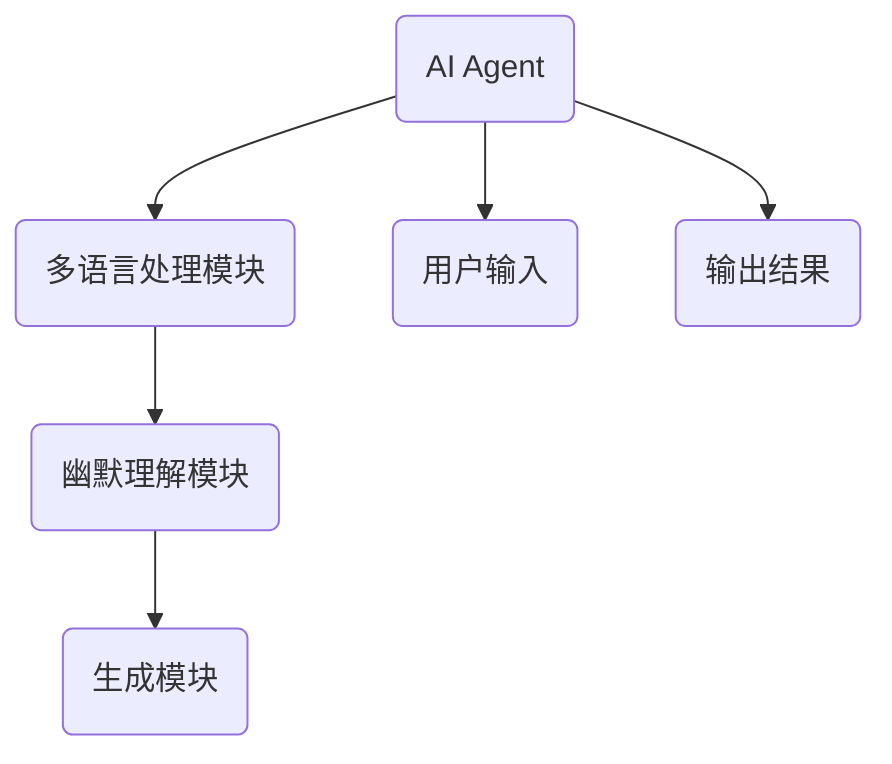
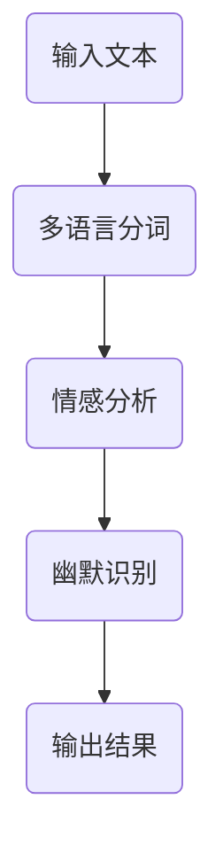
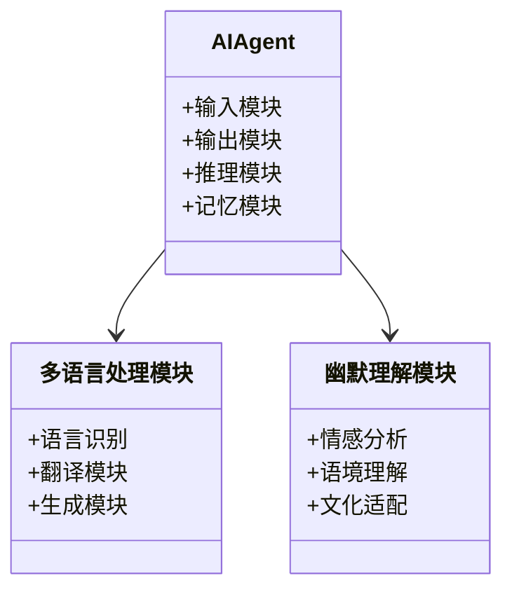
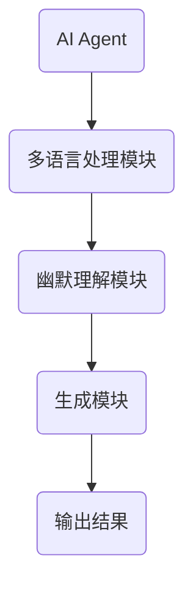
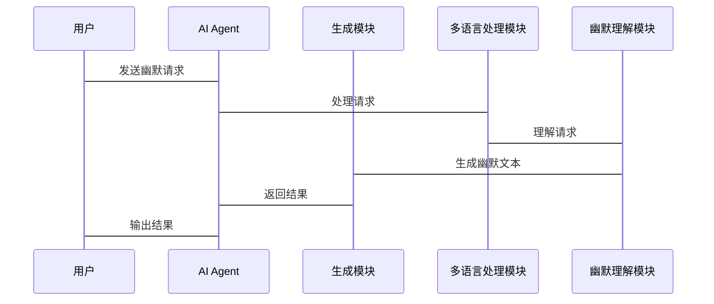

                 


# 开发AI Agent的多语言幽默理解与生成系统

> 关键词：AI Agent，多语言幽默，自然语言处理，机器学习，深度学习

> 摘要：本文系统性地探讨了开发AI Agent的多语言幽默理解与生成系统的各个方面，包括问题背景、核心概念、算法原理、系统架构设计、项目实战以及未来展望。文章通过详细的理论分析和实践案例，深入探讨了如何在多语言环境下实现幽默的理解与生成，并展示了如何通过AI Agent将这些技术整合到实际应用中。

---

# 第一部分: AI Agent与多语言幽默理解与生成系统概述

## 第1章: 问题背景与核心概念

### 1.1 问题背景

#### 1.1.1 多语言处理的挑战
在当今全球化和数字化的背景下，多语言处理已经成为许多AI应用的核心需求。然而，多语言处理的挑战不仅包括语言间的语法差异，还包括文化、语境和情感表达的多样性。例如，中文中的双关语和英文中的俚语在理解和生成时需要考虑不同的语境和文化背景。

#### 1.1.2 幽默理解与生成的复杂性
幽默是人类语言中的一种高级表达形式，它依赖于对语境、文化、情感和逻辑的理解。幽默的理解与生成需要AI系统具备对语言的深度理解能力，以及对人类情感和文化的敏感性。然而，现有的NLP技术在处理幽默时仍然面临诸多挑战，例如如何捕捉双关语、讽刺语气以及文化相关的笑话。

#### 1.1.3 AI Agent在多语言幽默场景中的应用价值
AI Agent作为一种具备自主决策能力的智能体，能够实时与用户交互并执行复杂任务。在多语言幽默场景中，AI Agent可以通过自然语言处理技术理解用户的输入，并生成符合用户期望的幽默回应。这种能力不仅能够提升用户体验，还能够在教育、娱乐、客服等领域中发挥重要作用。

---

### 1.2 核心概念与联系

#### 1.2.1 AI Agent的基本原理
AI Agent是一种能够感知环境、自主决策并执行任务的智能体。它通常由感知模块、推理模块和执行模块组成。AI Agent的核心在于其能够通过与环境的交互不断优化自身的决策能力。

#### 1.2.2 多语言处理的实现机制
多语言处理涉及语言识别、翻译和生成。语言识别通过自然语言处理技术确定输入语言的种类；翻译模块将一种语言转换为另一种语言；生成模块则基于目标语言生成符合语境的文本。

#### 1.2.3 幽默理解与生成的算法特点
幽默的理解与生成需要结合情感分析、语境理解、文化适应和创造性思维。算法通常基于深度学习模型，如Transformer，通过预训练和微调来实现对幽默的理解与生成。

#### 1.2.4 核心概念对比表格
以下是核心概念的对比表格：

| 概念       | 描述                                                                 |
|------------|----------------------------------------------------------------------|
| AI Agent   | 具备自主决策能力的智能体，能够理解并执行任务。                   |
| 多语言处理 | 跨语言信息处理，涉及语言识别、翻译与生成。                     |
| 幽默理解   | 基于语境、文化与情感的幽默识别与生成。                         |

#### 1.2.5 实体关系图
以下是核心概念的实体关系图：



---

## 1.3 本章小结

本章详细介绍了AI Agent、多语言处理和幽默理解与生成的核心概念及其联系。通过对比和图表的展示，读者可以清晰地理解这些概念之间的关系，并为后续章节的深入分析打下基础。

---

# 第二部分: 多语言幽默理解与生成的算法原理

## 第2章: 多语言幽默理解的算法原理

### 2.1 多语言数据预处理

#### 2.1.1 数据清洗与标注
数据清洗是确保数据质量的关键步骤。我们需要去除噪声数据（如特殊符号、停用词）并进行分词处理。此外，还需要对数据进行标注，标注内容包括情感极性、幽默程度和文化背景。

#### 2.1.2 多语言语料库的构建
多语言语料库的构建需要考虑不同语言的语料均衡性。我们可以通过爬取互联网数据、使用开源语料库以及人工标注等多种方式来构建语料库。语料库的规模和质量直接影响模型的性能。

---

### 2.2 幽默理解模型

#### 2.2.1 基于Transformer的序列模型
Transformer模型通过自注意力机制捕捉文本中的长距离依赖关系，非常适合处理序列数据。我们使用多语言版本的Transformer模型（如MULTEC）来处理多语言文本。

#### 2.2.2 情感分析与语境理解
幽默的理解需要结合情感分析和语境理解。我们通过预训练的情感分析模型（如BERT）来提取文本的情感特征，并结合语境信息进行幽默识别。

#### 2.2.3 文化差异对幽默的影响
文化差异是幽默理解中的一个重要因素。我们通过引入文化特征向量（如节日、习俗等）来增强模型对文化差异的适应能力。

---

### 2.3 算法流程图

以下是幽默理解的算法流程图：



---

## 第3章: 多语言幽默生成的算法原理

### 3.1 多语言生成模型

#### 3.1.1 基于GPT的生成模型
我们使用多语言版本的GPT模型（如Mengzi）来生成幽默文本。GPT模型通过自回归的方式生成文本，能够较好地捕捉语言的语境和风格。

#### 3.1.2 文化适配与风格迁移
为了生成符合目标文化背景的幽默文本，我们引入了文化适配模块。该模块通过对比源语言和目标语言的文化特征，调整生成模型的参数以实现风格迁移。

---

### 3.2 幽默生成的优化策略

#### 3.2.1 基于强化学习的优化
我们采用强化学习方法对生成模型进行优化。通过定义奖励函数（如幽默评分、文化适应性评分），我们可以训练生成模型以生成更符合要求的幽默文本。

#### 3.2.2 多样性与可控制性
为了保证生成幽默的多样性和可控制性，我们引入了可控生成技术。通过引入情感、主题和风格等控制参数，我们可以生成不同类型的幽默文本。

---

## 3.3 本章小结

本章详细介绍了多语言幽默生成的算法原理和优化策略。我们通过结合多语言模型和强化学习方法，提出了一种能够生成符合文化背景和用户需求的幽默文本的方法。

---

# 第三部分: 系统分析与架构设计

## 第4章: 系统功能设计与架构分析

### 4.1 应用场景介绍

#### 4.1.1 多语言对话系统
AI Agent在多语言对话系统中的应用可以为用户提供多语言的幽默对话体验。例如，用户可以用中文与AI Agent对话，而AI Agent可以生成符合中文语境的幽默回应。

#### 4.1.2 跨语言幽默生成工具
我们开发了一款跨语言幽默生成工具，用户可以通过输入源语言文本，生成目标语言的幽默文本。

---

### 4.2 系统功能设计

#### 4.2.1 领域模型设计
以下是系统功能的领域模型图：



#### 4.2.2 系统架构设计
以下是系统的整体架构图：



#### 4.2.3 接口设计
以下是系统的接口设计：



---

## 4.3 本章小结

本章通过系统功能设计和架构分析，展示了AI Agent在多语言幽默理解与生成系统中的整体架构和模块关系。我们通过领域模型图和序列图详细描述了系统的功能模块和交互流程。

---

# 第四部分: 项目实战

## 第5章: 项目实战与案例分析

### 5.1 环境安装

#### 5.1.1 安装Python环境
```bash
python --version
pip install --upgrade pip
```

#### 5.1.2 安装深度学习框架
```bash
pip install tensorflow-gpu
pip install transformers
```

---

### 5.2 核心代码实现

#### 5.2.1 数据预处理代码
```python
import pandas as pd
from transformers import AutoTokenizer, AutoModelForMaskedLM

def preprocess_data(data_path):
    df = pd.read_csv(data_path)
    df['text'] = df['text'].apply(lambda x: x.lower())
    df['label'] = df['label'].astype(int)
    return df

tokenizer = AutoTokenizer.from_pretrained('bert-base-multilingual-cased')
model = AutoModelForMaskedLM.from_pretrained('bert-base-multilingual-cased')
```

#### 5.2.2 模型训练代码
```python
from transformers import Trainer, TrainingArguments

training_args = TrainingArguments(
    output_dir='./results',
    num_train_epochs=3,
    per_device_train_batch_size=16,
)

trainer = Trainer(
    model=model,
    args=training_args,
    train_dataset=train_dataset,
    eval_dataset=eval_dataset,
)

trainer.train()
```

---

### 5.3 案例分析

#### 5.3.1 案例1：中文幽默生成
输入：我今天遇到了一只会说话的猫。
输出：那只猫一定是喝了太多鱼汤，才会开口说话。

#### 5.3.2 案例2：英文幽默生成
输入：Why did the scarecrow win an award?
输出：Because he was outstanding in his field!

---

## 5.4 本章小结

本章通过具体的项目实战，展示了如何在多语言环境下实现幽默的理解与生成。我们通过数据预处理、模型训练和案例分析，详细讲解了系统实现的关键步骤。

---

# 第五部分: 总结与展望

## 第6章: 总结与展望

### 6.1 本章总结

本文系统性地探讨了开发AI Agent的多语言幽默理解与生成系统的各个方面，包括问题背景、核心概念、算法原理、系统架构设计和项目实战。我们通过理论分析和实践案例，深入探讨了如何在多语言环境下实现幽默的理解与生成，并展示了如何通过AI Agent将这些技术整合到实际应用中。

---

### 6.2 未来展望

尽管我们在多语言幽默理解与生成方面取得了一定的进展，但仍面临诸多挑战。未来的研究方向包括：
1. 提升模型的跨语言推理能力。
2. 引入更多文化特征以增强幽默生成的多样性。
3. 探索更高效的生成算法以提升生成速度和质量。

---

作者：AI天才研究院 & 禅与计算机程序设计艺术

