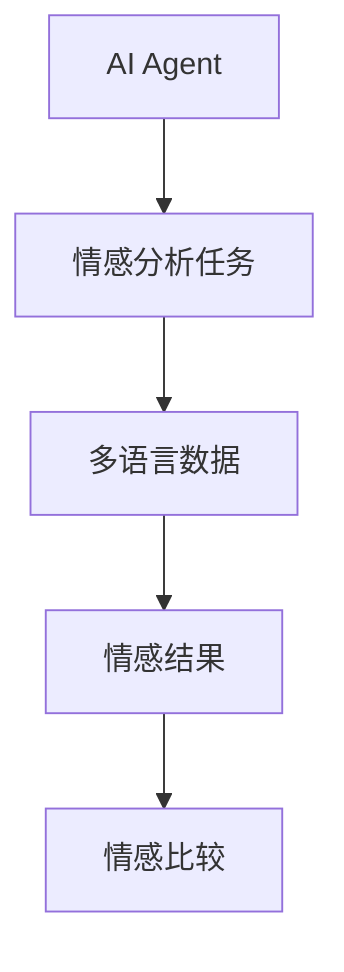
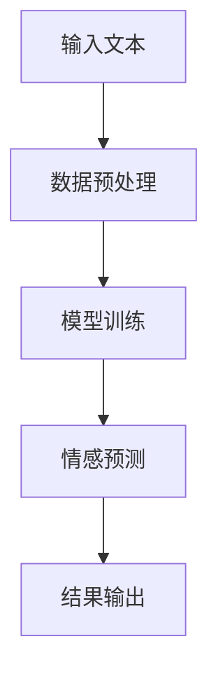
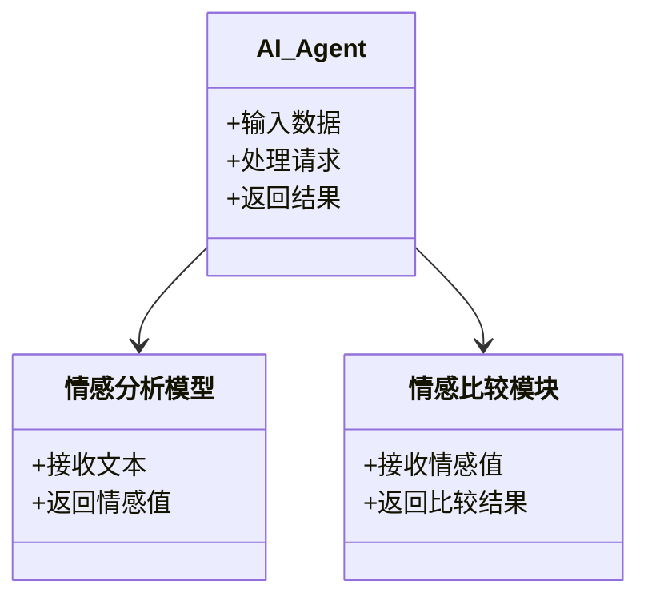
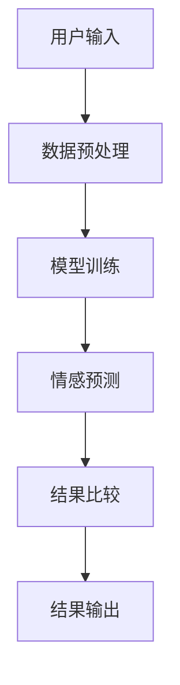

                 


```markdown
# 开发AI Agent的多语言情感分析比较系统

> 关键词：AI Agent, 多语言情感分析, 情感比较, 情感分析算法, 系统架构设计

> 摘要：本文详细探讨了开发AI Agent驱动的多语言情感分析比较系统的各个方面，包括背景介绍、核心概念、算法原理、系统架构设计、项目实战、最佳实践等，旨在为读者提供一个全面的技术指南。

---

## 第一部分: AI Agent与多语言情感分析概述

### 第1章: 背景介绍

#### 1.1 问题背景

##### 1.1.1 多语言情感分析的挑战
在当今全球化的信息时代，数据呈现多语言特性，如何准确分析不同语言的情感倾向是一个复杂的问题。不同语言的语法结构、文化背景差异使得情感分析更具挑战性。

##### 1.1.2 AI Agent在情感分析中的作用
AI Agent可以作为智能代理，自动处理多语言情感分析任务，帮助用户快速理解多语言文本的情感倾向。

##### 1.1.3 当前技术的局限性与改进方向
现有技术在处理多语言情感分析时，往往依赖单一语言模型，缺乏跨语言对比分析的能力。改进方向包括提升模型的跨语言理解能力，增强情感比较的准确性。

#### 1.2 问题描述

##### 1.2.1 多语言情感分析的核心问题
如何在多语言环境下准确识别文本的情感倾向，并进行跨语言情感比较。

##### 1.2.2 AI Agent在跨语言情感分析中的需求
AI Agent需要具备多语言处理能力，能够理解并比较不同语言文本的情感倾向。

##### 1.2.3 系统目标与预期功能
开发一个多语言情感分析系统，能够自动识别多种语言的情感倾向，并进行跨语言情感比较。

#### 1.3 问题解决

##### 1.3.1 多语言情感分析的解决方案
采用多语言预训练模型，结合情感分析任务，实现跨语言情感分析。

##### 1.3.2 AI Agent在系统中的角色与功能
AI Agent负责接收输入、调用情感分析模型、处理结果并返回比较结果。

##### 1.3.3 系统架构的初步设想
系统架构包括数据预处理、模型训练、结果比较等模块。

#### 1.4 边界与外延

##### 1.4.1 系统功能的边界
系统仅处理情感分析任务，不涉及文本生成或其他任务。

##### 1.4.2 多语言情感分析的适用范围
适用于多种语言的文本情感分析，但目前主要支持几种主流语言。

##### 1.4.3 AI Agent的性能与限制
受计算资源限制，系统处理速度和准确率可能受限。

#### 1.5 概念结构与核心要素

##### 1.5.1 系统的核心概念
多语言情感分析、AI Agent、情感比较。

##### 1.5.2 核心要素的组成与关系
AI Agent、多语言数据、情感分析模型、情感比较模块。

##### 1.5.3 系统的逻辑框架
数据输入 -> 数据预处理 -> 情感分析 -> 情感比较 -> 结果输出。

---

### 第2章: 核心概念与联系

#### 2.1 AI Agent的核心原理

##### 2.1.1 AI Agent的定义与分类
AI Agent是能够感知环境并采取行动以实现目标的智能实体。

##### 2.1.2 多语言情感分析的基本原理
通过语言无关的特征提取和语言相关的模型训练，实现跨语言情感分析。

##### 2.1.3 AI Agent与情感分析的关系
AI Agent作为代理，负责协调和执行情感分析任务。

#### 2.2 核心概念的属性特征对比

##### 2.2.1 情感分析的特征对比表
| 特征 | 单语言 | 多语言 |
|------|--------|--------|
| 数据来源 | 单一语言文本 | 多种语言文本 |
| 处理难度 | 较低 | 较高 |
| 模型需求 | 单语言模型 | 多语言模型 |

##### 2.2.2 AI Agent的功能对比表
| 功能 | 有AI Agent | 无AI Agent |
|------|------------|------------|
| 任务执行 | 自动化 | 手动化 |
| 任务协调 | 高效 | 低效 |

#### 2.3 ER实体关系图



---

### 第3章: 算法原理

#### 3.1 多语言情感分析算法

##### 3.1.1 基于规则的方法
通过预定义规则进行情感分类，适用于规则明确的语言。

##### 3.1.2 基于机器学习的方法
使用深度学习模型（如BERT）进行情感分类。

##### 3.1.3 对比分析
基于规则的方法在规则复杂时效果差，机器学习方法在数据充足时表现优异。

#### 3.2 AI Agent的算法实现

##### 3.2.1 情感分析算法流程图



##### 3.2.2 数学模型与公式
情感分析的损失函数：
$$ L = -\frac{1}{n}\sum_{i=1}^{n} y_i \log(p_i) + (1 - y_i)\log(1 - p_i) $$
其中，$y_i$是真实标签，$p_i$是预测概率。

---

### 第4章: 系统分析与架构设计

#### 4.1 系统功能设计

##### 4.1.1 领域模型类图



#### 4.2 系统架构设计

##### 4.2.1 分层架构图



---

### 第5章: 项目实战

#### 5.1 环境安装

##### 5.1.1 安装Python和相关库
```bash
pip install python
pip install transformers
pip install torch
```

#### 5.2 核心代码实现

##### 5.2.1 数据预处理

```python
def preprocess(text):
    return text.lower().strip()
```

##### 5.2.2 模型训练

```python
from transformers import AutoTokenizer, AutoModelForSequenceClassification
model = AutoModelForSequenceClassification.from_pretrained('bert-base-multilingual')
```

##### 5.2.3 情感比较

```python
def compare_emotions(emotion1, emotion2):
    return emotion1 == emotion2
```

#### 5.3 代码解读与分析

##### 5.3.1 数据预处理
将输入文本转换为小写并去除前后空格。

##### 5.3.2 模型训练
使用多语言BERT模型进行情感分类任务。

##### 5.3.3 情感比较
比较两种情感结果是否相同。

#### 5.4 实际案例分析

##### 5.4.1 案例输入
多语言文本样本。

##### 5.4.2 模型输出
情感分析结果。

##### 5.4.3 情感比较
比较不同语言的情感结果。

---

### 第6章: 最佳实践

#### 6.1 小结
本文详细介绍了AI Agent驱动的多语言情感分析比较系统的开发过程。

#### 6.2 注意事项
确保模型的泛化能力，避免过拟合。

#### 6.3 拓展阅读
推荐相关领域的书籍和论文。

---

## 第七章: 作者信息

作者：AI天才研究院/AI Genius Institute & 禅与计算机程序设计艺术 /Zen And The Art of Computer Programming
```

