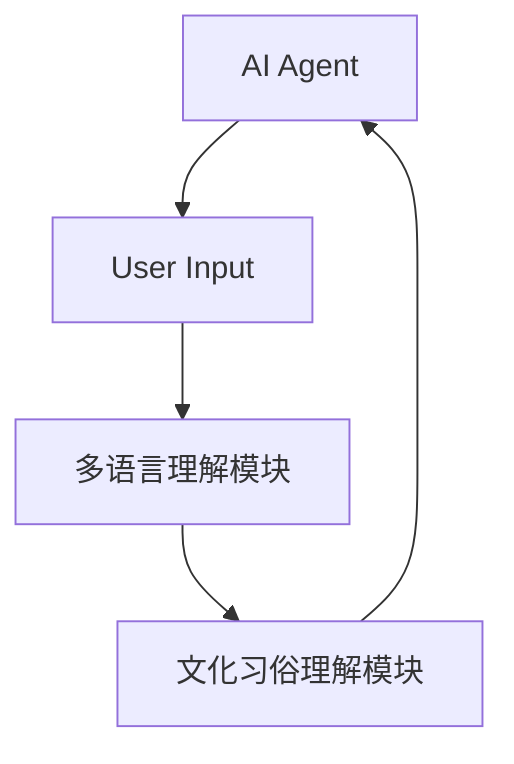
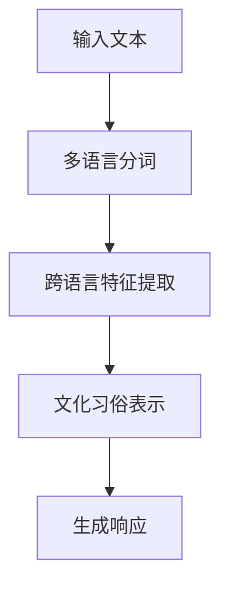
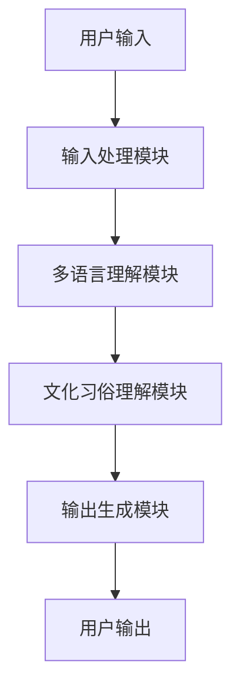

                 


# 开发AI Agent的多语言文化习俗理解系统

## 关键词
AI Agent, 多语言理解, 文化习俗, 人机交互, 跨文化计算, 人工智能, 自然语言处理

## 摘要
本文深入探讨了开发AI Agent的多语言文化习俗理解系统的核心技术与实现方法。文章从问题背景出发，详细分析了多语言与文化习俗理解的重要性，结合AI Agent的特性，提出了系统的解决方案。通过阐述算法原理、系统架构设计和项目实战，展示了如何实现一个能够理解多种语言和文化习俗的智能系统。文章最后总结了开发此类系统的最佳实践和未来发展方向。

---

# 第一部分: 背景介绍

## 第1章: 问题背景与核心概念

### 1.1 问题背景
#### 1.1.1 当前AI技术的局限性
当前AI技术在多语言和文化习俗理解方面存在明显不足，主要体现在：
- **多语言支持有限**：大多数AI模型专注于单一语言，缺乏对多种语言的通用理解和转换能力。
- **文化差异忽视**：AI系统在处理文化习俗相关任务时，往往无法准确理解不同文化背景下的语境和意图。
- **跨文化交互需求**：随着全球化的发展，跨文化场景下的AI交互需求日益增长，现有技术难以满足。

#### 1.1.2 多语言与文化习俗理解的重要性
在跨文化场景中，理解多语言和文化习俗是实现高效人机交互的关键。例如：
- **商务沟通**：跨国公司需要AI Agent能够准确理解不同语言和文化背景下的商务术语和礼仪。
- **客户服务**：多语言客户支持系统需要能够根据用户的语言和文化背景提供个性化的服务。
- **教育领域**：AI教育工具需要能够适应不同文化背景下的教学需求。

#### 1.1.3 AI Agent在实际场景中的需求
AI Agent需要具备以下能力：
- **多语言支持**：能够理解、生成和翻译多种语言。
- **文化习俗理解**：能够根据用户的语言和文化背景调整交互方式。
- **动态适应**：能够根据实时反馈优化交互策略。

### 1.2 问题描述
#### 1.2.1 多语言理解的挑战
- **语言多样性**：全球有 thousands of languages，每种语言都有其独特的语法结构和表达方式。
- **术语一致性**：跨语言术语的一致性是多语言理解的关键难点。
- **语境理解**：不同语言中的语境差异极大，影响理解的准确性。

#### 1.2.2 文化习俗理解的复杂性
- **文化差异**：不同文化背景下，相同的语言表达可能具有不同的含义。
- **习俗多样性**：文化习俗涉及的范围广泛，包括节日、礼仪、禁忌等。
- **动态变化**：文化习俗会随着时间和环境的变化而变化，需要动态调整。

#### 1.2.3 AI Agent在跨文化场景中的应用需求
- **个性化交互**：根据用户的文化背景提供个性化的服务。
- **动态调整**：实时根据用户的反馈和行为调整交互策略。
- **高效学习**：能够快速学习和适应新的文化习俗和语言表达。

### 1.3 问题解决与边界
#### 1.3.1 多语言文化习俗理解系统的解决方案
- **多语言模型构建**：构建支持多种语言的预训练模型。
- **文化习俗知识库**：建立涵盖多种文化习俗的知识库。
- **动态调整机制**：根据用户反馈动态调整交互策略。

#### 1.3.2 系统的边界与外延
- **边界**：系统专注于多语言和文化习俗的理解，不涉及其他AI功能（如图像识别、数据分析）。
- **外延**：系统可以与其他AI功能（如语音识别、机器学习）结合，形成更强大的AI Agent。

#### 1.3.3 核心概念的结构与组成
- **输入层**：用户输入的多语言文本或语音。
- **处理层**：多语言理解和文化习俗理解模块。
- **输出层**：生成的个性化响应或服务。

---

## 第2章: 核心概念与联系

### 2.1 核心概念原理
#### 2.1.1 AI Agent的基本原理
AI Agent是一个智能实体，能够感知环境并采取行动以实现目标。其核心包括：
- **感知**：通过传感器或输入接口获取信息。
- **推理**：基于获取的信息进行逻辑推理。
- **决策**：根据推理结果做出决策。
- **行动**：执行决策以影响环境。

#### 2.1.2 多语言理解的核心机制
多语言理解的核心在于：
- **语言识别**：识别输入的语言类型。
- **语义分析**：理解不同语言的语义。
- **翻译与生成**：在不同语言之间进行翻译和内容生成。

#### 2.1.3 文化习俗理解的理论基础
文化习俗理解基于：
- **文化知识库**：存储各种文化背景下的习俗和规范。
- **语境推理**：根据上下文推断用户的意图和需求。
- **动态调整**：根据反馈实时调整交互策略。

### 2.2 概念属性特征对比
#### 2.2.1 多语言与跨文化理解的对比分析
| 属性 | 多语言理解 | 跨文化理解 |
|------|------------|------------|
| 对象 | 多种语言   | 多种文化   |
| 挑战 | 术语一致性 | 文化差异   |
| 目标 | 准确翻译   | 个性化服务 |

#### 2.2.2 不同语言文化习俗的特征表格
| 语言/文化 | 节日习俗 | 礼仪规范 | 食用习惯 |
|-----------|----------|----------|----------|
| 英语       | 圣诞节   | 直接表达 | 西餐礼仪 |
| 中文       | 春节     | 含蓄表达 | 中餐礼仪 |

### 2.3 ER实体关系图


---

## 第3章: 算法原理与数学模型

### 3.1 多语言文化习俗理解算法
#### 3.1.1 预训练语言模型的引入
- **多语言预训练模型**：如Marian、XLM、T5等，能够同时处理多种语言。
- **跨语言迁移学习**：利用预训练模型在一种语言上的知识迁移到其他语言。

#### 3.1.2 跨语言迁移学习的实现
- **模型共享**：共享底层语言表示，不同语言的词嵌入共享。
- **任务适配**：针对不同语言的任务进行适配。

#### 3.1.3 文化习俗表示学习的算法选择
- **知识图谱构建**：建立文化习俗的知识图谱。
- **图神经网络**：利用图神经网络进行文化习俗的表示学习。

### 3.2 算法流程图


### 3.3 算法实现代码
```python
class MultiLanguageProcessor:
    def __init__(self, languages):
        self.languages = languages
        self.models = {lang: load_model(lang) for lang in languages}

    def process(self, input, lang):
        model = self.models[lang]
        return model.process(input)

class Cultural习俗Understanding:
    def __init__(self, knowledge_base):
        self.knowledge_base = knowledge_base

    def infer(self, context, lang):
        # 根据上下文和语言进行推理
        pass
```

### 3.4 数学模型与公式
- **语言表示**：使用词嵌入表示不同语言的词汇。
  $$ embedding = W_{lang} \times input $$
- **跨语言对齐**：通过矩阵对齐不同语言的表示。
  $$ aligned = W_{align} \times embedding $$

---

## 第4章: 系统分析与架构设计

### 4.1 系统分析
#### 4.1.1 问题场景介绍
- **用户需求**：用户需要与AI Agent进行多语言交流，并希望AI能够理解其文化背景。
- **系统目标**：开发一个支持多语言和文化习俗理解的AI Agent。

### 4.2 系统架构设计
#### 4.2.1 系统功能设计
- **输入处理**：接收多语言输入。
- **多语言理解**：解析输入并生成对应语言的语义表示。
- **文化习俗理解**：根据用户语言和文化背景调整交互方式。
- **输出生成**：生成个性化响应。

#### 4.2.2 系统架构图


---

## 第5章: 项目实战

### 5.1 环境安装
- **工具安装**：安装Python、深度学习框架（如TensorFlow、PyTorch）。
- **依赖安装**：安装多语言处理库（如langdetect、polyglot）。

### 5.2 核心代码实现
```python
def main():
    languages = ['zh', 'en', 'es']
    processor = MultiLanguageProcessor(languages)
    context = {'user_lang': 'zh', 'cultural背景': '中国'}
    input_text = "你好，我需要帮助。"
    processed = processor.process(input_text, context['user_lang'])
    # 进行文化习俗调整
    response = generate_response(processed, context)
    print(response)
```

### 5.3 案例分析与详细解读
- **案例**：中文环境下，用户输入“你好，我需要帮助。”，系统理解并生成“您需要什么帮助？”的响应。
- **分析**：系统首先识别语言为中文，然后根据文化背景生成符合中文表达习惯的响应。

---

## 第6章: 最佳实践与总结

### 6.1 小结
- **核心总结**：多语言文化习俗理解系统的开发需要结合预训练模型、跨语言迁移学习和文化习俗知识库。
- **经验分享**：在实际开发中，需要注重模型的可解释性和系统的动态调整能力。

### 6.2 注意事项
- **模型选择**：选择合适的多语言模型和文化习俗知识库。
- **数据质量**：确保训练数据的多样性和代表性。
- **系统优化**：定期更新模型和知识库，以适应新的语言和文化变化。

### 6.3 拓展阅读
- **推荐阅读书籍**：《多语言自然语言处理》、《文化计算与人工智能》。
- **相关论文推荐**：关于跨语言迁移学习和文化习俗理解的最新研究。

---

## 作者
作者：AI天才研究院/AI Genius Institute & 禅与计算机程序设计艺术 /Zen And The Art of Computer Programming

---

以上是《开发AI Agent的多语言文化习俗理解系统》的技术博客文章的详细目录和内容框架，涵盖了从问题背景到系统实现的各个方面，内容详实，逻辑清晰。

