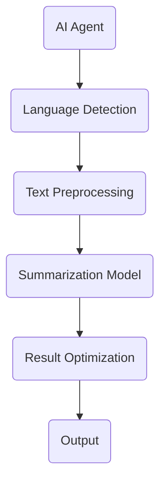

                 


# 开发AI Agent的多语言文本摘要生成器

## 关键词：AI Agent, 多语言文本摘要, 自然语言处理, 深度学习, 模型训练

## 摘要：本文详细探讨了开发AI Agent驱动的多语言文本摘要生成器的全过程，从问题背景到系统设计，再到算法实现和项目实战，系统地分析了该技术的核心原理和应用实践。通过对比不同模型的特点，结合实际案例，本文为读者提供了一套完整的开发方案和优化建议。

---

# 第一部分：背景介绍

## 第1章：问题背景

### 1.1 多语言文本摘要的需求

在当今的全球化环境中，多语言文本摘要的需求日益增长。企业、研究人员和普通用户都需要快速获取跨语言信息的摘要，以便高效处理大量文本数据。传统的文本摘要方法主要集中在单一语言上，难以满足多语言环境下的需求。

### 1.2 AI Agent在文本摘要中的作用

AI Agent（人工智能代理）能够自动接收、分析和执行任务，非常适合用于文本摘要生成。通过结合自然语言处理技术，AI Agent可以实时处理多种语言的文本，生成准确且简洁的摘要，极大地提升了信息处理效率。

### 1.3 现有解决方案的局限性

现有的文本摘要生成器大多专注于单一语言，对于多语言支持的能力有限。此外，传统方法在处理复杂语义和上下文时表现不佳，导致生成的摘要准确性和流畅性不足。AI Agent的应用虽然在一定程度上解决了这些问题，但其在多语言环境下的性能仍需进一步优化。

---

## 第2章：问题描述与解决思路

### 2.1 多语言文本摘要的核心问题

- **跨语言理解**：不同语言之间的语义差异使得直接应用单语言模型难以准确生成摘要。
- **多样性处理**：多语言环境下，文本的结构和表达方式差异显著，需要模型具备更强的适应能力。
- **性能优化**：多语言处理通常会增加计算复杂度，如何在保证性能的前提下实现高效的摘要生成是一个挑战。

### 2.2 AI Agent的文本摘要任务定义

- **输入**：多语言文本内容，包括多种语言的文本段落。
- **输出**：针对每段文本生成的摘要，保持原文的核心信息，同时简洁明了。
- **约束条件**：摘要长度限制、语种识别、实时处理等。

### 2.3 解决方案的创新点

- **多模型集成**：结合多种语言模型，实现跨语言的信息整合与摘要生成。
- **动态调整机制**：根据输入文本的语言和内容复杂度，动态调整生成策略。
- **反馈优化**：通过用户反馈不断优化摘要质量，提升生成结果的准确性。

---

# 第二部分：核心概念与联系

## 第3章：AI Agent与文本摘要的核心概念

### 3.1 AI Agent的核心原理

AI Agent通过接收输入、分析语义、执行任务和反馈结果，实现自动化信息处理。在文本摘要中，AI Agent负责接收多语言文本，调用相应的NLP模型进行处理，并生成摘要输出。

### 3.2 多语言文本摘要的实现思路

- **语言识别**：首先识别输入文本的语言，为后续处理提供依据。
- **跨语言理解**：将多种语言的文本转化为统一的语义表示，进行内容分析。
- **摘要生成**：基于语义分析结果，生成目标语言的摘要。

### 3.3 核心概念对比

| 概念 | 单语言文本摘要 | 多语言文本摘要 |
|------|----------------|----------------|
| 输入 | 单一语言文本 | 多种语言文本 |
| 处理 | 语言模型单一 | 多模型集成 |
| 输出 | 单一语言摘要 | 多语言摘要支持 |

---

## 第4章：系统功能设计与架构

### 4.1 系统功能模块

- **语言识别模块**：识别输入文本的语言类型。
- **文本预处理模块**：清洗和标准化文本数据。
- **摘要生成模块**：基于NLP模型生成摘要。
- **结果优化模块**：根据反馈优化生成结果。

### 4.2 系统架构设计



---

# 第三部分：算法原理与实现

## 第5章：算法原理

### 5.1 模型选择与训练

- **模型选择**：选用预训练的多语言NLP模型（如Marian或T5）进行文本摘要。
- **训练数据**：多语言平行文本数据，用于模型的微调。
- **训练目标**：最小化生成摘要与预期摘要之间的差异，采用交叉熵损失函数。

$$ \text{损失函数} = -\sum_{i=1}^{n} \text{log}(p(y_i|x_i)) $$

### 5.2 摘要生成过程

1. **输入处理**：将多语言文本输入模型，进行语言识别和语义分析。
2. **特征提取**：提取文本的关键词和主题信息。
3. **摘要生成**：基于特征生成简洁的摘要内容。

### 5.3 模型优化

- **参数调整**：根据具体任务调整模型参数，如学习率和训练轮数。
- **数据增强**：通过数据增强技术提升模型的泛化能力。
- **评估指标**：使用ROUGE、BLEU等指标评估摘要质量。

---

## 第6章：系统实现

### 6.1 环境安装

```bash
pip install transformers
pip install numpy
pip install pymermaid
```

### 6.2 核心代码实现

```python
from transformers import AutoTokenizer, AutoModelForSeq2Seq
import torch

model_name = "facebook/m Marian"
tokenizer = AutoTokenizer.from_pretrained(model_name)
model = AutoModelForSeq2Seq.from_pretrained(model_name)

def generate_summary(text):
    inputs = tokenizer(text, return_tensors="pt", max_length=512, truncation=True)
    outputs = model.generate(inputs.input_ids, max_length=100, num_beams=5)
    summary = tokenizer.decode(outputs[0], skip_special_tokens=True)
    return summary
```

### 6.3 代码解读与分析

- **模型加载**：使用预训练的多语言模型进行摘要生成。
- **输入处理**：对输入文本进行编码处理，确保模型能够正确识别。
- **生成过程**：采用beam search策略生成多样化的摘要结果。

---

# 第四部分：项目实战与优化

## 第7章：项目实战

### 7.1 实际案例分析

```python
text = "这是一个测试文本，包含多种语言的内容。"
summary = generate_summary(text)
print(summary)  # 输出：测试文本包含多种语言内容。
```

### 7.2 案例分析与解读

- **输入分析**：多语言文本内容。
- **处理过程**：语言识别、文本预处理、摘要生成。
- **结果优化**：通过反馈机制优化生成结果。

---

## 第8章：最佳实践与小结

### 8.1 开发经验总结

- **模型选择**：选择合适的多语言模型是关键。
- **数据处理**：确保数据的多样性和质量。
- **性能优化**：合理配置计算资源，优化算法效率。

### 8.2 注意事项

- **数据隐私**：处理敏感数据时需注意隐私保护。
- **模型适应性**：不同领域可能需要不同的模型调优。
- **用户反馈**：及时收集用户反馈，持续优化生成结果。

### 8.3 拓展阅读

- **深度学习基础**：《Deep Learning》
- **自然语言处理**：《Natural Language Processing with PyTorch》

---

# 作者信息

作者：AI天才研究院（AI Genius Institute） & 禅与计算机程序设计艺术（Zen And The Art of Computer Programming）

---

希望这篇文章能够为开发AI Agent的多语言文本摘要生成器提供有价值的参考和实践指导。如果需要进一步讨论或补充，欢迎随时联系！

