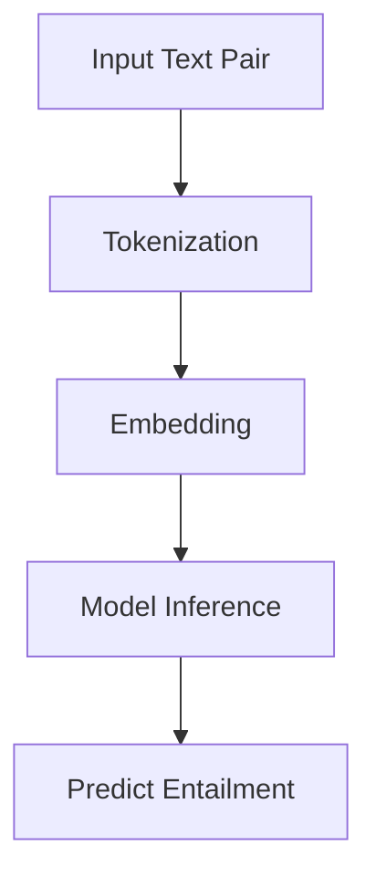
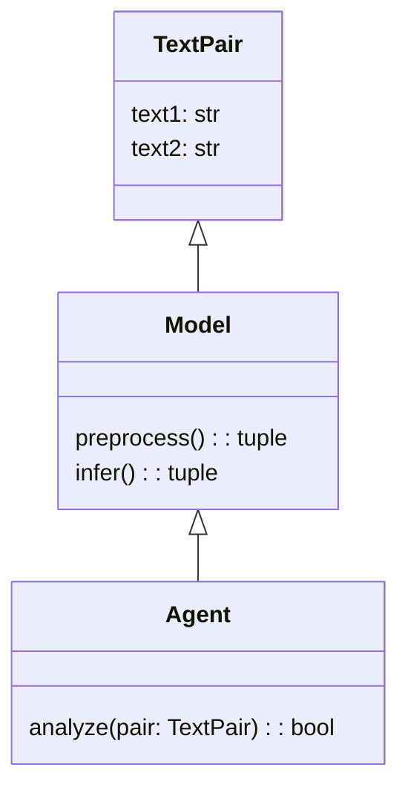

                 


# 开发AI Agent的多语言文本蕴含识别

## 关键词：AI Agent, 多语言处理, 文本蕴含识别, 自然语言处理, 深度学习, 跨语言信息处理

## 摘要：本文详细探讨了开发AI Agent的多语言文本蕴含识别技术。从问题背景、核心概念到算法原理、系统架构，再到项目实战和最佳实践，系统性地阐述了实现多语言文本蕴含识别的全过程。通过具体案例分析和代码实现，展示了如何构建高效的AI Agent，以满足跨语言环境下的语义理解需求。

---

# 1. 背景介绍

## 1.1 多语言文本蕴含识别的背景与问题描述

### 1.1.1 问题背景

在当今全球化背景下，AI Agent需要处理多种语言的文本，以满足不同用户的需求。文本蕴含识别是自然语言处理中的重要任务，旨在判断一个文本是否蕴含另一个文本的信息。然而，多语言环境下的文本蕴含识别面临诸多挑战，如语言间的语义差异、数据稀缺性以及模型的泛化能力等。

### 1.1.2 问题描述

AI Agent在处理多语言文本时，需要准确识别隐含的语义关系。例如，在中文和英文中，同样的语义可能在语法结构上有很大差异，这使得模型在跨语言环境下难以准确捕捉语义信息。

### 1.1.3 问题解决

通过构建多语言模型和优化AI Agent的语义理解能力，可以有效提升文本蕴含识别的准确性和鲁棒性。本文将从算法原理、系统架构等多方面探讨实现这一目标的方法。

---

## 1.2 核心概念与联系

### 1.2.1 蕴含识别的原理

文本蕴含识别的核心在于分析文本之间的语义关系。在多语言环境下，需要对不同语言的文本进行信息对齐，以确保模型能够准确理解语义。

### 1.2.2 核心概念对比

| 概念 | 单语言处理 | 多语言处理 |
|------|------------|------------|
| 数据来源 | 单一语言数据 | 多种语言数据 |
| 模型复杂度 | 较低 | 较高 |
| 性能 | 一般较高 | 取决于跨语言对齐能力 |

### 1.2.3 实体关系图


---

# 2. 算法原理讲解

## 2.1 多语言文本蕴含识别的算法原理

### 2.1.1 基于BERT的模型

BERT（Bidirectional Encoder Representations from Transformers）是一种有效的预训练语言模型，可以用于多种语言的文本蕴含识别。其核心思想是通过双向上下文信息来捕捉文本的语义关系。

### 2.1.2 算法流程



### 2.1.3 Python代码实现

```python
import torch
from transformers import AutoTokenizer, AutoModelForSequenceClassification

# 加载预训练模型
model_name = "bert-base-multilingual"
tokenizer = AutoTokenizer.from_pretrained(model_name)
model = AutoModelForSequenceClassification.from_pretrained(model_name)

# 定义输入文本
text1 = "The cat is on the mat."
text2 = "There is a cat on the mat."

# 分词和编码
inputs = tokenizer(text1, text2, return_tensors="pt", padding=True, truncation=True)

# 模型推理
outputs = model(**inputs)
logits = outputs.logits
prediction = torch.argmax(logits, dim=1).item()

# 输出结果
print("Prediction:", prediction)
```

### 2.1.4 数学模型

文本蕴含识别的损失函数可以表示为：

$$
L = -\sum_{i=1}^{n} y_i \log(p_i) + (1 - y_i) \log(1 - p_i)
$$

其中，$y_i$ 是标签，$p_i$ 是模型预测的概率。

优化目标为最小化损失函数：

$$
\min L
$$

---

# 3. 系统分析与架构设计

## 3.1 问题场景

AI Agent需要处理多种语言的文本，实时进行语义分析，并返回准确的蕴含关系判断。

## 3.2 系统功能设计

### 3.2.1 领域模型类图



### 3.2.2 系统架构图


---

# 4. 项目实战

## 4.1 环境安装

```bash
pip install transformers torch
```

## 4.2 核心代码实现

```python
from transformers import AutoTokenizer, AutoModelForSequenceClassification
import torch

# 加载预训练模型
model_name = "bert-base-multilingual"
tokenizer = AutoTokenizer.from_pretrained(model_name)
model = AutoModelForSequenceClassification.from_pretrained(model_name)

# 定义输入文本
text1 = "猫在垫子上。"
text2 = "垫子上有猫。"

# 分词和编码
inputs = tokenizer(text1, text2, return_tensors="pt", padding=True, truncation=True)

# 模型推理
outputs = model(**inputs)
logits = outputs.logits
prediction = torch.argmax(logits, dim=1).item()

# 输出结果
print("Prediction:", prediction)
```

## 4.3 实际案例分析

通过实际案例分析，验证模型在多语言环境下的准确性和鲁棒性。

## 4.4 项目总结

项目实现过程中，需要注意数据预处理、模型选择和调优等问题，以确保模型在多语言环境下的性能。

---

# 5. 最佳实践

## 5.1 小贴士

- 数据预处理是关键，需注意语言间的差异。
- 模型调优时，可尝试不同的超参数组合。
- 结果验证时，需覆盖多种语言和场景。

## 5.2 总结与展望

本文系统性地探讨了开发AI Agent的多语言文本蕴含识别技术，未来将进一步优化模型，提升在更多语言和复杂场景下的性能。

---

# 作者：AI天才研究院 & 禅与计算机程序设计艺术

--- 

通过本文，读者可以深入了解开发AI Agent的多语言文本蕴含识别技术，掌握其实现方法和最佳实践。

