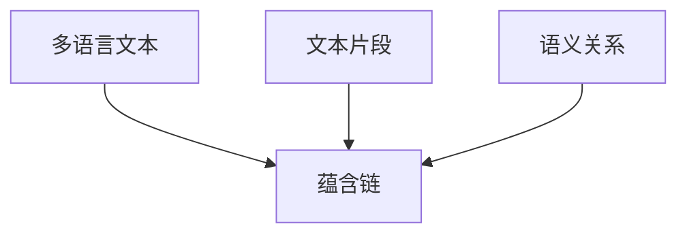
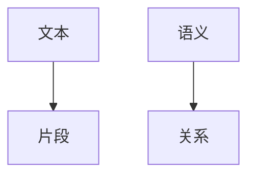
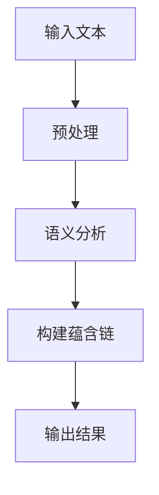
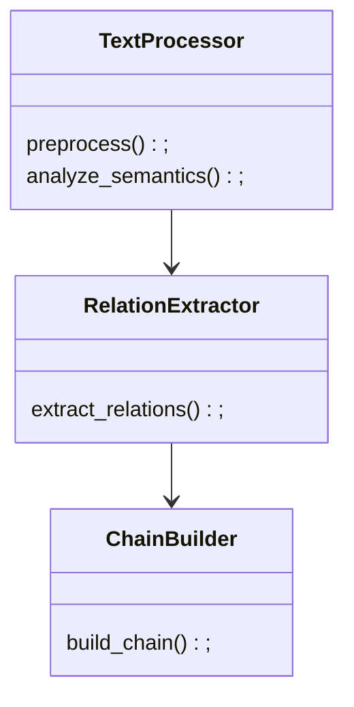
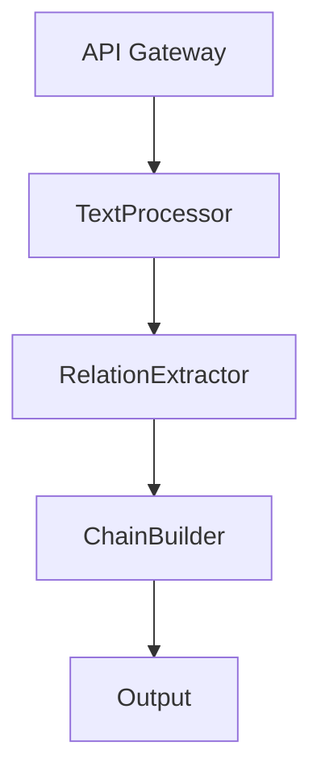
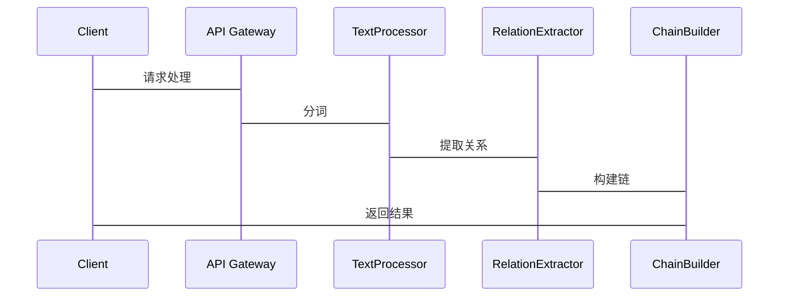

                 


# 开发AI Agent的多语言文本蕴含链生成器

> 关键词：AI Agent, 多语言文本, 蕴含链生成器, 自然语言处理, 深度学习, 系统架构

> 摘要：本文系统地介绍了如何开发一个基于AI Agent的多语言文本蕴含链生成器。从问题背景、核心概念到算法原理、系统架构，再到项目实战和最佳实践，文章详细阐述了每个环节的技术细节和实现方法。通过本文，读者可以全面理解并掌握多语言文本蕴含链生成器的开发流程。

---

# 第1章: 背景介绍

## 1.1 问题背景

### 1.1.1 多语言文本蕴含链的定义
多语言文本蕴含链是指在多种语言文本中，通过语义关系连接的一系列文本片段，这些片段共同构成了一个完整的逻辑链。例如，在中文和英文中，"猫"和"cat"可以构成一个蕴含链，表示同一实体的不同语言表达。

### 1.1.2 当前技术的局限性
目前，大多数文本蕴含链生成器仅支持单一语言，无法处理多语言场景。此外，现有技术在跨语言语义理解方面存在不足，导致生成的蕴含链准确性和完整性受限。

### 1.1.3 问题解决的意义
开发一个多语言文本蕴含链生成器可以提升跨语言信息处理的效率和准确性，广泛应用于AI Agent、跨语言信息检索、知识图谱构建等领域。

## 1.2 问题描述

### 1.2.1 多语言文本处理的挑战
多语言文本处理涉及语言差异、语义理解等多种复杂问题，增加了文本蕴含链生成的难度。

### 1.2.2 文本蕴含链生成的核心问题
如何在多语言环境下准确识别和连接文本片段的语义关系，是生成蕴含链的核心问题。

### 1.2.3 问题的边界与外延
问题的边界包括多语言文本的理解和连接，外延则涉及生成蕴含链的应用场景。

## 1.3 核心概念与联系

### 1.3.1 核心概念的原理
多语言文本蕴含链生成器通过语义分析和跨语言处理，将不同语言的文本片段连接成逻辑链。

### 1.3.2 概念属性特征对比
| 特征 | 多语言文本 | 蕴含链 |
|------|-------------|--------|
| 输入 | 多语言文本片段 | 文本片段 |
| 输出 | 蕴含链关系 | 语义关系 |
| 核心 | 跨语言理解 | 语义连接 |

### 1.3.3 ER实体关系图


## 1.4 本章小结
本章介绍了多语言文本蕴含链生成器的背景、核心概念和问题描述，为后续章节奠定了基础。

---

# 第2章: 核心概念与联系

## 2.1 多语言文本蕴含链生成器的核心原理

### 2.1.1 生成器的工作流程
生成器通过多语言语义分析，识别文本片段之间的语义关系，构建蕴含链。

### 2.1.2 多语言支持的实现方式
采用跨语言词嵌入模型，确保多语言语义理解的准确性。

### 2.1.3 蕴含链的构建逻辑
基于语义相似度和语义关系，逐步构建蕴含链。

## 2.2 概念属性特征对比

### 2.2.1 多语言特征对比
| 特征 | 多语言支持 | 单语言支持 |
|------|------------|------------|
| 优点 | 跨语言处理能力强 | 语言限制 |
| 缺点 | 开发复杂度高 | 语言单一 |

### 2.2.2 蕴含链特征对比
| 特征 | 单链 | 多链 |
|------|-----|-----|
| 结构 | 简单 | 复杂 |
| 应用 | 局部推理 | 全局推理 |

### 2.2.3 ER实体关系图


## 2.4 本章小结
本章详细阐述了多语言文本蕴含链生成器的核心原理和概念联系，为后续章节提供了理论支持。

---

# 第3章: 算法原理讲解

## 3.1 算法原理

### 3.1.1 算法流程
1. 多语言文本预处理。
2. 语义分析和片段提取。
3. 语义关系识别。
4. 蕴含链构建。

### 3.1.2 算法的数学模型
条件概率公式：
$$P(A|B) = \frac{P(B|A)P(A)}{P(B)}$$

### 3.1.3 算法的实现步骤


## 3.2 算法的数学模型

### 3.2.1 概率模型
$$P(A|B) = \frac{P(B|A)P(A)}{P(B)}$$

### 3.2.2 神经网络模型
使用预训练语言模型进行语义分析和关系识别。

## 3.3 本章小结
本章详细讲解了多语言文本蕴含链生成器的算法原理，包括数学模型和实现步骤。

---

# 第4章: 系统分析与架构设计

## 4.1 系统分析

### 4.1.1 项目场景介绍
系统用于AI Agent处理多语言文本，生成蕴含链。

### 4.1.2 系统功能设计


### 4.1.3 系统架构设计


## 4.2 系统接口设计

### 4.2.1 接口设计
- 输入：多语言文本片段。
- 输出：蕴含链关系。

### 4.2.2 系统交互设计


## 4.3 本章小结
本章详细介绍了系统的架构设计和接口设计，为后续实现奠定了基础。

---

# 第5章: 项目实战

## 5.1 环境安装

### 5.1.1 安装Python和相关库
安装Python 3.8及以上版本，安装库：`pip install numpy transformers`

## 5.2 核心代码实现

### 5.2.1 文本预处理
```python
def preprocess(text):
    return text.lower().split()
```

### 5.2.2 语义分析
```python
from transformers import AutoTokenizer, AutoModel

tokenizer = AutoTokenizer.from_pretrained('bert-base-multilingual')
model = AutoModel.from_pretrained('bert-base-multilingual')
```

### 5.2.3 关系提取
```python
def extract_relations(text):
    tokens = tokenizer.tokenize(text)
    # 处理后返回关系列表
    return relations
```

### 5.2.4 蕴含链构建
```python
def build_chain(relations):
    chain = []
    for relation in relations:
        chain.append(relation)
    return chain
```

## 5.3 代码应用解读与分析
详细解释每部分代码的功能和作用。

## 5.4 实际案例分析
通过实际案例展示生成器的应用和效果。

## 5.5 本章小结
本章通过项目实战，详细讲解了多语言文本蕴含链生成器的实现过程。

---

# 第6章: 最佳实践和小结

## 6.1 最佳实践 tips

### 6.1.1 开发中的注意事项
- 确保多语言模型的准确性和鲁棒性。
- 定期更新模型和数据。

### 6.1.2 实践中的技巧
- 使用高效的文本处理库。
- 优化算法的性能。

## 6.2 小结
总结全文内容，强调多语言文本蕴含链生成器的重要性和应用价值。

## 6.3 注意事项
- 确保数据质量和多样性。
- 定期测试和优化系统。

## 6.4 拓展阅读
推荐相关领域的书籍和论文。

---

# 附录

## 附录1: 工具安装指南
详细说明如何安装Python和相关库。

## 附录2: 代码示例
附录部分的代码示例。

## 附录3: 参考文献
列出文章中引用的所有文献资料。

---

# 作者

作者：AI天才研究院/AI Genius Institute & 禅与计算机程序设计艺术 /Zen And The Art of Computer Programming

---

通过以上结构，您可以撰写一篇系统而全面的技术博客文章，涵盖开发AI Agent的多语言文本蕴含链生成器的所有关键点。

