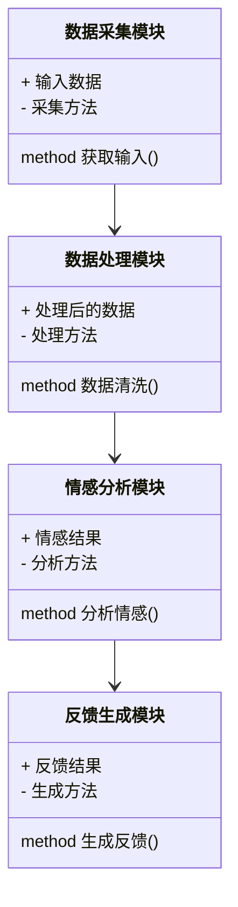

                 


# 开发AI Agent的情感计算模块

> 关键词：情感计算，AI Agent，深度学习，自然语言处理，人机交互

> 摘要：情感计算作为人机交互中的关键环节，旨在理解并模拟人类情感，使AI Agent能够更好地与人类进行有效沟通。本文详细探讨情感计算的核心概念、算法实现、系统设计及项目实战，帮助开发者构建高效的情感计算模块。

---

## 第1章 引言

### 1.1 情感计算的基本概念

情感计算（Affective Computing）是人工智能领域的重要分支，旨在通过计算技术理解和模拟人类情感。其核心目标是使AI系统能够识别人类的情感状态，并做出相应的反馈。

#### 问题背景

随着AI技术的快速发展，人机交互已成为日常生活的一部分。然而，现有的交互系统往往缺乏情感维度的理解，导致用户体验不足。情感计算通过分析用户的情感状态，使系统能够更自然地与用户互动。

#### 问题描述

如何让AI Agent识别用户的情感状态，并基于此提供个性化服务？情感计算需要解决数据采集、情感分析、情感推理等多个问题。

#### 问题解决

情感计算通过多种技术手段，如自然语言处理、语音分析和面部识别，获取用户情感信息，并结合上下文进行推理和反馈。

#### 边界与外延

情感计算的边界包括输入数据的类型（文本、语音、图像）和输出反馈的形式（文本、语音、动作）。外延则涉及跨领域应用，如教育、医疗和娱乐。

---

## 第2章 情感计算的核心概念

### 2.1 情感计算的实现原理

情感计算依赖于多模态数据的分析，包括文本、语音和图像。以下是主要实现步骤：

1. 数据采集：通过传感器或API获取用户输入。
2. 数据预处理：清洗和标准化数据。
3. 特征提取：识别关键情感特征。
4. 情感分类：基于特征进行情感判定。
5. 反馈生成：根据分类结果生成响应。

### 2.2 情感计算的关键技术

#### 情感分析技术

情感分析通过自然语言处理技术，识别文本中的情感倾向。常用方法包括基于规则的分析和机器学习模型。

#### 情感推理技术

情感推理基于上下文理解情感状态，通常使用深度学习模型，如循环神经网络（RNN）。

---

## 第3章 情感计算的算法实现

### 3.1 基于深度学习的情感分类算法

#### 算法流程

1. 数据预处理：文本分词、去除停用词。
2. 特征提取：使用词袋模型或词嵌入。
3. 模型训练：构建卷积神经网络（CNN）或长短期记忆网络（LSTM）。
4. 模型评估：计算准确率、召回率和F1值。

#### 代码实现

```python
import tensorflow as tf
from tensorflow.keras import layers

model = tf.keras.Sequential([
    layers.Embedding(input_dim=10000, output_dim=16),
    layers.Dropout(0.5),
    layers.Conv1D(filters=16, kernel_size=3, padding="same", activation="relu"),
    layers.GlobalMaxPooling1D(),
    layers.Dense(1, activation="sigmoid")
])

model.compile(optimizer="adam", loss="binary_crossentropy", metrics=["accuracy"])
model.summary()
```

#### 数学模型

情感分类模型的损失函数可以表示为：
$$ L = -\sum_{i=1}^{n} y_i \log(p_i) + (1 - y_i)\log(1 - p_i) $$

其中，\( p_i \) 是模型预测的概率，\( y_i \) 是真实标签。

---

## 第4章 系统架构与设计

### 4.1 系统功能设计

#### 功能模块

- 数据采集模块：负责获取用户输入。
- 数据处理模块：清洗和转换数据。
- 情感分析模块：识别情感状态。
- 反馈生成模块：根据情感结果生成响应。

#### 类图设计



---

## 第5章 项目实战

### 5.1 项目环境搭建

#### 工具安装

- 安装Python和必要的库（如TensorFlow、Keras）。
- 安装情感计算API（如TextBlob或Affective Computing API）。

#### 开发流程

1. 数据准备：收集和标注情感数据集。
2. 模型训练：基于数据集训练情感分类模型。
3. 系统集成：将模型集成到AI Agent中。
4. 测试优化：进行测试并优化性能。

---

## 第6章 总结与展望

### 6.1 总结

情感计算通过分析用户情感，使AI Agent能够提供更个性化的服务。本文详细探讨了情感计算的核心概念、算法实现和系统设计。

### 6.2 展望

未来，情感计算将与更多领域结合，如教育、医疗和娱乐，提供更广泛的应用场景。

---

作者：AI天才研究院/AI Genius Institute & 禅与计算机程序设计艺术 /Zen And The Art of Computer Programming

