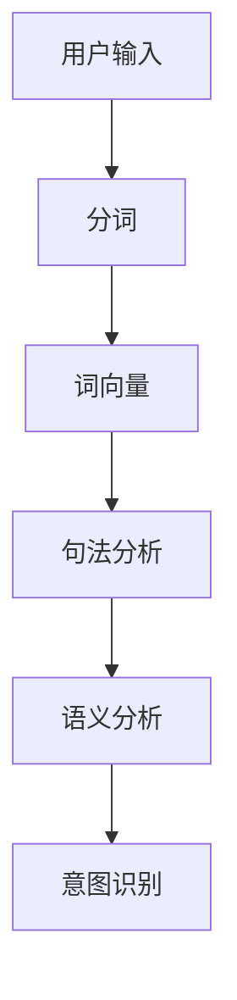
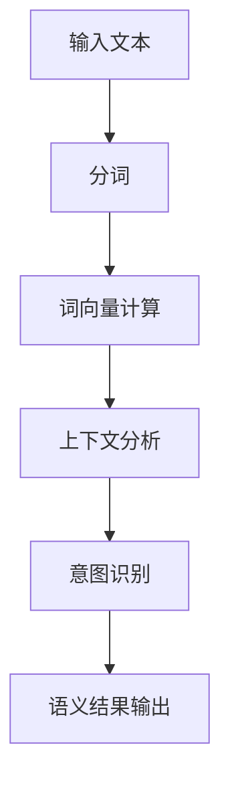
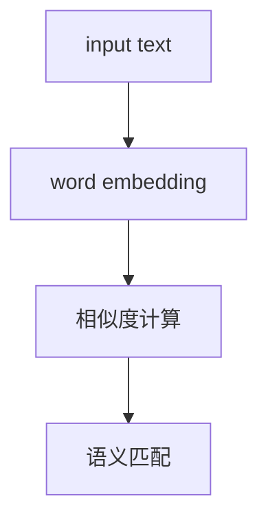
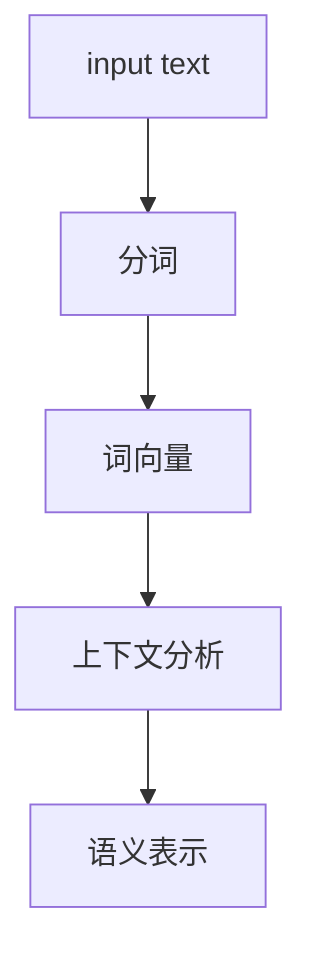
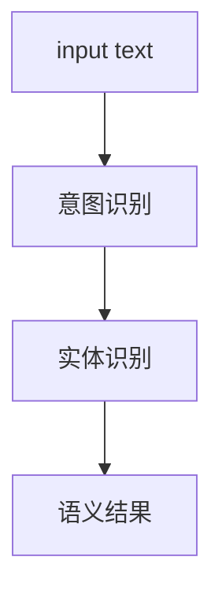
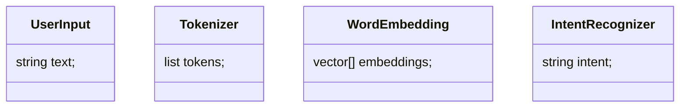
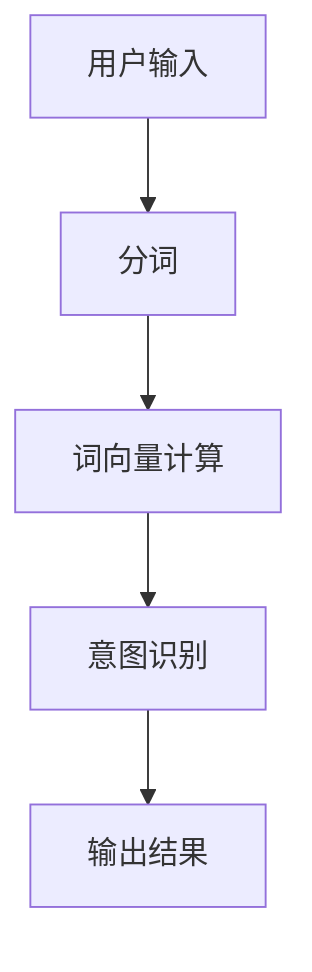

                 


# 开发AI Agent的语义理解深度：从字面到隐含

## 关键词：AI Agent, 语义理解, 深度学习, 自然语言处理, 意图识别, 实体识别, 知识图谱

## 摘要：  
语义理解（Semantic Understanding）是人工智能（AI）领域中的核心任务之一，尤其是在AI Agent（智能体）的应用中，语义理解能力直接决定了系统能否准确理解和处理用户意图。本文将从字面理解逐步深入到隐含语义，系统地分析语义理解的原理、算法、系统架构及实际应用。通过详细的技术分析和实战案例，本文将帮助读者全面理解AI Agent中的语义理解技术，并掌握其实现方法。

---

# 第一部分: AI Agent语义理解的背景与核心概念

# 第1章: 语义理解的背景与问题描述

## 1.1 语义理解的背景

### 1.1.1 从字面理解到语义理解的演进  
在人工智能领域，语义理解经历了从简单的关键词匹配到复杂的上下文理解和意图识别的演进。早期的系统仅能处理简单的查询，而现代系统则需要理解用户的深层需求和隐含意图。

### 1.1.2 AI Agent中的语义理解的重要性  
AI Agent作为人机交互的桥梁，需要通过语义理解技术来准确解析用户的输入，从而提供有效的反馈和行动。语义理解是实现智能化人机交互的核心技术。

### 1.1.3 当前语义理解技术的发展现状  
随着深度学习和自然语言处理技术的进步，语义理解已经从基于规则的方法发展到基于大规模预训练模型的方法。主流技术包括Word2Vec、BERT、GPT等。

## 1.2 语义理解的核心问题

### 1.2.1 语义理解的基本定义  
语义理解是指系统能够理解输入文本的含义，包括字面意思和隐含意义。它涉及自然语言处理（NLP）、机器学习和知识图谱等多个领域。

### 1.2.2 语义理解的关键挑战  
语义理解面临以下挑战：  
1. **歧义性**：同一句话可能有不同的含义。  
2. **上下文依赖性**：语义理解需要考虑上下文信息。  
3. **领域适应性**：语义理解需要针对特定领域进行优化。

### 1.2.3 语义理解的边界与外延  
语义理解的边界包括文本处理、语音处理和图像处理，外延则涉及知识图谱、意图识别和对话系统。

## 1.3 语义理解在AI Agent中的应用

### 1.3.1 AI Agent的基本概念与功能  
AI Agent是一种智能体，能够感知环境、理解用户输入并执行相应的操作。语义理解是AI Agent的核心功能之一。

### 1.3.2 语义理解在AI Agent中的核心作用  
语义理解帮助AI Agent准确解析用户的输入，从而提供个性化的服务和反馈。

### 1.3.3 语义理解的典型应用场景  
1. 智能客服  
2. 智能音箱  
3. 智能助手（如Siri、Alexa）  
4. 对话机器人

## 1.4 本章小结  
本章介绍了语义理解的背景、核心问题和在AI Agent中的应用，为后续内容奠定了基础。

---

# 第2章: 语义理解的核心概念与联系

## 2.1 语义理解的核心原理

### 2.1.1 语义理解的基本原理  
语义理解基于自然语言处理技术，通过词嵌入、句法分析和语义分析等步骤，将输入文本转化为可计算的向量表示。

### 2.1.2 语义理解的关键特征  
1. **上下文感知性**：能够理解词语的上下文含义。  
2. **意图识别能力**：能够识别用户的意图。  
3. **知识表示能力**：能够将语义信息表示为知识图谱。

### 2.1.3 语义理解的数学模型概述  
语义理解的数学模型包括词嵌入模型（如Word2Vec）和 transformers模型（如BERT）。

## 2.2 核心概念对比分析

### 2.2.1 不同语义理解模型的对比  
| 模型       | 基础原理               | 优点                           | 缺点                           |
|------------|------------------------|--------------------------------|--------------------------------|
| Word2Vec   | 基于上下文的词向量       | 计算简单，适合小数据集         | 无法捕捉句法结构               |
| BERT       | 基于 transformers的双向编码 | 上下文理解能力强               | 计算资源消耗大                 |
| GPT        | 基于 transformers的单向编码 | 可生成连贯文本                 | 无法处理需要双向理解的任务     |

### 2.2.2 语义理解与关键词匹配的对比  
关键词匹配仅基于文本中的关键词进行匹配，而语义理解能够捕捉文本的深层含义。

### 2.2.3 语义理解与意图识别的对比  
意图识别是语义理解的一个子任务，专注于识别用户的意图，而语义理解还包括实体识别、情感分析等任务。

## 2.3 实体关系图与流程图

### 2.3.1 语义理解的实体关系图（ER图）


### 2.3.2 语义理解的流程图


## 2.4 本章小结  
本章通过对比分析和流程图，详细解释了语义理解的核心概念及其与其他技术的关系。

---

# 第3章: 语义理解的算法原理

## 3.1 语义理解的核心算法

### 3.1.1 基于词嵌入的语义理解


### 3.1.2 基于上下文的语义理解


### 3.1.3 基于意图识别的语义理解


## 3.2 算法原理详细讲解

### 3.2.1 词嵌入算法（如Word2Vec）
```python
# Word2Vec训练代码示例
from gensim.models import Word2Vec

sentences = ["apple is a company", "banana is a fruit"]
model = Word2Vec(sentences, vector_size=100, window=5, min_count=1, workers=2)
```

### 3.2.2 基于 transformers的语义理解
```python
# BERT模型示例代码
import transformers

model_name = "bert-base-uncased"
model = transformers.AutoModel.from_pretrained(model_name)
tokenizer = transformers.AutoTokenizer.from_pretrained(model_name)
```

### 3.2.3 数学模型和公式
语义理解的数学模型通常基于向量空间模型（Vector Space Model）：
$$
\text{相似度} = \frac{\vec{a} \cdot \vec{b}}{\|\vec{a}\| \|\vec{b}\|}
$$

## 3.3 本章小结  
本章详细讲解了语义理解的核心算法及其实现原理，为后续系统设计奠定了基础。

---

# 第4章: 语义理解的系统分析与架构设计

## 4.1 问题场景介绍

### 4.1.1 语义理解的典型场景  
1. 用户查询处理  
2. 对话系统  
3. 智能推荐

## 4.2 系统功能设计

### 4.2.1 领域模型类图


### 4.2.2 系统架构设计


## 4.3 系统接口设计

### 4.3.1 输入接口
```json
{
    "input": "search for nearby restaurants",
    "output": {
        "intent": "search_restaurant",
        "entities": []
    }
}
```

### 4.3.2 输出接口
```json
{
    "intent": "search_restaurant",
    "entities": {
        "location": "nearby"
    }
}
```

## 4.4 系统交互流程图


## 4.5 本章小结  
本章通过系统分析和架构设计，详细讲解了语义理解的实现过程。

---

# 第5章: 语义理解的项目实战

## 5.1 环境安装

### 5.1.1 安装Python和必要的库
```bash
pip install numpy
pip install transformers
pip install gensim
```

## 5.2 系统核心实现源代码

### 5.2.1 分词实现
```python
import jieba

def tokenize(text):
    return jieba.lcut(text)
```

### 5.2.2 词向量计算
```python
from gensim.models import Word2Vec

def train_word2vec(sentences):
    model = Word2Vec(sentences, vector_size=100, window=5, min_count=1, workers=2)
    return model
```

### 5.2.3 意图识别
```python
import transformers

def recognize_intent(text):
    model = transformers.AutoModel.from_pretrained("bert-base-uncased")
    tokenizer = transformers.AutoTokenizer.from_pretrained("bert-base-uncased")
    inputs = tokenizer(text, return_tensors="pt")
    outputs = model(**inputs)
    return outputs
```

## 5.3 代码应用解读与分析

### 5.3.1 分词代码解读
分词是语义理解的第一步，使用`jieba`库对输入文本进行分词处理。

### 5.3.2 词向量计算代码解读
使用`gensim`库训练词嵌入模型，将词语表示为向量。

### 5.3.3 意图识别代码解读
使用`transformers`库中的BERT模型进行意图识别，基于预训练模型进行微调。

## 5.4 实际案例分析和详细讲解剖析

### 5.4.1 案例1：简单的意图识别
输入文本："search for nearby restaurants"，输出意图："search_restaurant"。

### 5.4.2 案例2：复杂意图识别
输入文本："book a flight from New York to London", 输出意图："book_flight"。

## 5.5 项目小结  
本章通过实际案例分析，详细讲解了语义理解的实现过程。

---

# 第6章: 总结与展望

## 6.1 本章总结  
本文系统地介绍了AI Agent中的语义理解技术，包括核心概念、算法原理、系统架构和实际应用。

## 6.2 未来展望  
随着深度学习和自然语言处理技术的进步，语义理解将更加智能化和个性化，应用场景也将更加广泛。

---

# 附录: 语义理解的资源与工具

## 附录A: 语义理解相关的开源库

### 1. `gensim`  
用于词嵌入和主题模型的开源库。

### 2. `transformers`  
基于transformers模型的开源库，支持BERT、GPT等模型。

## 附录B: 语义理解相关的工具

### 1. Hugging Face  
提供丰富的预训练模型和工具。

### 2. spaCy  
用于自然语言处理的开源工具。

---

# 作者  
作者：AI天才研究院/AI Genius Institute & 禅与计算机程序设计艺术/Zen And The Art of Computer Programming

