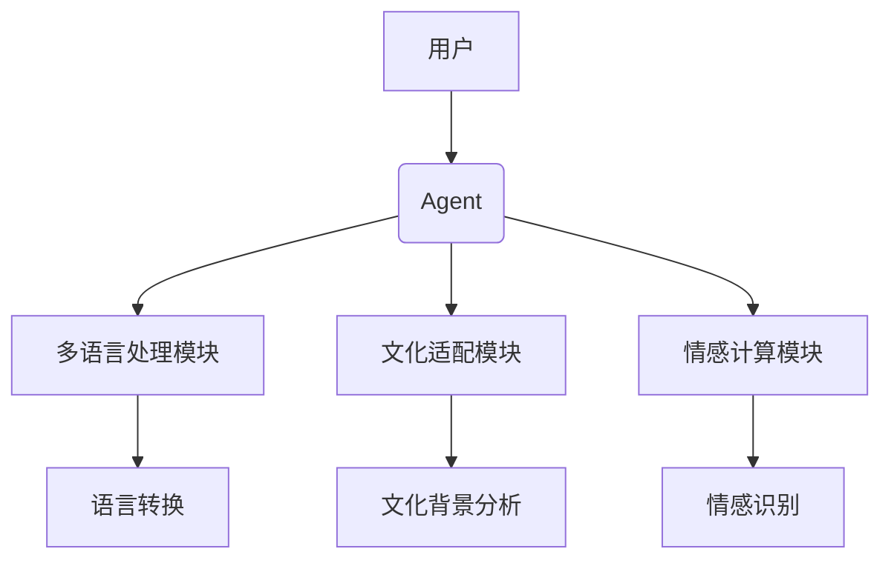

                 


# 开发AI Agent的跨文化交际能力

## 关键词：AI Agent，跨文化交际，自然语言处理，文化适配，情感计算

## 摘要：AI Agent作为人工智能技术的重要应用，其跨文化交际能力的开发是实现人机交互顺畅的关键。本文从背景介绍、核心概念、算法原理、系统架构、项目实战等方面，详细分析了开发AI Agent跨文化交际能力的必要性、挑战与解决方案，并通过具体的案例和代码实现，展示了如何构建具备跨文化交际能力的AI Agent系统。

---

## 第一部分: AI Agent的跨文化交际能力概述

### 第1章: AI Agent的基本概念与跨文化交际的重要性

#### 1.1 AI Agent的定义与特点

##### 1.1.1 AI Agent的基本概念
AI Agent（人工智能代理）是指能够感知环境、自主决策并执行任务的智能实体。AI Agent可以是软件程序、机器人或其他智能系统，其核心能力包括感知、推理、学习和执行。

##### 1.1.2 AI Agent的核心特点
- **自主性**：AI Agent能够在没有外部干预的情况下自主运行。
- **反应性**：能够实时感知环境并做出反应。
- **学习能力**：通过数据和经验不断优化自身的行为。
- **交互能力**：能够与人类或其他系统进行有效沟通和协作。

##### 1.1.3 AI Agent的应用场景
AI Agent广泛应用于客服、教育、医疗、金融等领域。例如，在客服领域，AI Agent可以处理多种语言的用户咨询，提供个性化的解决方案。

#### 1.2 跨文化交际的基本概念

##### 1.2.1 跨文化交际的定义
跨文化交际是指在不同文化背景下，个体或群体之间通过语言或非语言方式传递信息的过程。它强调理解和尊重不同文化背景下的沟通方式。

##### 1.2.2 跨文化交际的核心要素
- **语言**：不同语言的语法、词汇和表达习惯。
- **文化背景**：包括价值观、信仰、习俗等。
- **情感与非语言表达**：肢体语言、语气、表情等。

##### 1.2.3 跨文化交际的重要性
在全球化的背景下，跨文化交际能力是实现有效沟通的关键。对于AI Agent来说，具备跨文化交际能力可以提高用户体验，增强其适用性。

#### 1.3 AI Agent与跨文化交际的结合

##### 1.3.1 跨文化交际中AI Agent的作用
- **多语言支持**：能够理解并生成多种语言。
- **文化适配**：根据用户的文化背景调整沟通方式。
- **情感计算**：通过分析情感和语境，提供更贴心的服务。

##### 1.3.2 跨文化交际对AI Agent的要求
- **多语言处理能力**：支持多种语言的自然语言处理。
- **文化知识库**：具备不同文化的背景知识。
- **情感计算能力**：能够识别和理解用户的情感状态。

##### 1.3.3 AI Agent在跨文化交际中的应用前景
随着全球化的深入，AI Agent在跨文化交际中的应用前景广阔。例如，在国际商务、旅游、教育等领域，AI Agent可以通过跨文化交际能力提供更高效的服务。

---

## 第二部分: 跨文化交际中的挑战与AI Agent的解决方案

### 第2章: 跨文化交际中的挑战与AI Agent的解决方案

#### 2.1 跨文化交际的主要挑战

##### 2.1.1 文化差异对交际的影响
不同文化背景下，人们在表达方式、沟通习惯等方面存在显著差异。例如，西方文化更注重直接表达，而东方文化更倾向于委婉表达。

##### 2.1.2 语言障碍与语境理解
语言不仅是沟通的工具，还包含丰富的语境信息。AI Agent需要理解语言背后的语境，才能准确传递信息。

##### 2.1.3 情感与非语言表达的复杂性
情感和非语言表达（如肢体语言）在不同文化中有不同的含义，AI Agent需要具备识别和理解这些复杂性的能力。

#### 2.2 AI Agent在跨文化交际中的解决方案

##### 2.2.1 多语言模型的应用
AI Agent可以通过多语言模型处理多种语言的文本，例如使用神经机器翻译模型进行实时翻译。

##### 2.2.2 文化适配算法的设计
AI Agent可以根据用户的文化背景调整其回答的语气、内容和表达方式。例如，在与不同文化背景的用户交流时，AI Agent会自动选择合适的沟通风格。

##### 2.2.3 情感计算与语境理解的优化
AI Agent可以通过情感计算技术识别用户的情感状态，并结合语境信息生成更贴心的回应。例如，在用户表达不满时，AI Agent会调整语气，表达更多的理解和关心。

---

## 第三部分: 跨文化交际能力的评估与提升

### 第3章: 跨文化交际能力的评估与提升

#### 3.1 跨文化交际能力的评估标准

##### 3.1.1 语言能力评估
评估AI Agent是否能够准确理解和生成多种语言的文本。

##### 3.1.2 文化敏感性评估
评估AI Agent是否能够根据用户的文化背景调整其沟通方式。

##### 3.1.3 情感理解能力评估
评估AI Agent是否能够准确识别和理解用户的情感状态。

#### 3.2 AI Agent跨文化交际能力的提升策略

##### 3.2.1 多模态数据的整合
整合文本、语音、图像等多种模态的数据，以提高AI Agent的语境理解和情感计算能力。

##### 3.2.2 文化知识库的构建
构建包含多种文化背景知识的知识库，帮助AI Agent更好地理解用户的背景和需求。

##### 3.2.3 实时反馈与学习机制
通过用户反馈不断优化AI Agent的跨文化交际能力，例如，用户对AI Agent的回答进行评分，系统根据反馈调整其沟通策略。

---

## 第四部分: 跨文化交际中的伦理与隐私问题

### 第4章: 跨文化交际中的伦理与隐私问题

#### 4.1 跨文化交际中的伦理挑战

##### 4.1.1 数据使用的伦理问题
AI Agent在跨文化交际中需要处理大量用户数据，如何在不侵犯用户隐私的前提下进行数据处理是一个重要问题。

##### 4.1.2 文化偏见的消除
AI Agent可能因为训练数据中的文化偏见而导致不公平的沟通结果，如何消除这些偏见是开发中的重要挑战。

##### 4.1.3 用户隐私保护
在跨文化交际中，AI Agent需要保护用户的隐私，确保数据不被滥用。

#### 4.2 AI Agent在跨文化交际中的伦理解决方案

##### 4.2.1 数据使用规范
制定明确的数据使用规范，确保在跨文化交际中合理使用用户数据。

##### 4.2.2 去偏见算法的开发
通过算法优化消除文化偏见，确保AI Agent的沟通结果公平、公正。

##### 4.2.3 隐私保护机制的建立
通过加密、匿名化等技术手段保护用户隐私，确保数据安全。

---

## 第五部分: AI Agent跨文化交际能力的实现

### 第5章: AI Agent跨文化交际能力的实现

#### 5.1 系统架构设计

##### 5.1.1 系统功能设计
AI Agent跨文化交际系统包括多语言处理模块、文化适配模块、情感计算模块等多个功能模块。

##### 5.1.2 系统架构图


#### 5.2 算法实现

##### 5.2.1 多语言处理算法
使用神经机器翻译模型进行多语言文本处理，例如使用Transformer架构。

##### 5.2.2 文化适配算法
根据用户的文化背景调整回答的语气和内容，例如使用基于规则的适配算法。

##### 5.2.3 情感计算算法
通过自然语言处理技术识别用户的情感状态，例如使用情感分类模型。

#### 5.3 项目实战

##### 5.3.1 环境安装
安装Python、TensorFlow、Keras等开发工具。

##### 5.3.2 核心代码实现
```python
def multi_language_processing(text, target_language):
    # 使用神经机器翻译模型将文本从源语言翻译为目标语言
    translated_text = translator.translate(text, target_language)
    return translated_text

def cultural_adaptation(user_culture, response):
    # 根据用户文化背景调整回应
    adapted_response = cultural_model.adapt_response(response, user_culture)
    return adapted_response

def emotional_computation(user_input):
    # 通过情感分类模型识别用户情感
    emotion = emotion_classifier.predict(user_input)
    return emotion
```

##### 5.3.3 实际案例分析
例如，在与不同文化背景的用户交流时，AI Agent能够自动识别用户的语言和文化背景，并生成合适的回应。

#### 5.4 项目小结
通过多语言处理、文化适配和情感计算等技术，AI Agent能够具备跨文化交际能力，为用户提供更高效、更贴心的服务。

---

## 第六部分: 结论与展望

### 第6章: 结论与展望

#### 6.1 结论
开发AI Agent的跨文化交际能力是一个复杂但具有重要意义的挑战。通过多语言处理、文化适配和情感计算等技术，可以显著提升AI Agent的沟通能力。

#### 6.2 展望
未来，随着技术的不断进步，AI Agent的跨文化交际能力将更加智能化和个性化。例如，通过结合增强学习和自适应算法，AI Agent能够实时优化其沟通策略，更好地满足用户的多样化需求。

---

## 作者：AI天才研究院/AI Genius Institute & 禅与计算机程序设计艺术 /Zen And The Art of Computer Programming

---

这篇文章系统地介绍了AI Agent的跨文化交际能力的开发，从背景到实现，全面涵盖了技术细节和实际应用。通过理论分析和代码实现，展示了如何构建具备跨文化交际能力的AI Agent系统。

