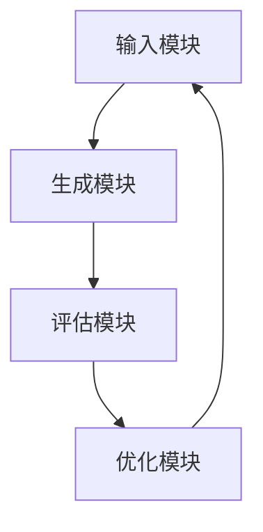

                 


# 开发AI Agent的跨模态内容生成与评估系统

> 关键词：AI Agent，跨模态内容生成，评估系统，深度学习，多模态模型

> 摘要：本文系统地探讨了开发AI Agent的跨模态内容生成与评估系统的各个方面，从背景介绍、核心概念到算法原理、系统架构、项目实战，再到最佳实践和未来展望，全面分析了该系统的设计与实现。文章通过详细的理论分析和实际案例，为读者提供了深入的技术指导和实践参考。

---

## 第一部分: AI Agent的跨模态内容生成与评估系统概述

### 第1章: 背景介绍

#### 1.1 问题背景
AI Agent（人工智能代理）是指能够感知环境、自主决策并执行任务的智能实体。随着技术的进步，AI Agent在多个领域展现出巨大潜力，如智能助手、内容推荐、自动化客服等。然而，AI Agent的能力受限于其处理信息的方式，尤其是在跨模态数据处理方面。

**跨模态技术**指的是在不同数据模态（如文本、图像、语音、视频等）之间进行信息处理和融合的技术。跨模态内容生成与评估系统能够利用多种模态的信息，生成更丰富、更准确的内容，并通过多维度评估确保内容质量。

#### 1.2 问题描述
在AI Agent的应用中，跨模态内容生成与评估面临以下挑战：
1. **数据异构性**：不同模态的数据具有不同的特征和表示方式，如何有效融合这些数据是一个难题。
2. **生成多样性**：生成的内容需要在保证质量的同时，具有多样性，以满足不同场景的需求。
3. **评估客观性**：如何建立一个客观、可量化的评估体系，是跨模态内容生成的关键问题。

#### 1.3 问题解决
为了应对上述挑战，我们提出了一种基于深度学习的跨模态内容生成与评估系统。该系统通过以下方式解决问题：
1. **多模态数据融合**：利用深度学习模型将不同模态的数据进行有效融合，提升生成内容的质量。
2. **多任务学习**：通过多任务学习，模型能够同时优化多个目标，如内容生成和评估。
3. **端到端优化**：通过端到端的训练方法，模型能够自动学习最优的参数，提升生成与评估的效果。

#### 1.4 边界与外延
AI Agent的跨模态内容生成与评估系统的边界主要在于：
- **输入范围**：系统支持的模态类型和数据格式。
- **输出范围**：生成内容的类型和评估结果的维度。

系统的外延包括：
- **扩展模态**：未来可以扩展支持更多模态，如视频、3D模型等。
- **应用场景**：可以应用于更多领域，如教育、医疗、金融等。

#### 1.5 核心概念结构与组成
系统的核心概念包括：
1. **输入模块**：负责接收多种模态的数据输入。
2. **生成模块**：基于输入数据生成跨模态内容。
3. **评估模块**：对生成的内容进行多维度评估。
4. **优化模块**：根据评估结果优化生成和评估过程。

---

## 第二部分: 跨模態內容生成與評估的核心概念

### 第2章: 跨模态内容生成原理

#### 2.1 跨模态数据处理
跨模态数据处理的关键在于如何有效地融合不同模态的信息。常用的方法包括：
1. **模态对齐**：通过某种方式将不同模态的数据对齐，使其能够进行有效的信息交互。
2. **模态融合**：将不同模态的数据进行融合，生成更高层次的表示。

#### 2.2 内容生成机制
内容生成机制主要依赖于深度学习模型，特别是Transformer模型。生成过程通常包括以下几个步骤：
1. **编码阶段**：将输入的多模态数据进行编码，生成相应的表示。
2. **解码阶段**：基于编码后的表示，生成目标内容。

#### 2.3 跨模态评估系统
评估系统需要考虑多个维度，如生成内容的准确性和相关性。常用的评估指标包括：
1. **准确性**：生成内容与真实内容的匹配程度。
2. **相关性**：生成内容与输入数据的相关性。
3. **多样性**：生成内容的多样性。

---

## 第三部分: 跨模態內容生成與評估的算法原理

### 第3章: 跨模态模型的训练与优化

#### 3.1 多任务学习
多任务学习是一种通过同时学习多个任务来提升模型性能的方法。在跨模态内容生成中，多任务学习可以同时优化生成和评估任务。

#### 3.2 端到端优化
端到端优化是一种通过整个系统的联合训练来优化模型参数的方法。这种方法能够使生成和评估模块协同优化，提升整体性能。

#### 3.3 模型架构
模型架构通常包括编码器和解码器两个部分。编码器负责将输入的多模态数据编码为一个共同的表示，解码器负责基于该表示生成目标内容。

---

## 第四部分: 跨模态內容生成與評估的系统架构

### 第4章: 系统架构设计

#### 4.1 功能模块
系统主要功能模块包括：
1. **输入模块**：接收多模态数据输入。
2. **生成模块**：生成目标内容。
3. **评估模块**：对生成内容进行评估。
4. **优化模块**：根据评估结果优化生成过程。

#### 4.2 系统架构图
以下是系统的架构图：



---

## 第五部分: 跨模态內容生成與評估的项目实战

### 第5章: 项目实战

#### 5.1 环境搭建
项目需要以下环境：
1. Python 3.8+
2. PyTorch 1.9+
3. Transformers库

#### 5.2 核心实现
以下是生成模块的核心代码：

```python
class MultiModalGenerator(nn.Module):
    def __init__(self, embed_dim, hidden_dim):
        super().__init__()
        self.text_encoder = TextEncoder(embed_dim)
        self.image_encoder = ImageEncoder(embed_dim)
        self.decoder = TransformerDecoder(hidden_dim, embed_dim)
    
    def forward(self, text_input, image_input):
        text_feat = self.text_encoder(text_input)
        image_feat = self.image_encoder(image_input)
        merged_feat = torch.cat([text_feat, image_feat], dim=-1)
        output = self.decoder(merged_feat)
        return output
```

#### 5.3 案例分析
以下是一个具体的案例分析：

**案例：跨模态文本生成**
- **输入**：一张图像和一段描述。
- **输出**：生成与图像和描述相关的文本内容。

---

## 第六部分: 最佳实践和未来展望

### 第6章: 最佳实践

#### 6.1 小结
本文详细介绍了开发AI Agent的跨模态内容生成与评估系统的各个方面，从背景介绍到算法原理，再到系统架构和项目实战，为读者提供了全面的技术指导。

#### 6.2 注意事项
在实际开发中，需要注意以下几点：
1. **数据质量**：输入数据的质量直接影响生成结果。
2. **模型调优**：需要进行充分的模型调优，以提升生成和评估的效果。
3. **性能优化**：需要考虑系统的性能优化，特别是在处理大规模数据时。

#### 6.3 未来展望
随着技术的不断发展，跨模态内容生成与评估系统将朝着以下几个方向发展：
1. **多模态融合**：支持更多模态的数据处理。
2. **实时性提升**：提高系统的实时性，满足更多应用场景的需求。
3. **自适应优化**：实现自适应优化，根据实时反馈优化生成和评估过程。

---

## 作者：AI天才研究院/AI Genius Institute & 禅与计算机程序设计艺术 /Zen And The Art of Computer Programming

---

感谢您的阅读！希望本文对您理解开发AI Agent的跨模态内容生成与评估系统有所帮助。如果需要进一步的技术支持或合作，请随时联系。

