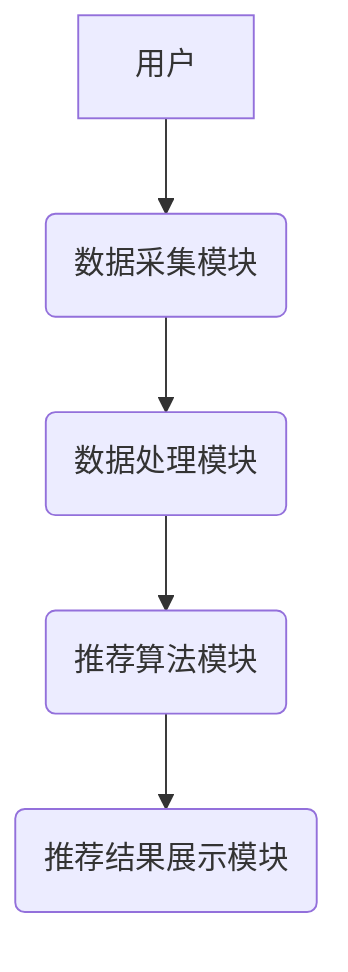
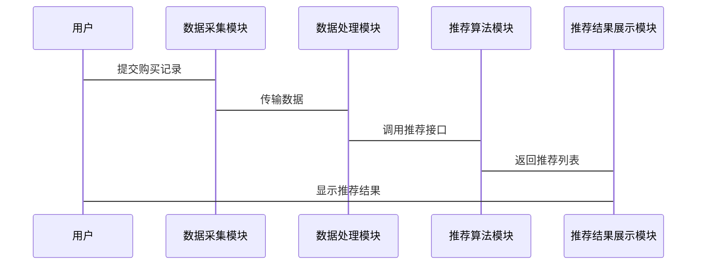

                 


# 开发AI Agent驱动的个性化推荐系统

## 关键词：个性化推荐系统，AI Agent，协同过滤，基于内容的推荐，系统架构，算法实现

## 摘要：  
本文将探讨如何利用AI Agent驱动的个性化推荐系统，结合推荐系统的演变、核心算法原理、系统架构设计以及实际项目实现，深入分析推荐系统的类型、AI Agent的角色，以及如何通过协同过滤、基于内容的推荐和深度学习算法来实现个性化的推荐服务。通过系统架构设计、项目实战和案例分析，本文将为读者提供从理论到实践的全面指导，帮助他们理解并开发高效的个性化推荐系统。

---

# 目录

1. [推荐系统的演变](#推荐系统的演变)
2. [推荐系统的核心要素](#推荐系统的核心要素)
3. [推荐系统与AI Agent的关系](#推荐系统与AI Agent的关系)
4. [协同过滤算法](#协同过滤算法)
5. [基于内容的推荐算法](#基于内容的推荐算法)
6. [推荐系统的架构设计](#推荐系统的架构设计)
7. [基于AI Agent的个性化推荐系统实现](#基于AI Agent的个性化推荐系统实现)
8. [项目实战与案例分析](#项目实战与案例分析)
9. [总结与展望](#总结与展望)

---

## 1. 推荐系统的演变

### 1.1 推荐系统的定义与作用

推荐系统是一种信息过滤技术，旨在通过分析用户行为和数据，向用户推荐相关内容或产品。其核心作用包括：

- **提升用户体验**：通过个性化推荐，满足用户多样化需求。
- **提高用户粘性**：通过精准推荐，增强用户对平台的依赖。
- **优化资源分配**：通过推荐算法，提高资源利用效率。

### 1.2 个性化推荐的必要性

个性化推荐是根据用户的行为和偏好，提供定制化的内容或产品。其必要性体现在：

- **满足用户需求**：用户希望得到符合自己兴趣的内容。
- **提高推荐精度**：通过分析用户数据，推荐更准确的内容。
- **增强用户满意度**：通过个性化推荐，提升用户体验。

### 1.3 AI Agent的基本概念

AI Agent是一种智能体，能够感知环境并采取行动以实现目标。其特点包括：

- **自主性**：能够在没有外部干预的情况下运行。
- **反应性**：能够根据环境变化调整行为。
- **社会性**：能够与其他智能体或用户进行交互。

---

## 2. 推荐系统的核心要素

### 2.1 推荐系统的类型

推荐系统可以根据不同的标准进行分类：

- **基于协同过滤的推荐**：通过用户行为相似性进行推荐。
- **基于内容的推荐**：通过分析内容特征进行推荐。
- **混合推荐**：结合多种推荐方法。

### 2.2 AI Agent在推荐中的角色

AI Agent在推荐系统中扮演关键角色：

- **数据采集**：收集用户行为和偏好数据。
- **推荐生成**：通过算法生成推荐列表。
- **用户交互**：与用户进行实时互动，调整推荐策略。

### 2.3 推荐系统的架构分析

推荐系统的架构通常包括以下几个模块：

- **数据采集模块**：负责收集用户行为数据。
- **数据处理模块**：对数据进行清洗和预处理。
- **推荐算法模块**：基于处理后的数据生成推荐结果。
- **推荐结果展示模块**：将推荐结果呈现给用户。

---

## 3. 推荐系统与AI Agent的关系

### 3.1 推荐系统的类型对比

| 类型            | 描述                                                                 |
|-----------------|----------------------------------------------------------------------|
| 协同过滤        | 基于用户行为相似性推荐                                               |
| 基于内容的推荐   | 基于内容特征相似性推荐                                               |
| 混合推荐         | 结合多种推荐方法，提升推荐精度                                       |

### 3.2 AI Agent推荐系统的特征

- **实时性**：能够实时响应用户请求。
- **智能性**：能够根据用户反馈调整推荐策略。
- **个性化**：能够提供高度个性化的推荐结果。

---

## 4. 协同过滤算法

### 4.1 协同过滤的原理

协同过滤分为基于用户的协同过滤和基于物品的协同过滤：

- **基于用户的协同过滤**：通过计算用户之间的相似度，推荐相似用户喜欢的内容。
- **基于物品的协同过滤**：通过计算物品之间的相似度，推荐用户可能感兴趣的内容。

### 4.2 协同过滤的实现步骤

#### 数据预处理
```python
# 示例代码：数据预处理
import pandas as pd

# 加载数据
data = pd.read_csv('user_ratings.csv')

# 删除缺失值
data = data.dropna()
```

#### 计算相似度
```python
from sklearn.metrics import pairwise

# 示例代码：计算用户相似度矩阵
user_similarity = pairwise.cosine_similarity(data)
```

#### 生成推荐
```python
# 示例代码：基于用户的协同过滤推荐
def get_recommendations(user_id, user_similarity):
    similar_users = user_similarity[user_id].argsort()[::-1][:5]
    recommended_items = data.iloc[similar_users].mean().sort_values(ascending=False)
    return recommended_items
```

### 4.3 协同过滤的优缺点

- **优点**：简单易实现，能够捕捉用户行为的相似性。
- **缺点**：计算复杂度高，冷启动问题明显。

---

## 5. 基于内容的推荐算法

### 5.1 基于内容的推荐原理

基于内容的推荐算法通过分析内容的特征，推荐与用户偏好相似的内容。常见的特征提取方法包括：

- **文本挖掘**：使用TF-IDF提取关键词。
- **特征向量**：通过词袋模型或词嵌模型生成特征向量。

### 5.2 基于内容的推荐实现

#### 特征提取
```python
from sklearn.feature_extraction.text import TfidfVectorizer

# 示例代码：文本特征提取
vectorizer = TfidfVectorizer()
tfidf_matrix = vectorizer.fit_transform(corpus)
```

#### 相似度计算
```python
# 示例代码：计算内容相似度
content_similarity = pairwise.cosine_similarity(tfidf_matrix)
```

#### 生成推荐
```python
# 示例代码：基于内容的推荐
def get_content_recommendations(item_id, content_similarity):
    similar_items = content_similarity[item_id].argsort()[::-1][:5]
    return data.iloc[similar_items]
```

---

## 6. 推荐系统的架构设计

### 6.1 系统功能模块划分

- **数据采集模块**：负责收集用户行为数据。
- **数据处理模块**：对数据进行清洗和预处理。
- **推荐算法模块**：基于处理后的数据生成推荐结果。
- **推荐结果展示模块**：将推荐结果呈现给用户。

### 6.2 系统架构图



---

## 7. 基于AI Agent的个性化推荐系统实现

### 7.1 问题场景

假设我们有一个电商网站，用户希望根据他们的购买历史和浏览行为，推荐相关产品。

### 7.2 系统介绍

系统包括数据采集、特征提取、推荐生成和结果展示四个模块。

### 7.3 系统架构设计


### 7.4 系统接口和交互流程



### 7.5 核心代码实现

#### 数据预处理
```python
# 示例代码：数据预处理
import pandas as pd

# 加载数据
data = pd.read_csv('user_ratings.csv')

# 删除缺失值
data = data.dropna()
```

#### 特征提取
```python
from sklearn.feature_extraction.text import TfidfVectorizer

# 示例代码：文本特征提取
vectorizer = TfidfVectorizer()
tfidf_matrix = vectorizer.fit_transform(corpus)
```

#### 推荐生成
```python
# 示例代码：基于用户的协同过滤推荐
def get_recommendations(user_id, user_similarity):
    similar_users = user_similarity[user_id].argsort()[::-1][:5]
    recommended_items = data.iloc[similar_users].mean().sort_values(ascending=False)
    return recommended_items
```

---

## 8. 项目实战与案例分析

### 8.1 环境安装

- **Python**：安装Python 3.x
- **库**：安装pandas、numpy、scikit-learn

### 8.2 核心代码实现

```python
import pandas as pd
from sklearn.metrics import pairwise

# 示例代码：协同过滤实现
data = pd.read_csv('user_ratings.csv')
user_similarity = pairwise.cosine_similarity(data)
```

### 8.3 案例分析

假设我们有一个电影推荐系统，用户A喜欢动作片和喜剧片，推荐系统会根据协同过滤算法，推荐给用户A相似的用户喜欢的电影。

### 8.4 项目总结

通过项目实战，我们掌握了协同过滤和基于内容的推荐算法的实现方法，并能够将这些算法应用到实际场景中。

---

## 9. 总结与展望

### 9.1 总结

本文详细介绍了AI Agent驱动的个性化推荐系统的开发过程，包括推荐系统的类型、算法原理、系统架构设计和项目实现。

### 9.2 未来展望

未来，随着AI技术的发展，个性化推荐系统将更加智能化和精准化，结合深度学习和强化学习，推荐系统将具备更强的自适应能力和实时性。

---

## 作者

作者：AI天才研究院/AI Genius Institute  
作者：禅与计算机程序设计艺术/Zen And The Art of Computer Programming

