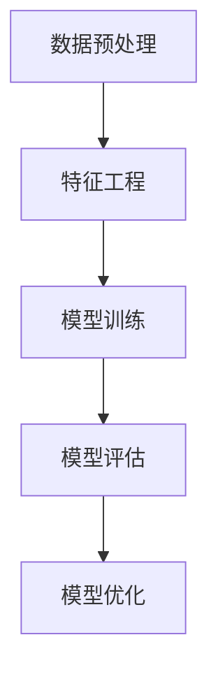
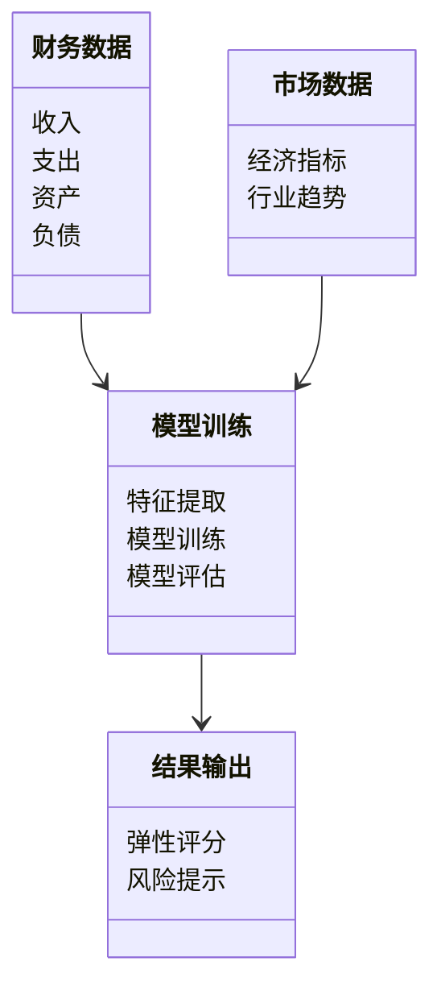
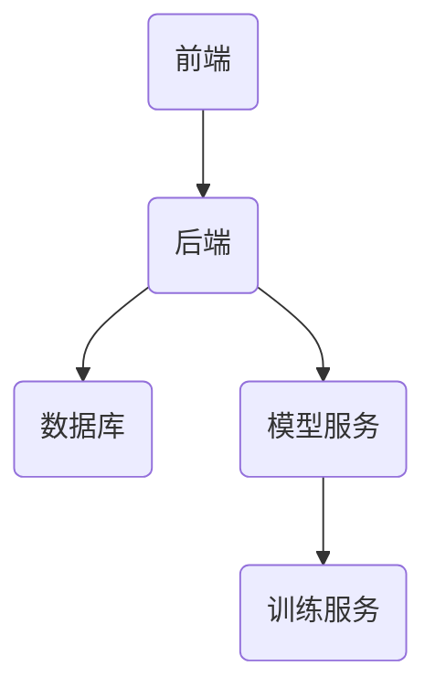
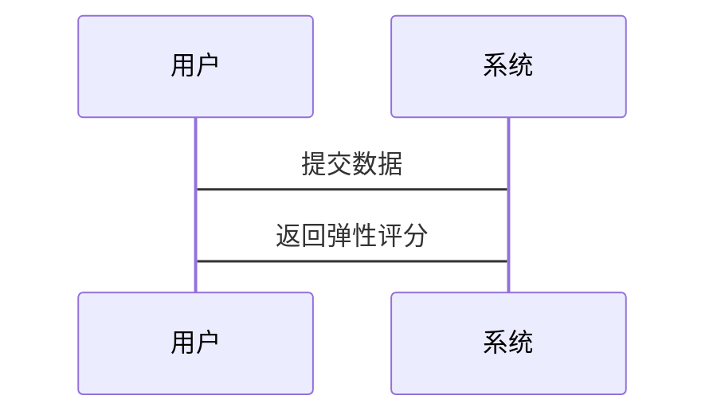

                 


---

# 开发AI辅助的企业财务弹性评估工具

## 关键词：AI技术、企业财务弹性、算法原理、系统架构、项目实战

## 摘要：  
随着企业规模的不断扩大和市场竞争的加剧，财务弹性评估变得越来越重要。传统的财务评估方法往往依赖于人工分析，效率低且容易出错。本文通过引入人工智能技术，提出了一种基于机器学习的财务弹性评估工具开发方案。文章详细探讨了AI在财务弹性评估中的应用，分析了算法原理，并通过实际案例展示了如何开发一个高效、准确的AI辅助财务弹性评估系统。

---

# 第一部分：背景介绍

## 第1章：问题背景与描述

### 1.1 问题背景
#### 1.1.1 企业财务弹性评估的定义
企业财务弹性是指企业在面对市场变化、经济波动或其他外部因素时，能够调整其财务结构、优化资源配置、维持正常运营并实现持续发展的能力。财务弹性评估是企业财务管理的重要组成部分，能够帮助企业更好地应对不确定性。

#### 1.1.2 当前企业财务弹性评估的痛点
- **数据量大、维度多**：企业财务数据通常包括收入、支出、资产、负债等多方面信息，传统的人工分析难以高效处理。
- **实时性要求高**：企业需要快速响应市场变化，传统的评估方法往往滞后。
- **准确性不足**：人工分析容易受到主观因素和经验限制，导致评估结果不够准确。

#### 1.1.3 AI技术在财务弹性评估中的应用潜力
AI技术可以通过大数据分析和机器学习算法，快速处理海量数据，发现隐藏的模式和趋势，从而提高评估的准确性和效率。

### 1.2 问题描述
#### 1.2.1 传统财务弹性评估方法的局限性
传统方法通常依赖于财务报表分析和人工判断，难以应对复杂多变的市场环境。

#### 1.2.2 数据量大、维度多的挑战
企业的财务数据通常涉及多个部门和业务单元，数据量大且维度复杂，传统方法难以高效处理。

#### 1.2.3 对实时性和准确性的要求
企业在面对市场波动时，需要快速调整财务策略，对评估结果的实时性和准确性提出了更高要求。

### 1.3 问题解决
#### 1.3.1 AI辅助的解决方案概述
通过引入机器学习算法，构建一个AI辅助的财务弹性评估系统，能够快速分析大量数据，提供准确的评估结果。

#### 1.3.2 数据驱动的财务弹性评估模型
利用机器学习模型，结合企业的财务数据和外部市场数据，构建一个数据驱动的评估模型。

#### 1.3.3 AI在财务预测与优化中的作用
AI可以通过历史数据分析，预测未来的财务状况，并提出优化建议，帮助企业更好地应对不确定性。

### 1.4 边界与外延
#### 1.4.1 企业财务弹性评估的边界条件
评估范围限定于企业的财务数据，不考虑外部市场环境的全部因素。

#### 1.4.2 相关领域的外延
AI技术在企业财务弹性评估中的应用可以扩展到风险管理、投资决策等领域。

#### 1.4.3 解决方案的适用范围与限制
该方案适用于数据量大、对实时性和准确性要求高的企业，但在数据不足或模型泛化能力不足的情况下，可能会影响评估结果。

### 1.5 核心概念结构与组成
#### 1.5.1 核心概念的层次结构
- **顶层概念**：企业财务弹性评估。
- **中层概念**：机器学习算法、财务数据处理、模型优化。
- **底层概念**：数据采集、特征提取、模型训练、结果输出。

#### 1.5.2 核心要素的组成与关系
- **数据来源**：财务报表、市场数据、企业内部数据。
- **算法选择**：随机森林、XGBoost、神经网络等。
- **模型优化**：超参数调整、特征工程、模型评估。

#### 1.5.3 问题解决的逻辑框架
1. 数据采集与预处理。
2. 特征提取与选择。
3. 模型训练与优化。
4. 结果输出与解释。

---

# 第二部分：核心概念与联系

## 第2章：AI在企业财务弹性评估中的应用

### 2.1 AI技术的核心概念
#### 2.1.1 机器学习与深度学习的定义
- **机器学习**：通过数据训练模型，使其能够从数据中学习并做出预测或决策。
- **深度学习**：一种基于人工神经网络的机器学习方法，能够自动提取数据特征。

#### 2.1.2 自然语言处理（NLP）与计算机视觉（CV）的应用
- **NLP**：用于处理财务报告、新闻等文本数据，提取关键信息。
- **CV**：用于处理财务图像数据，如识别财务凭证中的数字。

#### 2.1.3 大数据分析与数据挖掘技术
- **大数据分析**：对海量数据进行处理、分析和挖掘，提取有价值的信息。
- **数据挖掘**：从数据中发现模式、趋势和关联。

### 2.2 企业财务弹性评估的定义与关键特征
#### 2.2.1 财务弹性的定义
财务弹性是指企业在面对外部环境变化时，能够快速调整财务结构、优化资源配置，以维持或提高财务健康状况的能力。

#### 2.2.2 财务弹性的关键特征
- **流动性**：企业资产的流动性越高，应对短期债务的能力越强。
- **偿债能力**：企业偿还债务的能力影响其财务弹性。
- **盈利能力**：企业的盈利能力越强，财务弹性越大。

#### 2.2.3 弹性评估的核心指标
- **流动比率**：流动资产与流动负债的比值。
- **速动比率**：速动资产与流动负债的比值。
- **利息覆盖倍数**：息税前利润与利息支出的比值。

### 2.3 AI与财务弹性评估的关联
#### 2.3.1 数据驱动的弹性评估模型
通过机器学习模型，结合企业的财务数据和外部市场数据，构建数据驱动的弹性评估模型。

#### 2.3.2 AI技术在财务预测中的应用
- **预测模型**：利用历史数据训练模型，预测未来的财务状况。
- **实时监控**：通过实时数据更新，模型可以快速调整预测结果。

#### 2.3.3 弹性评估的实时性与准确性
AI技术能够快速处理大量数据，提高评估结果的实时性和准确性。

---

## 第2章附录：

---

# 第三部分：算法原理

## 第3章：算法原理与实现

### 3.1 算法原理
#### 3.1.1 机器学习算法的选择
- **随机森林**：适用于分类和回归问题，能够处理高维数据。
- **XGBoost**：高效的树模型，适合处理分类和回归问题。
- **神经网络**：适用于复杂的非线性关系。

#### 3.1.2 算法流程
1. 数据预处理：清洗数据，处理缺失值，标准化。
2. 特征工程：提取关键特征，进行特征选择。
3. 模型训练：使用训练数据训练模型。
4. 模型评估：通过交叉验证评估模型性能。
5. 模型优化：调整超参数，提高模型性能。

#### 3.1.3 算法流程图


#### 3.1.4 算法实现
以下是使用Python实现的随机森林算法代码示例：
```python
import pandas as pd
from sklearn.ensemble import RandomForestClassifier
from sklearn.metrics import accuracy_score
from sklearn.model_selection import train_test_split

# 数据加载
data = pd.read_csv('financial_data.csv')
X = data.drop('target', axis=1)
y = data['target']

# 数据分割
X_train, X_test, y_train, y_test = train_test_split(X, y, test_size=0.2, random_state=42)

# 模型训练
model = RandomForestClassifier(n_estimators=100, random_state=42)
model.fit(X_train, y_train)

# 模型预测
y_pred = model.predict(X_test)

# 模型评估
accuracy = accuracy_score(y_test, y_pred)
print(f'准确率：{accuracy}')
```

#### 3.1.5 数学模型与公式
随机森林算法的数学模型如下：
$$
f(x) = \sum_{i=1}^{n} \text{Tree}(x_i)
$$
其中，$x_i$ 是输入特征，$n$ 是树的数量。

---

# 第四部分：系统分析与架构设计

## 第4章：系统分析与架构设计

### 4.1 问题场景介绍
企业需要一个能够实时评估财务弹性的工具，帮助管理层快速做出决策。

### 4.2 系统功能设计
#### 4.2.1 领域模型


#### 4.2.2 系统架构


#### 4.2.3 接口设计
- **输入接口**：接收财务数据和市场数据。
- **输出接口**：提供弹性评分和风险提示。

#### 4.2.4 交互流程


---

# 第五部分：项目实战

## 第5章：项目实战与实现

### 5.1 环境安装
- **Python**：3.8+
- **库的安装**：`scikit-learn`, `pandas`, `numpy`, `mermaid`, `matplotlib`

### 5.2 系统核心实现
#### 5.2.1 核心代码实现
```python
import pandas as pd
from sklearn.ensemble import RandomForestClassifier
from sklearn.metrics import accuracy_score
from sklearn.model_selection import train_test_split

# 数据加载
data = pd.read_csv('financial_data.csv')
X = data.drop('target', axis=1)
y = data['target']

# 数据分割
X_train, X_test, y_train, y_test = train_test_split(X, y, test_size=0.2, random_state=42)

# 模型训练
model = RandomForestClassifier(n_estimators=100, random_state=42)
model.fit(X_train, y_train)

# 模型预测
y_pred = model.predict(X_test)

# 模型评估
accuracy = accuracy_score(y_test, y_pred)
print(f'准确率：{accuracy}')

# 特征重要性分析
importances = model.feature_importances_
feature_names = X.columns
feature_importances = pd.DataFrame({'feature': feature_names, 'importance': importances})
print(feature_importances.sort_values(by='importance', ascending=False))
```

#### 5.2.2 代码应用解读与分析
- **数据加载**：读取财务数据，提取特征和目标变量。
- **数据分割**：将数据分为训练集和测试集。
- **模型训练**：使用随机森林算法训练模型。
- **模型预测**：使用测试集进行预测。
- **模型评估**：计算准确率，评估模型性能。
- **特征重要性分析**：分析特征的重要性，优化模型。

#### 5.2.3 实际案例分析
以某企业为例，分析其财务弹性，并使用模型进行预测，输出弹性评分和风险提示。

---

# 第六部分：最佳实践

## 第6章：最佳实践与小结

### 6.1 小结
本文详细介绍了开发AI辅助的企业财务弹性评估工具的背景、核心概念、算法原理、系统架构设计和项目实战。通过实际案例分析，展示了如何利用AI技术提高财务评估的效率和准确性。

### 6.2 注意事项
- **数据质量**：确保数据的准确性和完整性。
- **模型优化**：根据实际需求调整模型参数，优化模型性能。
- **实时性**：确保系统能够实时更新数据，快速响应。

### 6.3 拓展阅读
- **机器学习**：深入学习随机森林、XGBoost等算法。
- **深度学习**：探索神经网络在财务分析中的应用。
- **自然语言处理**：研究NLP技术在财务文本分析中的应用。

---

# 作者

作者：AI天才研究院/AI Genius Institute & 禅与计算机程序设计艺术 /Zen And The Art of Computer Programming

---

以上是完整的内容大纲，涵盖了从背景介绍到项目实战的全过程。每一部分都详细阐述了核心概念、算法原理和实际应用，确保读者能够系统地理解和掌握开发AI辅助的企业财务弹性评估工具的全过程。

