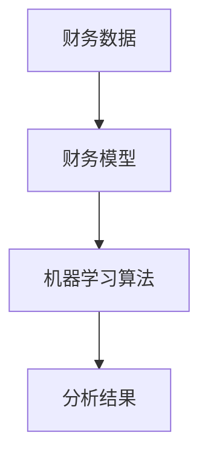
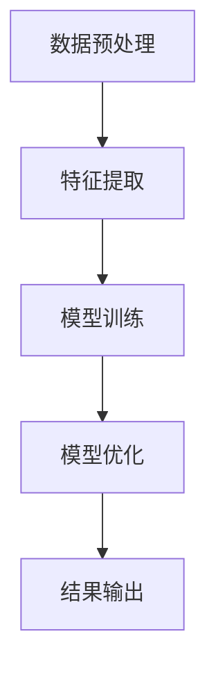
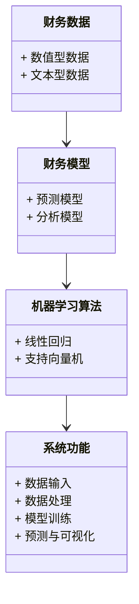
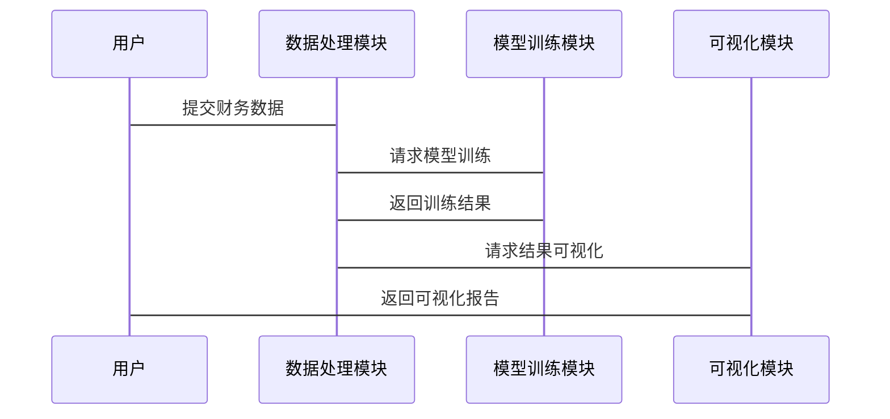

                 


# 开发AI辅助的企业财务情景分析工具

## 关键词：AI技术，财务分析，机器学习，自然语言处理（NLP），企业财务

## 摘要：  
随着人工智能技术的快速发展，AI在企业财务分析中的应用越来越广泛。本文详细探讨了如何开发一款AI辅助的企业财务情景分析工具，涵盖了从问题背景、核心概念、算法原理到系统架构设计、项目实战等多方面的内容。通过结合机器学习和自然语言处理技术，本文提出了一个高效的解决方案，并通过实际案例分析展示了该工具的应用效果。最终，本文为读者提供了一套完整的开发思路和实践指南，帮助企业在财务分析中实现智能化转型。

---

## 第1章: 背景介绍与问题背景

### 1.1 企业财务情景分析的背景与挑战

#### 1.1.1 传统财务分析的局限性  
传统的财务分析主要依赖人工操作，包括数据录入、报表分析、趋势预测等。这种方式不仅效率低下，容易出错，而且难以应对复杂多变的市场环境。企业财务人员需要处理大量的数据，且在分析过程中容易受到主观因素的影响，导致分析结果不够准确。

#### 1.1.2 AI技术在财务分析中的潜力  
人工智能技术的快速发展为财务分析带来了新的可能性。通过机器学习算法，AI能够快速处理海量数据，发现数据中的隐藏规律，并提供精准的预测和建议。此外，自然语言处理技术可以帮助AI理解财务报告、新闻等非结构化数据，进一步提升分析的深度和广度。

#### 1.1.3 企业财务情景分析的核心问题  
企业财务情景分析的核心问题是通过分析财务数据，预测未来财务状况的变化趋势，并为企业决策提供支持。这包括对财务数据的清洗、建模、预测和可视化等环节。

### 1.2 问题描述与目标设定

#### 1.2.1 问题背景分析  
企业在经营过程中需要定期进行财务分析，以评估自身的财务健康状况。然而，传统的财务分析方法效率低、成本高，且容易受到人为因素的影响。

#### 1.2.2 问题的边界与外延  
本工具的目标是通过AI技术，辅助企业进行财务情景分析，包括数据处理、建模、预测和可视化等环节。其边界包括财务数据的预处理、模型的训练与优化，以及结果的展示。

#### 1.2.3 问题解决的目标与预期成果  
开发一款AI辅助的企业财务情景分析工具，能够快速处理财务数据，提供精准的预测和可视化结果，帮助企业做出更明智的财务决策。

### 1.3 核心概念与联系

#### 1.3.1 核心概念原理  
企业财务情景分析涉及多个核心概念，包括财务数据、财务模型、机器学习算法等。

#### 1.3.2 核心概念属性特征对比表格  

| 核心概念 | 特性 |
|----------|------|
| 财务数据 | 结构化、非结构化 |
| 财务模型 | 预测性、描述性 |
| 机器学习算法 | 监督学习、无监督学习 |

#### 1.3.3 ER实体关系图架构（Mermaid流程图）



---

## 第2章: AI辅助企业财务情景分析的核心概念

### 2.1 AI技术与财务分析的结合

#### 2.1.1 人工智能在财务分析中的应用领域  
AI在财务分析中的应用领域包括财务预测、风险评估、 fraud detection 等。

#### 2.1.2 机器学习与深度学习在财务分析中的作用  
机器学习可以通过训练模型来预测财务数据的变化趋势，深度学习则可以处理复杂的非结构化数据。

#### 2.1.3 自然语言处理（NLP）在财务文本分析中的应用  
NLP技术可以帮助AI理解财务报告、新闻等文本数据，提取关键信息并进行分析。

### 2.2 企业财务情景分析的关键要素

#### 2.2.1 财务数据的特征与分类  
财务数据可以分为结构化数据（如财务报表）和非结构化数据（如财务报告）。

#### 2.2.2 财务情景分析的模型与方法  
常用的模型包括线性回归、支持向量机（SVM）等。

#### 2.2.3 企业财务情景分析的业务流程  
企业财务情景分析的业务流程包括数据采集、数据清洗、模型训练、预测与可视化等。

### 2.3 AI辅助分析的系统架构

#### 2.3.1 系统功能模块划分  
系统功能模块包括数据输入、数据处理、模型训练、预测与可视化等。

#### 2.3.2 系统输入输出的定义  
输入包括财务数据和模型参数，输出包括预测结果和可视化报告。

#### 2.3.3 系统的核心算法与实现  
系统的核心算法包括机器学习算法和NLP技术。

---

## 第3章: AI辅助财务情景分析的数学模型与算法原理

### 3.1 算法原理概述

#### 3.1.1 机器学习算法在财务分析中的应用  
常用的机器学习算法包括线性回归、随机森林、支持向量机等。

#### 3.1.2 支持向量机（SVM）的数学模型  
支持向量机的数学模型如下：

$$ \min_{\beta, \beta_0, \epsilon} \frac{1}{2}||\beta||^2 + C\sum_{i=1}^n \epsilon_i $$

#### 3.1.3 随机森林（Random Forest）算法的实现原理  
随机森林算法通过构建多个决策树，并通过投票机制进行预测。

### 3.2 算法实现流程

#### 3.2.1 数据预处理流程  
数据预处理包括数据清洗、特征提取、数据标准化等步骤。

#### 3.2.2 特征提取与选择  
特征提取是通过NLP技术从文本数据中提取关键词。

#### 3.2.3 模型训练与优化  
模型训练包括选择合适的算法、调整参数等步骤。

### 3.3 算法实现的数学公式

#### 3.3.1 线性回归模型公式  
线性回归模型公式为：

$$ y = \beta_0 + \beta_1x_1 + \beta_2x_2 + ... + \beta_nx_n $$

#### 3.3.2 支持向量机的优化目标  
支持向量机的优化目标为：

$$ \min_{\beta, \beta_0, \epsilon} \frac{1}{2}||\beta||^2 + C\sum_{i=1}^n \epsilon_i $$

### 3.4 算法流程图（Mermaid）



---

## 第4章: 系统分析与架构设计方案

### 4.1 问题场景介绍

#### 4.1.1 企业财务情景分析的典型场景  
企业需要分析财务数据，预测未来的财务状况。

#### 4.1.2 系统需要解决的具体问题  
系统需要解决数据处理、模型训练、预测与可视化等问题。

#### 4.1.3 系统的功能需求  
系统需要具备数据输入、数据处理、模型训练、预测与可视化等功能。

### 4.2 项目介绍

#### 4.2.1 项目目标  
开发一款AI辅助的企业财务情景分析工具。

#### 4.2.2 项目范围  
系统适用于企业财务部门，帮助其进行财务分析。

### 4.3 系统功能设计

#### 4.3.1 领域模型（Mermaid类图）



### 4.4 系统架构设计

#### 4.4.1 系统架构（Mermaid架构图）


### 4.5 系统接口设计

#### 4.5.1 系统接口设计  
系统接口包括数据输入接口、模型训练接口、预测接口和结果输出接口。

### 4.6 系统交互设计

#### 4.6.1 系统交互（Mermaid序列图）



---

## 第5章: 项目实战

### 5.1 环境安装

#### 5.1.1 开发工具安装  
安装Python、Jupyter Notebook等开发工具。

#### 5.1.2 依赖库安装  
安装NumPy、Pandas、Scikit-learn、NLTK等库。

### 5.2 系统核心实现源代码

#### 5.2.1 数据预处理代码  

```python
import pandas as pd
import numpy as np

# 读取数据
data = pd.read_csv('financial_data.csv')

# 数据清洗
data = data.dropna()
data = data.drop_duplicates()

# 特征提取
from sklearn.feature_extraction.text import TfidfVectorizer
vectorizer = TfidfVectorizer()
text_features = vectorizer.fit_transform(data['text'])
```

#### 5.2.2 模型训练代码  

```python
from sklearn.model_selection import train_test_split
from sklearn.svm import SVC

# 数据分割
X_train, X_test, y_train, y_test = train_test_split(text_features, data['label'], test_size=0.2)

# 模型训练
model = SVC()
model.fit(X_train, y_train)
```

### 5.3 代码应用解读与分析

#### 5.3.1 数据预处理代码解读  
上述代码实现了数据的清洗和特征提取，使用TfidfVectorizer提取文本特征。

#### 5.3.2 模型训练代码解读  
上述代码使用支持向量机模型进行训练，并对数据进行分割。

### 5.4 实际案例分析和详细讲解剖析

#### 5.4.1 案例背景  
以某企业的财务数据为例，进行情景分析。

#### 5.4.2 数据处理与分析  
对数据进行清洗和特征提取，训练模型并进行预测。

### 5.5 项目小结

#### 5.5.1 项目实现的成果  
成功开发了一款AI辅助的企业财务情景分析工具。

#### 5.5.2 项目经验总结  
通过项目实践，总结了开发过程中遇到的问题及解决方案。

---

## 第6章: 总结与展望

### 6.1 最佳实践 tips  
在开发过程中，需要注意数据质量、模型选择和代码实现等问题。

### 6.2 小结  
本文详细探讨了AI辅助的企业财务情景分析工具的开发过程，包括背景、核心概念、算法原理、系统架构设计和项目实战等。

### 6.3 注意事项  
在实际应用中，需要注意数据隐私和模型的可解释性问题。

### 6.4 拓展阅读  
建议读者阅读《机器学习实战》、《自然语言处理入门》等相关书籍。

---

## 作者：AI天才研究院/AI Genius Institute & 禅与计算机程序设计艺术 /Zen And The Art of Computer Programming

---

以上是文章的完整目录大纲和部分章节内容，您可以根据需要进一步扩展和补充各章节的具体内容。

