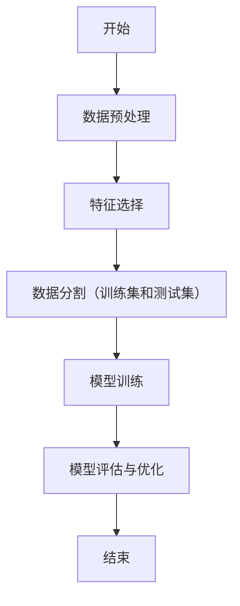
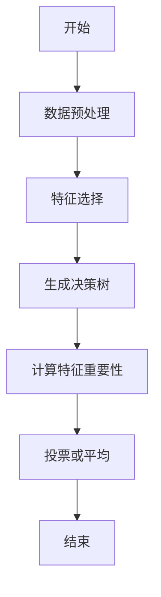
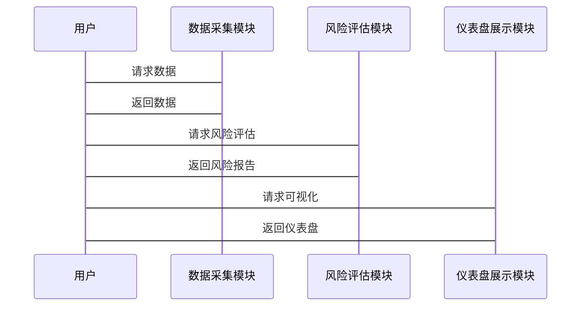

                 


# 开发AI辅助的企业财务风险预警仪表盘

> 关键词：企业财务风险、AI辅助、风险预警、仪表盘、机器学习、系统架构

> 摘要：随着企业财务风险管理的重要性日益增加，传统的财务风险管理方法逐渐暴露出效率低下、精准度不足等问题。基于AI技术的企业财务风险预警系统能够通过实时数据分析和预测模型，有效帮助企业识别潜在风险，优化财务决策。本文将详细探讨如何开发一款AI辅助的企业财务风险预警仪表盘，涵盖系统背景、核心概念、算法原理、系统架构设计、项目实战以及最佳实践等内容。

---

# 第一部分: 企业财务风险预警仪表盘的背景与核心概念

## 第1章: 企业财务风险预警的背景与需求

### 1.1 问题背景

#### 1.1.1 企业财务风险的定义与类型

企业财务风险是指企业在经营过程中由于内外部因素的影响，可能导致财务状况恶化、资金链断裂甚至破产的风险。常见的财务风险类型包括：

1. **流动性风险**：企业无法及时偿还短期债务的风险。
2. **信用风险**：客户或供应商无法履行合同义务的风险。
3. **市场风险**：市场波动对企业财务状况的影响。
4. **操作风险**：由于内部管理或操作失误导致的财务损失。

#### 1.1.2 传统财务风险管理的局限性

传统财务风险管理方法通常依赖于定期财务报表分析和人工判断，存在以下问题：

- 数据处理效率低：需要手动收集和整理大量财务数据。
- 预警滞后：传统方法通常基于历史数据，无法实现实时监控和预测。
- 精准度不足：人工判断容易受到主观因素影响，导致预警不准确。

#### 1.1.3 AI技术在财务风险管理中的潜力

人工智能技术可以通过以下方式提升财务风险管理的效率和精准度：

- **自动化数据处理**：AI能够快速处理大量非结构化数据，提取关键财务指标。
- **实时监控与预测**：基于机器学习的模型可以实时分析数据，预测潜在风险。
- **个性化预警**：根据企业的具体情况定制预警规则和阈值。

### 1.2 企业财务风险预警的需求分析

#### 1.2.1 企业对财务风险预警的需求场景

企业在以下场景中需要实时的财务风险预警：

- **日常财务监控**：实时跟踪企业的现金流、应收账款、应付账款等关键指标。
- **重大决策支持**：在投资、融资等重大决策前，提供风险评估和预警。
- **异常交易检测**：识别潜在的财务欺诈或异常交易行为。

#### 1.2.2 企业财务风险预警的核心目标

- 提高财务风险管理的效率和精准度。
- 实现财务数据的实时监控和预测。
- 提供直观的可视化工具（仪表盘）帮助管理层快速决策。

#### 1.2.3 仪表盘在财务风险预警中的作用

仪表盘作为财务风险预警系统的重要组成部分，具有以下功能：

- **数据可视化**：通过图表、仪表盘等形式直观展示财务指标。
- **实时预警**：当某个指标超过预设阈值时，触发预警。
- **趋势分析**：展示财务数据的历史趋势，帮助预测未来风险。

### 1.3 本章小结

本章从企业财务风险的定义、传统管理方法的局限性以及AI技术的潜力三个方面，阐述了开发AI辅助财务风险预警仪表盘的背景和必要性。同时，明确了仪表盘在财务风险预警中的核心作用。

---

## 第2章: AI辅助的企业财务风险预警的核心概念

### 2.1 财务风险预警的关键要素

#### 2.1.1 财务指标分析

财务指标是衡量企业财务健康状况的关键依据，常见的财务指标包括：

- **流动比率（Current Ratio）**：衡量企业短期偿债能力。
- **速动比率（Quick Ratio）**：衡量企业快速变现能力。
- **净利率（Net Profit Margin）**：衡量企业盈利能力。
- **应收账款周转率（Accounts Receivable Turnover）**：衡量企业资金回收效率。

#### 2.1.2 数据来源与处理

企业财务数据来源多样，包括：

- **财务报表**：资产负债表、利润表、现金流量表等。
- **业务系统数据**：销售、采购、库存等业务系统生成的数据。
- **外部数据**：行业基准数据、市场趋势数据等。

数据处理流程包括数据清洗、特征提取、数据标准化等步骤。

#### 2.1.3 预警模型构建

预警模型是基于机器学习算法构建的，用于预测企业财务风险的模型。常见的模型包括：

- **线性回归模型**：用于预测连续型财务指标。
- **逻辑回归模型**：用于分类财务风险等级（如高风险、中风险、低风险）。
- **随机森林模型**：用于处理高维数据和非线性关系。

### 2.2 AI在财务风险预警中的应用原理

#### 2.2.1 数据驱动的财务风险分析

AI通过分析企业的历史财务数据和实时数据，识别潜在的财务风险因素。例如，通过分析企业的现金流变化，预测企业可能面临的流动性风险。

#### 2.2.2 AI算法在风险预测中的作用

机器学习算法能够从大量数据中提取特征，并建立预测模型。例如，使用支持向量机（SVM）进行风险分类，或者使用XGBoost模型进行风险概率预测。

#### 2.2.3 仪表盘的实时监控功能

仪表盘通过实时更新和展示财务指标，帮助企业财务管理人员快速识别潜在风险。例如，仪表盘可以实时显示企业的流动比率、速动比率等关键指标，并设置预警阈值。

### 2.3 本章小结

本章详细介绍了财务风险预警的核心要素，包括财务指标分析、数据来源与处理以及预警模型构建。同时，阐述了AI在财务风险预警中的应用原理和仪表盘的实时监控功能。

---

## 第三部分: 系统架构与功能设计

---

# 第3章: 基于机器学习的财务风险预警算法

## 3.1 算法原理

### 3.1.1 线性回归模型

线性回归模型是一种常用的回归分析方法，适用于预测连续型财务指标。其数学模型如下：

$$ y = \beta_0 + \beta_1x_1 + \beta_2x_2 + \dots + \beta_nx_n + \epsilon $$

其中，$y$ 是目标变量（如净利率），$x_i$ 是自变量（如流动比率、速动比率），$\beta_i$ 是回归系数，$\epsilon$ 是误差项。

### 3.1.2 随机森林模型

随机森林是一种基于决策树的集成学习方法，适用于处理高维数据和非线性关系。其核心思想是通过构建多个决策树并进行投票或平均，提高模型的准确性和稳定性。

### 3.1.3 算法流程图

以下是一个简单的机器学习算法流程图（以随机森林为例）：



## 3.2 算法实现的数学模型

### 3.2.1 线性回归公式

线性回归的损失函数通常采用均方误差（MSE）：

$$ \text{MSE} = \frac{1}{n}\sum_{i=1}^{n}(y_i - \hat{y}_i)^2 $$

其中，$y_i$ 是实际值，$\hat{y}_i$ 是预测值，$n$ 是样本数量。

### 3.2.2 随机森林算法流程图

以下是一个随机森林算法的流程图：



---

## 第4章: 系统架构与功能设计

### 4.1 系统架构设计

#### 4.1.1 分层架构

系统采用分层架构，包括数据层、业务逻辑层和表现层。数据层负责数据的存储和管理，业务逻辑层负责数据处理和模型计算，表现层负责数据的可视化和用户交互。

#### 4.1.2 微服务架构

系统采用微服务架构，包括数据采集服务、模型计算服务和仪表盘展示服务。各服务之间通过API进行通信，确保系统的高可用性和扩展性。

#### 4.1.3 数据流设计

数据流从数据源流向数据存储，经过数据处理后，进入模型计算模块，最终在仪表盘上展示结果。

### 4.2 功能模块设计

#### 4.2.1 数据采集模块

数据采集模块负责从企业财务系统、业务系统等数据源采集数据，并进行初步清洗和预处理。

#### 4.2.2 风险评估模块

风险评估模块负责基于机器学习模型对企业的财务风险进行评估和预测，生成风险报告。

#### 4.2.3 仪表盘展示模块

仪表盘展示模块负责将风险评估结果以可视化的方式展示给用户，提供实时预警和趋势分析。

### 4.3 系统交互流程图

以下是一个系统的交互流程图：



---

## 第5章: 项目实战

### 5.1 环境搭建

#### 5.1.1 安装Python和相关库

安装Python和以下库：

- NumPy
- Pandas
- Scikit-learn
- Matplotlib
- Flask

#### 5.1.2 数据准备

准备企业财务数据，包括流动比率、速动比率、净利率等指标。

### 5.2 系统核心实现

#### 5.2.1 数据预处理

使用Pandas对数据进行清洗和特征提取。

```python
import pandas as pd

# 读取数据
data = pd.read_csv('financial_data.csv')

# 数据清洗
data.dropna(inplace=True)
data = pd.get_dummies(data)
```

#### 5.2.2 模型训练

使用Scikit-learn训练随机森林模型。

```python
from sklearn.ensemble import RandomForestClassifier
from sklearn.model_selection import train_test_split

# 数据分割
X = data.drop('risk_label', axis=1)
y = data['risk_label']
X_train, X_test, y_train, y_test = train_test_split(X, y, test_size=0.2, random_state=42)

# 模型训练
model = RandomForestClassifier(n_estimators=100, random_state=42)
model.fit(X_train, y_train)
```

#### 5.2.3 仪表盘开发

使用Flask开发一个简单的Web界面。

```python
from flask import Flask, render_template
import pandas as pd

app = Flask(__name__)

@app.route('/')
def dashboard():
    return render_template('dashboard.html')

if __name__ == '__main__':
    app.run(debug=True)
```

---

## 第6章: 最佳实践与小结

### 6.1 最佳实践

- 数据预处理是关键：确保数据的准确性和完整性。
- 选择合适的算法：根据数据特征选择合适的机器学习算法。
- 实时监控：确保仪表盘能够实时更新数据。

### 6.2 小结

本文详细探讨了开发AI辅助的企业财务风险预警仪表盘的背景、核心概念、算法原理、系统架构设计以及项目实战。通过本文的讲解，读者可以掌握如何利用AI技术提升企业财务风险管理的效率和精准度。

---

# 作者：AI天才研究院 & 禅与计算机程序设计艺术

