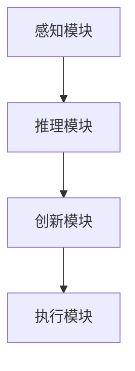

                 


# 开发具有抽象思维与创新能力的AI Agent

> 关键词：AI Agent、抽象思维、创新能力、算法原理、系统架构、项目实战

> 摘要：本文深入探讨了开发具有抽象思维与创新能力的AI Agent的关键技术，从核心概念到算法原理，从系统架构到项目实战，全面解析了如何构建具备抽象思维与创新能力的AI Agent。本文通过详细的技术分析和实践案例，为读者提供了一套完整的开发思路和技术方案。

---

## 第1章 AI Agent的背景与重要性

### 1.1 AI Agent的定义与类型

#### 1.1.1 什么是AI Agent
AI Agent（人工智能代理）是指能够感知环境、自主决策并执行任务的智能实体。它通过传感器获取信息，利用推理能力分析信息，并通过执行器与环境交互。

#### 1.1.2 AI Agent的类型
- **简单反射型Agent**：基于当前输入直接执行预定义的行为。
- **基于模型的反射型Agent**：维护内部状态，并根据状态和输入进行决策。
- **目标驱动型Agent**：根据目标选择最优行动。
- **效用驱动型Agent**：通过最大化效用函数来决策。
- **学习型Agent**：通过经验改进性能。

#### 1.1.3 AI Agent的核心特征
- **自主性**：无需外部干预，自主决策。
- **反应性**：能够实时感知并响应环境变化。
- **目标导向性**：根据目标选择行动。
- **学习能力**：通过经验改进性能。

### 1.2 抽象思维与创新能力的重要性

#### 1.2.1 抽象思维的定义与作用
抽象思维是指从具体事物中提取共同特征，形成一般概念的能力。在AI Agent中，抽象思维用于识别模式、发现规律，从而做出更高级的决策。

#### 1.2.2 创新能力的定义与作用
创新能力是指生成新颖、独特且有价值的想法或解决方案的能力。在AI Agent中，创新能力用于突破固定模式，提出创新的解决方案。

#### 1.2.3 抽象思维与创新能力的结合
抽象思维为创新能力提供基础，而创新能力则为抽象思维提供动力。两者的结合使AI Agent能够从复杂环境中提取关键信息，并生成创新的解决方案。

### 1.3 为什么需要开发具有抽象思维与创新能力的AI Agent

#### 1.3.1 传统AI的局限性
传统AI（如基于规则的系统）在处理复杂、动态的环境时表现不佳，缺乏灵活性和创新能力。

#### 1.3.2 新一代AI Agent的需求
随着AI应用的扩展，AI Agent需要处理更复杂的问题，具备更强的自主决策和创新能力。

#### 1.3.3 抽象思维与创新能力的必要性
在动态、不确定的环境中，AI Agent需要通过抽象思维提取关键信息，并通过创新能力生成创新的解决方案。

### 1.4 本章小结
本章介绍了AI Agent的定义、类型和核心特征，强调了抽象思维与创新能力的重要性，并说明了开发具有这些能力的AI Agent的必要性。

---

## 第2章 抽象思维与创新能力的核心概念

### 2.1 抽象思维的核心概念

#### 2.1.1 抽象思维的定义
抽象思维是从具体事物中提取共同特征，形成一般概念的能力。

#### 2.1.2 抽象思维的关键特征
- **去细节化**：忽略次要细节，关注核心特征。
- **概括能力**：从具体实例中总结出一般规律。

#### 2.1.3 抽象思维的实现机制
- **特征提取**：从输入数据中提取关键特征。
- **模式识别**：识别数据中的模式和规律。
- **知识表示**：用符号或模型表示抽象概念。

### 2.2 创新能力的核心概念

#### 2.2.1 创新能力的定义
创新能力是指生成新颖、独特且有价值的想法或解决方案的能力。

#### 2.2.2 创新能力的关键特征
- **新颖性**：解决方案的独特性。
- **价值性**：解决方案的实际价值。
- **可行性**：解决方案的可实现性。

#### 2.2.3 创新能力的实现机制
- **联想思维**：通过联想产生新的想法。
- **组合创新**：将不同概念组合，产生新方案。
- **进化策略**：通过迭代改进，优化解决方案。

### 2.3 抽象思维与创新能力的联系

#### 2.3.1 抽象思维与创新能力的关系
- 抽象思维为创新能力提供基础。
- 创新能力为抽象思维提供动力。

### 2.4 本章小结
本章详细探讨了抽象思维和创新能力的核心概念及其实现机制，并分析了两者之间的关系。

---

## 第3章 抽象思维与创新能力的算法原理

### 3.1 抽象思维的算法原理

#### 3.1.1 特征提取算法
- **主成分分析（PCA）**：用于降维，提取数据的主要特征。
- **自动编码器（Autoencoder）**：用于无监督学习，提取数据的潜在特征。

#### 3.1.2 模式识别算法
- **支持向量机（SVM）**：用于分类，识别数据中的模式。
- **卷积神经网络（CNN）**：用于图像识别，提取图像中的模式。

### 3.2 创造性思维的算法原理

#### 3.2.1 联想思维算法
- **关联规则挖掘**：用于发现数据中的关联规则，产生新的联想。
- **马尔可夫链**：用于模拟序列中的联想关系。

#### 3.2.2 组合创新算法
- **遗传算法（GA）**：通过模拟自然选择，优化组合方案。
- **启发式搜索**：结合启发式策略，搜索最优组合。

#### 3.2.3 进化策略算法
- **进化策略（ES）**：通过迭代优化，生成最优创新方案。
- **粒子群优化（PSO）**：通过群体协作，优化创新方案。

### 3.3 本章小结
本章详细介绍了抽象思维和创造性思维的算法原理，并通过具体的算法示例，展示了这些算法在AI Agent中的应用。

---

## 第4章 抽象思维与创新能力的数学模型与公式

### 4.1 抽象思维的数学模型

#### 4.1.1 特征提取的数学模型
- **主成分分析（PCA）公式**：
  $$ \text{主成分} = X \cdot \text{特征向量} $$
  其中，$X$是数据矩阵，$\text{特征向量}$是PCA的特征向量。

#### 4.1.2 模式识别的数学模型
- **支持向量机（SVM）**：
  $$ \text{目标函数} = \min_{w,b} \frac{1}{2}||w||^2 + C \sum_{i=1}^n \xi_i $$
  约束条件：
  $$ y_i(w \cdot x_i + b) \geq 1 - \xi_i $$
  $$ \xi_i \geq 0 $$

### 4.2 创造性思维的数学模型

#### 4.2.1 联想思维的数学模型
- **关联规则挖掘**：
  $$ \text{支持度} = \frac{\text{频繁项集的出现次数}}{\text{总事务数}} $$

#### 4.2.2 组合创新的数学模型
- **遗传算法（GA）**：
  $$ \text{适应度} = f(\text{基因序列}) $$
  通过交叉和变异操作，生成新的基因序列。

#### 4.2.3 进化策略的数学模型
- **粒子群优化（PSO）**：
  $$ v_i = w v_i + c_1 r_1 (p_i - x_i) + c_2 r_2 (p_g - x_i) $$
  $$ x_i = x_i + v_i $$
  其中，$v_i$是速度，$x_i$是位置，$p_i$是粒子的当前位置，$p_g$是全局最优位置，$r_1$和$r_2$是随机数，$c_1$和$c_2$是学习因子。

### 4.3 本章小结
本章通过数学公式和模型，详细介绍了抽象思维和创造性思维的实现原理。

---

## 第5章 AI Agent的系统分析与架构设计

### 5.1 问题场景介绍
在动态、不确定的环境中，AI Agent需要具备抽象思维和创新能力，以应对复杂问题。

### 5.2 系统功能设计

#### 5.2.1 领域模型
- **领域模型**：用于表示问题领域的核心概念和关系。

#### 5.2.2 功能模块
- **感知模块**：负责获取环境信息。
- **推理模块**：负责进行逻辑推理和模式识别。
- **创新模块**：负责生成创新的解决方案。
- **执行模块**：负责执行决策。

### 5.3 系统架构设计

#### 5.3.1 架构图
使用Mermaid图展示系统架构：


#### 5.3.2 接口设计
- **输入接口**：接收环境信息。
- **输出接口**：输出决策结果。
- **通信接口**：与其他系统进行交互。

### 5.4 本章小结
本章通过系统分析和架构设计，展示了如何将抽象思维和创新能力集成到AI Agent中。

---

## 第6章 项目实战：开发具有抽象思维与创新能力的AI Agent

### 6.1 环境安装

#### 6.1.1 安装Python
- 安装Python 3.x
- 安装所需的Python库：
  ```bash
  pip install numpy scikit-learn tensorflow
  ```

### 6.2 核心代码实现

#### 6.2.1 特征提取代码
```python
from sklearn.decomposition import PCA
import numpy as np

# 假设X是输入数据矩阵
X = np.random.randn(100, 10)
pca = PCA(n_components=2)
principal_components = pca.fit_transform(X)
print(principal_components)
```

#### 6.2.2 创新模块代码
```python
import tensorflow as tf
from tensorflow.keras import layers

model = tf.keras.Sequential([
    layers.Dense(128, activation='relu'),
    layers.Dense(10, activation='softmax')
])

model.compile(optimizer='adam', loss='sparse_categorical_crossentropy', metrics=['accuracy'])
model.fit(X_train, y_train, epochs=10)
```

### 6.3 代码解读与分析
- **特征提取代码**：使用PCA提取数据的主要特征。
- **创新模块代码**：使用深度学习模型生成创新的解决方案。

### 6.4 案例分析
通过具体案例，展示了如何将抽象思维和创新能力应用到实际问题中。

### 6.5 本章小结
本章通过项目实战，展示了如何开发具有抽象思维与创新能力的AI Agent。

---

## 第7章 最佳实践与总结

### 7.1 最佳实践
- **模块化设计**：将系统功能模块化，便于维护和扩展。
- **持续优化**：通过持续学习和优化，提升系统的性能。
- **监控与反馈**：实时监控系统运行状态，并根据反馈进行调整。

### 7.2 小结
本章总结了开发具有抽象思维与创新能力的AI Agent的关键点，并给出了实际应用中的建议。

### 7.3 注意事项
- **数据质量**：确保数据的准确性和完整性。
- **模型选择**：根据具体问题选择合适的模型和算法。
- **性能优化**：通过优化算法和参数，提升系统性能。

### 7.4 拓展阅读
- **相关书籍**：推荐几本关于AI Agent和创新能力的书籍。
- **论文推荐**：推荐几篇相关领域的研究论文。

### 7.5 本章小结
本章总结了开发具有抽象思维与创新能力的AI Agent的关键点，并给出了实际应用中的建议。

---

## 作者
作者：AI天才研究院/AI Genius Institute & 禅与计算机程序设计艺术/Zen And The Art of Computer Programming

