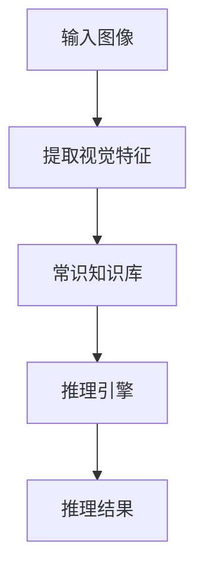
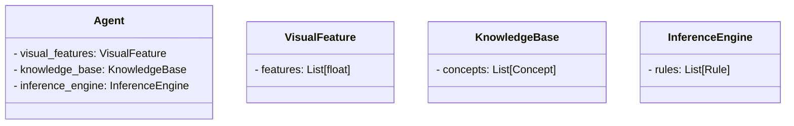
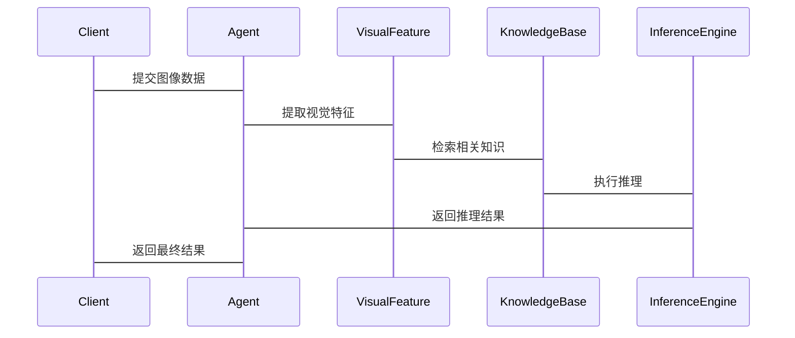

                 


# 开发具有视觉常识推理能力的AI Agent

> 关键词：AI Agent, 视觉常识推理, 计算机视觉, 常识推理, 知识图谱, 推理引擎

> 摘要：本文详细探讨了开发具有视觉常识推理能力的AI Agent的技术背景、核心概念、算法原理、系统架构及项目实现。通过结合视觉感知与常识推理，构建高效的推理引擎，提升AI Agent在复杂场景下的智能水平。

---

# 第一部分: 开发具有视觉常识推理能力的AI Agent背景与基础

## 第1章: 视觉常识推理的背景与问题定义

### 1.1 问题背景

#### 1.1.1 AI Agent的发展历程

AI Agent（智能体）经历了从简单规则驱动到复杂深度学习模型的演变。早期的AI Agent依赖于预定义规则，而现在则基于深度学习技术，具备更强的感知和决策能力。

#### 1.1.2 视觉常识推理的定义与特点

视觉常识推理是指AI Agent能够通过视觉数据（如图像、视频）结合常识知识，理解场景中的物体、关系和逻辑，从而进行推理和决策。其特点包括：

- **多模态融合**：结合视觉信息和常识知识。
- **上下文理解**：理解场景中的物体关系和逻辑。
- **动态推理**：能够根据变化的环境动态调整推理结果。

#### 1.1.3 当前AI Agent的局限性

当前AI Agent在视觉常识推理方面存在以下问题：

- **理解深度不足**：难以理解复杂场景中的隐含关系。
- **知识表示单一**：常用的知识表示方法难以处理多样的常识信息。
- **推理能力有限**：推理引擎的效率和准确性有待提升。

### 1.2 视觉常识推理的核心问题

#### 1.2.1 视觉感知与常识推理的结合

视觉感知负责从图像中提取物体、场景信息，常识推理则利用这些信息结合常识知识进行推理。两者的结合使得AI Agent能够理解并处理复杂的视觉场景。

#### 1.2.2 视觉数据的语义理解

视觉数据的语义理解是视觉常识推理的关键。AI Agent需要将图像中的像素信息转化为语义信息，例如识别图像中的物体类别、位置关系等。

#### 1.2.3 常识推理中的不确定性处理

常识推理涉及大量不确定性，例如物体之间的关系可能因场景不同而变化。如何在这些不确定性中进行准确推理是挑战。

---

## 第2章: 视觉常识推理的核心概念与联系

### 2.1 核心概念原理

#### 2.1.1 视觉感知

视觉感知是AI Agent通过摄像头或图像数据获取环境信息的能力。常见的视觉感知任务包括物体检测、场景分割、图像识别等。

#### 2.1.2 常识推理

常识推理是指基于常识知识库，通过推理引擎对给定的信息进行推理，得到合理的结论。常识知识库通常包含物体、场景、事件之间的关系和属性。

#### 2.1.3 两者结合的机制

视觉感知与常识推理的结合机制包括：

1. **特征提取**：从图像中提取视觉特征。
2. **知识检索**：基于视觉特征检索相关常识知识。
3. **推理推理**：利用常识知识进行推理，得到推理结果。

### 2.2 概念属性特征对比表格

| 概念 | 属性 | 特征 |
|------|------|------|
| 视觉感知 | 输入 | 图像/视频数据 |
|        | 输出 | 对象/场景的描述 |
| 常识推理 | 输入 | 文本/图像描述 |
|        | 输出 | 推理结果 |

### 2.3 ER实体关系图

```mermaid
er
actor(Agent) -|-> has -|-> KnowledgeBase
KnowledgeBase -|-> contains -|-> Concept
Concept -|-> relatedTo -|-> Relation
```

---

## 第3章: 视觉常识推理的算法原理

### 3.1 算法流程



### 3.2 核心算法代码实现

#### 3.2.1 视觉特征提取

```python
def extract_visual_features(image):
    # 使用预训练的CNN模型提取特征
    return cnn_model(image)
```

#### 3.2.2 常识知识库构建

```python
def build_knowledge_base():
    # 构建常识知识库，例如使用知识图谱
    return knowledge_graph
```

#### 3.2.3 推理引擎

```python
def reasoning_engine(features, knowledge_base):
    # 基于特征和知识库进行推理
    return inference_result
```

#### 3.2.4 推理结果解释

$$ P(h|e) = \frac{P(e|h)P(h)}{P(e)} $$

其中，$P(h|e)$ 表示在证据 $e$ 下假设 $h$ 的概率。

---

## 第4章: 系统分析与架构设计方案

### 4.1 系统功能设计

#### 4.1.1 功能模块

- **视觉感知模块**：负责图像的特征提取。
- **常识推理模块**：负责基于特征进行推理。
- **推理引擎模块**：负责推理过程的执行。

#### 4.1.2 领域模型



### 4.2 系统架构设计

#### 4.2.1 架构图


### 4.3 系统接口设计

- **输入接口**：接收图像数据和用户指令。
- **输出接口**：输出推理结果和反馈信息。

#### 4.3.1 系统交互



---

## 第5章: 项目实战

### 5.1 环境安装

```bash
pip install numpy
pip install tensorflow
pip install pydot
```

### 5.2 系统核心实现

#### 5.2.1 代码实现

```python
import numpy as np
import tensorflow as tf

class VisualFeatureExtractor:
    def extract(self, image):
        # 假设使用预训练的CNN模型
        model = tf.keras.Sequential([
            tf.keras.layers.Conv2D(32, (3,3), activation='relu'),
            tf.keras.layers.MaxPooling2D((2,2)),
            tf.keras.layers.Flatten(),
            tf.keras.layers.Dense(128, activation='relu'),
            tf.keras.layers.Dense(10, activation='softmax')
        ])
        return model.predict(image)

class KnowledgeBase:
    def __init__(self):
        self.concepts = []

    def add_concept(self, concept):
        self.concepts.append(concept)

class InferenceEngine:
    def infer(self, features, knowledge_base):
        # 假设知识库中的概念与特征相关
        result = []
        for concept in knowledge_base.concepts:
            if concept.match(features):
                result.append(concept)
        return result

class Agent:
    def __init__(self):
        self.visual_extractor = VisualFeatureExtractor()
        self.knowledge_base = KnowledgeBase()
        self.inference_engine = InferenceEngine()

    def process_image(self, image):
        features = self.visual_extractor.extract(image)
        concepts = self.inference_engine.infer(features, self.knowledge_base)
        return concepts
```

#### 5.2.2 代码解读与分析

- **VisualFeatureExtractor**：负责提取图像的视觉特征。
- **KnowledgeBase**：存储和管理常识知识。
- **InferenceEngine**：根据特征和知识库进行推理。
- **Agent**：整合各模块，处理图像并返回推理结果。

### 5.3 案例分析

假设我们有一个图像，其中包含一只猫和一只狗。Agent通过视觉感知模块提取特征，然后通过常识推理模块判断它们是宠物，并推断它们可能在公园里玩耍。

### 5.4 项目总结

通过该项目，我们展示了如何将视觉感知与常识推理结合，构建一个简单的AI Agent。实际应用中，还需要考虑更多复杂的场景和优化推理算法。

---

## 第6章: 总结与展望

### 6.1 核心要点回顾

- AI Agent需要结合视觉感知与常识推理，提升智能水平。
- 视觉特征提取、知识表示和推理引擎是关键模块。

### 6.2 未来展望

- **多模态融合**：结合听觉、嗅觉等多模态信息，提升推理能力。
- **实时推理**：优化算法，提升推理速度和准确性。
- **动态知识库**：构建动态更新的知识库，适应不断变化的环境。

### 6.3 注意事项

- 确保知识库的准确性和全面性。
- 处理推理中的不确定性，提升结果的可信度。

---

作者：AI天才研究院/AI Genius Institute & 禅与计算机程序设计艺术 /Zen And The Art of Computer Programming

