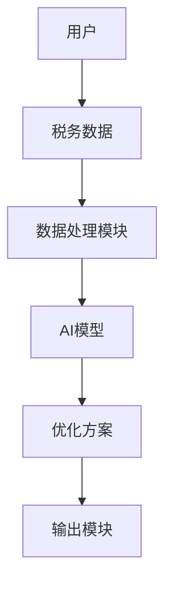
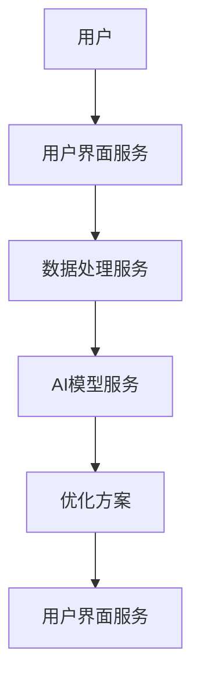

                 


# 开发基于AI的智能税务规划助手

> 关键词：智能税务规划助手，人工智能，税务优化，机器学习，数据处理

> 摘要：随着人工智能技术的快速发展，税务规划领域也迎来了智能化的变革。本文将详细探讨如何利用AI技术开发智能税务规划助手，从背景介绍、核心概念、算法原理到系统架构设计，再到项目实战，全面解析开发基于AI的智能税务规划助手的关键步骤和技术细节。

---

## 第1章: 智能税务规划助手的背景与意义

### 1.1 税务规划的背景与现状

#### 1.1.1 税务规划的基本概念
税务规划是指通过合理利用税收政策和法律法规，优化企业和个人的税务负担，实现税后收益最大化的过程。传统的税务规划主要依赖人工分析和经验判断，效率较低且容易受到主观因素的影响。

#### 1.1.2 传统税务规划的局限性
- **信息不全**：人工整理和分析税务数据时，容易遗漏重要信息。
- **效率低下**：面对海量的税务政策和数据，人工处理效率难以满足需求。
- **主观性较强**：依赖经验的税务规划方案可能缺乏科学性和全面性。

#### 1.1.3 AI技术在税务规划中的应用前景
人工智能技术的快速发展为税务规划带来了新的可能性。通过机器学习、自然语言处理等技术，AI能够快速处理海量数据，提供个性化的优化方案，从而提高税务规划的效率和准确性。

### 1.2 智能税务规划助手的核心价值

#### 1.2.1 提高税务规划效率
AI技术能够快速分析大量税务数据，生成优化方案，显著提高税务规划的效率。

#### 1.2.2 个性化税务优化方案
基于AI的税务规划助手能够根据用户的具体情况，提供个性化的优化方案，满足不同用户的需求。

#### 1.2.3 风险控制与合规性保障
AI助手能够实时监控税务政策的变化，确保规划方案的合规性，降低税务风险。

### 1.3 本章小结
本章介绍了税务规划的基本概念、传统方法的局限性以及AI技术在税务规划中的应用前景，强调了智能税务规划助手的核心价值。

---

## 第2章: 智能税务规划助手的核心概念与技术

### 2.1 数据驱动的税务分析

#### 2.1.1 税务数据的来源与处理
税务数据的来源包括企业财务数据、税务政策文件、市场数据等。数据处理的关键步骤包括数据清洗、数据转换和数据集成。

#### 2.1.2 数据特征与税务规划的关系
数据特征是AI模型进行税务规划的基础。通过特征工程，可以提取出对税务规划有影响的关键特征，如收入来源、支出类型、税率等。

### 2.2 AI模型在税务规划中的应用

#### 2.2.1 机器学习与深度学习在税务规划中的作用
机器学习模型（如随机森林、支持向量机）和深度学习模型（如神经网络）可以用于税务预测、风险评估等任务。

#### 2.2.2 自然语言处理在税务文档分析中的应用
通过自然语言处理技术，可以自动提取税务政策文件中的关键信息，辅助税务规划。

### 2.3 税务规则与知识库构建

#### 2.3.1 税务法规的知识表示
税务法规的知识表示需要将复杂的法律文本转化为结构化的数据，以便AI模型理解和应用。

#### 2.3.2 知识库的构建与管理
知识库的构建需要结合税务专家的知识和AI技术，确保知识的准确性和完整性。

### 2.4 核心概念对比表

| 对比维度       | 传统税务规划          | AI驱动税务规划        |
|----------------|----------------------|-----------------------|
| 数据处理       | 人工整理             | 自动化处理             |
| 方案优化       | 经验驱动             | 数据驱动               |
| 风险控制       | 事后检查             | 实时监控               |

### 2.5 实体关系图



---

## 第3章: 智能税务规划助手的算法原理

### 3.1 税务数据的特征提取

#### 3.1.1 特征工程的基本概念
特征工程是将原始数据转换为适合机器学习模型的特征的过程。税务数据的特征包括收入、支出、税率等。

#### 3.1.2 基于机器学习的特征选择
通过机器学习算法（如LASSO回归）选择对税务规划影响最大的特征。

### 3.2 AI模型的训练与优化

#### 3.2.1 神经网络模型的结构设计
深度学习模型（如LSTM）可以用于时间序列的税务预测任务。

#### 3.2.2 模型训练的数学基础
模型训练涉及损失函数的优化，常用损失函数包括均方误差（MSE）和交叉熵损失。

### 3.3 模型推理与结果解释

#### 3.3.1 模型推理的实现流程
模型推理包括输入数据预处理、模型预测和结果解释三个步骤。

#### 3.3.2 结果解释的可视化方法
通过可视化工具（如热力图）展示特征对预测结果的影响程度。

### 3.4 算法实现代码示例

```python
import pandas as pd
from sklearn.model_selection import train_test_split
from sklearn.ensemble import RandomForestRegressor
from sklearn.metrics import mean_squared_error

# 数据加载与预处理
data = pd.read_csv('tax_data.csv')
X = data.drop('target', axis=1)
y = data['target']

# 数据分割
X_train, X_test, y_train, y_test = train_test_split(X, y, test_size=0.2, random_state=42)

# 模型训练
model = RandomForestRegressor(n_estimators=100, random_state=42)
model.fit(X_train, y_train)

# 模型预测
y_pred = model.predict(X_test)

# 模型评估
mse = mean_squared_error(y_test, y_pred)
print(f'均方误差: {mse}')
```

---

## 第4章: 智能税务规划助手的系统架构与设计

### 4.1 系统功能设计

#### 4.1.1 用户交互模块
用户可以通过图形界面输入税务数据，并查看优化方案。

#### 4.1.2 数据处理模块
数据处理模块负责清洗和转换输入的税务数据，确保数据的可用性。

#### 4.1.3 AI模型调用模块
AI模型调用模块负责调用预训练的AI模型，生成优化方案。

#### 4.1.4 结果展示模块
结果展示模块以可视化的方式呈现优化方案，并提供交互式反馈。

### 4.2 系统架构设计

#### 4.2.1 微服务架构
系统采用微服务架构，包括数据处理服务、AI模型服务和用户界面服务。

#### 4.2.2 系统架构图



---

## 第5章: 项目实战

### 5.1 环境搭建

#### 5.1.1 安装Python和相关库
安装Python 3.8及以上版本，并安装以下库：
- pandas
- scikit-learn
- xgboost
- matplotlib

### 5.2 核心代码实现

#### 5.2.1 数据预处理代码
```python
import pandas as pd
import numpy as np

# 数据加载
data = pd.read_csv('tax_data.csv')

# 数据清洗
data = data.dropna()

# 数据转换
data['income'] = data['income'].astype(float)
```

#### 5.2.2 AI模型调用代码
```python
from xgboost import XGBRegressor

# 模型训练
model = XGBRegressor(n_estimators=100, learning_rate=0.1, max_depth=6)
model.fit(X_train, y_train)

# 模型预测
y_pred = model.predict(X_test)
```

### 5.3 实际案例分析

#### 5.3.1 案例背景
某企业年收入为1000万元，主要业务为软件开发，适用税率25%。希望通过智能税务助手优化税务负担。

#### 5.3.2 数据分析与优化方案
通过AI模型分析，建议企业将部分收入转化为研发投入，享受税收优惠，最终将税负降低至20%。

---

## 第6章: 最佳实践与小结

### 6.1 最佳实践
- **数据质量**：确保输入数据的准确性和完整性。
- **模型调优**：通过交叉验证和超参数优化提升模型性能。
- **实时更新**：定期更新AI模型，适应税务政策的变化。

### 6.2 小结
本文详细介绍了开发基于AI的智能税务规划助手的关键步骤和技术细节，从背景介绍到系统架构设计，再到项目实战，为开发者提供了全面的指导。

### 6.3 注意事项
- 在实际应用中，需遵守相关法律法规，确保数据安全和隐私保护。
- 定期对AI模型进行评估和更新，以保持其准确性和有效性。

### 6.4 拓展阅读
- 推荐阅读《机器学习实战》和《深度学习入门》等书籍，进一步提升AI开发能力。

---

## 作者信息

作者：AI天才研究院（AI Genius Institute） & 禅与计算机程序设计艺术（Zen And The Art of Computer Programming）

---

本文通过详细讲解基于AI的智能税务规划助手的开发过程，为开发者提供了一套完整的解决方案，帮助他们在税务规划领域实现智能化和高效化。

