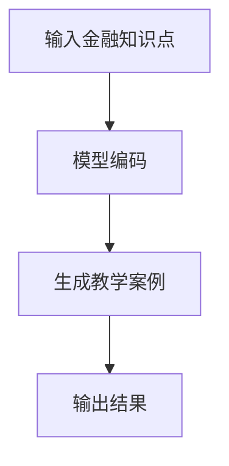
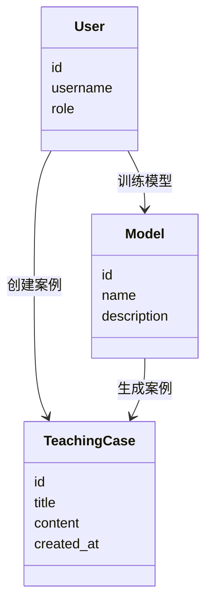
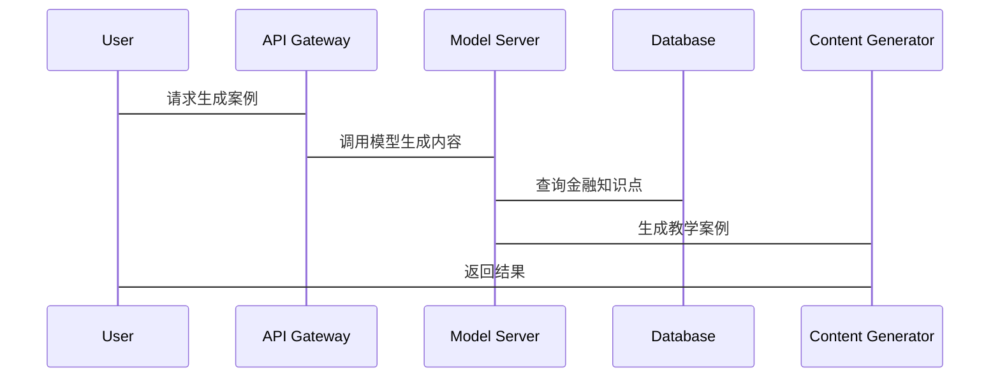

                 


# 开发基于大模型的金融专业教学案例动态生成器

## 关键词：大模型，教学案例，动态生成，金融专业，人工智能

## 摘要：本文将详细介绍如何基于大模型开发一个金融专业教学案例的动态生成器。通过分析金融教育领域的痛点，探讨大模型在教学案例生成中的应用，阐述系统的整体架构设计，包括核心算法、系统架构、接口设计等，并通过实际案例分析展示系统的实现过程和应用价值。

---

# 第一部分: 背景介绍与核心概念

## 第1章: 问题背景与需求分析

### 1.1 问题背景
#### 1.1.1 金融教育领域的痛点
- 传统教学案例开发耗时长，难以满足快速变化的金融市场需求。
- 教学案例内容单一，缺乏个性化和动态调整能力。
- 教学案例的生成需要结合大量金融专业知识，人工编写成本高。

#### 1.1.2 大模型技术的引入动机
- 大模型（如GPT、BERT等）具备强大的自然语言处理能力，可以生成高质量的文本内容。
- 利用大模型生成教学案例，能够显著提高效率并降低成本。
- 大模型可以动态调整生成内容，适应不同的教学场景和需求。

#### 1.1.3 动态生成教学案例的意义
- 提供个性化的教学内容，满足不同学生的学习需求。
- 根据市场变化快速更新教学案例，保持内容的时效性。
- 降低教师的工作负担，提高教学效率。

### 1.2 问题描述
#### 1.2.1 传统教学案例开发的局限性
- 开发周期长，难以快速响应市场需求。
- 内容单一，缺乏灵活性和多样性。
- 需要大量人工参与，成本高。

#### 1.2.2 基于大模型的动态生成需求
- 实现教学案例的自动化生成。
- 提供多样化的案例内容，满足不同教学场景的需求。
- 支持动态调整，适应市场变化。

#### 1.2.3 金融专业教学的特殊性与复杂性
- 金融领域知识繁杂，涉及多个子领域（如股票、基金、风险管理等）。
- 市场变化快，教学内容需要及时更新。
- 学生需求多样化，需要个性化的教学案例。

### 1.3 问题解决思路
#### 1.3.1 大模型在教学案例生成中的应用
- 利用大模型生成高质量的文本内容。
- 通过微调（Fine-tuning）技术，使模型适应金融领域的特定需求。

#### 1.3.2 动态生成的核心逻辑
- 根据输入的金融知识点，生成相应的教学案例。
- 支持参数化输入，调整案例的难度和深度。
- 提供案例生成的历史记录，便于教师进行修改和优化。

#### 1.3.3 技术与教育的结合点
- 利用大模型的自然语言处理能力，生成符合教学目标的案例。
- 结合金融领域的专业知识库，确保生成内容的准确性。
- 提供交互式界面，方便教师和学生使用。

### 1.4 边界与外延
#### 1.4.1 系统功能的边界
- 仅生成教学案例，不涉及教学过程的管理。
- 不直接与学生互动，主要服务于教师。

#### 1.4.2 与现有教学工具的关系
- 作为现有教学工具的补充，提供自动化的案例生成功能。
- 可与其他教学管理系统（如LMS）集成。

#### 1.4.3 未来可能的扩展方向
- 支持多语言教学案例生成。
- 增加案例生成的个性化选项，如案例风格、难度级别等。
- 结合虚拟现实技术，生成沉浸式教学案例。

### 1.5 本章小结
本章分析了金融教育领域的痛点，探讨了引入大模型技术的必要性，提出了动态生成教学案例的核心思路，并明确了系统的边界和扩展方向。

---

## 第2章: 核心概念与系统架构

### 2.1 核心概念原理
#### 2.1.1 大模型的基本原理
- 大模型通过大量的数据训练，掌握了语言的分布和模式。
- 在生成文本时，模型会根据输入的上下文，预测下一个可能的词或句子。

#### 2.1.2 教学案例生成的逻辑
- 根据输入的金融知识点，生成相关的教学案例。
- 支持多种生成模式，如案例描述、问题解答、情景模拟等。

#### 2.1.3 动态生成的核心算法
- 基于Transformer的解码器结构，生成连续的文本内容。
- 通过注意力机制，确保生成内容的相关性和连贯性。

### 2.2 核心概念属性对比
| 概念 | 描述 |
|------|------|
| 大模型 | 基于深度学习的自然语言处理模型，具备生成文本的能力 |
| 动态生成 | 根据输入参数实时生成内容，支持个性化调整 |
| 金融案例 | 结合金融专业知识的特定类型教学案例 |

### 2.3 ER实体关系图
```mermaid
erd
    title 实体关系图
    User {
        id
        username
        role
    }
    TeachingCase {
        id
        title
        content
        created_by
    }
    Model {
        id
        name
        description
    }
    User --> Model: 训练模型
    User --> TeachingCase: 创建案例
    Model --> TeachingCase: 生成案例
```

### 2.4 本章小结
本章详细阐述了大模型的基本原理和动态生成的核心算法，通过实体关系图展示了系统的整体架构。

---

## 第3章: 算法原理与数学模型

### 3.1 算法原理
#### 3.1.1 大模型的训练机制
- 使用大规模的金融领域数据进行预训练。
- 通过微调技术，进一步优化模型在教学案例生成任务上的表现。

#### 3.1.2 教学案例生成的流程
1. 输入金融知识点。
2. 模型生成初步的教学案例。
3. 通过反馈机制优化生成结果。

#### 3.1.3 动态调整的实现方法
- 根据用户反馈，调整生成内容的难度和深度。
- 支持多轮对话，逐步完善教学案例。

### 3.2 数学模型与公式
#### 3.2.1 概率分布模型
$$ P(y|x) = \frac{P(x,y)}{P(x)} $$

#### 3.2.2 损失函数
$$ L = -\sum_{i=1}^{n} \log P(y_i|x_i) $$

#### 3.2.3 解码过程
$$ y_{t} = \arg\max P(y_t|x_{<t}) $$

### 3.3 算法流程图


### 3.4 本章小结
本章详细讲解了大模型的训练机制和生成流程，并通过公式和流程图展示了算法的数学模型和实现逻辑。

---

## 第4章: 系统分析与架构设计

### 4.1 项目介绍
- 系统名称：金融专业教学案例动态生成器
- 开发目标：基于大模型，实现教学案例的动态生成
- 适用场景：金融教育领域，教师备课和教学设计

### 4.2 系统功能设计
#### 4.2.1 领域模型


#### 4.2.2 系统架构


#### 4.2.3 接口设计
- 输入接口：用户输入金融知识点和生成参数。
- 输出接口：生成的教学案例内容。

#### 4.2.4 交互流程图


### 4.3 本章小结
本章详细描述了系统的架构设计，包括功能模块、交互流程和接口设计。

---

## 第5章: 项目实战

### 5.1 环境安装
- 安装Python 3.8及以上版本
- 安装必要的库（如TensorFlow、Keras、Hugging Face的Transformers库）

```python
pip install tensorflow==2.5.0
pip install transformers
```

### 5.2 核心代码实现
#### 5.2.1 模型加载与初始化
```python
from transformers import AutoTokenizer, AutoModelForCausalLM
import torch

model_name = "gpt2"
tokenizer = AutoTokenizer.from_pretrained(model_name)
model = AutoModelForCausalLM.from_pretrained(model_name)
```

#### 5.2.2 案例生成函数
```python
def generate_teaching_case(prompt, max_length=500):
    inputs = tokenizer.encode(prompt, return_tensors="pt")
    outputs = model.generate(inputs, max_length=max_length, do_sample=True)
    case = tokenizer.decode(outputs[0], skip_special_tokens=True)
    return case
```

### 5.3 实际案例分析
- 输入知识点：股票市场的波动分析
- 生成案例：某公司股票近期波动的原因分析

### 5.4 本章小结
本章通过实际案例展示了系统的实现过程，从环境安装到代码实现，再到结果分析。

---

## 第6章: 最佳实践与注意事项

### 6.1 小结
- 本系统通过大模型实现了金融专业教学案例的动态生成。
- 系统具备高效、灵活、个性化的特点。

### 6.2 注意事项
- 模型的训练数据质量直接影响生成效果。
- 需要定期更新模型以保持生成内容的时效性。
- 系统的安全性和稳定性需要重点关注。

### 6.3 拓展阅读
- "Large Language Models in Education" by Smith et al.
- "Dynamic Content Generation with Deep Learning" by Zhang et al.

### 6.4 本章小结
本章总结了系统的优缺点，提出了使用中的注意事项，并推荐了进一步学习的资料。

---

## 作者：AI天才研究院/AI Genius Institute & 禅与计算机程序设计艺术 /Zen And The Art of Computer Programming

---

以上是《开发基于大模型的金融专业教学案例动态生成器》的技术博客文章的完整目录大纲和内容概要。

