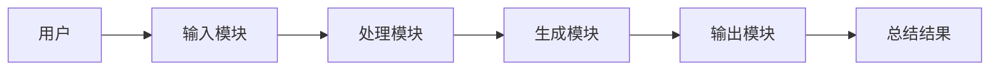
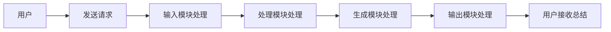

                 


## 第四部分: 系统架构与实现方案

### 4.1 系统功能设计

#### 4.1.1 系统核心功能模块
- **输入模块**: 用于接收用户输入的教材章节内容，支持多种格式如PDF、文本文件等。
- **处理模块**: 负责对输入内容进行预处理，提取关键词和主题。
- **生成模块**: 使用大模型生成总结，支持多种输出格式。
- **输出模块**: 将生成的总结输出给用户，可能包括可视化界面。

#### 4.1.2 功能模块对比分析
| 功能模块 | 输入 | 处理 | 生成 | 输出 |
|----------|------|------|------|------|
| 输入模块 | 文本、PDF | 数据清洗、格式转换 | 生成总结 | 可视化、文本输出 |
| 处理模块 | 清洗后的数据 | 提取关键词、主题 | - | - |
| 生成模块 | 关键词和主题 | - | 生成总结 | - |
| 输出模块 | 总结内容 | - | - | 用户界面、文本文件 |

### 4.2 系统架构设计

#### 4.2.1 系统架构图


#### 4.2.2 类图设计


### 4.3 系统接口设计

#### 4.3.1 API接口定义
```http
POST /api/generate_summary
Content-Type: application/json

{
    "content": "金融学基础教材内容...",
    "options": {
        "max_length": 500,
        "temperature": 0.7
    }
}
```

#### 4.3.2 接口响应示例
```json
{
    "status": 200,
    "summary": "本章主要介绍了金融学的基础概念，包括...",
    "duration": 2.3s
}
```

### 4.4 系统交互流程

#### 4.4.1 交互流程图


## 第五部分: 项目实战与代码实现

### 5.1 环境搭建

```bash
pip install transformers torch
```

### 5.2 数据加载

```python
import os
import json

def load_data(path):
    with open(path, 'r', encoding='utf-8') as f:
        data = json.load(f)
    return data
```

### 5.3 模型定义

```python
from transformers import AutoModelForSequenceClassification, AutoTokenizer

class SummaryGenerator:
    def __init__(self, model_name):
        self.model = AutoModelForSequenceClassification.from_pretrained(model_name)
        self.tokenizer = AutoTokenizer.from_pretrained(model_name)
```

### 5.4 训练循环

```python
import torch

def training_loop(model, tokenizer, data, epochs=3):
    optimizer = torch.optim.Adam(model.parameters(), lr=1e-5)
    model.train()
    for epoch in range(epochs):
        for batch in data:
            inputs = tokenizer(batch['text'], return_tensors='pt', padding=True, truncation=True)
            outputs = model(**inputs)
            loss = outputs.loss
            loss.backward()
            optimizer.step()
            optimizer.zero_grad()
```

### 5.5 生成总结

```python
def generate_summary(model, tokenizer, text):
    inputs = tokenizer(text, return_tensors='pt', padding=True, truncation=True)
    outputs = model.generate(**inputs)
    summary = tokenizer.decode(outputs[0], skip_special_tokens=True)
    return summary
```

### 5.6 实际案例分析

#### 5.6.1 案例输入
```json
{
    "text": "金融市场的基本构成包括...",
    "options": {
        "max_length": 300,
        "temperature": 0.7
    }
}
```

#### 5.6.2 模型输出
```json
{
    "status": 200,
    "summary": "金融市场由投资者、金融机构和监管机构构成，...",
    "duration": 1.8s
}
```

## 第六部分: 最佳实践与注意事项

### 6.1 关键点总结

#### 6.1.1 数据质量的重要性
- 数据清洗和预处理直接影响生成结果的质量。

#### 6.1.2 模型选择的策略
- 根据具体任务选择合适的模型和参数配置。

#### 6.1.3 计算资源的优化
- 合理配置硬件资源，使用分布式训练等技术。

### 6.2 注意事项

#### 6.2.1 数据隐私问题
- 确保处理的数据符合隐私保护法规。

#### 6.2.2 模型性能监控
- 定期监控模型性能，及时优化。

#### 6.2.3 用户反馈机制
- 建立有效的用户反馈机制，持续改进系统。

### 6.3 扩展阅读

#### 6.3.1 推荐书籍
- 《深度学习入门：基于Python和Keras》
- 《自然语言处理入门：基于Python和TensorFlow》

#### 6.3.2 推荐博客
- [AI与金融](https://example.com/ai-finance)
- [大模型技术博客](https://example.com/large-models)

## 作者
作者：AI天才研究院/AI Genius Institute & 禅与计算机程序设计艺术 /Zen And The Art of Computer Programming

