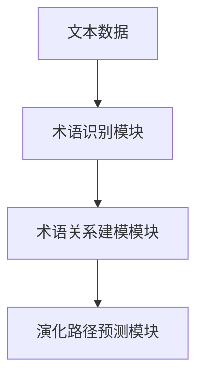
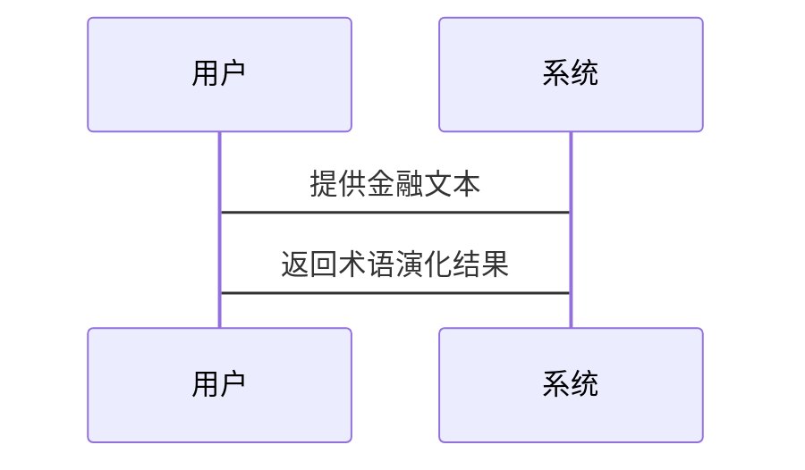

                 


# 开发基于大模型的金融专业术语演化跟踪器

> 关键词：大模型，金融术语，术语演化，自然语言处理，深度学习

> 摘要：本文详细介绍了开发基于大模型的金融专业术语演化跟踪器的背景、核心概念、算法原理、系统设计和项目实现。通过结合大模型的自然语言处理能力，我们提出了一种动态捕捉金融术语演化的解决方案，并通过具体案例展示了该系统的实际应用价值。

---

## 第一部分: 背景介绍

### 第1章: 问题背景与应用价值

#### 1.1 问题背景
金融领域的术语演化速度极快，受市场变化、政策调整和学术研究的影响，新的术语不断涌现，旧的术语逐渐被淘汰或改变其含义。传统的术语管理方法通常依赖于静态的词典或规则，难以捕捉动态变化的术语演化规律。这种动态变化对金融研究、投资决策和学术分析提出了更高的要求，传统的术语管理方法已无法满足需求。

#### 1.2 问题描述
术语演化跟踪的核心问题是如何动态识别、提取和建模金融术语的演化路径。具体挑战包括：
1. **术语识别与抽取**：如何准确识别文本中的金融术语。
2. **术语关系建模**：如何描述术语之间的关联和演化关系。
3. **术语演化路径预测**：如何基于历史数据预测术语的未来演化趋势。

#### 1.3 核心概念与组成
术语演化跟踪器的核心组成包括：
1. **术语识别模块**：用于从文本中提取金融术语。
2. **术语关系建模模块**：用于分析术语之间的关系。
3. **演化路径预测模块**：基于历史数据预测术语的演化趋势。

### 第2章: 大模型在金融术语演化中的核心作用

#### 2.1 大模型的基本原理
大模型（如Transformer）通过自注意力机制能够捕捉文本中的长距离依赖关系，适合处理金融术语的复杂关系和动态演化。

#### 2.2 术语演化跟踪的核心原理
1. **术语识别**：使用大模型对文本进行分词和实体识别。
2. **术语关系建模**：通过关系抽取技术，构建术语之间的关系图谱。
3. **演化路径预测**：基于历史数据，预测术语的未来演化趋势。

#### 2.3 大模型与术语演化跟踪的结合
1. **术语识别与抽取**：利用大模型的上下文理解能力，准确提取术语。
2. **术语关系建模**：通过关系抽取和图嵌入技术，构建术语关系网络。
3. **术语演化路径分析**：基于大模型的序列建模能力，预测术语的演化路径。

---

## 第二部分: 算法原理

### 第3章: 大模型驱动的术语演化跟踪算法原理

#### 3.1 大模型的训练与优化
1. **模型结构**：使用Transformer架构，包括编码器和解码器。
2. **损失函数**：交叉熵损失函数。
3. **优化策略**：Adam优化器，学习率衰减。

#### 3.2 术语演化跟踪的算法流程
1. **术语识别与抽取**：通过分词和实体识别提取术语。
2. **术语关系建模**：使用关系抽取技术构建术语关系图。
3. **术语演化路径预测**：基于历史数据，预测术语的未来演化趋势。

#### 3.3 算法的数学模型与公式
1. **大模型的数学表达式**
$$P(\theta) = \frac{1}{Z} \exp(-E(\theta))$$

2. **术语演化路径的预测公式**
$$P(y|x) = \sum_{z} P(y|x,z)P(z|x)$$

---

## 第三部分: 系统分析与架构设计

### 第4章: 系统分析与架构设计方案

#### 4.1 问题场景介绍
金融术语演化跟踪系统需要处理海量金融文本数据，实时捕捉术语的动态变化。

#### 4.2 系统功能设计
1. **术语识别模块**：实现术语的自动识别和提取。
2. **术语关系建模模块**：构建术语关系图谱。
3. **演化路径预测模块**：预测术语的未来演化趋势。

#### 4.3 系统架构设计
使用Mermaid绘制系统架构图：



#### 4.4 系统接口设计
1. **输入接口**：接收金融文本数据。
2. **输出接口**：输出术语演化结果。

#### 4.5 系统交互流程
使用Mermaid绘制交互流程图：



---

## 第四部分: 项目实战

### 第5章: 项目实战

#### 5.1 环境安装
安装必要的Python库：
```bash
pip install numpy pandas torch transformers
```

#### 5.2 系统核心实现源代码
1. **数据预处理代码**
```python
import pandas as pd

def preprocess_data(data):
    # 分词处理
    tokens = data.split()
    return tokens
```

2. **模型训练代码**
```python
import torch
import torch.nn as nn

class TransformerModel(nn.Module):
    def __init__(self):
        super(TransformerModel, self).__init__()
        self.encoder = nn.TransformerEncoder(...)
        self.decoder = nn.TransformerDecoder(...)

    def forward(self, x):
        return self.decoder(self.encoder(x))
```

3. **术语演化路径预测代码**
```python
def predict_evolution(model, input_sequence):
    with torch.no_grad():
        output = model(input_sequence)
        return output.argmax(dim=1).item()
```

#### 5.3 案例分析
通过具体案例分析，展示系统如何动态捕捉术语演化趋势。

---

## 第五部分: 总结与展望

### 第6章: 总结与展望

#### 6.1 项目总结
本文详细介绍了开发基于大模型的金融术语演化跟踪器的背景、核心概念、算法原理、系统设计和项目实现。

#### 6.2 展望
未来的工作方向包括优化模型性能、扩展应用场景和提高系统的实时性。

---

## 作者

作者：AI天才研究院/AI Genius Institute & 禅与计算机程序设计艺术 /Zen And The Art of Computer Programming

