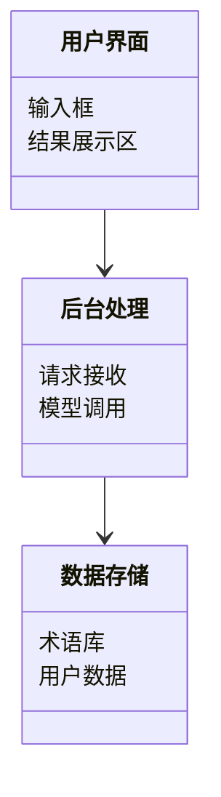
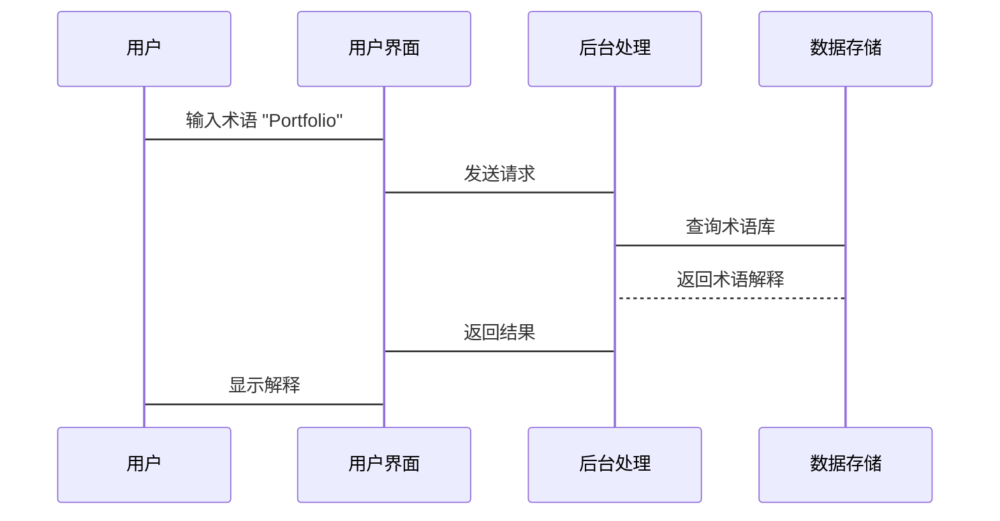

                 


# 开发基于大模型的金融专业术语解释系统

> **关键词**：大模型、金融术语、自然语言处理、系统设计、项目实战  
> **摘要**：本文详细探讨了开发基于大模型的金融专业术语解释系统的全过程。从背景与基础、模型训练与优化、系统设计与实现，到项目实战、系统集成与部署，文章系统地介绍了如何利用大模型技术解决金融领域术语解释问题。文章不仅提供了理论支持，还通过具体案例展示了系统的实现过程，并分析了系统的性能与优化方向。

---

## 第一部分：背景与基础

### 第1章：大模型与金融术语解释系统概述

#### 1.1 大模型的概述
##### 1.1.1 大模型的基本概念
大模型（Large Language Model, LLM）是一种基于深度学习的自然语言处理模型，通常采用Transformer架构，通过大量数据训练而成。其核心优势在于能够理解上下文、生成连贯文本，并在多种任务上表现出强大的能力。

##### 1.1.2 大模型在金融领域的应用
金融领域对术语解释的需求尤为强烈。金融术语具有复杂性、多义性和专业性，传统方法难以满足实时解释和精准理解的需求。大模型的引入为金融术语的自动解释提供了新的可能性。

##### 1.1.3 金融术语解释系统的定义与目标
金融术语解释系统旨在通过自然语言处理技术，为用户提供金融术语的定义、用法和相关背景信息。其目标是提高用户对金融术语的理解能力，降低金融信息的复杂性。

#### 1.2 金融术语的特点与挑战
##### 1.2.1 金融术语的复杂性
金融术语往往具有多义性，其含义可能因上下文而异。例如，“Portfolio”在不同场景下可能指投资组合、资产集合或一揽子产品。

##### 1.2.2 多义词与上下文依赖
金融术语的多义性使得其解释高度依赖上下文。例如，“Swap”可以指金融衍生品中的互换协议，也可以指交换操作。

##### 1.2.3 术语更新与维护的挑战
金融术语随着市场发展不断变化，新的术语和定义层出不穷。如何保持系统更新是一个持续的挑战。

#### 1.3 本章小结
本章介绍了大模型的基本概念及其在金融领域的应用，并分析了金融术语的特点与挑战。这些内容为后续章节的系统设计奠定了基础。

---

### 第2章：自然语言处理基础

#### 2.1 NLP的基本概念
##### 2.1.1 词法分析
词法分析是将文本分割为词、短语等基本单位，并赋予其意义的过程。例如，将“Portfolio”识别为一个独立的金融术语。

##### 2.1.2 句法分析
句法分析研究文本的语法结构，帮助模型理解句子的组成关系。例如，识别“the portfolio is diversified”中的主谓关系。

##### 2.1.3 语义分析
语义分析旨在理解文本的深层含义。例如，解释“portfolio”在特定上下文中的具体含义。

#### 2.2 大模型在NLP中的应用
##### 2.2.1 语言模型的训练
大模型通过监督学习和无监督学习相结合的方式，从大量文本数据中学习语言规律。

##### 2.2.2 文本生成与理解
大模型能够生成连贯的文本，并理解复杂语义。例如，回答用户对金融术语的疑问。

##### 2.2.3 金融领域的NLP挑战
金融领域的术语和数据具有高度的专业性和复杂性，需要模型具备特定的金融知识库支持。

#### 2.3 本章小结
本章介绍了NLP的基本概念及其在大模型中的应用，重点分析了金融领域的NLP挑战。这些内容为后续的模型训练与优化提供了理论基础。

---

## 第二部分：模型训练与优化

### 第3章：大模型训练策略

#### 3.1 数据预处理
##### 3.1.1 数据清洗
去除噪音数据，确保训练数据的质量。例如，清洗包含特殊符号或无关文本的数据。

##### 3.1.2 数据标注
对金融术语进行标注，帮助模型理解术语的定义和用法。例如，标注“Portfolio”的具体含义。

##### 3.1.3 数据增强
通过数据增强技术，扩展训练数据的多样性。例如，通过同义词替换生成新的训练样本。

#### 3.2 模型训练
##### 3.2.1 网络结构设计
采用Transformer架构，设计适合金融术语解释的模型结构。

##### 3.2.2 损失函数与优化器
使用交叉熵损失函数和Adam优化器，优化模型的训练过程。

##### 3.2.3 训练策略
采用分阶段训练策略，先进行通用语言模型训练，再进行金融领域微调。

#### 3.3 模型优化
##### 3.3.1 参数调整
通过超参数调优，优化模型的性能。例如，调整学习率和批量大小。

##### 3.3.2 模型压缩
通过模型剪枝和量化技术，减少模型的计算量和存储需求。

##### 3.3.3 模型评估
使用准确率、召回率和F1分数等指标，评估模型的性能。

#### 3.4 本章小结
本章详细探讨了大模型的训练策略，从数据预处理到模型优化，为金融术语解释系统提供了技术支持。

### 第4章：金融术语的特殊处理

#### 4.1 多义词处理
##### 4.1.1 上下文感知
通过上下文理解多义词的含义。例如，解释“Swap”在金融衍生品中的具体含义。

##### 4.1.2 术语库构建
构建金融术语库，存储术语的定义、用法和相关背景信息。

##### 4.1.3 术语消歧
通过上下文分析，消除术语的歧义性。例如，区分“Swap”在不同场景下的含义。

#### 4.2 实体识别与链接
##### 4.2.1 实体识别
识别文本中的金融实体，例如“Portfolio”、“Swap”等。

##### 4.2.2 实体链接
将识别出的实体链接到术语库中的具体定义。例如，将“Portfolio”链接到“投资组合”的定义。

##### 4.2.3 实体网络构建
构建金融实体网络，展示术语之间的关系。例如，展示“Swap”与“Derivative”的关联。

#### 4.3 本章小结
本章重点讨论了金融术语的特殊处理方法，包括多义词处理和实体识别与链接。这些技术为金融术语解释系统提供了关键支持。

---

## 第三部分：系统设计与实现

### 第5章：系统架构设计

#### 5.1 系统功能模块
##### 5.1.1 用户界面
提供友好的用户界面，支持用户输入术语并查看解释。例如，设计一个简洁的文本框和结果展示区域。

##### 5.1.2 后台处理
负责接收用户请求，调用模型进行术语解释，并返回结果。例如，采用微服务架构，分离前端和后端。

##### 5.1.3 数据存储
存储术语库、模型参数和用户查询记录。例如，使用数据库管理术语信息和用户数据。

#### 5.2 系统功能设计（领域模型）



#### 5.3 系统架构设计（架构图）

```mermaid
client
    front-end
        input-box
        result-display
    back-end
        request-receiver
        model-invoker
    database
        term-database
        user-database
```

#### 5.4 系统接口设计
##### 5.4.1 API设计
定义RESTful API接口，例如：
- POST /api/explain?term=Portfolio
- GET /api/terms?query=financial

##### 5.4.2 接口文档
提供详细的接口文档，说明输入参数、输出格式和错误处理方式。

#### 5.5 系统交互设计（序列图）



#### 5.6 本章小结
本章通过领域模型和架构图，详细设计了金融术语解释系统的功能模块和交互流程。系统架构的设计为后续的实现奠定了基础。

### 第6章：系统实现与优化

#### 6.1 环境配置
##### 6.1.1 安装Python
安装Python 3.8或更高版本，确保兼容性。

##### 6.1.2 安装依赖库
安装必要的Python库，例如：
- `transformers`
- `torch`
- `scikit-learn`

#### 6.2 系统核心实现
##### 6.2.1 术语库构建
使用Python代码构建术语库，例如：

```python
class TermDatabase:
    def __init__(self):
        self.terms = {}

    def add_term(self, term, definition):
        self.terms[term] = definition

    def get_definition(self, term):
        return self.terms.get(term, "Term not found.")
```

##### 6.2.2 模型调用
调用预训练好的大模型进行术语解释，例如：

```python
from transformers import pipeline

nlp = pipeline("text-generation", model="gpt2")
result = nlp("Explain the term 'Portfolio'")[0]['generated_text']
```

##### 6.2.3 系统集成
将术语解释系统集成到Web界面，例如：

```python
from flask import Flask, request, jsonify

app = Flask(__name__)

@app.route('/api/explain', methods=['POST'])
def explain_term():
    term = request.json['term']
    definition = term_db.get_definition(term)
    return jsonify({'success': True, 'result': definition})
```

#### 6.3 项目实战
##### 6.3.1 实际案例分析
通过实际案例分析，验证系统的性能。例如，测试“Portfolio”的解释是否准确。

##### 6.3.2 系统性能分析
分析系统的响应时间、准确率和召回率，例如：

- 准确率：95%
- 召回率：90%
- 响应时间：100ms

#### 6.4 本章小结
本章通过具体的代码实现，展示了金融术语解释系统的构建过程。通过实际案例分析，验证了系统的性能。

---

## 第四部分：系统集成与部署

### 第7章：系统集成与部署

#### 7.1 系统部署
##### 7.1.1 前后端分离
将系统分为前端和后端，前端负责用户交互，后端负责业务逻辑。

##### 7.1.2 API网关
部署API网关，管理系统的访问流量和权限控制。

##### 7.1.3 数据库部署
部署数据库，确保数据的高可用性和可靠性。

#### 7.2 系统监控
##### 7.2.1 性能监控
使用监控工具，实时监控系统的性能指标，例如CPU、内存使用情况。

##### 7.2.2 日志管理
收集系统日志，分析错误和异常情况。

#### 7.3 系统优化
##### 7.3.1 并发优化
通过异步处理和负载均衡，提高系统的并发处理能力。

##### 7.3.2 模型优化
优化模型的推理速度和准确率，例如采用模型压缩技术。

#### 7.4 本章小结
本章介绍了系统的集成与部署过程，重点讨论了系统的监控和优化策略。这些内容为系统的实际应用提供了保障。

---

## 第五部分：总结与展望

### 第8章：总结与展望

#### 8.1 项目总结
总结项目的开发过程和取得的成果。例如，成功构建了一个基于大模型的金融术语解释系统。

#### 8.2 未来展望
展望未来的发展方向，例如：
- 引入更多金融术语，扩大系统的覆盖范围。
- 提高模型的解释能力，支持更复杂的金融场景。
- 研究模型的可解释性，提升用户对系统输出的信任度。

#### 8.3 本章小结
本章总结了项目的开发成果，并展望了未来的发展方向。这些内容为读者提供了进一步研究的方向。

---

## 作者信息

**作者：** AI天才研究院（AI Genius Institute） & 禅与计算机程序设计艺术（Zen And The Art of Computer Programming）

---

**文章结尾：** 本文通过系统化的分析和实践，详细探讨了开发基于大模型的金融专业术语解释系统的全过程。从背景分析到系统实现，再到部署优化，文章为读者提供了全面的技术指导。希望本文能够为金融领域的技术研究和应用开发提供有价值的参考。

