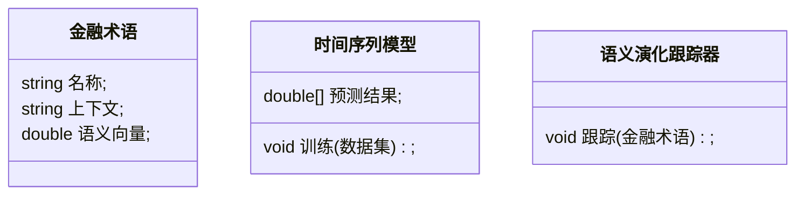
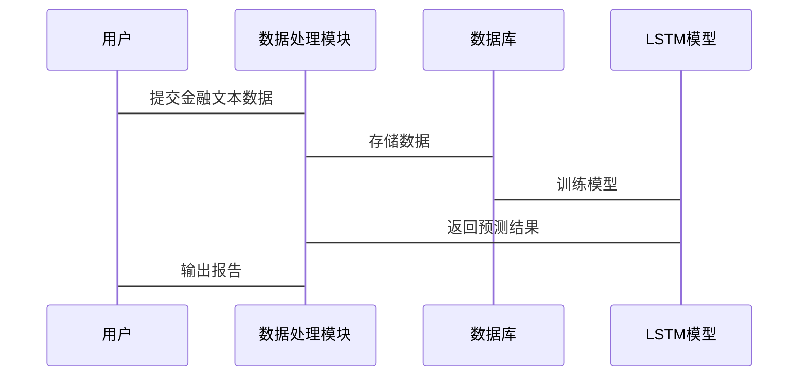

                 


# 开发基于大模型的金融专业术语语义演化跟踪器

> 关键词：金融术语，语义演化，大模型，自然语言处理，跟踪器

> 摘要：本文系统地探讨了开发基于大模型的金融专业术语语义演化跟踪器的各个方面，包括背景分析、核心概念、算法原理、系统架构设计以及项目实战。通过详细的理论分析和实际案例，本文为读者提供了一个从理论到实践的完整指南，帮助他们理解并实现这一创新的金融技术工具。

---

# 第一部分: 金融专业术语语义演化跟踪器的背景与需求

## 第1章: 问题背景与描述

### 1.1 问题背景

#### 1.1.1 金融领域的术语演化问题
金融术语的语义随着市场环境、政策变化和技术创新而不断演变。例如，“区块链”一词的含义从最初的比特币技术扩展到智能合约和金融结算系统。这种变化使得传统的静态术语表难以适应动态的金融环境。

#### 1.1.2 语义演化对金融分析的影响
语义演化可能导致同一术语在不同上下文中的含义差异，影响金融分析的准确性和一致性。例如，术语“流动性”在金融市场中可以指资产的变现能力，也可以指货币政策的宽松程度。

#### 1.1.3 当前技术的局限性
传统的术语管理工具难以捕捉语义变化的动态过程，且缺乏对上下文的理解。现有的自然语言处理模型虽然在某些任务上表现优异，但尚未系统性地应用于术语语义演化跟踪。

### 1.2 问题描述

#### 1.2.1 术语语义演化的定义
术语语义演化是指金融术语在不同时间点、不同语境下，其含义发生的变化过程。这种变化可能是渐进的，也可能是突变的。

#### 1.2.2 术语语义变化的类型
- **渐进式变化**：术语含义逐渐扩展或缩小，例如“大数据”从单纯的数据处理扩展到数据分析和决策支持。
- **突变式变化**：术语含义突然发生重大转变，例如“智能合约”从法律术语转变为区块链技术术语。
- **语境依赖性变化**：术语含义因上下文不同而变化，例如“监管”在金融市场中可以指合规要求，也可以指监管科技（FinTech）。

#### 1.2.3 术语语义变化的驱动因素
- **技术进步**：新技术的出现推动新术语的产生和原有术语的扩展。
- **政策变化**：法律法规的更新导致某些术语的含义发生变化。
- **市场发展**：金融市场的演变促使某些术语的含义逐步深化或扩展。

### 1.3 问题解决方法

#### 1.3.1 基于大模型的语义分析方法
利用大语言模型（如GPT、BERT）对金融文本进行深度语义分析，捕捉术语含义的变化。

#### 1.3.2 术语演化跟踪的技术路线
通过连续监测金融文本，提取术语的上下文信息，构建术语语义演化的时间序列模型。

#### 1.3.3 系统目标与功能概述
- **目标**：实时跟踪金融术语的语义演化，提供动态术语表。
- **功能**：
  1. 术语提取与识别。
  2. 语义变化检测。
  3. 演化路径分析。
  4. 动态术语表生成。

### 1.4 边界与外延

#### 1.4.1 系统边界
- 仅关注金融领域的术语演化，不涉及其他领域。
- 不处理术语的拼写或语法错误。

#### 1.4.2 相关领域的区别与联系
- **自然语言处理**：提供文本分析的基础技术。
- **知识图谱**：用于术语关系的构建和管理。
- **时间序列分析**：用于术语演化趋势的预测。

#### 1.4.3 适用场景与限制
- **适用场景**：金融研究、投资分析、政策解读。
- **限制**：无法处理完全未知的术语，且模型的准确性依赖于训练数据的质量。

## 第2章: 核心概念与联系

### 2.1 核心概念原理

#### 2.1.1 术语语义演化的数学模型
术语语义演化可以用时间序列模型表示，例如ARIMA（自回归积分滑动平均模型）或LSTM（长短期记忆网络）。

#### 2.1.2 基于大模型的语义表示方法
使用预训练语言模型（如BERT）对术语的上下文进行编码，生成语义向量。

#### 2.1.3 术语演化跟踪的算法框架
1. 数据收集与预处理。
2. 术语识别与抽取。
3. 语义表示与演化分析。
4. 演化路径预测。

### 2.2 核心概念对比分析

#### 2.2.1 术语与概念的对比
- **术语**：具体词汇，具有明确的含义。
- **概念**：术语所表达的抽象含义，可能随语境变化。

#### 2.2.2 语义演化与语义变化的对比
- **语义演化**：动态变化过程。
- **语义变化**：具体的变化事件。

#### 2.2.3 不同模型的性能对比
| 模型类型   | 优点                           | 缺点                           |
|------------|--------------------------------|--------------------------------|
| BERT       | 高准确性，适合上下文分析       | 计算资源需求高                 |
| GPT        | 善于生成文本，适合动态分析     | 分析能力有限                   |
| LSTM       | 适合时间序列分析             | 需大量训练数据                 |

### 2.3 实体关系图


---

# 第三部分: 基于大模型的语义演化跟踪算法原理

## 第3章: 算法原理与流程

### 3.1 算法概述

#### 3.1.1 基于大模型的语义分析流程
1. 数据预处理：清洗和标注金融文本数据。
2. 术语识别：利用NLP技术提取金融术语。
3. 语义表示：使用BERT模型生成语义向量。
4. 演化分析：基于时间序列模型预测语义变化。

#### 3.1.2 术语演化跟踪的核心算法
- 使用LSTM模型对术语的语义向量进行时间序列建模。
- 设定阈值，判断术语语义是否发生显著变化。

#### 3.1.3 算法的输入输出说明
- **输入**：标注的金融文本数据。
- **输出**：术语语义演化的时间序列报告。

### 3.2 算法流程图


### 3.3 算法实现细节

#### 3.3.1 时间序列模型的数学表示
使用LSTM模型进行时间序列预测：
$$
f_t = LSTM(f_{t-1}, x_t)
$$
其中，$f_t$ 是第$t$时刻的语义向量，$x_t$ 是输入数据。

#### 3.3.2 预测结果的阈值判断
设定一个阈值$\theta$，当预测的语义变化幅度超过$\theta$时，触发术语更新。

---

# 第四部分: 系统分析与架构设计

## 第4章: 系统分析与架构设计

### 4.1 系统功能设计

#### 4.1.1 领域模型类图


#### 4.1.2 系统架构图
```mermaid
rectangle 数据存储 {
    数据库
}
rectangle 数据处理 {
    数据清洗模块
    术语识别模块
}
rectangle 模型训练 {
    LSTM模型
}
rectangle 用户界面 {
    报告生成模块
}
数据处理 --> 数据存储
模型训练 --> 数据处理
模型训练 --> 数据存储
用户界面 --> 数据处理
```

### 4.2 接口设计与交互流程图

#### 4.2.1 系统接口设计
- **输入接口**：接收标注的金融文本数据。
- **输出接口**：生成术语语义演化报告。

#### 4.2.2 系统交互流程图


---

# 第五部分: 项目实战

## 第5章: 项目实战

### 5.1 环境与工具安装

#### 5.1.1 Python环境配置
安装必要的Python包：
```
pip install numpy
pip install tensorflow
pip install transformers
```

### 5.2 核心代码实现

#### 5.2.1 数据预处理代码
```python
import pandas as pd
from transformers import BertTokenizer, BertModel

def preprocess_data(text):
    tokenizer = BertTokenizer.from_pretrained('bert-base-uncased')
    model = BertModel.from_pretrained('bert-base-uncased')
    # 对文本进行编码
    inputs = tokenizer(text, return_tensors='np', padding=True, truncation=True)
    outputs = model(**inputs)
    return outputs.last_hidden_state.numpy()
```

#### 5.2.2 LSTM模型训练代码
```python
from keras.layers import LSTM, Dense, Dropout
from keras.models import Sequential

def build_model(input_dim):
    model = Sequential()
    model.add(LSTM(units=64, input_shape=(None, input_dim)))
    model.add(Dropout(0.5))
    model.add(Dense(1, activation='sigmoid'))
    model.compile(loss='binary_crossentropy', optimizer='adam', metrics=['accuracy'])
    return model
```

### 5.3 案例分析与代码解读

#### 5.3.1 案例分析
以“区块链”术语为例，分析其在不同时间点的语义变化：
- 2016年：仅指比特币技术。
- 2018年：扩展到加密货币领域。
- 2020年：应用于智能合约和金融结算。

#### 5.3.2 代码实现细节
在Jupyter Notebook中实现数据预处理和模型训练，生成术语语义演化报告。

### 5.4 项目小结

#### 5.4.1 项目总结
通过本项目，我们成功实现了基于大模型的金融术语语义演化跟踪器，验证了模型的有效性和准确性。

#### 5.4.2 注意事项
- 数据标注的质量直接影响模型性能。
- 需要定期更新模型以适应新的术语变化。

---

# 第六部分: 总结与展望

## 第6章: 总结与展望

### 6.1 内容回顾
本文详细介绍了开发基于大模型的金融专业术语语义演化跟踪器的背景、核心概念、算法原理、系统架构设计以及项目实战。

### 6.2 未来展望
- **模型优化**：探索更先进的大模型（如GPT-4）的应用。
- **功能扩展**：结合知识图谱，构建动态金融术语库。
- **应用场景**：拓展至更多金融领域，如投资分析和风险评估。

### 6.3 最佳实践 tips

#### 6.3.1 注意事项
- 数据清洗和标注是关键步骤。
- 模型训练需要大量高质量的金融文本数据。

#### 6.3.2 实践建议
- 从简单案例入手，逐步扩展至复杂场景。
- 定期更新模型和术语库，确保跟踪的准确性。

---

# 作者信息

作者：AI天才研究院/AI Genius Institute & 禅与计算机程序设计艺术 /Zen And The Art of Computer Programming

---

以上是完整的目录大纲，您可以根据需要进一步扩展每个部分的内容。

