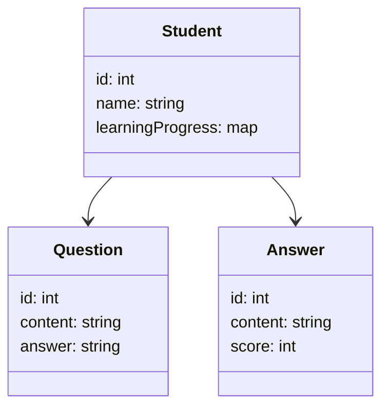
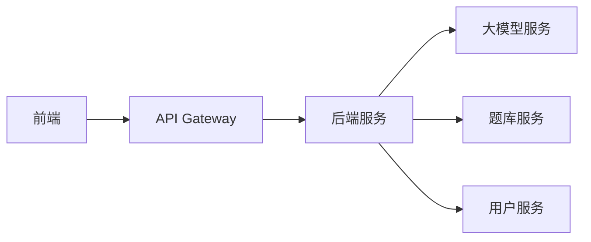
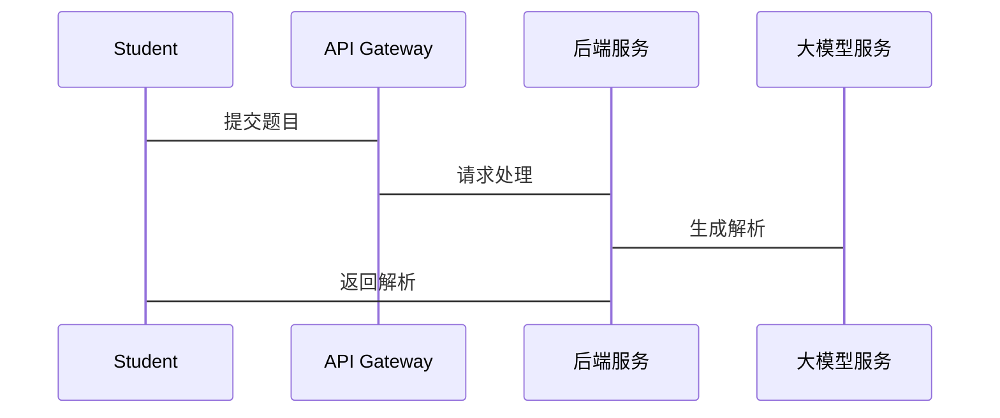
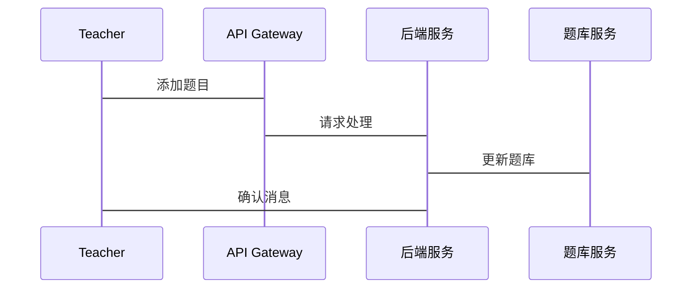

                 


# 开发基于大模型的金融专业考试辅导系统

**关键词：** 大模型，金融考试，辅导系统，自然语言处理，机器学习

**摘要：**  
本文详细探讨了开发基于大模型的金融专业考试辅导系统的背景、核心概念、算法原理、系统架构设计、项目实战以及最佳实践。通过分析金融考试辅导的核心问题，结合大模型技术的优势，提出了一种创新的解决方案，并详细介绍了系统的实现过程和实际应用效果。本文旨在为金融行业和人工智能领域提供有价值的参考和实践指导。

---

# 第1章: 开发基于大模型的金融专业考试辅导系统概述

## 1.1 问题背景与目标

### 1.1.1 传统金融考试辅导的局限性  
传统金融考试辅导主要依赖于人工讲解和固定题库，存在以下问题：  
1. **知识更新滞后**：金融市场变化迅速，传统题库难以覆盖最新知识点。  
2. **个性化不足**：不同学生的学习需求差异大，难以提供针对性的辅导。  
3. **效率低下**：人工辅导成本高，覆盖面有限，难以满足大规模需求。  

### 1.1.2 大模型技术的引入与优势  
大模型技术（如Transformer、BERT等）在自然语言处理领域的突破，为金融考试辅导带来了新的可能性：  
1. **智能解析**：能够理解复杂的金融题目和学生的疑惑，提供精准的解答。  
2. **个性化辅导**：根据学生的学习情况，实时调整辅导策略。  
3. **高效扩展**：通过自动化处理，可以覆盖大量学生和题目。  

### 1.1.3 系统开发目标与意义  
本系统的目标是开发一个基于大模型的智能辅导系统，解决传统辅导的痛点，提升学习效率和体验。其意义在于推动人工智能技术在金融教育领域的应用，为学生和教育机构提供高效、个性化的学习工具。

## 1.2 问题描述与解决思路

### 1.2.1 金融考试辅导的核心问题  
金融考试辅导的核心问题包括：  
1. 如何准确理解题目内容和学生需求。  
2. 如何快速生成准确的解答和解析。  
3. 如何个性化推荐学习资源和练习题目。  

### 1.2.2 基于大模型的解决方案  
解决方案包括以下步骤：  
1. **数据收集与处理**：收集金融考试题目、解析和相关知识点。  
2. **模型训练与优化**：基于收集的数据，训练大模型并进行微调。  
3. **系统集成与测试**：将模型集成到系统中，进行功能测试和优化。  

### 1.2.3 系统的边界与外延  
系统的边界包括：  
- 输入：学生提交的题目和问题。  
- 输出：系统的解答和解析。  
- 外延：系统不直接处理支付、报名等事务，但可与相关系统集成。  

## 1.3 核心概念与系统架构

### 1.3.1 系统的核心要素  
系统的核心要素包括：  
1. **大模型引擎**：负责理解和生成文本。  
2. **题库管理**：存储和管理金融考试题目。  
3. **用户管理**：记录用户的学习进度和偏好。  
4. **知识图谱**：构建金融领域的知识点网络。  

### 1.3.2 系统功能模块划分  
系统功能模块包括：  
1. **用户交互模块**：提供友好的用户界面。  
2. **题目解析模块**：解析题目并生成解答。  
3. **智能推荐模块**：推荐相关题目和学习资源。  

### 1.3.3 系统架构的初步设想  
初步架构设想：  
1. 前端：Web或移动端界面。  
2. 后端：API接口和业务逻辑处理。  
3. 大模型服务：负责文本理解和生成。  

## 1.4 本章小结  
本章介绍了系统开发的背景、目标、核心问题及解决思路，并初步阐述了系统的架构设计。

---

# 第2章: 大模型的核心原理与金融应用

## 2.1 大模型的核心原理

### 2.1.1 大模型的定义与特点  
大模型是一种基于深度学习的自然语言处理模型，具有以下特点：  
- **大规模参数**：通常包含 billions 的参数。  
- **自适应能力**：能够根据输入上下文生成文本。  
- **多任务能力**：可应用于问答、翻译等多种任务。  

### 2.1.2 大模型的训练与推理机制  
1. **训练阶段**：使用大量数据进行监督学习。  
2. **推理阶段**：基于输入生成输出。  

### 2.1.3 模型的可解释性与鲁棒性  
- **可解释性**：通过注意力机制分析模型决策过程。  
- **鲁棒性**：模型对噪声和干扰的抵抗能力。  

## 2.2 大模型在金融领域的应用特征

### 2.2.1 金融数据的特性与挑战  
1. **专业性**：金融术语复杂。  
2. **实时性**：需要处理最新的市场动态。  
3. **准确性**：错误可能带来重大损失。  

### 2.2.2 大模型在金融分析中的优势  
1. **快速理解**：能够快速解析复杂的金融问题。  
2. **知识整合**：能够关联多个知识点生成解答。  

### 2.2.3 金融场景下的模型调优策略  
1. **领域微调**：在金融领域数据上进行微调。  
2. **多模态融合**：结合文本、数据等多模态信息。  

## 2.3 核心概念之间的关系

### 2.3.1 模型、数据与任务的关系  
| 模型 | 数据 | 任务 |  
|------|------|------|  
| Transformer | 金融文本 | 题目解析 |  

### 2.3.2 金融场景与模型性能的关联  
金融场景影响模型的输入和输出，进而影响模型的性能表现。  

### 2.3.3 用户需求与系统功能的匹配  
用户需求驱动系统功能的设计与优化。  

## 2.4 本章小结  
本章详细讲解了大模型的核心原理及其在金融领域的应用，并分析了相关概念之间的关系。

---

# 第3章: 大模型的算法原理与实现

## 3.1 大模型的算法概述

### 3.1.1 变压器（Transformer）模型的核心结构  
1. **编码器**：将输入序列编码为向量。  
2. **解码器**：根据编码结果生成输出序列。  

### 3.1.2 编码器与解码器的工作流程  
1. **编码器**：输入序列通过多头注意力机制生成上下文向量。  
2. **解码器**：根据编码结果逐步生成输出。  

### 3.1.3 注意力机制的数学表达  
$$\text{Attention}(Q, K, V) = \text{softmax}\left(\frac{QK^T}{\sqrt{d_k}}\right)V$$  

## 3.2 注意力机制的详细讲解

### 3.2.1 注意力机制的公式推导  
注意力机制的核心公式为：  
$$\text{score}(i, j) = Q_i K_j^T$$  
经过缩放和softmax后，得到权重：  
$$\alpha_{ij} = \text{softmax}(\frac{\text{score}(i, j)}{\sqrt{d_k}})$$  
最终输出为：  
$$\text{output}_i = \sum_{j=1}^n \alpha_{ij} V_j$$  

### 3.2.2 注意力机制的计算流程  
1. **计算查询（Q）、键（K）、值（V）**。  
2. **计算注意力得分**。  
3. **应用softmax获取权重**。  
4. **加权求和得到输出**。  

### 3.2.3 注意力机制的优化策略  
1. **多头注意力**：通过多个注意力头捕捉不同类型的模式。  
2. **位置编码**：引入位置信息。  

## 3.3 大模型的训练与推理流程

### 3.3.1 训练流程  
1. **数据预处理**：分词、去除停用词等。  
2. **模型初始化**：随机初始化参数。  
3. **前向传播**：计算输出并计算损失。  
4. **反向传播**：更新模型参数。  

### 3.3.2 推理流程  
1. **输入处理**：将输入文本转换为模型可处理的形式。  
2. **生成输出**：逐步生成文本。  

## 3.4 本章小结  
本章详细讲解了大模型的算法原理，包括Transformer模型的结构、注意力机制的数学推导和优化策略。

---

# 第4章: 系统分析与架构设计方案

## 4.1 问题场景介绍

### 4.1.1 金融考试辅导的场景分析  
1. **学生端**：学生提交题目，系统生成解析。  
2. **教师端**：教师管理题库和学生学习进度。  

## 4.2 系统功能设计

### 4.2.1 领域模型类图  


### 4.2.2 系统架构设计  


### 4.2.3 接口设计  
1. **查询题目接口**：`GET /api/questions?query=...`  
2. **生成解析接口**：`POST /api/answers`  

## 4.3 系统交互流程

### 4.3.1 学生提交题目  


### 4.3.2 教师管理题库  


## 4.4 本章小结  
本章分析了系统的应用场景，设计了系统的功能模块和架构，并通过mermaid图展示了系统的交互流程。

---

# 第5章: 项目实战

## 5.1 环境安装

### 5.1.1 安装Python与相关库  
```bash
pip install python
pip install torch
pip install transformers
pip install fastapi
pip install uvicorn
```

### 5.1.2 安装NVIDIA显卡驱动与CUDA  
1. 下载并安装NVIDIA显卡驱动。  
2. 安装CUDA Toolkit。  

## 5.2 系统核心实现

### 5.2.1 数据预处理  
```python
def preprocess(text):
    # 分词处理
    tokens = tokenizer(text)
    # 转换为模型输入格式
    inputs = tokenizer.convert_tokens_to_ids(tokens)
    return inputs
```

### 5.2.2 模型调用  
```python
def generate_answer(question):
    inputs = preprocess(question)
    outputs = model.generate(inputs, max_length=100)
    return tokenizer.decode(outputs[0])
```

### 5.2.3 接口实现  
```python
@app.post("/api/answers")
async def answer(question: str):
    result = generate_answer(question)
    return {"answer": result}
```

## 5.3 代码应用解读与分析  
1. **数据预处理**：将输入文本转换为模型可接受的格式。  
2. **模型调用**：使用大模型生成答案。  
3. **接口实现**：通过API接口提供服务。  

## 5.4 实际案例分析  
1. **案例1**：学生提交一道金融题目，系统生成详细解析。  
2. **案例2**：教师通过API添加新题目，系统更新题库。  

## 5.5 本章小结  
本章通过实际代码展示了系统的实现过程，并通过案例分析验证了系统的有效性。

---

# 第6章: 最佳实践与总结

## 6.1 开发过程中的注意事项

### 6.1.1 数据质量问题  
确保数据的准确性和多样性。  

### 6.1.2 模型调优技巧  
1. **领域微调**：在金融领域数据上进行微调。  
2. **参数调整**：优化学习率和批次大小。  

### 6.1.3 系统性能优化  
1. **缓存机制**：减少重复计算。  
2. **并行处理**：利用多线程或分布式计算。  

## 6.2 本章小结  
本章总结了系统开发中的注意事项和优化技巧，为后续开发提供了参考。

## 6.3 未来展望与扩展阅读  
1. **多模态融合**：结合图像、语音等多模态信息。  
2. **实时更新**：动态更新题目和解析。  

---

# 作者  
作者：AI天才研究院 & 禅与计算机程序设计艺术

