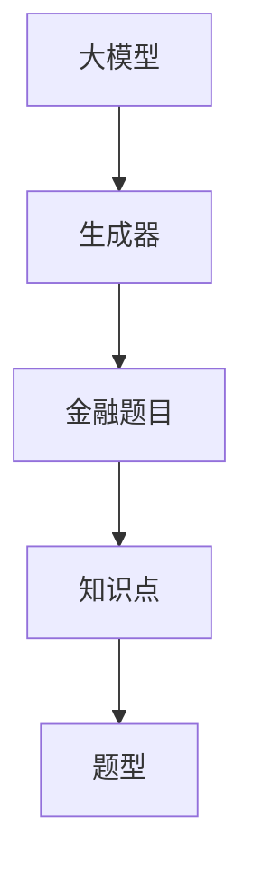
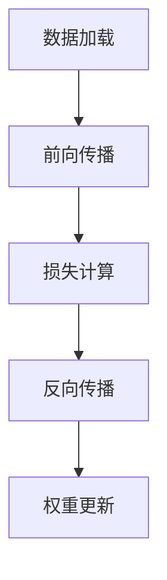

                 

# 开发基于大模型的金融专业考试题目生成器

## 关键词：大模型、金融考试、题目生成器、人工智能、自然语言处理

## 摘要：本文系统地探讨了基于大模型开发金融专业考试题目生成器的全过程，从问题背景到算法原理，从系统架构到项目实战，结合具体案例分析和代码实现，深入剖析了大模型在金融考试题目生成中的应用潜力和实现细节，为读者提供了一个全面的技术指南。

---

## 第一部分: 开发背景与核心概念

### 第1章: 问题背景与需求分析

#### 1.1 问题背景介绍

##### 1.1.1 传统金融考试题目的痛点

传统金融考试题目生成过程中存在以下痛点：

1. **效率低**：手动编写大量题目耗时耗力，效率低下。
2. **覆盖不足**：难以全面覆盖金融领域的各种知识点和题型。
3. **一致性差**：不同出题人员的风格和难度可能不一致，影响考试公平性。
4. **更新慢**：金融领域知识更新快，传统方法难以及时更新题目。

##### 1.1.2 人工智能在金融领域的应用潜力

人工智能在金融领域的应用潜力主要体现在以下几个方面：

1. **智能投顾**：通过AI分析用户需求，提供个性化的投资建议。
2. **风险评估**：利用AI模型评估金融产品的风险。
3. **数据处理**：快速分析大量金融数据，提取有价值的信息。

##### 1.1.3 大模型技术的出现与优势

大模型技术的出现为金融领域带来了新的可能性，其优势包括：

1. **强大的生成能力**：能够生成高质量、多样化的文本内容。
2. **快速学习能力**：通过大量数据训练，快速掌握特定领域的知识。
3. **灵活性高**：可以根据需求调整生成的内容风格和难度。

#### 1.2 问题描述与目标设定

##### 1.2.1 金融考试题目生成的核心问题

金融考试题目生成的核心问题包括：

1. **知识点覆盖**：确保题目涵盖所有相关知识点。
2. **难度控制**：根据目标人群调整题目难度。
3. **多样性**：生成多种题型（如选择题、简答题等）。

##### 1.2.2 目标设定与实现路径

目标设定：
1. 开发一个能够自动生成金融考试题目的系统。
2. 确保生成题目准确、多样化且符合教育标准。

实现路径：
1. 数据收集与预处理。
2. 模型训练与优化。
3. 系统集成与测试。

##### 1.2.3 边界与外延

边界：
1. 仅生成考试题目，不涉及评分或答案解析。
2. 支持特定题型，如选择题和简答题。

外延：
1. 可扩展到其他领域，如法律或医学考试题目生成。
2. 集成更多功能，如题目自动评分。

#### 1.3 核心概念与联系

##### 1.3.1 大模型的基本原理

大模型是一种基于深度学习的自然语言处理模型，通常采用Transformer架构。其核心原理包括：

1. **自注意力机制**：模型能够关注输入中的重要部分，生成相关文本。
2. **多层结构**：通过多层处理，模型能够捕捉复杂的语言模式。

##### 1.3.2 生成机制与金融考试题目的关联

大模型的生成机制能够为金融考试题目生成提供以下支持：

1. **上下文理解**：模型能够理解题目内容和背景，生成连贯的题目。
2. **多样性控制**：通过调整生成策略，控制题目难度和多样性。
3. **快速生成**：模型能够在短时间内生成大量题目。

##### 1.3.3 核心概念属性特征对比表

| 概念 | 属性 | 特征 |
|------|------|------|
| 大模型 | 数据需求 | 高 |
| 生成机制 | 精度 | 高 |
| 金融题目 | 题型多样性 | 高 |

##### 1.3.4 ER实体关系图

### 第2章: 大模型的核心原理与算法基础

#### 2.1 大模型的基本原理

##### 2.1.1 神经网络基础

神经网络是一种通过模仿人脑结构和功能来处理信息的模型。其基本单元是神经元，通过权重和激活函数传递信息。

##### 2.1.2 变压器模型

变压器模型是一种基于自注意力机制的深度学习模型，广泛应用于自然语言处理领域。其核心部分包括编码器和解码器。

##### 2.1.3 注意力机制

注意力机制允许模型在生成文本时关注输入中的重要部分，从而提高生成质量。

#### 2.2 大模型的生成机制

##### 2.2.1 解码器结构

解码器负责将输入转换为输出，通常包括自注意力和前馈网络。

##### 2.2.2 生成策略

生成策略包括贪心生成和随机采样，分别适用于不同的场景。

##### 2.2.3 温度参数调整

温度参数控制生成的多样性和确定性，较低温度生成更保守的文本，较高温度生成更多样化的文本。

#### 2.3 大模型的训练与优化

##### 2.3.1 数据预处理

数据预处理包括分词、去除停用词等步骤，确保数据质量。

##### 2.3.2 模型训练流程

模型训练流程包括数据加载、前向传播、损失计算和反向传播。

##### 2.3.3 模型调优

模型调优包括调整超参数（如学习率）和优化策略（如早停），以提高模型性能。

### 第3章: 算法原理与数学模型

#### 3.1 大模型的数学模型

##### 3.1.1 变压器模型的数学表示

变体器模型的数学表示包括自注意力机制和前馈网络。自注意力机制的计算公式如下：

$$\text{Attention}(Q,K,V) = \text{softmax}\left(\frac{QK^T}{\sqrt{d_k}}\right)V$$

其中，Q是查询向量，K是键向量，V是值向量，$d_k$是键的维度。

##### 3.1.2 生成过程中的数学细节

生成过程中的数学细节包括概率计算和损失函数。交叉熵损失函数的计算公式为：

$$L(x,y) = -\sum_{i=1}^{n} y_i \log p(y_i|x)$$

其中，$x$是输入，$y$是目标输出，$p(y|x)$是生成概率。

#### 3.2 生成算法的优化

##### 3.2.1 梯度下降法

梯度下降法是一种优化算法，通过调整权重减少损失函数值。

##### 3.2.2 动量优化器

动量优化器通过引入动量项加速收敛，减少参数振荡。

##### 3.2.3 Adam优化器

Adam优化器结合了动量和自适应学习率，是一种高效的优化算法。

#### 3.3 数学模型的实现

##### 3.3.1 概率生成

概率生成通过计算每个可能输出的概率，选择概率最高的输出。

##### 3.3.2 贝叶斯定理

贝叶斯定理用于计算条件概率，公式为：

$$P(A|B) = \frac{P(B|A)P(A)}{P(B)}$$

---

## 总结

开发基于大模型的金融专业考试题目生成器是一项具有挑战性的任务，但其潜力巨大。通过结合大模型的强大生成能力和金融领域的专业知识，可以显著提高题目生成的效率和质量。本文系统地探讨了从问题背景到算法实现的全过程，为读者提供了深入的技术指导。

