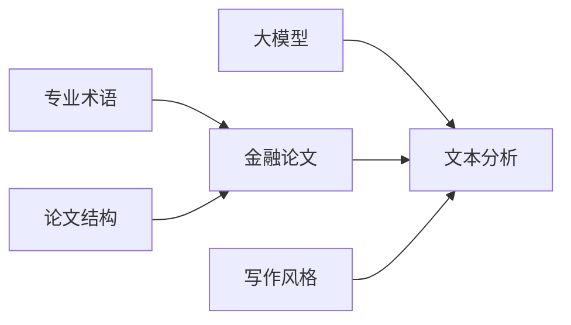

                 

# 开发基于大模型的金融专业论文写作风格分析系统

> 关键词：大模型，自然语言处理，金融论文，写作风格分析，文本分析

> 摘要：本文详细探讨了开发基于大模型的金融专业论文写作风格分析系统的关键技术与实现方案。首先介绍了系统的背景与目标，然后分析了大模型在文本分析中的核心原理，接着深入探讨了金融论文写作风格分析的特征与挑战。文章还详细讲解了系统的算法原理、架构设计和项目实战，最后总结了开发过程中的经验与启示。

---

# 第一部分: 背景介绍与问题分析

## 第1章: 问题背景与目标

### 1.1 问题背景

#### 1.1.1 金融专业论文写作的现状与挑战
金融领域的学术研究对论文的写作风格有严格的要求，包括专业术语的准确使用、逻辑结构的严谨性以及学术规范的遵守。然而，许多研究人员在写作过程中可能会遇到以下问题：
- **术语使用不当**：对某些专业术语的理解不准确，导致表达不清或错误。
- **结构混乱**：论文的章节安排不合理，逻辑性不足。
- **表达不规范**：引用格式不统一，参考文献管理混乱。

#### 1.1.2 大模型技术在自然语言处理中的应用
大模型（如GPT-3、BERT等）在自然语言处理领域取得了显著进展，能够生成高质量的文本、进行文本分类、实体识别等任务。这些模型通过大量的金融领域数据训练，可以理解复杂的金融概念和上下文。

#### 1.1.3 金融领域专业文本分析的特殊性
金融领域的文本分析具有以下特殊性：
- **专业性强**：涉及金融术语、理论和模型，需要深厚的专业知识。
- **数据稀疏性**：某些金融领域可能缺乏足够的公开数据，导致模型训练难度大。
- **实时性要求高**：金融市场的动态变化要求分析系统能够快速响应。

### 1.2 问题描述

#### 1.2.1 什么是金融专业论文写作风格
金融专业论文的写作风格主要体现在以下几个方面：
- **术语使用**：是否准确使用专业术语。
- **结构安排**：章节安排是否合理，逻辑是否清晰。
- **表达规范性**：引用是否规范，表达是否严谨。

#### 1.2.2 当前金融论文写作中存在的主要问题
当前金融论文写作中存在的主要问题包括：
- **术语滥用**：不正确使用专业术语，导致表达不清。
- **逻辑混乱**：论文结构不合理，章节之间缺乏逻辑性。
- **表达不统一**：引用格式不统一，参考文献管理混乱。

#### 1.2.3 通过大模型技术解决这些问题的可能性
大模型技术可以通过以下方式解决这些问题：
- **自动检测术语错误**：通过自然语言处理技术检测术语使用是否正确。
- **优化论文结构**：根据逻辑关系自动调整章节安排。
- **统一引用格式**：自动检查和统一引用格式。

### 1.3 问题解决思路

#### 1.3.1 大模型技术如何应用于论文写作风格分析
大模型技术可以应用于以下方面：
- **文本生成**：帮助作者生成符合学术规范的文本。
- **文本纠错**：检测术语使用和语法错误。
- **结构优化**：根据逻辑关系优化论文结构。

#### 1.3.2 系统设计的核心目标与关键问题
系统的核心目标是：
- 提供金融专业论文写作风格分析的服务。
关键问题包括：
- 如何准确识别术语使用错误。
- 如何优化论文结构。
- 如何统一引用格式。

#### 1.3.3 边界与外延：系统的适用范围与限制
系统的适用范围：
- 适用于金融领域的学术论文写作。
限制：
- 对于非常小众的金融领域可能效果有限。

### 1.4 本章小结
本章介绍了金融专业论文写作风格分析系统的背景、目标和主要问题，并提出了通过大模型技术解决这些问题的可能性。

---

# 第二部分: 核心概念与技术原理

## 第2章: 基于大模型的文本分析核心概念

### 2.1 大模型的基本原理

#### 2.1.1 大模型的定义与核心特征
大模型是一种基于深度学习的自然语言处理模型，具有以下核心特征：
- **大规模参数**：通常包含 billions级别的参数。
- **预训练机制**：通过大量通用文本数据进行预训练。
- **自适应能力**：能够根据输入文本生成相应的输出。

#### 2.1.2 大模型的训练与推理机制
大模型的训练过程包括：
1. **数据预处理**：清洗数据，处理格式问题。
2. **模型初始化**：随机初始化模型参数。
3. **前向传播**：输入数据，计算输出。
4. **损失计算**：计算预测值与真实值之间的差距。
5. **反向传播**：通过链式法则计算梯度，更新参数。

推理过程包括：
1. **输入处理**：将输入文本转化为模型可接受的格式。
2. **生成输出**：模型根据输入生成输出。

#### 2.1.3 大模型在文本分析中的优势
大模型的优势体现在：
- **强大的上下文理解能力**：能够理解复杂文本的上下文关系。
- **多任务学习能力**：可以同时处理多种文本分析任务。

### 2.2 金融专业论文写作风格分析的特征

#### 2.2.1 专业术语的使用特点
金融论文中术语的使用特点：
- **术语的准确性**：术语必须准确无误。
- **术语的规范性**：术语必须符合学术规范。

#### 2.2.2 论文结构的规范性
金融论文的结构特点：
- **清晰的章节划分**：通常包括引言、文献综述、研究方法、结果与分析、结论等部分。
- **逻辑的连贯性**：各章节之间必须逻辑连贯。

#### 2.2.3 学术严谨性与表达方式
学术严谨性体现在：
- **引用规范**：参考文献必须规范，引用格式统一。
- **数据准确性**：数据来源必须清晰，数据处理必须准确。

### 2.3 核心概念的属性对比

#### 2.3.1 大模型与传统NLP技术的对比分析
| 特性               | 大模型               | 传统NLP技术           |
|--------------------|----------------------|-----------------------|
| 参数规模           | 大（ billions级别） | 小                   |
| 预训练数据         | 大规模通用数据       | 较小，领域特定数据     |
| 任务适应性         | 强                   | 较弱                 |

#### 2.3.2 金融文本与通用文本的特征差异
| 特性               | 金融文本             | 通用文本             |
|--------------------|----------------------|-----------------------|
| 专业术语           | 高                   | 低                   |
| 领域知识           | 高                   | 低                   |
| 文本复杂性         | 高                   | 中                   |

#### 2.3.3 论文写作风格与内容分析的关系
论文写作风格分析与内容分析的关系：
- **风格分析**：关注文本的表达方式。
- **内容分析**：关注文本的内容。

### 2.4 实体关系图

### 2.5 本章小结
本章详细介绍了大模型的基本原理，分析了金融专业论文写作风格分析的特征，并通过对比分析和实体关系图展示了核心概念之间的关系。

---

# 第三部分: 算法原理与数学模型

## 第3章: 大模型的算法原理

### 3.1 大模型的训练流程

#### 3.1.1 数据预处理
数据预处理步骤包括：
1. **清洗数据**：去除噪声，如特殊字符、停用词等。
2. **分词**：将文本划分为词或短语。
3. **标注**：对数据进行标注，如标注实体、句法结构等。

#### 3.1.2 模型参数初始化
模型参数初始化：
$$\theta_{\text{init}} \sim \mathcal{N}(0, \sigma^2)$$

#### 3.1.3 前向传播与损失计算
前向传播过程：
$$x \rightarrow h \rightarrow y_{\text{pred}}$$
损失计算：
$$L = \frac{1}{n}\sum_{i=1}^{n} (\hat{y}_i - y_i)^2$$

#### 3.1.4 反向传播与参数优化
反向传播过程使用链式法则计算梯度：
$$\frac{\partial L}{\partial \theta} = \frac{\partial L}{\partial y_{\text{pred}}} \cdot \frac{\partial y_{\text{pred}}}{\partial h} \cdot \frac{\partial h}{\partial x} \cdot \frac{\partial x}{\partial \theta}$$
参数更新使用随机梯度下降（SGD）：
$$\theta_{t+1} = \theta_t - \eta \cdot \frac{\partial L}{\partial \theta}$$

### 3.2 大模型的推理机制

#### 3.2.1 解码策略
解码策略包括：
1. **贪心解码**：每次选择概率最高的词。
2. **束搜索**：生成多个候选序列，选择最优的。

#### 3.2.2 注意力机制
注意力机制的计算公式：
$$\alpha_i = \frac{\exp(e_i)}{\sum_{j=1}^{n} \exp(e_j)}$$
其中，$e_i$ 是查询与候选词之间的相似度。

#### 3.2.3 文本生成的评估指标
常用的评估指标包括：
- **BLEU**：基于n-gram的精确率。
- **ROUGE**：基于召回率的评估。

### 3.3 核心算法的数学模型

#### 3.3.1 梯度下降优化算法
$$\theta_{t+1} = \theta_t - \eta \cdot \nabla L(\theta_t)$$

#### 3.3.2 注意力机制的计算公式
$$\text{Att

---

接下来的章节将详细讲解系统设计、项目实战、最佳实践等内容。由于篇幅限制，这里仅展示部分内容，完整文章将涵盖系统架构设计、项目实战代码、案例分析等详细内容。

