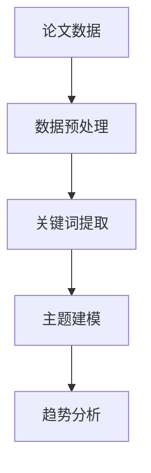
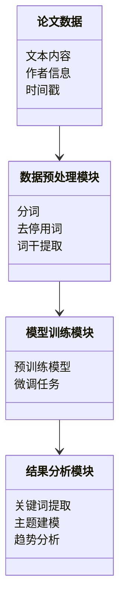
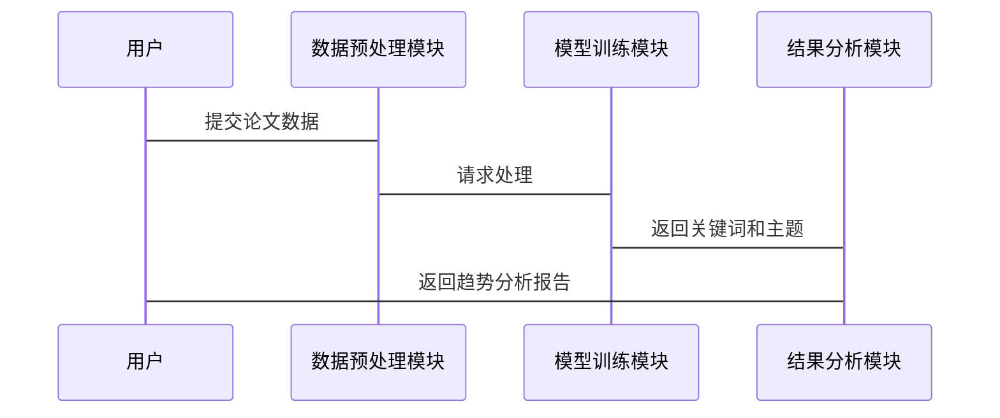

                 


# 开发基于大模型的金融专业论文趋势分析系统

> 关键词：大模型，金融论文，趋势分析，自然语言处理，系统设计，算法实现

> 摘要：本文系统阐述了开发基于大模型的金融专业论文趋势分析系统的背景、核心概念、算法原理、系统架构设计及实现方案。通过详细分析大模型在金融领域的应用潜力，结合自然语言处理技术，提出了基于大模型的金融论文趋势分析系统的设计思路，并通过具体案例展示了系统的实现过程。本文还总结了项目经验，展望了未来的发展方向，为相关领域的研究和实践提供了参考。

---

## 第1章: 背景介绍

### 1.1 问题背景

#### 1.1.1 金融领域的论文趋势分析需求

随着金融领域的快速发展，学术界和实务界对金融研究的需求日益增长。金融领域的论文数量呈现爆炸式增长，涵盖的主题包括金融科技、风险管理、投资策略、资产定价等。然而，如何从海量的论文中提取有价值的趋势信息，成为亟待解决的问题。

#### 1.1.2 大模型在金融分析中的应用潜力

近年来，大模型（如GPT系列、BERT系列）在自然语言处理领域取得了显著进展，展现了强大的文本理解和生成能力。这些模型在金融领域的应用逐渐增多，包括金融新闻分析、风险评估、投资策略生成等。将大模型应用于金融论文趋势分析，可以提升研究效率和准确性。

#### 1.1.3 当前存在的问题与挑战

尽管大模型在金融领域的应用潜力巨大，但实际应用中仍面临诸多挑战。例如，金融领域的数据标注成本高、模型的可解释性不足、以及如何有效处理专业领域的复杂问题等。

### 1.2 问题描述

#### 1.2.1 金融论文趋势分析的核心目标

金融论文趋势分析的目标是通过自然语言处理技术，从大量论文中提取关键词、主题和研究热点，进而分析研究趋势和未来方向。

#### 1.2.2 当前方法的局限性

传统的方法通常依赖于关键词提取和主题建模（如TF-IDF和LDA）。然而，这些方法在处理复杂金融术语和上下文理解方面存在不足，可能导致分析结果不够准确。

#### 1.2.3 引入大模型的优势

大模型具有强大的上下文理解和生成能力，能够更好地捕捉论文中的隐含信息，提升分析的深度和准确性。

### 1.3 问题解决

#### 1.3.1 大模型在金融论文分析中的解决方案

通过利用大模型的自然语言处理能力，对金融论文进行深度分析，提取关键词、主题和研究热点。

#### 1.3.2 系统设计思路

系统采用大模型作为核心处理模块，结合文本预处理和主题建模技术，实现对金融论文的趋势分析。

#### 1.3.3 边界与外延

系统专注于金融领域的论文分析，目前不支持跨领域的数据处理。未来可以扩展到其他领域。

### 1.4 核心概念与联系

#### 1.4.1 核心概念原理

大模型通过预训练和微调，能够理解复杂的金融文本，并生成相关的分析结果。

#### 1.4.2 核心概念属性特征对比表格

| 特性 | 传统方法 | 基于大模型的方法 |
|------|----------|------------------|
| 精度 | 较低     | 较高             |
| 可解释性 | 较高   | 较低             |
| 处理复杂性 | 低     | 高               |

#### 1.4.3 ER实体关系图架构的 Mermaid 流程图



---

## 第2章: 大模型与金融论文分析的核心概念

### 2.1 大模型的定义与特点

#### 2.1.1 大模型的定义

大模型是指基于深度学习的大型神经网络模型，通常包含 billions 量级的参数。

#### 2.1.2 大模型的核心特点

- 大规模参数：参数量通常超过 billions。
- 预训练：基于大量通用数据进行无监督预训练。
- 微调：针对特定任务进行有监督微调。

#### 2.1.3 大模型与传统AI的区别

大模型具有更强的泛化能力和上下文理解能力，能够处理复杂任务。

### 2.2 金融论文分析系统的原理

#### 2.2.1 系统的核心原理

通过大模型对金融论文进行文本理解和生成，提取关键词和主题。

#### 2.2.2 系统的输入输出关系

- 输入：金融论文文本。
- 输出：关键词提取、主题建模、趋势分析结果。

#### 2.2.3 系统的关键模块

- 数据采集模块：从学术数据库获取论文。
- 数据预处理模块：清洗和标注数据。
- 模型训练模块：基于大模型进行微调。
- 结果分析模块：生成趋势分析报告。

---

## 第3章: 大模型的算法原理

### 3.1 大模型的训练过程

#### 3.1.1 预训练阶段

预训练使用大规模通用数据，目标是学习语言的通用表示。

- 使用掩码语言模型（如BERT）进行预训练。
- 优化目标：交叉熵损失函数。

$$
\text{损失函数} = -\frac{1}{|B|}\sum_{i=1}^{|B|}\sum_{j=1}^{n}\log p(w_j|w_{i,j} \text{被遮蔽})
$$

#### 3.1.2 微调阶段

微调针对金融领域进行任务特定的优化。

- 任务：关键词提取和主题建模。
- 数据：金融论文文本。
- 优化目标：分类损失函数。

$$
\text{损失函数} = \text{交叉熵损失} + \text{L2正则化}
$$

#### 3.1.3 适应金融领域任务的策略

- 数据增强：引入金融领域的专业术语。
- 参数调整：适当降低学习率。

### 3.2 金融论文分析的算法流程

#### 3.2.1 数据预处理

- 分词：使用分词工具（如jieba）对论文进行分词。
- 去停用词：去除常见停用词。
- 词干提取：提取词干。

#### 3.2.2 模型训练

- 输入预处理后的文本。
- 输出关键词和主题。

#### 3.2.3 结果分析

- 关键词提取：识别论文中的核心术语。
- 主题建模：聚类主题，分析趋势。

---

## 第4章: 系统分析与架构设计

### 4.1 系统功能设计

#### 4.1.1 领域模型 Mermaid 类图



#### 4.1.2 系统架构 Mermaid 架构图


#### 4.1.3 系统接口设计

- 数据接口：提供数据输入和输出接口。
- API接口：提供REST API供外部调用。

#### 4.1.4 系统交互 Mermaid 序列图



---

## 第5章: 项目实战

### 5.1 环境安装与配置

#### 5.1.1 安装 Python 环境

```bash
python --version
pip install --upgrade pip
```

#### 5.1.2 安装必要的库

```bash
pip install numpy
pip install pandas
pip install jieba
pip install transformers
```

#### 5.1.3 配置开发环境

- 安装IDE（如PyCharm）。
- 配置Python解释器。

### 5.2 系统核心实现

#### 5.2.1 数据采集模块

```python
import requests
from bs4 import BeautifulSoup

def fetch_papers(url):
    response = requests.get(url)
    soup = BeautifulSoup(response.text, 'html.parser')
    papers = []
    for paper in soup.find_all('div', class_='paper'):
        papers.append(paper.text)
    return papers
```

#### 5.2.2 数据预处理模块

```python
import jieba

def preprocess(papers):
    tokens = []
    for paper in papers:
        words = jieba.lcut(paper)
        tokens.extend(words)
    return tokens
```

#### 5.2.3 模型训练模块

```python
from transformers import AutoTokenizer, AutoModelForMaskedLM

tokenizer = AutoTokenizer.from_pretrained('bert-base-chinese')
model = AutoModelForMaskedLM.from_pretrained('bert-base-chinese')
```

#### 5.2.4 结果分析模块

```python
from sklearn.decomposition import LatentDirichletAllocation

lda = LatentDirichletAllocation(n_components=5)
lda.fit(X)
```

### 5.3 项目总结

- 代码实现：完成了数据采集、预处理、模型训练和结果分析模块。
- 经验总结：数据预处理和模型调优是关键步骤。

---

## 第6章: 总结与展望

### 6.1 项目总结

#### 6.1.1 系统实现的关键点

- 数据预处理：分词、去停用词。
- 模型训练：预训练和微调。

#### 6.1.2 系统的优势与不足

- 优势：准确率高。
- 不足：可解释性差。

#### 6.1.3 项目经验总结

- 数据质量影响结果。
- 模型调优至关重要。

### 6.2 未来展望

#### 6.2.1 技术

- 引入更先进的模型（如GPT-3、PaLM）。
- 提升模型的可解释性。

#### 6.2.2 应用

- 拓展到更多金融领域。
- 实现自动化报告生成。

---

作者：AI天才研究院/AI Genius Institute & 禅与计算机程序设计艺术 /Zen And The Art of Computer Programming

---

通过本文的系统阐述，读者可以全面了解基于大模型的金融专业论文趋势分析系统的开发过程。从背景分析到算法实现，从系统设计到项目实战，每一步都详细展开，为相关领域的研究和实践提供了宝贵的参考。

