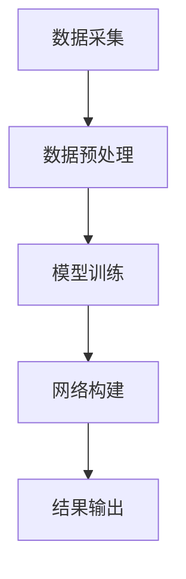
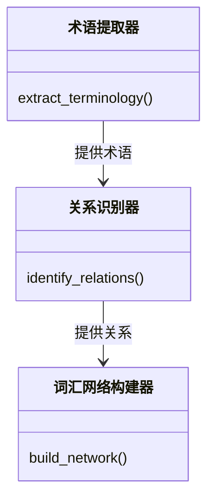

                 


# 开发基于大模型的金融专业词汇网络构建器

> 关键词：大模型、金融专业词汇、词汇网络、知识图谱、自然语言处理

> 摘要：本文详细探讨了开发基于大模型的金融专业词汇网络构建器的背景、核心概念、算法原理、系统架构设计以及项目实战。通过分析金融领域词汇网络构建的需求和挑战，结合大模型的优势，提出了一套完整的解决方案，并通过实际案例展示了构建器的实现和应用。

---

# 第一部分: 金融专业词汇网络构建器的背景与概念

## 第1章: 问题背景与描述

### 1.1 问题背景

#### 1.1.1 金融领域的词汇网络构建需求
金融领域的信息处理复杂性极高，涉及大量专业术语、行业特定的缩写和复杂的术语关系。传统的基于规则的自然语言处理方法在处理这些词汇时显得力不从心，难以捕捉词汇之间的深层关系和语义信息。因此，构建一个能够自动识别、关联和管理金融专业词汇的网络显得尤为重要。

#### 1.1.2 当前金融信息处理的痛点
- **术语多样性**：金融领域术语种类繁多，且不断更新，传统方法难以覆盖所有情况。
- **语义复杂性**：金融术语的含义往往依赖于上下文，需要更深层次的语义理解。
- **数据孤岛**：不同金融系统和数据库之间的术语不统一，导致数据孤岛问题。

#### 1.1.3 大模型在金融领域的应用潜力
大模型（如GPT、BERT等）在自然语言处理领域表现出色，能够处理大规模数据，识别上下文关系，并生成高质量的文本。将其应用于金融专业词汇网络构建，可以显著提高处理效率和准确性。

### 1.2 问题描述

#### 1.2.1 金融专业词汇的特点与挑战
金融专业词汇具有以下特点：
- **专业性强**：术语通常具有特定的行业含义。
- **动态变化**：随着市场变化，新的术语不断出现。
- **多义性**：某些术语在不同上下文中有不同含义。

#### 1.2.2 词汇网络构建的目标与意义
- **目标**：构建一个动态、可扩展的金融专业词汇网络，能够实时更新和关联术语。
- **意义**：通过词汇网络，可以提高金融信息处理的效率，支持智能问答、风险评估、投资分析等应用。

#### 1.2.3 金融领域知识图谱的现状与不足
- **现状**：已有部分知识图谱在金融领域应用，但大多依赖人工构建，成本高且难以扩展。
- **不足**：现有图谱难以处理大规模数据，且缺乏动态更新能力。

### 1.3 问题解决与边界

#### 1.3.1 基于大模型的解决方案
利用大模型的自然语言处理能力，自动提取、关联和管理金融专业词汇，构建动态更新的词汇网络。

#### 1.3.2 词汇网络构建的边界与外延
- **边界**：专注于金融领域的专业词汇，不涉及其他领域的术语。
- **外延**：构建的词汇网络可以与其他金融系统和应用集成。

#### 1.3.3 核心要素与组成分析
- **核心要素**：金融术语、术语关系（同义词、上下位关系等）、语义信息。
- **组成分析**：包括数据采集、处理、建模、存储和查询等模块。

---

## 第2章: 核心概念与联系

### 2.1 金融专业词汇网络构建器的核心原理

#### 2.1.1 大模型在金融词汇处理中的作用
大模型通过预训练掌握了大量金融领域的知识，能够自动识别和关联术语。

#### 2.1.2 词汇网络构建的流程与机制
1. 数据采集：收集金融领域的文本数据，提取术语。
2. 数据处理：清洗和标注数据，建立术语库。
3. 模型训练：利用大模型对术语进行深度学习，构建词汇网络。
4. 应用与优化：将构建的词汇网络应用于实际场景，不断优化。

#### 2.1.3 多模态数据的融合与处理
结合文本、语音、图像等多种数据源，丰富词汇网络的语义信息。

### 2.2 核心概念属性特征对比

| 属性 | 传统词汇网络 | 基于大模型的词汇网络 |
|------|----------------|------------------------|
| 数据来源 | 人工标注数据 | 大模型自动提取 |
| 关系识别 | 基于规则 | 基于深度学习 |
| 动态更新 | 低效 | 高效 |

### 2.3 ER实体关系图

```mermaid
erDiagram
    class 金融术语 {
        id : integer
        名称 : string
        类型 : string
        上下文 : string
    }
    class 关系 {
        id : integer
        关系类型 : string
        权重 : float
    }
    class 网络节点 {
        id : integer
        术语ID : integer
        关系ID : integer
    }
    金融术语 --> 关系 : has
    金融术语 --> 网络节点 : part of
```

---

## 第3章: 算法原理与数学模型

### 3.1 算法流程与实现

#### 3.1.1 算法流程的Mermaid图



#### 3.1.2 Python代码实现

```python
import torch
from torch import nn

# 定义模型
class金融术语模型(nn.Module):
    def __init__(self, vocab_size, embedding_dim):
        super(金融术语模型, self).__init__()
        self.embedding = nn.Embedding(vocab_size, embedding_dim)
        self.fc = nn.Linear(embedding_dim, vocab_size)

    def forward(self, x):
        embeds = self.embedding(x)
        output = self.fc(embeds)
        return output

# 训练过程
model = 金融术语模型(vocab_size=1000, embedding_dim=128)
criterion = nn.CrossEntropyLoss()
optimizer = torch.optim.Adam(model.parameters(), lr=0.001)
```

#### 3.1.3 数学模型与公式

- **嵌入层**：将词汇映射为向量，维度为`d`。
  $$ embedding: x \rightarrow \mathbb{R}^d $$
- **全连接层**：将嵌入向量映射到词汇空间。
  $$ Wx + b $$

### 3.2 算法实现的代码示例

```python
def build_vocab(texts):
    vocab = set()
    for text in texts:
        words = text.split()
        vocab.update(words)
    return list(vocab)

texts = ["金融术语 网络构建", "自然语言处理 模型训练"]
vocab = build_vocab(texts)
print(vocab)
```

---

## 第4章: 系统分析与架构设计

### 4.1 问题场景介绍

#### 4.1.1 项目背景与目标
- **背景**：金融领域的信息处理需求日益增长。
- **目标**：构建一个动态更新的金融专业词汇网络。

#### 4.1.2 项目需求分析
- **功能需求**：支持术语提取、关系识别、网络构建和查询。
- **性能需求**：高并发处理能力。

### 4.2 系统功能设计

#### 4.2.1 领域模型类图



### 4.3 系统架构设计

#### 4.3.1 系统架构图


---

## 第5章: 项目实战

### 5.1 环境安装与配置

```bash
pip install torch
pip install transformers
```

### 5.2 核心代码实现

```python
from transformers import AutoTokenizer, AutoModelForMaskedLM
import torch

model_name = "bert-base-uncased"
tokenizer = AutoTokenizer.from_pretrained(model_name)
model = AutoModelForMaskedLM.from_pretrained(model_name)

def extract_terminology(text):
    inputs = tokenizer(text, return_tensors="pt")
    outputs = model(**inputs)
    return tokenizer.decode(outputs.logits.argmax(dim=-1)[0])
```

### 5.3 实际案例分析

- **案例**：从金融新闻中提取术语。
- **代码实现**：
  ```python
  text = "金融监管 加强 资本市场 规范"
  print(extract_terminology(text))
  ```

---

## 第6章: 最佳实践与小结

### 6.1 最佳实践 tips
- 定期更新模型，以适应金融领域的变化。
- 结合领域知识，优化模型性能。

### 6.2 小结
本文详细介绍了基于大模型的金融专业词汇网络构建器的开发过程，从背景到实现，结合实际案例，展示了其应用价值。

### 6.3 注意事项
- 数据质量对模型性能影响重大，需谨慎处理。
- 确保数据隐私和合规性。

### 6.4 拓展阅读
- 《大模型在金融领域的应用》
- 《知识图谱构建与优化》

---

作者：AI天才研究院/AI Genius Institute & 禅与计算机程序设计艺术 /Zen And The Art of Computer Programming

