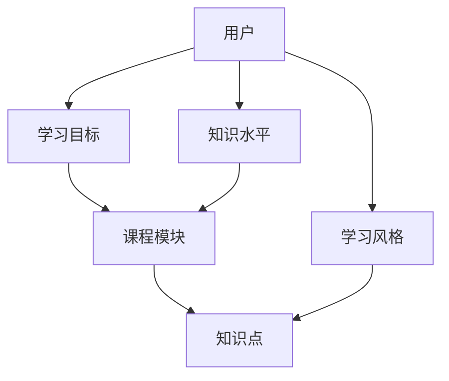
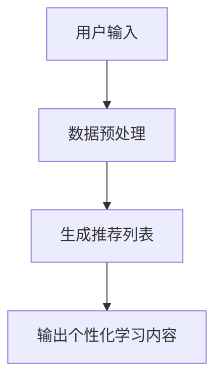
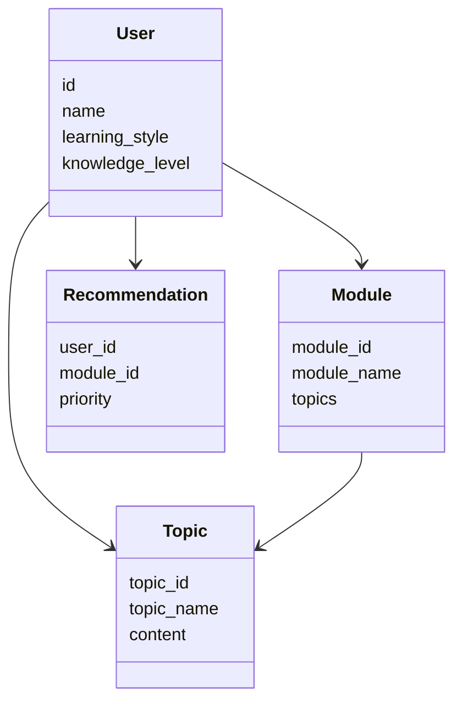

                 


# 开发基于大模型的金融合规培训个性化学习系统

> 关键词：金融合规培训，个性化学习，人工智能，大模型，系统架构，算法原理

> 摘要：本文探讨了如何利用大模型技术构建金融合规培训的个性化学习系统。文章从问题背景、核心概念、算法原理、系统架构、项目实战等方面进行详细分析，提出了系统的设计思路和实现方案，并通过实际案例展示了系统的应用效果。

---

# 第一部分: 背景介绍

## 第1章: 问题背景与描述

### 1.1 问题背景
#### 1.1.1 金融合规培训的现状与挑战
金融行业的合规性要求日益严格，金融机构需要员工不断接受合规培训以应对监管变化。然而，传统的培训方式存在以下问题：
- 培训内容千篇一律，难以满足不同员工的需求。
- 培训效果难以量化，员工学习效果参差不齐。
- 培训资源分散，缺乏系统性。

#### 1.1.2 个性化学习的需求与痛点
随着人工智能技术的发展，个性化学习成为趋势。员工的学习需求因人而异，例如：
- 新员工需要基础合规知识。
- 经验丰富的员工需要深入特定领域的合规细节。
- 不同岗位的员工对合规内容的需求不同。

#### 1.1.3 大模型技术的引入与应用
大模型（如GPT-3、GPT-4等）具备强大的自然语言处理能力，能够理解和生成复杂的文本内容。通过大模型技术，可以实现个性化的学习内容推荐、智能问答、学习效果评估等功能。

### 1.2 问题描述
#### 1.2.1 传统金融合规培训的局限性
传统培训方式通常采用统一的课程内容，忽视了员工的个体差异，导致学习效率低下，员工兴趣不高。

#### 1.2.2 个性化学习的定义与目标
个性化学习是指根据员工的背景、需求和学习进度，定制专属的学习计划和内容，以提高学习效率和效果。

#### 1.2.3 系统构建的核心问题与目标
核心问题是如何利用大模型技术实现个性化学习推荐和动态调整学习路径。目标是构建一个智能化、个性化的金融合规培训系统，帮助员工高效学习。

---

# 第二部分: 核心概念与联系

## 第3章: 核心概念原理

### 3.1 AI大模型的基本原理
#### 3.1.1 大模型的训练机制与特点
大模型通过大量的数据训练，采用自注意力机制（Self-Attention）和前馈网络（FFN）结构，能够捕捉文本中的长距离依赖关系。

#### 3.1.2 大模型在自然语言处理中的应用
大模型可以用于文本生成、问答系统、文本分类等任务，为个性化学习提供技术支持。

#### 3.1.3 大模型的可扩展性与适应性
大模型可以通过微调（Fine-tuning）或提示工程（Prompt Engineering）适应不同领域和场景的需求。

### 3.2 个性化学习系统的构建原理
#### 3.2.1 用户需求分析与数据采集
通过问卷调查、学习行为分析等方式，收集用户的学习目标、知识水平、学习风格等数据。

#### 3.2.2 知识图谱的构建与应用
构建金融合规知识图谱，将相关知识点进行关联，帮助系统理解知识之间的逻辑关系。

#### 3.2.3 个性化推荐算法的设计与实现
基于用户数据和知识图谱，设计推荐算法，为用户推荐个性化的学习内容。

---

## 第4章: 核心概念的特征对比与ER图

### 4.1 核心概念的特征对比
| 特征 | 传统学习系统 | 个性化学习系统 |
|------|--------------|----------------|
| 内容定制 | 固定内容     | 定制化内容       |
| 学习路径 | 单一路径     | 动态调整路径     |
| 评估方式 | 统一标准     | 个性化评估标准   |

### 4.2 ER实体关系图


---

# 第三部分: 算法原理与数学模型

## 第5章: 算法原理讲解

### 5.1 算法流程图


### 5.2 推荐算法实现
```python
def personalized_recommendation(user_id):
    # 获取用户数据
    user_data = get_user_data(user_id)
    # 计算相似用户
    similar_users = find_similar_users(user_data)
    # 获取推荐内容
    recommendations = get_recommendations(similar_users)
    return recommendations
```

### 5.3 数学模型
推荐算法基于余弦相似度计算：
$$
\text{similarity}(u_1, u_2) = \frac{\sum_{i=1}^{n} u_1(i) \cdot u_2(i)}{\sqrt{\sum_{i=1}^{n} u_1(i)^2} \cdot \sqrt{\sum_{i=1}^{n} u_2(i)^2}}
$$

---

# 第四部分: 系统分析与架构设计方案

## 第6章: 系统架构设计

### 6.1 系统功能模块


### 6.2 系统架构图
```mermaid
graph LR
    Client --> API Gateway
    API Gateway --> Service1
    API Gateway --> Service2
    Service1 --> Database
    Service2 --> Database
```

---

## 第7章: 项目实战

### 7.1 环境安装
```bash
pip install transformers
pip install mermaid
```

### 7.2 核心代码实现
```python
from transformers import AutoModelForMaskedLM, AutoTokenizer

model_name = "gpt2"
tokenizer = AutoTokenizer.from_pretrained(model_name)
model = AutoModelForMaskedLM.from_pretrained(model_name)
```

### 7.3 案例分析
通过实际案例分析，展示系统的推荐效果和学习效果。

---

## 第8章: 最佳实践

### 8.1 小结
个性化学习系统通过大模型技术，显著提升了金融合规培训的效果。

### 8.2 注意事项
- 数据隐私保护
- 系统性能优化
- 模型的可解释性

### 8.3 扩展阅读
推荐相关领域的书籍和论文，供读者深入学习。

---

# 作者：AI天才研究院 & 禅与计算机程序设计艺术

