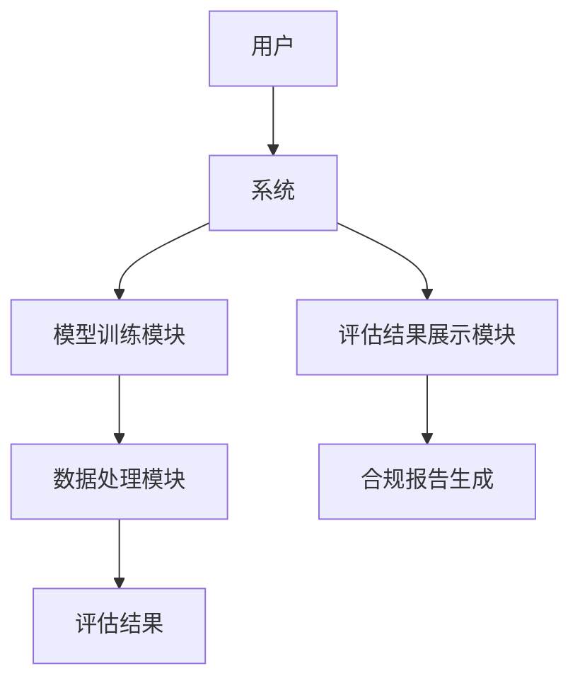
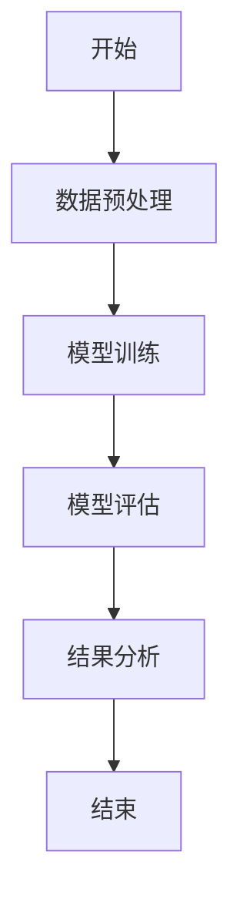

                 


# 开发基于大模型的金融合规培训效果评估系统

> 关键词：大模型，金融合规，培训效果评估，系统开发，人工智能

> 摘要：本文详细介绍了如何开发基于大模型的金融合规培训效果评估系统，从系统背景、核心概念、算法原理到系统架构设计，再到项目实战，层层深入，全面解析了该系统的开发过程和实际应用场景。通过本文的学习，读者可以掌握基于大模型的金融合规培训效果评估系统的开发方法和实际应用技巧。

---

## 第一部分：系统背景与核心概念

### 第1章：问题背景与核心概念

#### 1.1 问题背景

随着金融行业的快速发展，合规性问题变得越来越重要。金融合规培训的效果直接关系到金融机构的风险控制能力和合规性水平。传统的培训效果评估方法存在以下问题：

- **评估方式单一**：传统的评估方式主要依赖主观评分和问卷调查，缺乏客观性和科学性。
- **数据利用率低**：无法充分利用培训过程中的海量数据，难以实现精准评估。
- **实时性不足**：评估结果往往滞后于培训过程，无法提供实时反馈。

#### 1.2 问题解决方法

大模型技术的引入为金融合规培训效果评估提供了新的解决方案。通过大模型的强大计算能力和深度学习算法，可以实现以下目标：

- **智能化评估**：利用自然语言处理技术对培训内容和学员反馈进行智能分析，生成客观的评估结果。
- **数据驱动决策**：通过对海量数据的深度挖掘，发现潜在问题，提供个性化改进建议。
- **实时反馈**：实时监控学员的学习过程，提供即时反馈，帮助学员及时调整学习策略。

#### 1.3 系统边界与外延

本系统的主要功能是评估金融合规培训的效果，核心模块包括：

- **数据采集模块**：收集培训内容、学员反馈、考试成绩等数据。
- **模型训练模块**：基于大模型对数据进行分析，生成评估结果。
- **结果展示模块**：以可视化的方式呈现评估结果，便于用户理解和决策。

#### 1.4 系统核心概念与组成

系统的核心概念包括：

- **大模型**：基于深度学习的自然语言处理模型，用于分析文本数据。
- **评估指标**：包括准确性、召回率、F1分数等，用于衡量模型的性能。
- **领域知识库**：包含金融合规相关的法律法规和行业知识，用于模型的初始化训练。

系统组成包括：

- **数据层**：存储培训数据、学员数据等。
- **模型层**：包括大模型和评估算法。
- **应用层**：提供用户交互界面和结果展示。

---

### 第2章：大模型与金融合规评估的核心联系

#### 2.1 大模型的基本原理

大模型是一种基于深度学习的自然语言处理模型，其核心是通过大量的数据训练，使得模型能够理解和生成人类语言。大模型的主要特点包括：

- **大规模数据训练**：需要大量的文本数据进行训练，以确保模型的泛化能力。
- **深度学习架构**：通常采用多层神经网络结构，包括编码器和解码器。
- **上下文理解能力**：能够理解文本的上下文关系，生成连贯的文本。

#### 2.2 大模型与传统技术的对比

以下是大模型与传统技术的对比：

| 对比维度 | 大模型 | 传统技术 |
|----------|--------|----------|
| 数据需求 | 需要大量数据 | 数据需求较低 |
| 计算能力 | 需要高性能计算 | 计算能力要求较低 |
| 精度 | 高精度 | 精度较低 |
| 可扩展性 | 高扩展性 | 扩展性有限 |

#### 2.3 系统实体关系图



---

## 第二部分：系统算法原理与数学模型

### 第3章：系统算法原理

#### 3.1 算法流程概述

系统算法的主要流程包括以下步骤：

1. **数据预处理**：对原始数据进行清洗、归一化等处理，确保数据质量。
2. **模型训练**：基于大模型对预处理后的数据进行训练，生成评估模型。
3. **模型评估**：通过测试数据对模型进行评估，计算准确率、召回率等指标。
4. **结果分析**：根据评估结果，生成合规报告，提出改进建议。

#### 3.2 算法流程图



#### 3.3 算法实现代码

以下是一个简单的算法实现示例：

```python
import torch
from torch import nn

class SimpleModel(nn.Module):
    def __init__(self, input_dim, output_dim):
        super(SimpleModel, self).__init__()
        self.fc = nn.Linear(input_dim, output_dim)
        self.relu = nn.ReLU()
        self.sigmoid = nn.Sigmoid()

    def forward(self, x):
        x = self.fc(x)
        x = self.relu(x)
        x = self.sigmoid(x)
        return x

# 初始化模型
input_dim = 10
output_dim = 1
model = SimpleModel(input_dim, output_dim)

# 模型训练
criterion = nn.BCELoss()
optimizer = torch.optim.Adam(model.parameters(), lr=0.001)
```

---

### 第4章：数学模型与公式解析

#### 4.1 损失函数

损失函数用于衡量模型输出与真实值之间的差异。常用的损失函数包括均方误差（MSE）和二元交叉熵损失（BCE）。

- 均方误差：
  $$ MSE = \frac{1}{n}\sum_{i=1}^{n}(y_i - \hat{y}_i)^2 $$
  
- 二元交叉熵损失：
  $$ BCE = -\frac{1}{n}\sum_{i=1}^{n} y_i \log(\hat{y}_i) + (1 - y_i) \log(1 - \hat{y}_i) $$

#### 4.2 优化算法

优化算法用于调整模型参数，以最小化损失函数。常用的优化算法包括随机梯度下降（SGD）和Adam优化器。

- 随机梯度下降：
  $$ \theta_{t+1} = \theta_t - \eta \nabla L(\theta_t) $$
  
- Adam优化器：
  $$ m_t = \beta_1 m_{t-1} + (1 - \beta_1)g_t $$
  $$ v_t = \beta_2 v_{t-1} + (1 - \beta_2)g_t^2 $$
  $$ \theta_{t+1} = \theta_t - \alpha \frac{m_t}{\sqrt{v_t} + \epsilon} $$

---

## 第三部分：系统分析与架构设计

### 第5章：系统分析

#### 5.1 项目背景

随着金融行业的快速发展，合规性问题变得越来越重要。金融合规培训的效果直接关系到金融机构的风险控制能力和合规性水平。传统的培训效果评估方法存在以下问题：

- **评估方式单一**：传统的评估方式主要依赖主观评分和问卷调查，缺乏客观性和科学性。
- **数据利用率低**：无法充分利用培训过程中的海量数据，难以实现精准评估。
- **实时性不足**：评估结果往往滞后于培训过程，无法提供实时反馈。

#### 5.2 系统功能设计

系统功能设计包括以下几个方面：

- **数据采集模块**：收集培训内容、学员反馈、考试成绩等数据。
- **模型训练模块**：基于大模型对数据进行分析，生成评估结果。
- **结果展示模块**：以可视化的方式呈现评估结果，便于用户理解和决策。

#### 5.3 系统架构设计

系统架构设计包括以下几个部分：

- **数据层**：存储培训数据、学员数据等。
- **模型层**：包括大模型和评估算法。
- **应用层**：提供用户交互界面和结果展示。

#### 5.4 系统交互设计

系统交互设计包括以下几个步骤：

1. **用户输入**：用户输入培训数据和学员反馈。
2. **数据处理**：系统对输入数据进行预处理。
3. **模型训练**：系统基于大模型对数据进行训练，生成评估结果。
4. **结果展示**：系统以可视化的方式展示评估结果。

---

### 第6章：项目实战

#### 6.1 环境安装

需要安装以下环境：

- **Python**：3.6以上版本
- **PyTorch**：1.0以上版本
- **numpy**：1.21以上版本
- **matplotlib**：3.3以上版本

#### 6.2 系统核心实现代码

以下是一个简单的系统核心实现代码示例：

```python
import torch
import torch.nn as nn
import torch.optim as optim
import numpy as np
import matplotlib.pyplot as plt

class SimpleModel(nn.Module):
    def __init__(self, input_dim, output_dim):
        super(SimpleModel, self).__init__()
        self.fc = nn.Linear(input_dim, output_dim)
        self.relu = nn.ReLU()
        self.sigmoid = nn.Sigmoid()

    def forward(self, x):
        x = self.fc(x)
        x = self.relu(x)
        x = self.sigmoid(x)
        return x

# 初始化模型
input_dim = 10
output_dim = 1
model = SimpleModel(input_dim, output_dim)

# 定义损失函数和优化器
criterion = nn.BCELoss()
optimizer = optim.Adam(model.parameters(), lr=0.001)

# 训练过程
for epoch in range(100):
    outputs = model(input)
    loss = criterion(outputs, target)
    optimizer.zero_grad()
    loss.backward()
    optimizer.step()

# 可视化结果
plt.plot(loss_values)
plt.xlabel('Epoch')
plt.ylabel('Loss')
plt.show()
```

---

## 第四部分：总结与展望

### 第7章：总结

通过本文的介绍，读者可以了解到如何开发基于大模型的金融合规培训效果评估系统。从系统背景到核心概念，从算法原理到系统架构设计，再到项目实战，层层深入，全面解析了该系统的开发过程和实际应用场景。

---

### 第8章：展望

未来，随着大模型技术的不断发展，金融合规培训效果评估系统将更加智能化和精准化。一方面，可以进一步优化模型算法，提高评估的准确性；另一方面，可以拓展应用场景，实现金融合规培训的全流程智能化管理。

---

## 作者

作者：AI天才研究院/AI Genius Institute & 禅与计算机程序设计艺术 /Zen And The Art of Computer Programming

