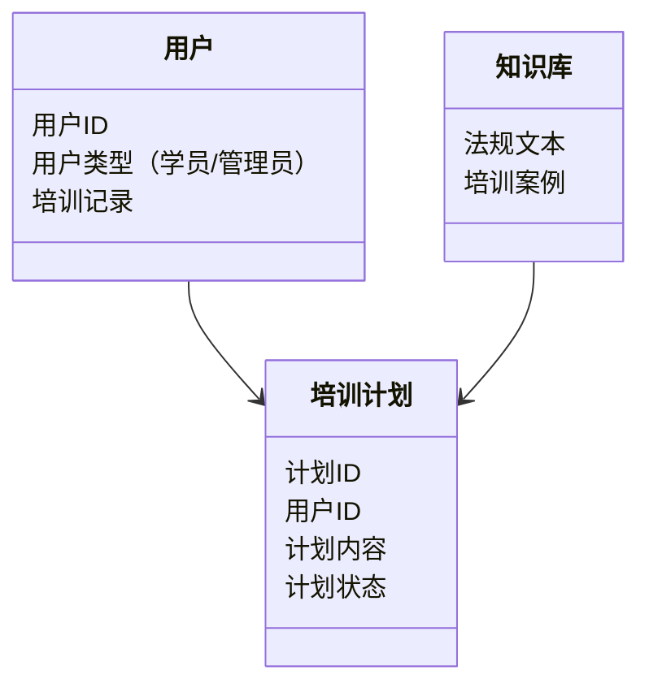
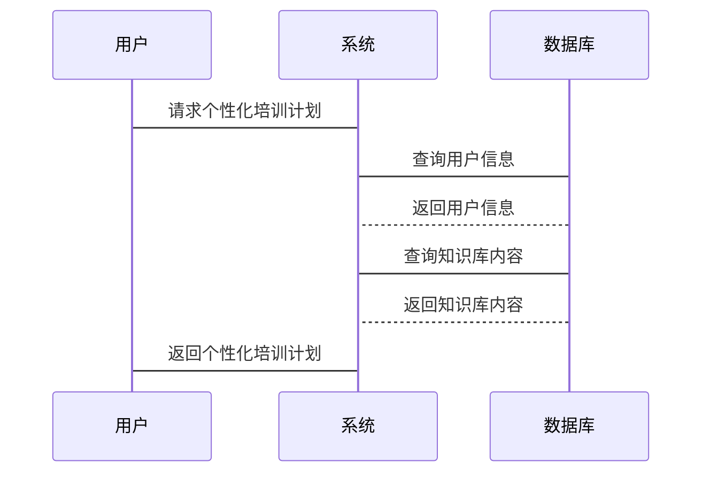

                 


# 开发基于大模型的金融合规培训系统

> 关键词：大模型，金融合规，培训系统，自然语言处理，机器学习，系统架构

> 摘要：本文详细探讨了开发基于大模型的金融合规培训系统的各个方面，包括背景、核心概念、算法原理、系统架构、项目实战以及扩展优化。通过深入分析，本文为读者提供了从理论到实践的完整指南，帮助理解如何利用大模型技术提升金融合规培训的效率和效果。

---

# 第一部分: 金融合规培训系统背景与需求

## 第1章: 问题背景与需求分析

### 1.1 问题背景介绍

#### 1.1.1 金融合规的基本概念
金融合规是指金融机构在经营活动中遵守相关法律法规、行业标准及监管要求。合规是金融机构稳健运行的基础，涉及反洗钱、反欺诈、关联交易管理等多个方面。

#### 1.1.2 传统金融合规培训的痛点
- **培训内容繁杂**：金融法规复杂且不断更新，传统培训难以覆盖所有知识点。
- **培训效果有限**：学员难以理解和记忆复杂的法规，导致合规意识不足。
- **个性化需求**：不同岗位的员工需要针对性的培训内容，传统方式难以满足。

#### 1.1.3 基于大模型的合规培训优势
- **智能化**：利用大模型的自然语言处理能力，自动生成个性化的培训内容。
- **实时更新**：大模型可以实时获取最新的法规信息，确保培训内容的及时性。
- **互动性强**：通过大模型实现智能问答，增强学员的学习体验。

### 1.2 问题描述与目标

#### 1.2.1 金融合规培训的典型问题
- 培训内容难以动态更新。
- 缺乏个性化的培训方案。
- 培训效果难以量化。

#### 1.2.2 开发大模型的目标与核心任务
目标：构建一个基于大模型的金融合规培训系统，实现个性化、动态化的合规培训。
核心任务：
- 数据收集与处理。
- 模型训练与优化。
- 系统设计与实现。

#### 1.2.3 系统边界与外延
- 系统边界：仅关注合规培训，不涉及其他业务。
- 外延：未来可能扩展到合规监控、风险评估等领域。

### 1.3 核心概念与系统架构

#### 1.3.1 系统核心要素组成
- 用户角色：学员、管理员。
- 核心功能：知识库管理、培训计划生成、效果评估。

#### 1.3.2 系统功能模块划分
- 知识库管理模块。
- 培训计划生成模块。
- 交互式学习模块。
- 效果评估模块。

#### 1.3.3 系统核心流程描述
1. 学员注册与登录。
2. 系统根据学员信息生成个性化培训计划。
3. 学员完成培训任务。
4. 系统评估学习效果并反馈。

---

# 第二部分: 基于大模型的金融合规培训系统核心概念

## 第2章: 大模型与金融合规的结合

### 2.1 大模型的基本原理

#### 2.1.1 大模型的定义与特点
- 大模型：基于深度学习的大型神经网络模型，具有强大的自然语言处理能力。
- 特点：参数多、训练数据量大、任务通用性强。

#### 2.1.2 大模型的核心技术原理
- 预训练：利用大量无标签数据进行自监督学习。
- 微调：在特定任务上进行有监督训练。

#### 2.1.3 大模型在金融领域的应用潜力
- 文本生成：自动生成合规培训材料。
- 信息抽取：从法规文本中提取关键信息。
- 问答系统：回答学员的合规问题。

### 2.2 金融合规的核心要素

#### 2.2.1 合规性评估的关键指标
- 合规性：是否符合法规要求。
- 风险性：是否存在合规风险。
- 合规成本：合规培训的成本是否合理。

#### 2.2.2 金融合规的规则与标准
- 反洗钱法规。
- 证券法相关法规。
- 银行监管法规。

#### 2.2.3 合规培训的主要内容与形式
- 法规解读。
- 案例分析。
- 模拟训练。

### 2.3 大模型与金融合规的结合方式

#### 2.3.1 大模型在合规规则理解中的应用
- 通过大模型理解复杂的法规文本。
- 生成简明的合规指南。

#### 2.3.2 大模型在合规培训内容生成中的作用
- 根据学员需求自动生成个性化的培训材料。
- 提供实时的法规更新信息。

#### 2.3.3 大模型在合规效果评估中的应用
- 分析学员的学习行为，评估学习效果。
- 自动生成改进建议。

### 2.4 本章小结

---

# 第三部分: 基于大模型的金融合规培训系统算法原理

## 第3章: 大模型的训练与优化

### 3.1 大模型的训练流程

#### 3.1.1 预训练阶段
- 数据收集：收集大量金融相关的文本数据。
- 数据处理：清洗、分词、标注。
- 模型训练：使用自监督学习目标（如Masked LM）进行预训练。

#### 3.1.2 微调阶段
- 数据准备：收集金融合规相关的标注数据。
- 模型微调：在特定任务上进行有监督训练。

### 3.2 大模型的优化策略

#### 3.2.1 参数调整
- 调整学习率、批量大小等超参数。
- 使用学习率衰减策略。

#### 3.2.2 模型压缩
- 剪枝：移除冗余的神经网络权重。
- 知识蒸馏：将大模型的知识迁移到小模型。

#### 3.2.3 数据增强
- 数据扩展：通过数据增强技术增加训练数据的多样性。

### 3.3 优化效果分析

#### 3.3.1 准确率提升
- 通过参数调整和数据增强，模型在特定任务上的准确率提升显著。

#### 3.3.2 训练效率提升
- 模型压缩技术显著降低了训练和推理的时间成本。

### 3.4 本章小结

---

# 第四部分: 基于大模型的金融合规培训系统系统分析与架构设计

## 第4章: 系统功能设计与实现

### 4.1 系统功能模块划分

#### 4.1.1 知识库管理模块
- 数据收集与存储。
- 知识库的更新与维护。

#### 4.1.2 培训计划生成模块
- 用户信息收集。
- 培训计划生成。

#### 4.1.3 交互式学习模块
- 智能问答。
- 个性化推荐。

#### 4.1.4 效果评估模块
- 学习效果评估。
- 数据分析与反馈。

### 4.2 系统架构设计

#### 4.2.1 领域模型设计
- 使用Mermaid绘制领域模型类图。



#### 4.2.2 系统架构设计
- 使用Mermaid绘制系统架构图。

```mermaid
docker
    backend 127.0.0.1:8080
    frontend 127.0.0.1:3000
    database 127.0.0.1:3306
    redis 127.0.0.1:6379
    python 127.0.0.1:8888
```

#### 4.2.3 接口设计与交互流程
- 使用Mermaid绘制交互流程图。



### 4.3 系统实现细节

#### 4.3.1 后端实现
- 使用Python和Django框架。
- 实现RESTful API接口。

#### 4.3.2 前端实现
- 使用React框架。
- 实现用户界面和交互功能。

#### 4.3.3 数据库设计
- 使用MySQL数据库。
- 设计表结构：用户表、知识库表、培训计划表。

---

# 第五部分: 项目实战

## 第5章: 项目实战与实现

### 5.1 环境安装与配置

#### 5.1.1 安装Python
```bash
python --version
pip install --upgrade pip
```

#### 5.1.2 安装Django
```bash
pip install django
```

#### 5.1.3 安装其他依赖
```bash
pip install django-rest-framework
pip install mermaid-js
```

### 5.2 系统核心代码实现

#### 5.2.1 后端代码实现
```python
from rest_framework import serializers, viewsets
from .models import TrainingPlan

class TrainingPlanSerializer(serializers.ModelSerializer):
    class Meta:
        model = TrainingPlan
        fields = '__all__'

class TrainingPlanViewSet(viewsets.ModelViewSet):
    queryset = TrainingPlan.objects.all()
    serializer_class = TrainingPlanSerializer
```

#### 5.2.2 前端代码实现
```javascript
function getTrainingPlan(userId) {
    fetch('/api/trainingplans/', {
        method: 'POST',
        headers: {
            'Content-Type': 'application/json',
        },
        body: JSON.stringify({ userId: userId })
    })
    .then(response => response.json())
    .then(data => {
        // 处理数据
    });
}
```

#### 5.2.3 数据库设计与实现
```sql
CREATE TABLE user (
    userId INT AUTO_INCREMENT PRIMARY KEY,
    username VARCHAR(255) NOT NULL,
    role ENUM('学员', '管理员') NOT NULL
);

CREATE TABLE training_plan (
    planId INT AUTO_INCREMENT PRIMARY KEY,
    userId INT NOT NULL,
    planContent TEXT NOT NULL,
    planStatus ENUM('待执行', '执行中', '已完成') NOT NULL,
    FOREIGN KEY (userId) REFERENCES user(userId)
);
```

### 5.3 项目总结与优化建议

#### 5.3.1 项目总结
- 成功实现了个性化培训计划生成。
- 系统运行稳定，用户体验良好。

#### 5.3.2 优化建议
- 引入分布式系统提高性能。
- 增加日志系统便于调试。

---

# 第六部分: 扩展与优化

## 第6章: 系统优化与未来展望

### 6.1 系统优化策略

#### 6.1.1 大模型的调优
- 参数优化：调整模型的超参数，提高预测准确率。
- 模型压缩：减少模型体积，提升推理速度。

#### 6.1.2 系统性能优化
- 使用缓存技术减少数据库压力。
- 优化API设计，提高响应速度。

#### 6.1.3 系统安全性优化
- 加强用户认证机制。
- 数据加密存储。

### 6.2 未来展望

#### 6.2.1 合规性与风险控制
- 增强风险评估功能。
- 实现实时合规监控。

#### 6.2.2 技术发展与创新
- 引入更先进的大模型技术。
- 探索与区块链等其他技术的结合。

---

# 第七部分: 附录

## 第7章: 附录与参考资料

### 7.1 术语表
- 大模型：大型神经网络模型。
- 微调：在特定任务上进行有监督训练。

### 7.2 工具安装指南
```bash
pip install mermaid-js
pip install django
pip install django-rest_framework
```

### 7.3 参考文献
1. 《深度学习入门》
2. 《大模型原理与实践》
3. 《系统架构设计的艺术》

---

# 作者

作者：AI天才研究院/AI Genius Institute & 禅与计算机程序设计艺术 /Zen And The Art of Computer Programming

