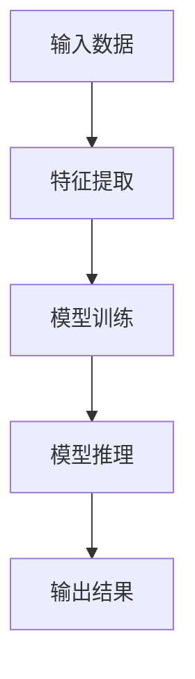
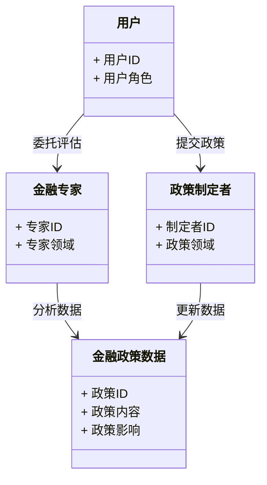
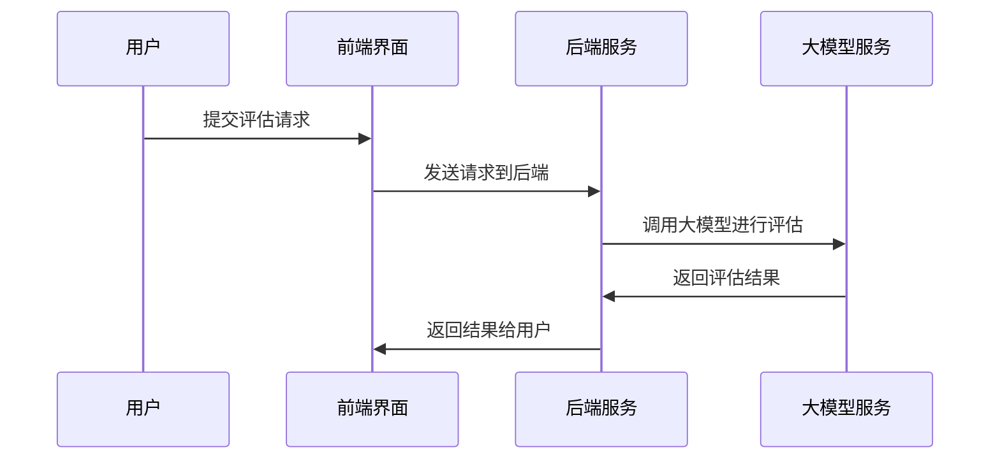

                 


# 开发基于大模型的金融政策影响评估工具

> 关键词：大模型，金融政策，影响评估，工具开发，算法原理

> 摘要：本文详细探讨了开发基于大模型的金融政策影响评估工具的各个方面，包括背景分析、核心概念、算法原理、系统架构设计以及项目实战。通过系统的分析和具体的实现步骤，展示了如何利用大模型技术提升金融政策评估的效率和准确性。

---

## 第1章: 金融政策影响评估工具的背景与需求

### 1.1 问题背景与挑战

#### 1.1.1 金融政策评估的传统方法与局限性
传统的金融政策评估方法主要依赖于经济模型和专家经验，存在以下问题：
- 数据量有限，难以捕捉复杂市场动态。
- 评估过程耗时较长，难以实时反馈。
- 专家经验依赖性强，主观性较高。

#### 1.1.2 大模型技术在金融领域的应用潜力
大模型技术（如GPT系列）具有以下优势：
- 能够处理海量文本数据，提取深层次信息。
- 可以快速生成分析报告，提升评估效率。
- 可扩展性强，适用于多种金融场景。

#### 1.1.3 金融政策影响评估工具的市场需求
随着金融市场的日益复杂化，政策制定者和金融机构迫切需要一种高效、准确的工具来评估政策影响。这为基于大模型的工具开发提供了广阔的应用场景。

### 1.2 问题描述与目标

#### 1.2.1 金融政策影响的多维度评估需求
金融政策的影响涉及多个方面，包括市场波动、企业行为、经济指标等。工具需要能够从多个维度进行综合评估。

#### 1.2.2 工具开发的核心目标与关键指标
- 核心目标：提供准确的政策影响预测和可行的建议。
- 关键指标：评估速度、准确率、可解释性。

#### 1.2.3 边界与外延：工具的功能范围与限制
工具主要关注政策的直接影响，暂不考虑政策的间接影响（如长期经济结构调整）。

### 1.3 核心概念与联系

#### 1.3.1 金融政策影响评估工具的核心要素
- 输入数据：金融政策内容、市场数据、经济指标。
- 处理模块：数据清洗、特征提取、模型推理。
- 输出结果：影响预测、建议报告。

#### 1.3.2 实体关系图

```mermaid
er
actor: 用户
actor: 金融专家
actor: 政策制定者
database: 金融政策数据
database: 市场行为数据
database: 经济指标数据
```

---

## 第2章: 大模型技术基础与算法原理

### 2.1 大模型技术的核心原理

#### 2.1.1 大模型的训练机制
大模型通常采用大规模预训练（Pre-training）和微调（Fine-tuning）的策略，通过海量数据学习语言特征。

#### 2.1.2 大模型的推理机制
基于生成式模型，通过条件概率生成文本内容。

#### 2.1.3 可解释性问题
通过注意力机制和概率分布分析，提升模型的可解释性。

### 2.2 金融政策影响评估的算法选择

#### 2.2.1 传统算法与大模型算法的对比
- 传统算法：依赖于特定的特征工程，灵活性较差。
- 大模型算法：具有更强的泛化能力，能够处理非结构化数据。

#### 2.2.2 基于大模型的评估算法流程



#### 2.2.3 数学模型与公式
政策影响概率公式：
$$ P(\text{影响}) = \sum_{i=1}^{n} w_i \cdot x_i $$
其中，$w_i$为权重，$x_i$为特征值。

### 2.3 算法实现与优化

#### 2.3.1 算法实现的步骤与代码示例
```python
def policy_impact_prediction(policy_text, market_data):
    # 特征提取
    features = extract_features(policy_text, market_data)
    # 模型推理
    impact_prob = model.predict(features)
    return impact_prob
```

#### 2.3.2 算法优化策略
- 参数调优：通过实验确定最优超参数。
- 数据增强：增加多样化的数据样本。

#### 2.3.3 性能评估与改进
通过准确率、召回率等指标评估模型性能，并针对性优化。

### 2.4 本章小结

---

## 第3章: 系统架构与设计

### 3.1 系统功能设计

#### 3.1.1 系统功能模块划分
- 用户界面：输入政策内容，查看评估结果。
- 数据处理：清洗和预处理数据。
- 模型推理：调用大模型进行评估。
- 结果展示：生成可视化报告。

#### 3.1.2 系统功能流程图


### 3.2 系统架构设计

#### 3.2.1 系统架构图



#### 3.2.2 系统模块之间的交互关系


### 3.3 接口设计与交互流程

#### 3.3.1 系统接口定义
- 输入接口：接收政策文本和相关数据。
- 输出接口：返回评估结果和建议报告。

#### 3.3.2 系统交互流程图



### 3.4 本章小结

---

## 第4章: 项目实战与代码实现

### 4.1 环境搭建与工具安装

#### 4.1.1 开发环境配置
- 操作系统：建议使用Linux或Windows 10。
- 开发工具：Python、Jupyter Notebook、Git。

#### 4.1.2 大模型框架的安装与配置
- 安装：使用 pip 安装 PyTorch 或 TensorFlow。
- 配置：设置 GPU 支持（如NVIDIA GPU）。

### 4.2 系统核心实现源代码

#### 4.2.1 数据处理模块
```python
def preprocess_data(policy_text, market_data):
    # 数据清洗和特征提取
    features = []
    for text in policy_text:
        features.append(extract_features(text, market_data))
    return features
```

#### 4.2.2 模型推理模块
```python
def model_inference(features):
    # 调用大模型进行预测
    outputs = model(features)
    return outputs
```

### 4.3 案例分析与详细解读

#### 4.3.1 案例背景
假设我们要评估一项新的货币政策对股市的影响。

#### 4.3.2 数据准备
- 政策文本：包括政策内容和目标。
- 市场数据：包括历史股价、交易量等。

#### 4.3.3 评估过程
1. 数据清洗和特征提取。
2. 调用大模型进行推理。
3. 生成评估报告。

### 4.4 本章小结

---

## 第5章: 总结与注意事项

### 5.1 总结
本文详细介绍了开发基于大模型的金融政策影响评估工具的各个方面，从背景分析到系统实现，展示了如何利用大模型技术提升金融政策评估的效率和准确性。

### 5.2 注意事项
- 数据隐私问题：确保数据的合法性和安全性。
- 模型解释性：需要进一步优化模型的可解释性。
- 持续优化：定期更新模型和数据，保持工具的准确性。

### 5.3 最佳实践 Tips
- 结合领域知识优化模型。
- 多与专家合作，验证模型的准确性。

### 5.4 未来展望
未来可以考虑将工具扩展到更多金融场景，如风险管理、投资决策等。

---

## 作者：AI天才研究院/AI Genius Institute & 禅与计算机程序设计艺术 /Zen And The Art of Computer Programming

