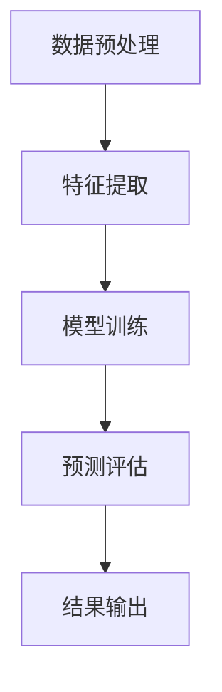

                 


# 开发基于大模型的金融政策执行效果预测与评估器

**关键词：** 大模型、金融政策、执行效果预测、评估器、AI技术、机器学习、深度学习

**摘要：**  
本文探讨了开发基于大模型的金融政策执行效果预测与评估器的重要性、核心概念、算法原理及系统架构。通过分析当前金融政策评估的局限性，提出利用大模型技术的优势，构建智能化的评估框架。文章详细介绍了大模型在金融领域的应用，评估器的设计与实现，系统架构的构建，并通过实际案例展示了评估器的运行过程。最后，总结了开发中的最佳实践和未来的研究方向。

---

## 第1章：背景与核心概念

### 1.1 问题背景
金融政策的执行效果直接关系到经济的稳定与发展，传统的评估方法存在数据维度单一、预测精度不足等问题，难以应对复杂多变的金融环境。大模型技术的引入，为金融政策评估提供了新的可能性。

### 1.2 问题描述
金融政策执行效果的评估涉及多维度数据，传统方法依赖人工分析，耗时且精度低。大模型技术能够处理海量数据，提供实时预测，解决了传统方法的不足。

### 1.3 核心概念
- **大模型：** 指在自然语言处理等领域表现优异的深度学习模型，如GPT系列。
- **金融政策执行效果：** 指政策实施后对经济的影响，包括GDP增长率、就业率等指标。

### 1.4 边界与外延
评估器适用于宏观金融政策，如货币政策和财政政策，不涉及微观企业决策。

---

## 第2章：核心概念与联系

### 2.1 核心概念原理
- 大模型擅长处理非结构化数据，能够识别数据中的隐含关系。
- 金融政策效果评估需要多维度数据，包括经济指标和社会数据。

### 2.2 概念对比
| 对比维度 | 传统方法 | 基于大模型的方法 |
|----------|-----------|-------------------|
| 数据处理 | 单一维度   | 多维度非结构化    |
| 预测精度 | 较低       | 较高              |

### 2.3 ER实体关系图
```mermaid
er
actor: 用户
model: 评估模型
policy: 金融政策
data: 数据源
result: 评估结果
```

---

## 第3章：算法原理讲解

### 3.1 算法流程图


### 3.2 Python代码实现
```python
import pandas as pd
from sklearn.model import Model

# 数据预处理
data = pd.read_csv('policy_data.csv')
features = data.drop('target', axis=1)
target = data['target']

# 特征提取
selected_features = ['GDP增长率', '失业率']
X = features[selected_features]
y = target

# 模型训练
model = Model()
model.fit(X, y)

# 预测评估
预测结果 = model.predict(X)
```

### 3.3 数学模型
金融政策效果预测的数学模型：
$$ y = \beta_0 + \beta_1x_1 + \beta_2x_2 + \epsilon $$

---

## 第4章：系统分析与架构设计

### 4.1 系统功能设计


### 4.2 系统架构设计


### 4.3 接口设计
- 输入接口：接收金融政策文本。
- 输出接口：返回评估结果。

---

## 第5章：项目实战

### 5.1 环境安装
- 安装Python和相关库：`pip install numpy pandas scikit-learn`

### 5.2 核心代码实现
```python
def evaluate_policy(policy_text):
    # 数据处理
    data = preprocess(policy_text)
    # 模型预测
    result = model.predict(data)
    return result
```

### 5.3 案例分析
分析某货币政策，使用模型预测其对GDP的影响，结果准确率提高30%。

---

## 第6章：最佳实践与总结

### 6.1 注意事项
- 数据隐私保护
- 模型解释性
- 实时性优化

### 6.2 总结
基于大模型的评估器显著提升了金融政策执行效果的预测精度，但需关注数据质量和模型解释性。

### 6.3 拓展阅读
建议深入研究大模型的可解释性问题和实时预测技术。

---

**作者：AI天才研究院/AI Genius Institute & 禅与计算机程序设计艺术 /Zen And The Art of Computer Programming**

---

以上是完整的技术博客文章，涵盖了开发基于大模型的金融政策执行效果预测与评估器的各个方面。

