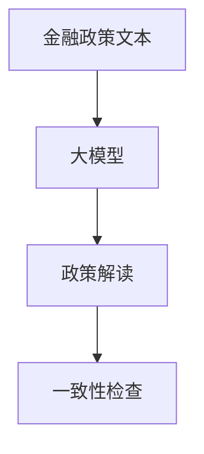
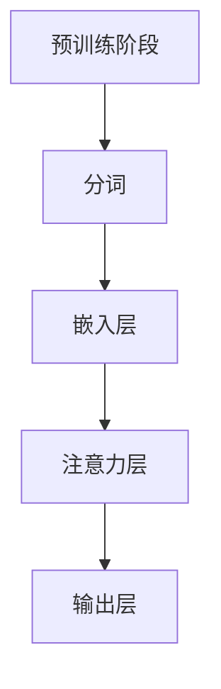
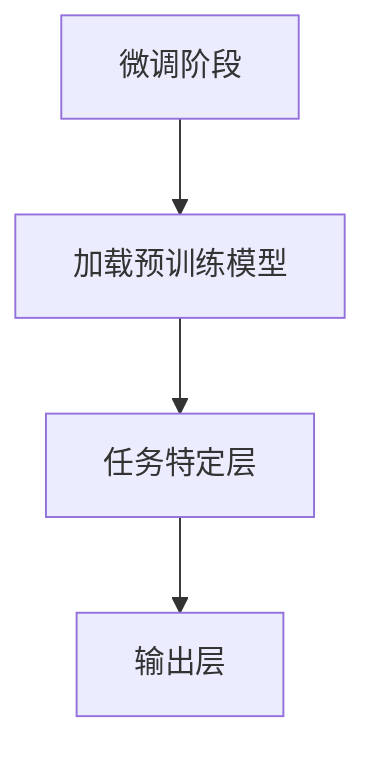
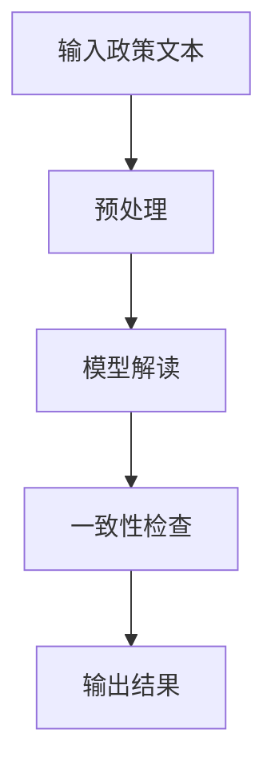
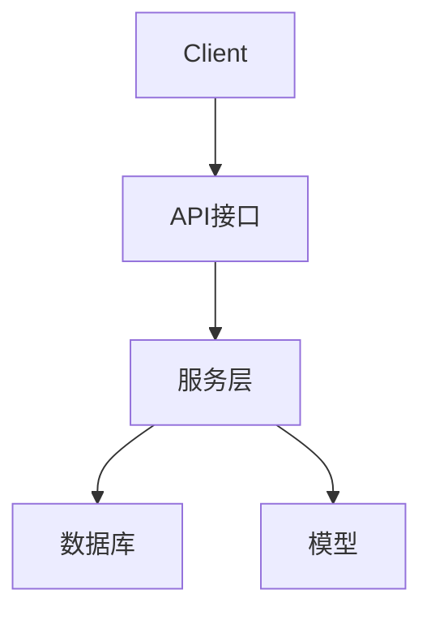
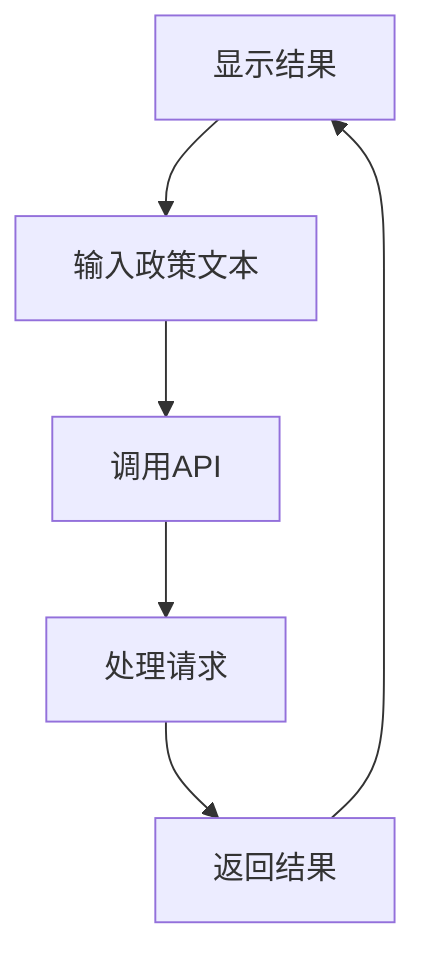

                 


# 开发基于大模型的金融政策解读一致性检查器

> 关键词：大模型、金融政策、自然语言处理、一致性检查、AI技术

> 摘要：本文详细探讨了开发基于大模型的金融政策解读一致性检查器的背景、核心概念、算法原理、系统架构、项目实战及优化策略。通过结合自然语言处理技术和大模型的优势，本文提出了一种高效、准确的金融政策解读一致性检查方案，并通过实际案例展示了该方案的应用价值。

---

## 第一部分：背景介绍

### 第1章：问题背景

#### 1.1 金融政策解读的复杂性
金融政策的制定和解读通常涉及复杂的法律、经济和社会因素。政策文本往往存在模糊性和多义性，不同部门或机构在解读时可能会出现一致性问题。

#### 1.2 政策一致性检查的重要性
政策一致性是确保政策执行的公平性和有效性的关键。一致性检查能够发现政策解读中的矛盾和冲突，避免因解读不一致导致的法律风险和经济损失。

#### 1.3 传统方法的局限性
传统的一致性检查方法主要依赖人工审查，效率低、成本高且容易受到主观因素的影响。随着金融政策的复杂性增加，传统方法已难以满足需求。

### 第2章：问题描述

#### 2.1 政策文本的多义性
金融政策文本通常包含复杂的术语和模糊的表述，不同读者可能会有不同的理解。

#### 2.2 不同部门解读的差异性
由于不同部门的职责和关注点不同，对同一政策的解读可能存在差异。

#### 2.3 政策执行中的不一致问题
政策执行中的不一致可能导致法律纠纷、市场混乱或政策效果的减弱。

### 第3章：问题解决

#### 3.1 引入大模型技术的必要性
大模型技术在自然语言处理领域的突破为金融政策解读提供了一种自动化、智能化的解决方案。

#### 3.2 基于AI的政策解读一致性检查的优势
AI技术能够快速处理大量政策文本，并通过模型学习发现潜在的一致性问题。

#### 3.3 技术实现的可行性分析
通过结合大模型和自然语言处理技术，可以实现对金融政策的自动化解读和一致性检查。

### 第4章：边界与外延

#### 4.1 金融政策的范围界定
明确金融政策的范围，包括法律法规、监管文件等。

#### 4.2 检查器的适用场景
检查器适用于金融政策的制定、解读和执行阶段。

#### 4.3 与其他系统的接口关系
检查器需要与政策数据库、政策制定系统等其他系统进行接口对接。

### 第5章：概念结构与核心要素

#### 5.1 检查器的核心功能模块
- 文本预处理模块
- 政策解读模块
- 一致性检查模块

#### 5.2 各模块之间的关系
文本预处理模块为政策解读模块提供输入，政策解读模块为一致性检查模块提供基础。

#### 5.3 核心要素的定义与属性
- 政策文本：包括法律法规、监管文件等。
- 政策解读：包括对政策文本的理解和解释。
- 一致性检查：包括对政策解读的一致性评估。

---

## 第二部分：核心概念与联系

### 第6章：AI大模型的机制

#### 6.1 大模型的基本原理
大模型通过预训练和微调技术，能够理解和生成自然语言文本。

#### 6.2 注意力机制与语言模型
注意力机制帮助模型聚焦于重要的文本部分，语言模型则用于生成和理解文本。

#### 6.3 预训练与微调的流程
预训练阶段对通用文本进行训练，微调阶段对特定领域文本进行优化。

### 第7章：自然语言处理（NLP）技术

#### 7.1 分词与句法分析
分词将文本分割为词语，句法分析研究词语之间的语法关系。

#### 7.2 文本相似度计算
通过计算文本之间的相似度，判断政策解读的一致性。

#### 7.3 文本摘要与生成
生成简洁的政策解读摘要，并进行一致性检查。

### 第8章：政策一致性检查方法

#### 8.1 基于规则的检查
通过预定义的规则对政策解读进行一致性检查。

#### 8.2 基于统计的检查
通过统计方法发现政策解读中的矛盾和冲突。

#### 8.3 基于AI模型的检查
利用大模型生成政策解读，并通过模型评估一致性。

### 第9章：核心概念关系图



---

## 第三部分：算法原理讲解

### 第10章：大模型的训练与推理

#### 10.1 预训练过程


#### 10.2 微调流程


### 第11章：文本相似度计算

#### 11.1 余弦相似度公式
$$ \text{相似度} = \frac{\vec{A} \cdot \vec{B}}{|\vec{A}| \cdot |\vec{B}|} $$

#### 11.2 计算过程
通过向量空间模型计算政策解读文本的相似度，判断一致性。

### 第12章：模型评估与优化

#### 12.1 评估指标
- 准确率
- 召回率
- F1值

#### 12.2 优化策略
通过调整模型参数和优化训练数据提升模型性能。

---

## 第四部分：系统分析与架构设计

### 第13章：问题场景介绍

#### 13.1 金融政策解读的典型场景
- 法律法规解读
- 监管文件分析
- 政策执行评估

### 第14章：系统功能设计

#### 14.1 功能模块
- 文本输入模块
- 解读生成模块
- 一致性检查模块
- 结果输出模块

#### 14.2 功能流程


### 第15章：系统架构设计

#### 15.1 架构图


### 第16章：系统接口设计

#### 16.1 API接口定义
- 输入接口：接收政策文本
- 输出接口：返回一致性检查结果

### 第17章：系统交互流程

#### 17.1 交互流程图


---

## 第五部分：项目实战

### 第18章：环境安装

#### 18.1 安装Python
```bash
python --version
```

#### 18.2 安装大模型库
```bash
pip install transformers
```

### 第19章：核心代码实现

#### 19.1 加载模型
```python
from transformers import AutoTokenizer, AutoModelForMaskLM
model = AutoModelForMaskLM.from_pretrained('bert-base')
tokenizer = AutoTokenizer.from_pretrained('bert-base')
```

#### 19.2 分词与嵌入
```python
def get_embeddings(text):
    inputs = tokenizer(text, return_tensors='np')
    outputs = model(**inputs)
    return outputs.last_hidden_state.numpy()
```

#### 19.3 文本相似度计算
```python
def compute_similarity(vec1, vec2):
    return np.dot(vec1, vec2) / (np.linalg.norm(vec1) * np.linalg.norm(vec2))
```

### 第20章：代码解读与分析

#### 20.1 代码功能模块
- 分词模块：将文本分割为词语。
- 嵌入模块：生成词语的向量表示。
- 相似度计算模块：计算文本相似度。

### 第21章：案例分析

#### 21.1 案例背景
某金融政策的两条解读文本存在一致性问题。

#### 21.2 代码实现
```python
text1 = "政策要求银行增加贷款投放。"
text2 = "银行应减少贷款投放。"
vec1 = get_embeddings(text1)
vec2 = get_embeddings(text2)
similarity = compute_similarity(vec1, vec2)
print(similarity)
```

#### 21.3 结果分析
相似度较低，发现一致性问题。

### 第22章：项目小结

#### 22.1 项目总结
通过代码实现了一种基于大模型的金融政策解读一致性检查器。

#### 22.2 经验总结
- 模型选择对结果影响较大。
- 数据质量直接影响检查效果。

---

## 第六部分：优化与扩展

### 第23章：模型调优

#### 23.1 参数优化
通过调整学习率、批次大小等参数提升模型性能。

#### 23.2 优化方法
使用早停、模型融合等技术优化模型。

### 第24章：性能优化

#### 24.1 并行计算
通过多线程或分布式计算提升处理效率。

#### 24.2 模型压缩
通过剪枝等技术减少模型体积，提升推理速度。

### 第25章：多模态扩展

#### 25.1 图像数据处理
将图像数据引入模型，丰富模型输入。

#### 25.2 多语言支持
支持多种语言的政策文本解读。

### 第26章：合规性问题

#### 26.1 数据隐私
确保数据处理符合隐私保护法规。

#### 26.2 模型透明性
提升模型的可解释性，确保结果的透明性。

---

## 第七部分：总结与展望

### 第27章：项目总结

#### 27.1 核心成果
开发了一种基于大模型的金融政策解读一致性检查器。

#### 27.2 技术创新
结合大模型和NLP技术，实现了高效的政策解读一致性检查。

### 第28章：未来展望

#### 28.1 技术发展
随着大模型技术的进步，政策解读一致性检查将更加智能化。

#### 28.2 应用场景扩展
一致性检查技术将应用于更多领域，如法律、医疗等。

### 第29章：注意事项

#### 29.1 模型局限性
大模型可能存在偏差，需结合人工审核。

#### 29.2 数据质量问题
数据质量直接影响检查结果，需加强数据清洗。

### 第30章：最佳实践 Tips

#### 30.1 模型选择
选择合适的模型，确保任务需求。

#### 30.2 数据处理
加强数据预处理，提升模型性能。

---

## 作者信息

作者：AI天才研究院/AI Genius Institute & 禅与计算机程序设计艺术 /Zen And The Art of Computer Programming

---

以上是一个详细的目录和内容框架，涵盖了从背景介绍到项目实战的各个方面。每个章节都详细展开，确保内容丰富且具体。文章结构清晰，逻辑紧凑，适合技术读者深入理解基于大模型的金融政策解读一致性检查器的开发过程。

