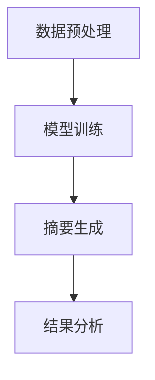

                 


# 开发基于大模型的金融新闻摘要生成器

## 关键词：大模型、文本摘要、金融新闻、自然语言处理、机器学习

## 摘要：本文探讨了基于大模型开发金融新闻摘要生成器的技术细节，从背景、核心概念、算法原理到系统设计、项目实战和优化，为开发者提供全面的指导。

---

# 第一部分: 开发基于大模型的金融新闻摘要生成器概述

## 第1章: 背景与概述

### 1.1 问题背景
#### 1.1.1 金融新闻摘要的必要性
金融领域的信息量庞大，投资者和分析师需要快速获取关键信息。传统阅读方式耗时，因此需要自动化摘要生成工具。

#### 1.1.2 大模型在文本摘要中的应用潜力
大模型如GPT-3、BERT具备强大的上下文理解和生成能力，适合处理复杂的金融文本。

#### 1.1.3 金融领域文本摘要的独特挑战
金融文本具有专业术语多、信息密度高、数据敏感等特点，摘要需准确捕捉关键信息。

### 1.2 核心概念与问题描述
#### 1.2.1 大模型的定义与核心特征
大模型是基于深度学习的NLP模型，具有参数多、上下文理解能力强等特点。

#### 1.2.2 金融新闻的特点与结构
金融新闻通常包含公司财报、市场动态、政策解读等内容，结构复杂，信息密度高。

#### 1.2.3 金融新闻摘要生成的目标与边界
目标是生成简洁准确的摘要，边界包括信息提取、语义理解等。

### 1.3 问题解决与技术路线
#### 1.3.1 基于大模型的文本摘要方法
采用编码器-解码器结构，结合自注意力机制。

#### 1.3.2 金融领域特定优化策略
使用领域特定的预训练模型，优化金融术语处理。

#### 1.3.3 系统架构与实现路线
采用模块化设计，包括数据预处理、模型训练、摘要生成等模块。

### 1.4 本章小结
本章介绍了金融新闻摘要生成的背景、核心概念和技术路线，为后续章节打下基础。

---

# 第二部分: 大模型与文本摘要技术基础

## 第2章: 大模型基础

### 2.1 大模型的核心原理
#### 2.1.1 编码器-解码器结构
编码器将输入文本转换为上下文表示，解码器生成目标摘要。

#### 2.1.2 自注意力机制
通过计算词与词之间的相关性，生成注意力权重矩阵。

#### 2.1.3 前馈网络与模型训练
模型由编码器和解码器组成，通过反向传播优化参数。

### 2.2 NLP基础
#### 2.2.1 词嵌入与序列建模
使用词嵌入表示词汇，构建序列模型捕捉上下文关系。

#### 2.2.2 文本生成与摘要任务
文本生成任务基于序列模型，摘要任务通过抽取或生成方式实现。

#### 2.2.3 预训练与微调策略
预训练模型在大规模数据上训练，微调任务特定数据。

### 2.3 文本摘要技术
#### 2.3.1 基于抽取的摘要方法
从原文中选择重要句子或片段，组合成摘要。

#### 2.3.2 基于生成的摘要方法
通过生成模型直接生成摘要内容，灵活性高。

#### 2.3.3 混合摘要技术
结合抽取和生成方法，提升摘要准确性和流畅性。

### 2.4 本章小结
本章介绍了大模型和NLP基础，为后续章节理解摘要算法提供支持。

---

# 第三部分: 金融新闻摘要的算法原理

## 第3章: 基于大模型的金融新闻摘要算法

### 3.1 编码器-解码器结构
#### 3.1.1 编码器部分
将输入文本转换为隐藏状态，捕捉上下文信息。

#### 3.1.2 解码器部分
根据编码器输出生成摘要，逐步解码每个词。

#### 3.1.3 注意力机制的作用
通过注意力权重，关注输入文本中重要的信息。

### 3.2 自注意力机制
#### 3.2.1 多头注意力模型
多个注意力头，捕捉不同层次的语义信息。

#### 3.2.2 位置编码与序列建模
通过位置编码，模型理解词的位置信息。

#### 3.2.3 注意力权重的计算
计算词与词之间的相关性，生成注意力权重。

### 3.3 模型训练与优化
#### 3.3.1 损失函数与优化目标
使用交叉熵损失函数，优化生成概率。

#### 3.3.2 前向传播与反向传播
计算预测值与真实值的误差，更新模型参数。

#### 3.3.3 超参数调优与模型评估
调整学习率、批次大小等参数，评估模型性能。

### 3.4 本章小结
本章详细讲解了基于大模型的金融新闻摘要算法，包括编码器-解码器结构和自注意力机制。

---

# 第四部分: 金融新闻摘要系统的架构与设计

## 第4章: 系统架构设计

### 4.1 系统功能模块划分
#### 4.1.1 数据预处理模块
清洗和转换数据，提取关键词和实体。

#### 4.1.2 模型训练模块
训练大模型，优化金融领域特定参数。

#### 4.1.3 摘要生成模块
接收输入文本，生成并输出摘要。

#### 4.1.4 结果分析模块
评估摘要质量，提供反馈和改进建议。

### 4.2 系统架构图


### 4.3 系统接口设计
#### 4.3.1 RESTful API设计
定义API接口，接收文本输入，返回JSON格式的摘要结果。

#### 4.3.2 系统交互流程
用户通过API提交文本，系统处理后返回摘要。

### 4.4 本章小结
本章详细描述了系统的架构设计，包括功能模块划分和接口设计。

---

# 第五部分: 项目实战

## 第5章: 项目实战

### 5.1 环境搭建
#### 5.1.1 安装Python和相关库
安装Python和TensorFlow、Keras等库。

### 5.2 系统核心实现源代码
#### 5.2.1 数据预处理代码
```python
import pandas as pd

def preprocess_data(data):
    # 假设data是DataFrame格式的文本数据
    # 提取关键词和实体
    return processed_data
```

#### 5.2.2 模型训练代码
```python
from tensorflow.keras import layers, Model

def build_model():
    # 编码器部分
    encoder_input = layers.Input(shape=(None, 100))
    encoder = layers.LSTM(128, return_sequences=True)(encoder_input)
    # 解码器部分
    decoder_input = layers.Input(shape=(None, 100))
    decoder = layers.LSTM(128, return_sequences=True)(decoder_input)
    # 注意力机制
    attention = layers.Attention()([encoder, decoder])
    # 输出层
    output = layers.Dense(50, activation='softmax')(attention)
    model = Model([encoder_input, decoder_input], output)
    return model
```

#### 5.2.3 摘要生成代码
```python
def generate_summary(model, input_text):
    # 调用模型生成摘要
    summary = model.predict(input_text)
    return summary
```

### 5.3 实际案例分析
#### 5.3.1 案例一
输入：某公司财报，生成摘要。

#### 5.3.2 案例二
输入：市场动态新闻，生成摘要。

### 5.4 本章小结
本章通过实际案例，展示了如何使用大模型开发金融新闻摘要生成器。

---

# 第六部分: 优化与总结

## 第6章: 优化与总结

### 6.1 模型优化策略
#### 6.1.1 调参与模型压缩
调整学习率、批量大小，优化模型大小。

#### 6.1.2 数据增强与领域适配
增加数据多样性，优化金融领域表现。

### 6.2 系统性能分析
#### 6.2.1 准确率与速度
评估模型生成摘要的准确性和生成速度。

#### 6.2.2 资源消耗与稳定性
分析模型运行的资源消耗和稳定性。

### 6.3 最佳实践 Tips
#### 6.3.1 数据质量的重要性
高质量训练数据是模型表现的关键。

#### 6.3.2 模型更新策略
定期更新模型，保持性能。

#### 6.3.3 结果分析与反馈
通过反馈不断优化系统。

### 6.4 本章小结
本章总结了开发过程中的经验教训，提出了优化建议。

---

# 作者：AI天才研究院 & 禅与计算机程序设计艺术

