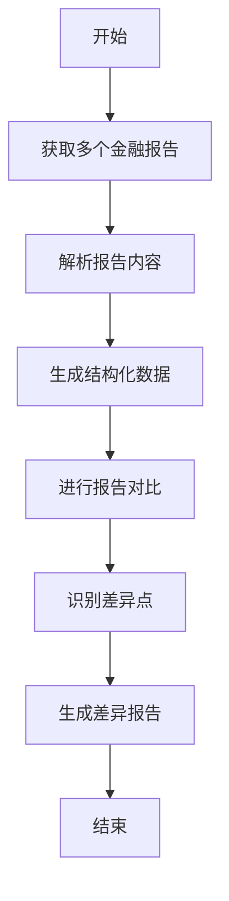
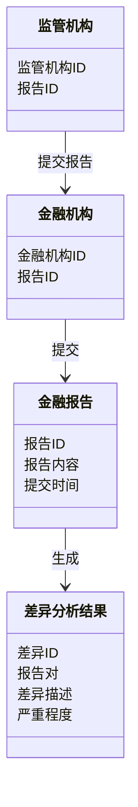
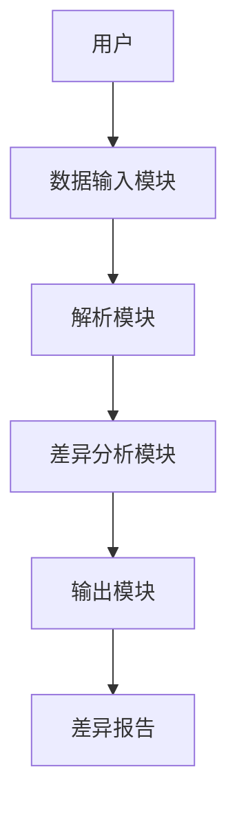

                 


# 开发基于大模型的金融监管报告差异化分析助手

> 关键词：金融监管，大模型，差异化分析，报告生成，实体关系图，数学模型，系统架构

> 摘要：本文详细介绍了如何开发基于大模型的金融监管报告差异化分析助手。通过分析金融监管的核心问题，结合大模型技术，提出了一个高效的解决方案。本文从问题背景、核心概念、算法原理、系统架构到项目实战，全面阐述了开发过程，并通过具体案例展示了该助手的实际应用价值。

---

## 第1章: 问题背景与核心概念

### 1.1 问题背景

金融监管是保障金融市场健康运行的重要手段，其核心目标是确保金融机构的合规性、风险管理和透明度。然而，传统金融监管手段存在以下问题：

1. **数据量大**：金融机构每天生成大量报告，人工审查效率低下。
2. **复杂性高**：金融报告内容复杂，涉及多个领域，传统规则难以覆盖所有场景。
3. **实时性要求高**：金融市场变化迅速，监管需要快速响应。

大模型技术的引入为金融监管带来了新的可能性。大模型具有强大的自然语言处理能力和模式识别能力，能够高效处理大量非结构化数据，帮助监管机构快速发现潜在问题。

### 1.2 核心概念与问题描述

#### 1.2.1 金融监管报告

金融监管报告是金融机构按照监管要求定期提交的文件，内容包括财务状况、风险管理、合规性等信息。这些报告通常包含大量的文本数据，需要通过分析和对比来发现差异。

#### 1.2.2 差异化分析

差异化分析是指对多个金融监管报告进行对比，识别出报告之间的差异点。通过分析差异，监管机构可以发现潜在的风险和问题，从而采取相应的措施。

#### 1.2.3 大模型在金融监管中的应用

大模型技术可以通过自然语言处理和深度学习，自动解析和分析金融报告，生成结构化的数据，并进行差异对比。这种技术能够显著提高监管效率，降低人工审查的成本。

### 1.3 问题解决与边界

#### 1.3.1 大模型如何解决金融监管问题

大模型技术可以自动解析金融报告，提取关键信息，生成结构化的数据，从而实现快速的报告对比和差异分析。同时，大模型还可以通过历史数据学习，识别潜在的风险模式，帮助监管机构提前预警。

#### 1.3.2 边界与外延

- **边界**：本方案主要针对金融监管报告的差异化分析，不包括实时监控和风险预警系统。
- **外延**：未来可以扩展到实时数据处理和多语言报告分析。

#### 1.3.3 核心要素与组成

- 数据源：金融机构提交的监管报告。
- 大模型：用于解析和分析报告内容。
- 差异化分析模块：用于对比和识别差异。
- 用户界面：供监管机构查看和分析结果。

---

## 第2章: 大模型与金融监管的核心概念

### 2.1 大模型的基本原理

#### 2.1.1 大模型的定义

大模型（Large Model）是一种基于深度学习的自然语言处理模型，通常使用变压器（Transformer）架构。大模型具有强大的语言理解和生成能力，能够处理复杂的文本数据。

#### 2.1.2 大模型的核心技术

1. **神经网络**：大模型基于深度神经网络，通过多层参数变换实现特征提取。
2. **注意力机制**：注意力机制帮助模型关注输入中的重要部分，提升处理效率。
3. **自适应学习**：大模型可以通过大量数据训练，自适应地调整参数，提高准确性。

#### 2.1.3 大模型与金融监管的结合

通过将大模型应用于金融报告的解析和生成，监管机构可以快速获取结构化的信息，并进行高效的报告对比。

### 2.2 金融监管报告的差异化分析

#### 2.2.1 报告生成的基本流程

1. 数据预处理：清洗和标准化数据。
2. 模型训练：训练大模型生成结构化的报告。
3. 报告生成：根据输入的金融数据生成报告。

#### 2.2.2 差异化分析的实现方法

1. **数据对齐**：将多个报告的内容对齐，生成统一的结构。
2. **差异识别**：通过对比对齐后的数据，识别差异点。
3. **结果解释**：生成差异报告，供监管机构参考。

#### 2.2.3 大模型在差异化分析中的作用

大模型可以自动解析报告内容，生成结构化的数据，从而简化差异分析的过程。

### 2.3 实体关系图

```mermaid
erDiagram
    actor 监管机构 {
        <账号：监管机构ID>
        <报告：报告ID>
    }
    actor 金融机构 {
        <账号：金融机构ID>
        <报告：报告ID>
    }
    entity 金融报告 {
        <报告ID>
        <报告内容>
        <提交时间>
    }
    entity 差异分析结果 {
        <差异ID>
        <报告对>
        <差异描述>
        <严重程度>
    }
    监管机构 --> 金融报告：提交
    金融机构 --> 金融报告：提交
    金融报告 --> 差异分析结果：生成
```

---

## 第3章: 大模型与金融监管的实体关系

### 3.1 差异化分析的流程图



### 3.2 代码实现与分析

#### 3.2.1 解析报告内容

```python
def parse_report(report_text):
    # 使用大模型解析报告内容
    model = load_model()
    parsed_data = model.parse(report_text)
    return parsed_data
```

#### 3.2.2 生成结构化数据

```python
def generate_structured_data(parsed_data):
    # 将解析后的数据转换为结构化格式
    structured_data = {}
    for key, value in parsed_data.items():
        structured_data[key] = value
    return structured_data
```

#### 3.2.3 报告对比与差异分析

```python
def compare_reports(report1, report2):
    differences = []
    for key in report1.keys():
        if report1[key] != report2[key]:
            differences.append(key)
    return differences
```

---

## 第4章: 系统分析与架构设计

### 4.1 系统功能设计

#### 4.1.1 领域模型设计



#### 4.1.2 功能模块划分

- **数据输入模块**：接收金融机构提交的报告。
- **解析模块**：使用大模型解析报告内容。
- **差异分析模块**：对比报告，识别差异。
- **输出模块**：生成差异报告并输出。

### 4.2 系统架构设计



---

## 第5章: 项目实战

### 5.1 环境安装

1. 安装Python和必要的库：
   ```bash
   pip install python-transformer
   pip install numpy
   ```

2. 下载大模型框架：
   ```bash
   git clone https://github.com/example/large-model.git
   ```

### 5.2 核心代码实现

#### 5.2.1 解析模块

```python
import numpy as np
from transformer import Model

def parse_report(report_text):
    model = Model()
    parsed_data = model.decode(report_text)
    return parsed_data
```

#### 5.2.2 差异分析模块

```python
def compare_reports(report1, report2):
    differences = []
    for key in report1:
        if report1[key] != report2[key]:
            differences.append(key)
    return differences
```

### 5.3 案例分析

假设我们有两家金融机构提交的报告：

- 机构A：收入为100万，支出为50万。
- 机构B：收入为80万，支出为60万。

通过差异分析模块，我们发现机构A的收入比机构B高20万，支出比机构B低10万。

---

## 第6章: 总结与展望

### 6.1 总结

本文详细介绍了如何开发基于大模型的金融监管报告差异化分析助手。通过结合大模型技术，我们能够高效地解析和分析金融报告，识别差异点，帮助监管机构提高工作效率。

### 6.2 展望

未来，我们可以进一步优化大模型的性能，提高解析的准确率。同时，还可以扩展到实时数据处理和多语言报告分析，进一步提升监管效率。

---

## 作者：AI天才研究院 & 禅与计算机程序设计艺术

这篇文章的作者是AI天才研究院，专注于人工智能和计算机程序设计的研究与实践。我们致力于通过技术创新和实践分享，推动金融监管领域的智能化发展。

