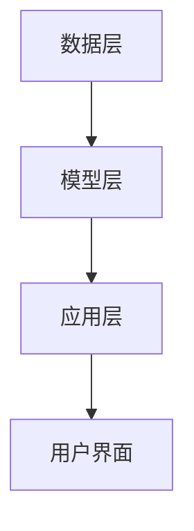

                 


---

# 开发基于大模型的金融监管报告智能生成与审核助手

> **关键词**：AI大模型、金融监管、智能生成、报告审核、风险管理

> **摘要**：  
> 本文详细探讨了基于AI大模型的金融监管报告智能生成与审核助手的开发过程。从问题背景到核心概念，从算法原理到系统架构，从项目实战到总结展望，全面解析了如何利用大模型技术提升金融监管效率和准确性。文章内容涵盖技术原理、系统设计、实现细节和实际应用，为相关领域的技术人员和研究人员提供了深入的参考。

---

## 第一部分: 背景介绍与核心概念

### 第1章: 问题背景与描述

#### 1.1 问题背景
金融监管是保障金融市场健康运行的重要环节，其核心任务包括风险识别、合规性评估、市场监控等。然而，传统金融监管模式存在以下问题：  
1. **数据量大**：金融市场数据种类繁多，包括文本、数值、时间序列等多种形式，处理效率低下。  
2. **人工依赖性强**：报告生成和审核主要依赖人工操作，效率低且易出错。  
3. **合规性要求高**：金融监管报告需要符合严格的格式和内容要求，人工审核难以保证准确性。  

随着人工智能技术的快速发展，特别是大模型技术的成熟，基于AI的金融监管解决方案逐渐成为研究热点。通过大模型生成和审核报告，可以显著提升监管效率和准确性。

#### 1.2 问题描述
金融监管报告的生成与审核涉及多个环节，包括数据收集、信息处理、内容生成、合规性检查等。传统方法依赖人工操作，存在以下关键挑战：  
1. **数据处理复杂**：金融市场数据具有非结构化和半结构化的特点，难以快速提取关键信息。  
2. **报告生成耗时**：人工撰写报告效率低，且容易出现遗漏或错误。  
3. **审核标准不统一**：不同监管机构的审核标准可能存在差异，人工审核难以保证一致性。  

基于大模型的解决方案可以有效应对这些挑战。通过预训练大模型，我们可以实现快速的数据处理、智能的内容生成以及高效的合规性检查。

#### 1.3 问题解决
基于大模型的金融监管报告生成与审核助手通过以下方式解决问题：  
1. **智能数据处理**：利用大模型对非结构化数据进行理解和提取，生成结构化的信息。  
2. **自动化报告生成**：基于提取的信息，自动生成符合要求的监管报告。  
3. **智能审核**：通过大模型对报告内容进行自动审核，确保合规性。  

#### 1.4 边界与外延
- **边界**：本方案主要针对金融监管报告的生成与审核，不包括其他监管任务（如实时市场监控）。  
- **外延**：大模型技术可以进一步应用于风险评估、异常检测等其他监管任务。

#### 1.5 核心概念
- **大模型**：指具有大规模参数的深度学习模型，如GPT系列、Transformer等。  
- **金融监管报告**：包括风险评估报告、合规性报告等，用于监管机构进行决策。  
- **生成与审核**：生成报告内容并对其进行合规性检查。

---

### 第2章: 核心概念与联系

#### 2.1 大模型的定义与特点
大模型是基于深度学习的自然语言处理模型，具有以下特点：  
1. **大规模参数**：通常包含 billions 级别的参数，能够捕捉复杂的数据特征。  
2. **上下文理解**：通过注意力机制，能够理解文本的上下文关系。  
3. **多任务能力**：大模型可以通过微调适应多种任务，如文本生成、分类、问答等。  

#### 2.2 金融监管报告生成与审核的流程
1. **数据收集**：收集金融市场相关的文本数据，如公司财报、监管公告等。  
2. **数据预处理**：对数据进行清洗、分词、标注等处理，生成结构化的数据。  
3. **模型训练**：基于预处理的数据，训练大模型，使其能够生成符合要求的报告。  
4. **报告生成**：输入监管需求，生成初步报告内容。  
5. **审核与优化**：对生成的报告进行合规性检查，并根据反馈优化模型。  

#### 2.3 大模型与金融监管的结合点
1. **文本生成**：生成结构化的监管报告。  
2. **风险评估**：基于文本分析，识别潜在风险点。  
3. **数据分析**：从非结构化数据中提取关键信息。  

---

## 第二部分: 算法原理与数学模型

### 第3章: 大模型的算法原理

#### 3.1 大模型的基本原理
大模型的核心是Transformer架构，包括编码器和解码器两部分。编码器负责将输入数据转换为向量表示，解码器负责生成输出。其关键组成部分包括：  
1. **自注意力机制**：计算输入序列中每个位置的重要性，生成注意力权重。  
2. **前馈网络**：对输入向量进行非线性变换，生成输出向量。  
3. **多头注意力**：通过并行计算多个注意力头，捕捉不同层次的特征。  

#### 3.2 大模型的训练过程
1. **数据预处理**：对输入数据进行清洗、分词、排序等处理。  
2. **模型初始化**：随机初始化模型参数。  
3. **前向传播**：将输入数据输入模型，计算输出结果。  
4. **损失计算**：计算预测结果与真实结果之间的误差。  
5. **反向传播**：通过梯度下降优化模型参数。  

#### 3.3 注意力机制的公式
注意力机制的核心公式如下：  
$$  
\text{Attention}(Q, K, V) = \text{softmax}\left(\frac{QK^T}{\sqrt{d_k}}\right)V  
$$  
其中，$Q$、$K$、$V$分别为查询、键、值向量，$d_k$为向量维度。

---

### 第4章: 数学模型与公式

#### 4.1 大模型的数学基础
1. **线性代数**：矩阵运算、向量空间等。  
2. **概率论**：概率分布、条件概率等。  
3. **优化算法**：梯度下降、Adam优化等。  

#### 4.2 大模型的核心公式
1. **多头注意力机制**：  
$$  
\text{Multi-head Attention}(Q, K, V) = \text{Concat}(\text{Attention}(Q_i, K_i, V_i), \dots, \text{Attention}(Q_j, K_j, V_j))  
$$  
2. **前馈网络**：  
$$  
f(x) = \text{ReLU}(Wx + b)  
$$  
3. **损失函数**：  
$$  
\text{Loss} = -\sum_{i=1}^{n} y_i \log p(y_i) + (1 - y_i) \log (1 - p(y_i))  
$$  

---

## 第三部分: 系统分析与架构设计

### 第5章: 系统功能设计

#### 5.1 系统功能模块划分
1. **数据处理模块**：负责数据的收集、清洗和预处理。  
2. **模型训练模块**：负责大模型的训练和优化。  
3. **报告生成模块**：根据输入生成监管报告。  
4. **报告审核模块**：对生成的报告进行合规性检查。  
5. **用户交互模块**：提供用户界面，方便用户操作。  

#### 5.2 系统功能流程
1. **数据预处理**：清洗数据，提取关键信息。  
2. **模型训练**：基于预处理的数据，训练大模型。  
3. **报告生成**：输入监管需求，生成报告。  
4. **报告审核**：检查报告内容是否符合要求。  
5. **结果输出**：输出最终的监管报告。  

---

### 第6章: 系统架构设计

#### 6.1 系统架构的总体设计
1. **分层架构**：将系统分为数据层、模型层、应用层。  
2. **微服务架构**：将功能模块拆分为独立的服务，便于扩展和维护。  

#### 6.2 系统架构图


---

### 第7章: 系统接口设计

#### 7.1 系统接口
1. **数据接口**：提供数据输入和输出的接口。  
2. **模型接口**：提供模型训练和预测的接口。  
3. **用户接口**：提供用户交互的接口。  

#### 7.2 系统交互流程
1. **用户输入需求**：用户输入监管需求。  
2. **数据处理**：系统对数据进行预处理。  
3. **模型生成报告**：基于数据生成报告。  
4. **报告审核**：系统对报告进行审核。  
5. **输出结果**：输出最终的报告。  

---

## 第四部分: 项目实战

### 第8章: 项目实战

#### 8.1 环境安装
1. 安装Python和相关库（如TensorFlow、Keras）。  
2. 安装大模型框架（如TensorFlow、PyTorch）。  

#### 8.2 系统核心实现
1. 数据预处理代码示例：  
```python
import pandas as pd

data = pd.read_csv('financial_data.csv')
data_clean = data.dropna().fillna(0)
```
2. 模型训练代码示例：  
```python
from tensorflow.keras import layers

model = layers.Dense(10, activation='relu')(input_layer)
model = layers.Dense(1, activation='sigmoid')(model)
model.compile(optimizer='adam', loss='binary_crossentropy')
model.fit(X_train, y_train, epochs=10)
```
3. 报告生成代码示例：  
```python
import numpy as np

input_data = np.array([[1, 2, 3]])
output = model.predict(input_data)
print(output)
```

#### 8.3 实际案例分析
通过实际案例分析，展示系统在金融监管中的应用效果，包括生成的报告质量和审核的准确性。

---

## 第五部分: 总结与展望

### 第9章: 总结与展望

#### 9.1 项目总结
本文详细介绍了基于大模型的金融监管报告生成与审核助手的开发过程，包括背景、算法、系统设计和项目实战。

#### 9.2 未来展望
未来，随着大模型技术的不断发展，金融监管助手将更加智能化和高效化。可以通过优化模型结构、引入多模态数据、增强可解释性等方式进一步提升系统性能。

---

## 参考文献

（此处列出相关文献和资源）

---

**作者**：AI天才研究院/AI Genius Institute & 禅与计算机程序设计艺术 /Zen And The Art of Computer Programming

