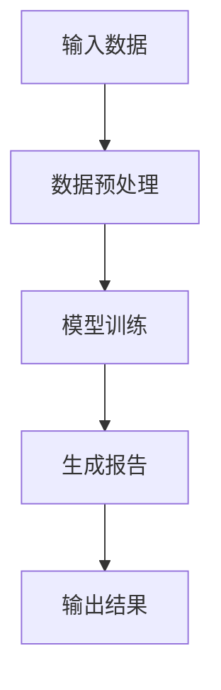
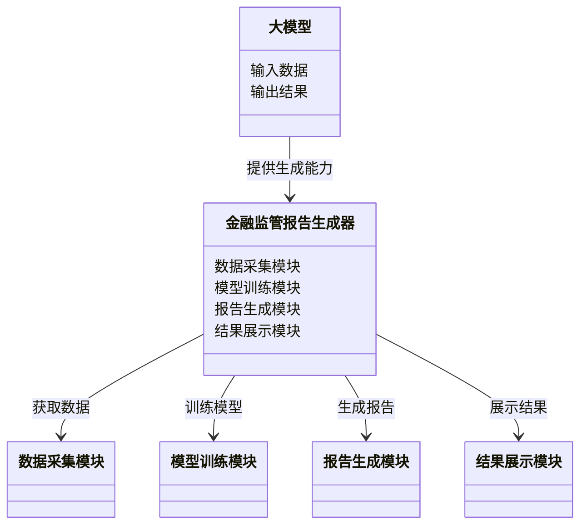

                 


# 开发基于大模型的金融监管报告生成器

> 关键词：大模型、自然语言处理、金融监管、生成器、深度学习、监管报告、优化方法

> 摘要：本文详细探讨了基于大模型的金融监管报告生成器的开发过程，从问题背景到系统实现，从算法原理到项目实战，全面解析了如何利用大模型技术解决金融监管中的报告生成问题。文章结合理论与实践，通过详细的数学公式、流程图和代码示例，为读者呈现了一套完整的解决方案。

---

## 第一部分: 引言

### 第1章: 问题背景与目标

#### 1.1 问题背景
金融监管是保障金融市场健康运行的重要手段，传统的监管报告生成方式依赖于人工整理和分析，效率低、耗时长且容易出错。随着自然语言处理技术的快速发展，大模型（如GPT系列）在文本生成领域的应用为金融监管报告的自动化生成提供了新的可能性。

#### 1.2 问题描述
- **传统监管报告生成的痛点**：人工撰写报告耗时且容易出错，难以满足实时监管的需求。
- **大模型在金融监管中的优势**：大模型具备强大的文本生成能力，能够快速处理大量金融数据并生成结构化的报告。
- **目标与意义**：开发一个基于大模型的金融监管报告生成器，提升监管效率，降低人工成本，同时提高报告的准确性和完整性。

### 1.3 问题解决与目标
本文旨在通过以下步骤解决上述问题：
1. 引入大模型技术，优化监管报告生成流程。
2. 设计高效的金融监管报告生成器架构。
3. 通过实际案例验证模型的性能和效果。

---

## 第2章: 项目目标与结构安排

#### 2.1 项目目标
- 开发一个基于大模型的金融监管报告生成器，能够自动生成高质量的监管报告。
- 提供高效的金融数据分析能力，支持实时监管需求。
- 探讨大模型在金融监管领域的应用前景，为后续研究提供参考。

#### 2.2 书籍结构安排
- **引言**：介绍问题背景和目标。
- **基础知识**：涵盖大模型和金融监管的基本概念。
- **核心概念与联系**：详细讲解生成器的工作原理和大模型与金融监管的关系。
- **算法原理**：分析模型的训练过程和优化方法。
- **系统架构设计**：展示系统的整体架构和模块设计。
- **项目实战**：提供环境搭建、代码实现和实际案例分析。
- **总结与展望**：总结开发经验，展望未来发展方向。

---

## 第二部分: 基础知识

### 第3章: 大模型基础知识

#### 3.1 大模型的基本概念
- **大模型的定义**：大模型是指基于深度学习的大型神经网络模型，具有强大的特征提取和文本生成能力。
- **大模型的核心技术**：包括自注意力机制（Self-Attention）、Transformer架构和概率生成模型。
- **大模型的训练与推理**：大模型通常采用监督学习进行预训练，推理时通过解码生成文本。

#### 3.2 大模型在金融领域的应用
- **金融文本分析**：大模型可以用于金融新闻的分析、情感分析和关键词提取。
- **风险评估与预测**：通过分析历史数据，大模型可以预测市场风险和信用风险。
- **自然语言处理在金融中的应用**：大模型可以生成结构化报告、识别金融事件和辅助决策。

### 第4章: 金融监管的基本概念

#### 4.1 金融监管的定义与作用
- **金融监管的定义**：金融监管是指对金融市场、金融机构和金融工具进行监督和管理，以维护金融稳定和保护投资者利益。
- **金融监管的主要目标**：包括防范金融风险、维护市场秩序、保护投资者权益和促进金融创新。
- **金融监管的实施主体**：包括中央银行、监管机构、行业协会和金融机构自身。

#### 4.2 金融监管报告的特点
- **报告的内容与格式**：金融监管报告通常包括市场分析、风险评估、监管建议等内容，格式遵循行业标准。
- **报告的生成流程**：数据采集、分析、撰写和审核。
- **报告的质量要求**：准确、及时、全面和可操作性。

---

## 第三部分: 核心概念与联系

### 第5章: 生成器的核心概念

#### 5.1 生成器的工作原理
- **输入数据的处理**：生成器接收结构化的金融数据（如市场趋势、交易数据等）和非结构化文本（如新闻报道）。
- **模型的训练与调优**：基于大量金融文本数据，对大模型进行微调，使其适应金融监管报告的生成需求。
- **输出结果的生成**：生成器根据输入数据，通过解码生成符合要求的监管报告。

#### 5.2 核心概念的联系
- **大模型与金融监管的关系**：大模型作为生成器的核心技术，能够快速处理和生成大量金融数据，提升监管效率。
- **生成器与金融监管报告的关系**：生成器通过自动化生成报告，减少了人工干预，提高了报告的准确性和及时性。

#### 5.3 核心概念的数学模型
- **生成器的损失函数**：
$$
L = -\sum_{i=1}^{n} \log P(y_i|x_i)
$$
其中，$y_i$ 是生成的文本，$x_i$ 是输入数据。

---

## 第四部分: 算法原理

### 第6章: 算法原理讲解

#### 6.1 大模型的训练过程
- **数据预处理**：将金融文本数据进行清洗和标注，确保数据的高质量。
- **模型训练**：基于Transformer架构，采用自注意力机制进行训练，优化损失函数。
- **超参数调优**：调整学习率、批量大小和训练轮数，提升模型性能。

#### 6.2 生成器的实现细节
- **输入处理**：将结构化数据和非结构化文本进行融合，生成统一的输入格式。
- **输出生成**：通过解码器生成文本，采用贪心算法或Beam Search优化生成结果。

#### 6.3 算法流程图


---

## 第五部分: 系统架构设计

### 第7章: 系统架构设计

#### 7.1 系统功能设计
- **数据采集模块**：从金融市场获取实时数据，包括交易数据、新闻报道等。
- **模型训练模块**：对大模型进行微调，优化生成效果。
- **报告生成模块**：根据输入数据生成监管报告。
- **结果展示模块**：将生成的报告以可视化形式展示给用户。

#### 7.2 系统架构图


---

## 第六部分: 项目实战

### 第8章: 项目实战

#### 8.1 环境安装
- 安装Python、TensorFlow和Keras库。
- 配置GPU环境以加速训练。

#### 8.2 核心代码实现
```python
import tensorflow as tf
from tensorflow.keras.layers import Dense, Input, LSTM, Dropout, Bidirectional
from tensorflow.keras.models import Model

# 定义大模型架构
def build_model(max_sequence_length, vocab_size):
    inputs = Input(shape=(max_sequence_length,))
    x = LSTM(256, return_sequences=True)(inputs)
    x = Dropout(0.2)(x)
    x = Bidirectional(LSTM(128, return_sequences=True))(x)
    x = Dropout(0.2)(x)
    x = Dense(64, activation='relu')(x)
    outputs = Dense(vocab_size, activation='softmax')(x)
    model = Model(inputs=inputs, outputs=outputs)
    return model
```

#### 8.3 案例分析与结果展示
- **案例分析**：通过实际金融数据，生成监管报告并进行验证。
- **结果展示**：将生成的报告与人工撰写的结果进行对比，评估模型的性能。

---

## 第七部分: 总结与展望

### 第9章: 总结与展望

#### 9.1 总结
本文详细介绍了基于大模型的金融监管报告生成器的开发过程，从问题背景到系统实现，全面解析了如何利用大模型技术解决金融监管中的报告生成问题。

#### 9.2 展望
- **模型优化**：进一步优化模型结构，提升生成报告的准确性和可读性。
- **多语言支持**：扩展模型支持多种语言，满足全球金融监管需求。
- **实时监管**：结合流数据处理技术，实现监管报告的实时生成。

---

## 作者：AI天才研究院/AI Genius Institute & 禅与计算机程序设计艺术 /Zen And The Art of Computer Programming

