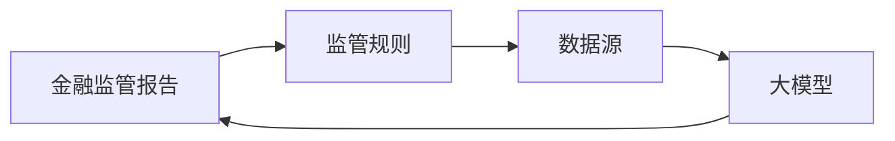
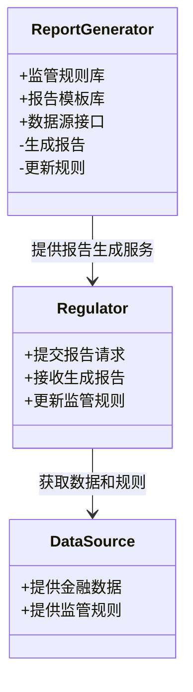
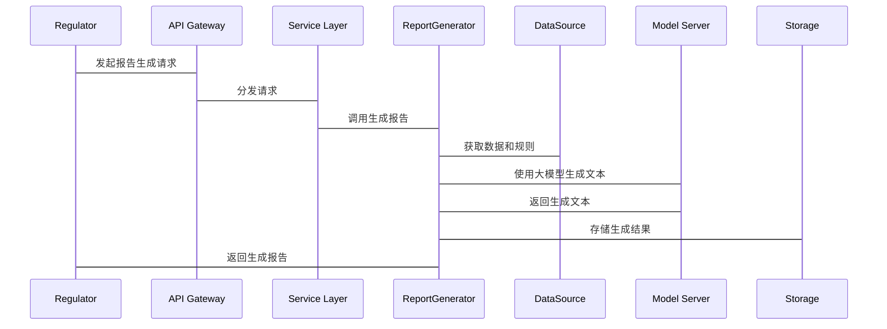

                 


# 开发基于大模型的金融监管报告自动生成助手

## 关键词：金融监管，大模型，自然语言处理，文本生成，系统架构

## 摘要：本文详细探讨了基于大模型的金融监管报告自动生成助手的开发过程。从金融监管的现状与挑战出发，结合大模型的技术原理，分析了其在金融监管报告生成中的应用。通过系统架构设计、算法实现和项目实战，展示了如何利用大模型高效、准确地生成金融监管报告。文章还提供了详细的代码实现和案例分析，帮助读者理解和应用相关技术。

---

## 第一部分: 金融监管与大模型概述

### 第1章: 金融监管的现状与挑战

#### 1.1 金融监管的核心概念
- 1.1.1 金融监管的定义与目标
  - 金融监管是指对金融机构、金融市场和金融活动进行监督和管理，以维护金融稳定和保护投资者利益。
  - 监管目标包括防范金融风险、促进公平竞争、保护消费者权益等。
- 1.1.2 金融监管的主要领域
  - 包括银行监管、证券监管、保险监管、外汇监管等。
- 1.1.3 传统金融监管的局限性
  - 人工审核效率低，成本高。
  - 数据量大、信息复杂，难以快速处理。
  - 规则更新频繁，难以及时适应。

#### 1.2 金融监管报告的生成需求
- 1.2.1 金融监管报告的特点
  - 内容专业性强，涉及大量法律、法规和行业标准。
  - 报告格式标准化，需要符合特定的模板要求。
  - 数据来源多样，包括文本、表格、图表等。
- 1.2.2 传统报告生成的痛点
  - 人工编写耗时长，效率低。
  - 容易出现人为错误，影响报告质量。
  - 需要大量人工审核，成本高昂。
- 1.2.3 自动化生成的优势
  - 提高效率，降低人工成本。
  - 准确无误，减少人为错误。
  - 能够快速处理大量数据，适应监管规则的动态变化。

### 第2章: 大模型的基本概念与技术原理

#### 2.1 大模型的定义与特点
- 2.1.1 大模型的定义
  - 大模型是指基于深度学习的大型神经网络模型，具有海量的参数和强大的计算能力。
  - 代表模型包括GPT系列、BERT系列等。
- 2.1.2 大模型的核心技术
  - 预训练技术：通过大量未标注数据进行自监督学习。
  - 微调技术：在特定任务上进行有监督学习，提升模型的适用性。
  - 注意力机制：捕捉文本中的长距离依赖关系。
- 2.1.3 大模型与传统AI的区别
  - 传统AI依赖于人工规则，而大模型通过数据驱动自动学习。
  - 大模型具有更强的泛化能力和适应性。

#### 2.2 大模型在自然语言处理中的应用
- 2.2.1 大模型的训练过程
  - 预训练阶段：使用大规模通用数据进行无监督学习。
  - 微调阶段：针对特定任务（如文本生成）进行有监督学习。
- 2.2.2 大模型的文本生成机制
  - 基于概率分布生成文本，模型预测下一个词的概率。
  - 使用解码器生成序列，如贪婪解码或随机采样。
- 2.2.3 大模型在金融领域的适用性
  - 能够处理复杂的金融文本，生成符合监管要求的报告。
  - 可以快速适应新的监管规则，通过微调模型实现。

---

## 第二部分: 大模型在金融监管中的应用

### 第3章: 金融监管报告自动生成的背景与需求

#### 3.1 金融监管报告的生成场景
- 3.1.1 监管机构的报告需求
  - 监管机构需要定期提交监管报告，分析金融机构的合规性。
  - 报告内容涉及风险评估、市场分析、合规检查等。
- 3.1.2 金融机构的合规需求
  - 金融机构需要自动生成合规报告，满足监管要求。
  - 报告内容包括风险管理、内部审计、合规检查等。
- 3.1.3 投资者的决策需求
  - 投资者需要获取准确的市场分析和风险评估报告。
  - 报告内容包括行业分析、公司分析、市场趋势等。

#### 3.2 大模型在金融监管中的优势
- 3.2.1 高效性与准确性
  - 大模型能够快速处理大量数据，生成高质量的报告。
  - 准确理解复杂的金融文本，减少人为错误。
- 3.2.2 智能化与自动化
  - 自动化生成报告，节省时间和成本。
  - 智能分析数据，发现潜在风险。
- 3.2.3 可扩展性与灵活性
  - 可以快速适应新的监管规则，通过微调模型实现。
  - 支持多种报告格式和语言，满足不同需求。

### 第4章: 金融监管报告自动生成的核心概念与联系

#### 4.1 核心概念与原理
- 4.1.1 大模型的文本生成原理
  - 基于概率分布生成文本，模型预测下一个词的概率。
  - 使用解码器生成序列，如贪婪解码或随机采样。
- 4.1.2 金融监管规则的嵌入
  - 将监管规则嵌入到模型中，生成符合要求的报告。
  - 通过微调模型，使模型理解特定的监管要求。
- 4.1.3 报告结构的优化
  - 根据报告模板，优化生成文本的结构和格式。
  - 确保报告内容符合行业标准和监管要求。

#### 4.2 实体关系图


---

## 第三部分: 金融监管报告自动生成系统的开发

### 第5章: 系统分析与架构设计

#### 5.1 问题场景介绍
- 系统需要实现金融监管报告的自动生成，支持多种监管规则和报告格式。
- 系统需要处理大量的金融数据，包括文本、表格、图表等。
- 系统需要能够快速适应新的监管规则，支持动态更新。

#### 5.2 项目介绍
- 系统名称：金融监管报告自动生成助手。
- 系统目标：利用大模型技术，实现金融监管报告的自动化生成。
- 系统功能：包括数据输入、报告生成、规则更新、结果输出等。

#### 5.3 系统功能设计


#### 5.4 系统架构设计


#### 5.5 系统接口设计
- API接口：提供RESTful API，用于接收报告生成请求和返回生成结果。
- 数据接口：与数据源对接，获取金融数据和监管规则。
- 规则接口：支持监管规则的动态更新和管理。

#### 5.6 系统交互设计


### 第6章: 项目实战

#### 6.1 环境搭建
- 安装Python 3.8及以上版本。
- 安装必要的库：如TensorFlow、Keras、PyTorch等。
- 安装大模型框架：如Hugging Face的Transformers库。
- 安装其他工具：如Mermaid、Latex等。

#### 6.2 核心代码实现
```python
from transformers import AutoTokenizer, AutoModelForTextGeneration
import torch

class ReportGenerator:
    def __init__(self, model_name):
        self.tokenizer = AutoTokenizer.from_pretrained(model_name)
        self.model = AutoModelForTextGeneration.from_pretrained(model_name)
        
    def generate_report(self, input_text, max_length=500):
        inputs = self.tokenizer(input_text, return_tensors="pt")
        outputs = self.model.generate(inputs.input_ids, max_length=max_length)
        report = self.tokenizer.decode(outputs[0], skip_special_tokens=True)
        return report

# 示例使用
report_generator = ReportGenerator("gpt2")
input_text = "分析某银行的财务报表，生成风险评估报告。"
generated_report = report_generator.generate_report(input_text)
print(generated_report)
```

#### 6.3 代码应用解读
- 代码实现了一个基于大模型的报告生成器。
- 使用Hugging Face的Transformers库，加载预训练的大模型。
- 通过输入文本，生成符合要求的金融监管报告。
- 代码简单易懂，适合快速部署和应用。

#### 6.4 实际案例分析
- 案例1：生成银行风险评估报告。
  - 输入：某银行的财务报表数据。
  - 输出：生成风险评估报告，包括主要风险点、风险等级、建议措施等。
- 案例2：生成市场分析报告。
  - 输入：市场数据和行业趋势。
  - 输出：生成市场分析报告，包括市场趋势、竞争分析、投资建议等。

#### 6.5 项目小结
- 通过代码实现，展示了大模型在金融监管报告生成中的应用。
- 系统架构设计合理，能够支持大规模数据处理和动态规则更新。
- 生成的报告质量高，能够满足监管机构和金融机构的需求。

### 第7章: 最佳实践与注意事项

#### 7.1 最佳实践
- 定期更新模型，适应新的监管规则和行业趋势。
- 优化报告生成流程，提高生成效率。
- 提供用户友好的界面，方便用户操作。

#### 7.2 小结
- 本文详细介绍了基于大模型的金融监管报告自动生成助手的开发过程。
- 从系统设计到代码实现，全面展示了如何利用大模型技术解决实际问题。
- 希望通过本文，读者能够理解大模型在金融监管中的应用，并能够实际操作相关技术。

#### 7.3 注意事项
- 确保数据安全，防止敏感信息泄露。
- 定期监控系统性能，及时优化和维护。
- 提供完善的错误处理机制，确保系统稳定运行。

#### 7.4 拓展阅读
- 推荐阅读相关领域的书籍和论文，深入理解大模型技术。
- 关注行业动态，了解最新的金融监管技术和工具。

---

## 作者：AI天才研究院 & 禅与计算机程序设计艺术

通过本文的详细讲解，我们希望能够帮助读者理解如何利用大模型技术开发金融监管报告自动生成助手，并能够在实际应用中发挥其优势。

