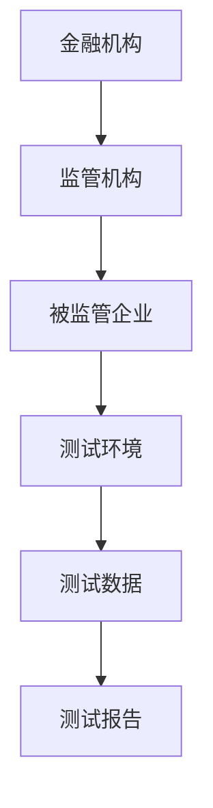
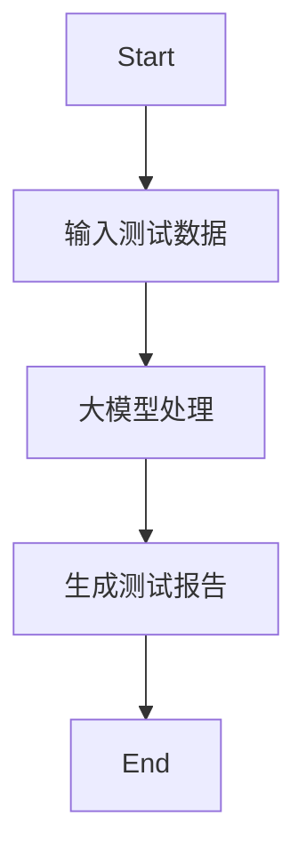
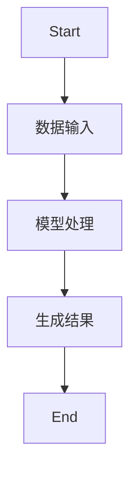
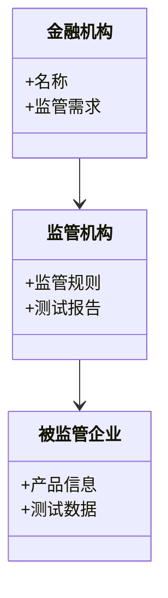

                 


# 开发基于大模型的金融监管沙盒测试报告生成器

## 关键词：大模型，金融监管，沙盒测试，生成报告，人工智能

## 摘要：本文详细探讨了如何利用大模型技术开发金融监管沙盒测试报告生成器。通过分析传统金融监管的局限性，结合大模型的优势，提出了基于大模型的沙盒测试报告生成方法。文章从背景介绍、核心概念、算法原理、系统架构设计到项目实战，全面解析了该系统的开发过程，为金融监管领域的人工智能应用提供了新的思路。

---

# 第一部分: 金融监管沙盒与大模型的背景介绍

## 第1章: 问题背景与核心概念

### 1.1 问题背景

#### 1.1.1 金融监管的重要性
金融监管是维护金融市场稳定、保护投资者利益的重要手段。传统金融监管依赖人工审核和规则匹配，效率低且覆盖面有限。

#### 1.1.2 传统金融监管的局限性
- **效率低下**：人工审核耗时长，难以应对海量数据。
- **规则单一**：传统规则难以覆盖复杂金融场景。
- **实时性不足**：无法快速响应市场变化。

#### 1.1.3 大模型技术的引入与优势
大模型具有强大的自然语言处理能力和数据分析能力，能够快速生成结构化报告，显著提升监管效率。

### 1.2 问题描述

#### 1.2.1 金融监管沙盒的定义
金融监管沙盒是一种受控环境，允许金融机构在真实市场中测试创新产品和服务，同时确保风险可控。

#### 1.2.2 沙盒测试的核心目标
- **风险控制**：确保创新产品不会对市场造成重大风险。
- **合规性验证**：验证产品是否符合相关法规。
- **效率提升**：快速测试并迭代产品。

#### 1.2.3 传统测试报告生成的痛点
- **人工成本高**：需要大量人力编写报告。
- **效率低**：报告生成周期长，难以满足实时需求。
- **一致性差**：人工编写易出错，报告质量不一。

### 1.3 问题解决思路

#### 1.3.1 大模型在金融监管中的应用潜力
大模型可以自动分析海量数据，生成结构化的报告，帮助监管机构快速评估创新产品。

#### 1.3.2 利用大模型生成测试报告的可行性
- **数据处理能力**：大模型能够处理非结构化数据，生成结构化报告。
- **生成效率**：相比人工，大模型生成报告速度快，一致性高。

#### 1.3.3 技术实现的关键点
- **模型训练**：需要大量金融领域的数据进行微调。
- **生成策略**：制定合理的生成规则，确保报告的准确性和合规性。

### 1.4 边界与外延

#### 1.4.1 金融监管沙盒的边界
- **测试范围**：仅限于沙盒环境，不影响真实市场。
- **监管对象**：主要针对金融机构的新产品和服务。

#### 1.4.2 大模型应用的边界
- **数据依赖**：需要高质量的金融领域数据。
- **生成范围**：目前主要生成报告，不涉及决策。

#### 1.4.3 技术实现的外延
- **扩展性**：未来可以扩展到实时监控和风险预警。
- **多模态**：结合图像、语音等多种数据源。

### 1.5 核心概念与组成

#### 1.5.1 核心概念的定义
- **金融监管沙盒**：受控环境，用于测试创新产品。
- **大模型**：具有强大自然语言处理能力的人工智能模型。

#### 1.5.2 核心概念的属性特征对比
| 特性 | 传统监管 | 基于大模型的监管 |
|------|----------|-------------------|
| 效率 | 低       | 高               |
| 覆盖面 | 有限     | 宽广             |
| 及时性 | 滞后     | 实时             |

#### 1.5.3 实体关系图


---

## 第2章: 大模型与金融监管沙盒的关系

### 2.1 大模型的核心原理

#### 2.1.1 大模型的基本原理
大模型通过深度学习训练，能够理解并生成人类语言，具有强大的文本处理能力。

#### 2.1.2 大模型的训练过程
- **数据预处理**：清洗和标注金融数据。
- **模型训练**：使用训练数据调整模型参数。
- **模型优化**：通过微调提升金融领域的表现。

#### 2.1.3 大模型的输出机制
- **解码过程**：模型通过解码生成文本。
- **概率分布**：生成文本基于概率预测。

### 2.2 金融监管沙盒的实体关系图


### 2.3 大模型在沙盒测试中的流程


---

## 第3章: 大模型的算法原理

### 3.1 大模型的训练过程

#### 3.1.1 数据预处理
- **清洗数据**：去除噪声，提取关键信息。
- **标注数据**：为数据打上标签，便于模型训练。

#### 3.1.2 模型训练
- **训练数据**：使用金融领域的文本数据。
- **训练目标**：最小化生成文本的损失函数。

#### 3.1.3 模型调优
- **参数调整**：优化模型参数，提升生成质量。
- **评估指标**：使用BLEU、ROUGE等指标评估生成效果。

### 3.2 大模型的生成机制

#### 3.2.1 解码过程
- **贪心解码**：每次选择概率最高的词生成文本。
- **beam search**：生成多个候选解，选择最优解。

#### 3.2.2 概率分布
- **文本生成**：模型预测每个词的概率分布。
- **条件概率**：P(word | previous words)

#### 3.2.3 损失函数
- **交叉熵损失**：用于衡量生成文本与真实文本的差异。
  $$ L = -\sum_{i=1}^{n} \log P(y_i | y_{i-1}) $$

### 3.3 算法流程图


---

## 第4章: 系统分析与架构设计

### 4.1 系统功能设计

#### 4.1.1 领域模型图


#### 4.1.2 系统架构设计


### 4.2 系统架构设计

#### 4.2.1 系统架构图


#### 4.2.2 系统接口设计
- **输入接口**：接收测试数据。
- **输出接口**：生成测试报告。

#### 4.2.3 系统交互流程


---

## 第5章: 项目实战

### 5.1 环境安装

#### 5.1.1 安装Python
```bash
python --version
```

#### 5.1.2 安装依赖
```bash
pip install numpy
pip install pandas
pip install transformers
pip install torch
```

### 5.2 系统核心实现

#### 5.2.1 模型加载
```python
from transformers import AutoTokenizer, AutoModelForCausalLM
tokenizer = AutoTokenizer.from_pretrained('gpt2')
model = AutoModelForCausalLM.from_pretrained('gpt2')
```

#### 5.2.2 数据处理
```python
def preprocess(text):
    return tokenizer(text, return_tensors='np')
```

#### 5.2.3 模型生成
```python
def generate_report(prompt):
    inputs = tokenizer(prompt, return_tensors='np')
    outputs = model.generate(inputs.input_ids, max_length=500)
    return tokenizer.decode(outputs[0])
```

### 5.3 代码解读与分析

#### 5.3.1 核心代码
```python
def generate_report(prompt):
    inputs = tokenizer(prompt, return_tensors='np')
    outputs = model.generate(inputs.input_ids, max_length=500)
    return tokenizer.decode(outputs[0])
```

#### 5.3.2 功能实现
- **输入处理**：将输入文本转换为模型可处理的格式。
- **模型生成**：生成符合要求的测试报告。

### 5.4 实际案例分析

#### 5.4.1 案例背景
某金融机构推出新产品，需在沙盒环境中测试。

#### 5.4.2 数据准备
测试数据包括产品描述、风险评估等信息。

#### 5.4.3 模型生成
生成结构化的测试报告，包含合规性分析、风险评估等内容。

### 5.5 项目小结

#### 5.5.1 成果展示
成功生成结构化的测试报告，效率显著提升。

#### 5.5.2 经验总结
- **数据质量**：高质量的训练数据是关键。
- **模型调优**：需要不断优化模型参数。
- **场景适配**：不同场景需调整生成策略。

---

## 第6章: 总结与展望

### 6.1 总结

#### 6.1.1 核心观点回顾
大模型技术能够显著提升金融监管沙盒测试的效率和质量。

#### 6.1.2 项目成果
成功开发了基于大模型的测试报告生成器，验证了技术可行性。

### 6.2 未来展望

#### 6.2.1 技术发展
- **多模态模型**：结合图像、语音等多种数据源。
- **实时监控**：实现对金融市场的实时监管。

#### 6.2.2 应用场景扩展
- **风险预警**：实时监测市场风险。
- **智能合规**：自动识别合规问题。

### 6.3 最佳实践 tips

#### 6.3.1 开发建议
- **数据质量**：确保训练数据的多样性和高质量。
- **模型调优**：定期优化模型参数，提升生成效果。
- **场景适配**：根据不同场景调整生成策略。

#### 6.3.2 注意事项
- **数据隐私**：确保数据的安全性和隐私性。
- **模型稳定性**：保证模型的稳定运行，避免生成错误报告。

---

## 作者

**作者：AI天才研究院/AI Genius Institute & 禅与计算机程序设计艺术 /Zen And The Art of Computer Programming**

---

这篇文章详细探讨了如何利用大模型技术开发金融监管沙盒测试报告生成器，从背景介绍到项目实战，全面解析了系统的开发过程，为金融监管领域的人工智能应用提供了新的思路。

